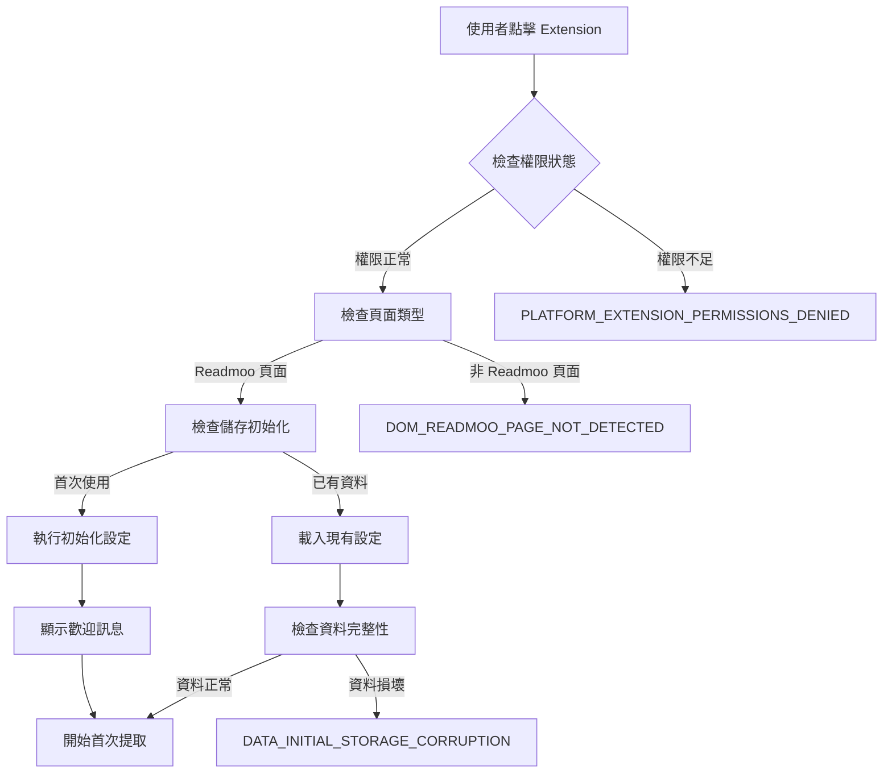
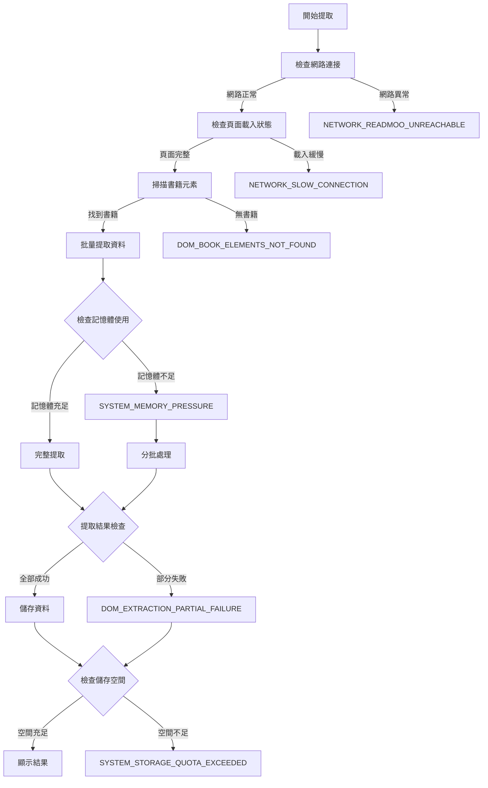
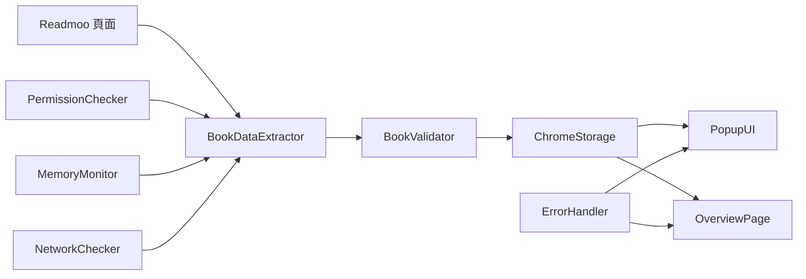

# UC-01: 首次安裝與設定 - 功能實作細節

## 🎯 Use Case 核心功能
**UC-01** 負責使用者的第一次使用體驗，包含 Extension 初始化、歡迎流程、首次資料提取和 Overview 頁面設定。

## 🏗️ 核心邏輯流程

### 1. Extension 初始化流程


### 2. 首次資料提取流程


## 🔧 關鍵模組和方法

### 核心模組結構
```
src/
├── popup/
│   ├── PopupController.js           # 主要控制邏輯
│   └── FirstTimeSetupHandler.js     # 首次設定專用
├── background/
│   ├── ExtensionInitializer.js      # Extension 初始化
│   └── PermissionChecker.js         # 權限檢查
├── content/
│   ├── ReadmooPageDetector.js       # 頁面檢測
│   └── BookDataExtractor.js         # 資料提取
├── core/
│   ├── storage/ChromeStorage.js     # 儲存管理
│   ├── errors/StandardError.js      # 錯誤處理
│   └── validation/BookValidator.js  # 資料驗證
└── overview/
    └── OverviewInitializer.js       # Overview 頁面初始化
```

### 關鍵方法詳解

#### PopupController.handleFirstTimeSetup()
```javascript
async handleFirstTimeSetup() {
  try {
    // 1. 權限檢查
    await this.permissionChecker.validateRequiredPermissions()

    // 2. 頁面檢測
    const pageInfo = await this.pageDetector.analyzeCurrentPage()
    if (!pageInfo.isReadmooLibrary) {
      throw new StandardError('DOM_READMOO_PAGE_NOT_DETECTED', '無法檢測到 Readmoo 書庫頁面', {
        currentUrl: pageInfo.url,
        detectedType: pageInfo.type
      })
    }

    // 3. 儲存初始化
    await this.storageManager.initializeFirstTime()

    // 4. 開始資料提取
    const extractionResult = await this.bookExtractor.performFirstExtraction()

    // 5. 結果處理和 UI 更新
    await this.updateUIWithResults(extractionResult)

  } catch (error) {
    await this.errorHandler.handleFirstTimeSetupError(error)
  }
}
```

#### BookDataExtractor.performFirstExtraction()
```javascript
async performFirstExtraction() {
  const results = {
    totalBooks: 0,
    successfulExtractions: 0,
    failures: [],
    extractedData: []
  }

  try {
    // 1. 掃描書籍元素
    const bookElements = await this.scanForBookElements()
    if (bookElements.length === 0) {
      throw new StandardError('DOM_BOOK_ELEMENTS_NOT_FOUND', '頁面中找不到書籍元素')
    }

    results.totalBooks = bookElements.length

    // 2. 記憶體檢查和分批處理
    const batchSize = this.calculateOptimalBatchSize(bookElements.length)

    // 3. 批量提取
    for (let i = 0; i < bookElements.length; i += batchSize) {
      const batch = bookElements.slice(i, i + batchSize)
      const batchResults = await this.processBatch(batch, i)

      results.successfulExtractions += batchResults.successes
      results.failures.push(...batchResults.failures)
      results.extractedData.push(...batchResults.data)

      // 記憶體壓力檢查
      if (this.memoryMonitor.isUnderPressure()) {
        throw new StandardError('SYSTEM_MEMORY_PRESSURE', '系統記憶體不足', {
          booksProcessed: i + batch.length,
          totalBooks: bookElements.length
        })
      }
    }

    // 4. 結果驗證
    if (results.failures.length > results.totalBooks * 0.2) {
      throw new StandardError('DOM_EXTRACTION_PARTIAL_FAILURE', '部分書籍資料提取失敗', {
        totalBooks: results.totalBooks,
        successfulExtractions: results.successfulExtractions,
        failedBooks: results.failures
      })
    }

    return results

  } catch (error) {
    if (error instanceof StandardError) {
      throw error
    }
    throw new StandardError('SYSTEM_ERROR', '提取過程發生未知錯誤', { originalError: error.message })
  }
}
```

#### ChromeStorage.initializeFirstTime()
```javascript
async initializeFirstTime() {
  try {
    // 1. 檢查現有資料
    const existingData = await this.getStoredData()

    if (existingData && this.isDataCorrupted(existingData)) {
      throw new StandardError('DATA_INITIAL_STORAGE_CORRUPTION', '初始化儲存資料時發現損壞', {
        corruptedFields: this.analyzeCorruption(existingData)
      })
    }

    // 2. 初始化基本結構
    const initialData = {
      books: [],
      settings: this.getDefaultSettings(),
      metadata: {
        version: this.getCurrentVersion(),
        firstSetupTime: Date.now(),
        lastUpdateTime: Date.now()
      }
    }

    // 3. 儲存空間檢查
    const requiredSpace = this.calculateRequiredSpace(initialData)
    const availableSpace = await this.getAvailableSpace()

    if (requiredSpace > availableSpace) {
      throw new StandardError('SYSTEM_STORAGE_QUOTA_EXCEEDED', 'Extension 儲存空間不足', {
        required: requiredSpace,
        available: availableSpace
      })
    }

    // 4. 執行初始化
    await this.saveData(initialData)

  } catch (error) {
    if (error instanceof StandardError) {
      throw error
    }
    throw new StandardError('SYSTEM_ERROR', '儲存初始化失敗', { originalError: error.message })
  }
}
```

## 📊 資料流和狀態管理

### 資料流向圖


### 狀態管理架構
```javascript
// 首次設定狀態機
const FirstTimeSetupStateMachine = {
  states: {
    INITIAL: 'initial',
    CHECKING_PERMISSIONS: 'checking_permissions',
    DETECTING_PAGE: 'detecting_page',
    INITIALIZING_STORAGE: 'initializing_storage',
    EXTRACTING_DATA: 'extracting_data',
    VALIDATING_DATA: 'validating_data',
    SAVING_DATA: 'saving_data',
    COMPLETED: 'completed',
    ERROR: 'error'
  },

  transitions: {
    [INITIAL]: [CHECKING_PERMISSIONS],
    [CHECKING_PERMISSIONS]: [DETECTING_PAGE, ERROR],
    [DETECTING_PAGE]: [INITIALIZING_STORAGE, ERROR],
    [INITIALIZING_STORAGE]: [EXTRACTING_DATA, ERROR],
    [EXTRACTING_DATA]: [VALIDATING_DATA, ERROR],
    [VALIDATING_DATA]: [SAVING_DATA, ERROR],
    [SAVING_DATA]: [COMPLETED, ERROR],
    [ERROR]: [INITIAL] // 允許重試
  }
}
```

## 🔗 與其他 UC 的交互點

### UC-01 → UC-02 的數據傳遞
- **共享資料格式**: 建立的書籍資料結構供 UC-02 增量更新使用
- **設定傳承**: 首次設定的偏好設定影響後續提取行為
- **錯誤學習**: UC-01 的錯誤模式會影響 UC-02 的預防策略

### UC-01 → UC-03/UC-04 的兼容性
- **資料格式標準化**: 確保首次提取的資料可以被正確匯出和匯入
- **版本控制**: 建立的資料版本資訊供匯入時格式升級使用

### UC-01 → UC-06 的初始化
- **Overview 頁面設定**: 首次設定決定 Overview 頁面的初始狀態
- **UI 偏好**: 使用者在首次使用中的操作偏好記錄

## ⚡ 效能考量和最佳化

### 記憶體管理
- **分批處理**: 大量書籍時自動分批，避免記憶體溢出
- **垃圾回收**: 每批處理後主動釋放不需要的物件
- **記憶體監控**: 實時監控記憶體使用，動態調整批次大小

### 網路最佳化
- **非同步處理**: 圖片載入不阻塞主要資料提取
- **超時控制**: 網路請求設定合理超時，避免長時間等待
- **降級策略**: 網路緩慢時提供輕量模式選項

### 儲存最佳化
- **壓縮儲存**: 大量資料使用壓縮格式儲存
- **增量儲存**: 只儲存變更的資料，避免重複寫入
- **空間監控**: 定期檢查儲存空間使用量

## 🧪 測試策略

### 單元測試重點
- **權限檢查邏輯**: 各種權限狀態的處理
- **頁面檢測準確性**: 不同頁面類型的識別
- **資料提取邏輯**: 各種 DOM 結構的適應性
- **錯誤處理完整性**: 所有 StandardError 的觸發和處理

### 整合測試重點
- **完整首次設定流程**: 從點擊到完成的全流程測試
- **大量資料處理**: 300+ 本書籍的處理測試
- **網路異常情況**: 各種網路狀況的應對測試
- **跨瀏覽器相容性**: 不同 Chrome 版本的測試

### 使用者驗收測試
- **真實 Readmoo 帳號**: 使用真實的書庫資料測試
- **不同網路環境**: 快速、緩慢、不穩定網路的測試
- **各種設備配置**: 不同記憶體和儲存空間的設備測試