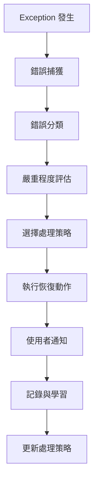

# Flutter APP 錯誤處理系統設計文件

## 📖 文件目的與範圍

**本文件目的**: 詳細說明 Flutter APP 錯誤處理系統的設計思路、流程和實作指引，確保程式實作與設計需求保持一致。

**適用範圍**: Flutter 跨平台書庫管理 APP 的完整錯誤處理機制設計。

**設計原則**: 基於實際使用場景分析，透過測試與實際運作發現邊界狀況，漸進式完善 StandardError 體系。

**🚨 跨平台一致性更新 (v0.12.13+)**: 為確保 Chrome Extension 和 Flutter APP 的錯誤處理體系一致性，StandardError 在兩個平台都採用繼承原生錯誤類別的設計：
- **Chrome Extension**: `class StandardError extends Error`
- **Flutter APP**: `class StandardError extends Exception` (Dart 平台)

---

## 🎯 設計思路與方法論

### 為什麼選擇場景驅動設計

**傳統錯誤處理問題**:
- 預定義錯誤類別常常與實際遇到的問題不符
- 錯誤訊息技術化，使用者無法理解
- 缺乏具體的恢復策略
- 無法適應新發現的邊界狀況

**場景驅動的優勢**:
1. **貼近實際**: 從具體 Use Case 出發，分析真實可能遇到的問題
2. **可驗證**: 每種錯誤都有對應的測試場景和驗證方法
3. **可進化**: 實際運作中發現新問題時，可自動擴充錯誤分類
4. **使用者導向**: 每種錯誤都有明確的使用者溝通和恢復策略

### 設計與實作一致性保證

**一致性原則**:
```
設計需求 ↔ 測試案例 ↔ 程式實作 ↔ 使用者體驗
```

**確保一致性的方法**:
1. **需求可測試**: 每個設計需求都有對應的測試案例
2. **測試可追溯**: 每個測試案例都能追溯到具體的設計需求
3. **實作可驗證**: 程式實作必須通過所有對應的測試案例
4. **體驗可評估**: 使用者體驗符合設計預期

---

## 🔄 Exception 處理流程設計

### 完整處理流程



### 階段一：錯誤捕獲與初步分析

**目標**: 完整捕獲錯誤資訊，避免遺漏關鍵上下文

```dart
// v0.12.13+ 繼承設計
class StandardError extends Exception {
  final String code;
  final String message;
  final Map<String, dynamic> details;
  final DateTime timestamp;
  final String id;

  StandardError(this.code, this.message, {this.details = const {}})
      : timestamp = DateTime.now(),
        id = _generateId();

  // 提供與 JavaScript 版本一致的 API
  Map<String, dynamic> toJSON() => {
    'code': code,
    'message': message,
    'details': details,
    'timestamp': timestamp.toIso8601String(),
    'id': id,
  };

  @override
  String toString() => 'StandardError [$code]: $message';

  static String _generateId() {
    final timestamp = DateTime.now().millisecondsSinceEpoch;
    final random = (DateTime.now().microsecond * 1000).toString();
    return 'err_${timestamp}_$random';
  }
}

class ErrorCaptureService {
  static StandardError captureAndAnalyze(dynamic error, StackTrace? stackTrace) {
    // 1. 收集基本錯誤資訊
    final basicInfo = _extractBasicInfo(error);

    // 2. 收集執行環境上下文
    final context = _collectExecutionContext();

    // 3. 分析錯誤類型和可能原因
    final analysis = _performInitialAnalysis(error, stackTrace);

    // 4. 建立 StandardError 實例 (繼承 Exception)
    return StandardError(
      analysis.suggestedCode,
      analysis.primaryMessage,
      details: {
        'basicInfo': basicInfo,
        'context': context,
        'analysis': analysis.toMap(),
        'timestamp': DateTime.now().toIso8601String(),
        'stackTrace': stackTrace?.toString(), // 原生支援 Stack trace
      },
    );
  }

  static ExecutionContext _collectExecutionContext() {
    return ExecutionContext(
      currentOperation: OperationTracker.getCurrentOperation(),
      userJourney: UserJourneyTracker.getCurrentStep(),
      systemState: SystemStateCollector.getSnapshot(),
      networkCondition: NetworkMonitor.getCurrentStatus(),
      memoryUsage: MemoryMonitor.getCurrentUsage(),
    );
  }
}
```

### 階段二：錯誤分類與嚴重程度評估

**分類決策邏輯**:

```dart
class ErrorClassificationService {
  static ErrorClassification classify(StandardError error) {
    // 1. 基於錯誤類型進行初步分類
    final primaryCategory = _determinePrimaryCategory(error);

    // 2. 基於影響範圍評估嚴重程度
    final severity = _assessSeverity(error, primaryCategory);

    // 3. 基於恢復可能性評估處理優先級
    final recoverability = _assessRecoverability(error);

    // 4. 基於使用者影響評估通知策略
    final userImpact = _assessUserImpact(error, severity);

    return ErrorClassification(
      category: primaryCategory,
      severity: severity,
      recoverability: recoverability,
      userImpact: userImpact,
      suggestedStrategy: _recommendStrategy(primaryCategory, severity, recoverability),
    );
  }

  static ErrorSeverity _assessSeverity(StandardError error, ErrorCategory category) {
    // 基於多個維度評估嚴重程度
    final dimensions = [
      _evaluateBusinessImpact(error),      // 對業務功能的影響
      _evaluateDataIntegrity(error),       // 對資料完整性的影響
      _evaluateUserExperience(error),      // 對使用者體驗的影響
      _evaluateSystemStability(error),     // 對系統穩定性的影響
    ];

    return ErrorSeverityCalculator.calculate(dimensions);
  }
}
```

### 階段三：處理策略選擇

**策略選擇決策樹**:

```dart
class ErrorHandlingStrategySelector {
  static HandlingStrategy selectStrategy(ErrorClassification classification) {
    return switch ((classification.category, classification.severity, classification.recoverability)) {
      // 網路錯誤的處理策略
      (ErrorCategory.NETWORK, ErrorSeverity.HIGH, Recoverability.AUTO) =>
        HandlingStrategy.retryWithBackoff(maxAttempts: 3),

      (ErrorCategory.NETWORK, ErrorSeverity.MODERATE, Recoverability.MANUAL) =>
        HandlingStrategy.queueForLaterRetry(),

      (ErrorCategory.NETWORK, _, Recoverability.NONE) =>
        HandlingStrategy.gracefulDegradation(),

      // 相機錯誤的處理策略
      (ErrorCategory.CAMERA, ErrorSeverity.HIGH, _) =>
        HandlingStrategy.immediate([
          RecoveryAction.requestPermission(),
          RecoveryAction.showAlternatives(['手動輸入 ISBN']),
        ]),

      // 檔案錯誤的處理策略
      (ErrorCategory.FILE, ErrorSeverity.CRITICAL, _) =>
        HandlingStrategy.immediate([
          RecoveryAction.rollbackTransaction(),
          RecoveryAction.notifyUserWithDetails(),
          RecoveryAction.suggestDataRecovery(),
        ]),

      // 記憶體壓力的處理策略
      (ErrorCategory.SYSTEM, ErrorSeverity.CRITICAL, _) when
        classification.context.memoryPressure == true =>
        HandlingStrategy.emergency([
          RecoveryAction.forceGarbageCollection(),
          RecoveryAction.clearNonEssentialCaches(),
          RecoveryAction.degradeToMinimalMode(),
        ]),

      // 預設策略
      _ => HandlingStrategy.standard(),
    };
  }
}
```

### 階段四：恢復動作執行

**恢復動作執行框架**:

```dart
class ErrorRecoveryExecutor {
  static Future<RecoveryResult> executeRecovery(
    HandlingStrategy strategy,
    StandardError originalError,
  ) async {
    final recoveryContext = RecoveryContext(
      originalError: originalError,
      strategy: strategy,
      startTime: DateTime.now(),
    );

    try {
      // 1. 執行前置檢查
      await _preRecoveryChecks(recoveryContext);

      // 2. 按順序執行恢復動作
      for (final action in strategy.actions) {
        final actionResult = await _executeAction(action, recoveryContext);
        recoveryContext.addActionResult(actionResult);

        // 3. 檢查是否需要提前終止
        if (actionResult.shouldTerminate) break;

        // 4. 檢查是否已解決問題
        if (await _isProblemResolved(recoveryContext)) {
          return RecoveryResult.success(recoveryContext);
        }
      }

      // 5. 評估整體恢復結果
      return _evaluateRecoveryOutcome(recoveryContext);

    } catch (recoveryError) {
      // 6. 恢復過程本身失敗的處理
      return _handleRecoveryFailure(recoveryError, recoveryContext);
    } finally {
      // 7. 清理和記錄
      await _cleanup(recoveryContext);
      await _logRecoveryAttempt(recoveryContext);
    }
  }
}
```

---

## 🎯 設計決策框架

### 新 Exception 分類判斷方法

**判斷新錯誤是否需要建立新分類的標準**:

```dart
class NewErrorClassificationDecider {
  static Future<ClassificationDecision> shouldCreateNewClass(
    List<ErrorOccurrence> occurrences,
  ) async {
    // 1. 頻率分析
    if (occurrences.length < 3) {
      return ClassificationDecision.waitForMoreData();
    }

    // 2. 模式分析
    final pattern = await ErrorPatternAnalyzer.analyze(occurrences);
    if (!pattern.isConsistent) {
      return ClassificationDecision.needMoreAnalysis();
    }

    // 3. 影響分析
    final impact = await ImpactAssessment.analyze(occurrences);
    if (impact.severity < ImpactLevel.MODERATE) {
      return ClassificationDecision.useExistingCategory();
    }

    // 4. 處理策略差異分析
    final requiredStrategy = await StrategyAnalyzer.analyzeRequired(pattern);
    final existingStrategies = await StrategyRegistry.getExistingStrategies();

    if (existingStrategies.canHandle(requiredStrategy)) {
      return ClassificationDecision.enhanceExisting(
        existingCategory: requiredStrategy.bestMatch,
        enhancement: requiredStrategy,
      );
    }

    // 5. 建立新分類
    return ClassificationDecision.createNew(
      suggestedCode: pattern.generateCode(),
      category: pattern.inferCategory(),
      severity: impact.severity,
      handlingStrategy: requiredStrategy,
      testCases: pattern.generateTestCases(),
    );
  }
}
```

### 重試策略選擇決策邏輯

**重試策略決策矩陣**:

| 錯誤類型 | 網路狀態 | 失敗次數 | 選擇策略 |
|---------|---------|---------|---------|
| API_TIMEOUT | 良好 | 1-2 | 線性重試 (2s, 4s) |
| API_TIMEOUT | 良好 | 3+ | 指數退避 (2s, 4s, 8s) |
| API_TIMEOUT | 不穩定 | 任何 | 佇列延後重試 |
| CAMERA_FOCUS | - | 1-3 | 立即重試 (500ms 間隔) |
| CAMERA_FOCUS | - | 4+ | 建議手動操作 |
| FILE_CORRUPTED | - | 任何 | 不重試，建議重新選擇檔案 |

**實作範例**:

```dart
class RetryStrategyDecider {
  static RetryStrategy decide(StandardError error, int attemptCount) {
    return switch ((error.code, attemptCount, _getNetworkStatus())) {
      ('API_TIMEOUT', <= 2, NetworkStatus.GOOD) =>
        RetryStrategy.linear(delay: Duration(seconds: 2 * attemptCount)),

      ('API_TIMEOUT', > 2, NetworkStatus.GOOD) =>
        RetryStrategy.exponentialBackoff(baseDelay: Duration(seconds: 2)),

      ('API_TIMEOUT', _, NetworkStatus.POOR) =>
        RetryStrategy.queueForLater(estimatedRetryTime: Duration(minutes: 5)),

      ('CAMERA_AUTOFOCUS_FAILED', <= 3, _) =>
        RetryStrategy.immediate(delay: Duration(milliseconds: 500)),

      ('CAMERA_AUTOFOCUS_FAILED', > 3, _) =>
        RetryStrategy.none(suggestion: 'manual_focus'),

      (String code, _, _) when code.contains('CORRUPTED') =>
        RetryStrategy.none(suggestion: 'reselect_file'),

      _ => RetryStrategy.conservative(),
    };
  }
}
```

### 使用者溝通策略設計原則

**溝通策略設計框架**:

```dart
class UserCommunicationDesign {
  static CommunicationStrategy design(StandardError error, UserContext context) {
    // 1. 確定使用者的技術水平
    final techLevel = _assessUserTechLevel(context);

    // 2. 確定當前操作的重要性
    final operationImportance = _assessOperationImportance(context.currentOperation);

    // 3. 確定使用者的時間壓力
    final timePressure = _assessTimePressure(context);

    // 4. 設計主要訊息
    final primaryMessage = _designPrimaryMessage(error, techLevel);

    // 5. 設計動作建議
    final actionSuggestions = _designActionSuggestions(
      error,
      operationImportance,
      timePressure,
      techLevel,
    );

    // 6. 設計視覺呈現
    final visualStyle = _designVisualStyle(error.severity, operationImportance);

    return CommunicationStrategy(
      primaryMessage: primaryMessage,
      actionSuggestions: actionSuggestions,
      visualStyle: visualStyle,
      estimatedResolutionTime: _estimateResolutionTime(error),
      followUpStrategy: _designFollowUpStrategy(error, context),
    );
  }

  static String _designPrimaryMessage(StandardError error, TechLevel techLevel) {
    return switch ((error.code, techLevel)) {
      ('CAMERA_PERMISSION_DENIED', TechLevel.BEGINNER) =>
        '需要開啟相機權限才能掃描書籍條碼',

      ('CAMERA_PERMISSION_DENIED', TechLevel.ADVANCED) =>
        '相機權限被拒絕，請在系統設定中允許本 APP 使用相機',

      ('NETWORK_TIMEOUT', TechLevel.BEGINNER) =>
        '網路連線有問題，請檢查網路設定',

      ('NETWORK_TIMEOUT', TechLevel.ADVANCED) =>
        '網路請求超時，可能是網路不穩定或伺服器繁忙',

      _ => _getGenericMessage(error, techLevel),
    };
  }
}
```

---

## 🧪 實作指引與驗證方法

### 設計與實作的對應關係

**確保對應關係的檢查清單**:

```dart
class DesignImplementationValidator {
  static Future<ValidationResult> validateImplementation() async {
    final results = <ValidationCheck>[];

    // 1. 錯誤分類完整性檢查
    results.add(await _validateErrorClassifications());

    // 2. 處理策略一致性檢查
    results.add(await _validateHandlingStrategies());

    // 3. 使用者溝通實作檢查
    results.add(await _validateUserCommunication());

    // 4. 測試覆蓋率檢查
    results.add(await _validateTestCoverage());

    // 5. 恢復機制有效性檢查
    results.add(await _validateRecoveryMechanisms());

    return ValidationResult.aggregate(results);
  }

  static Future<ValidationCheck> _validateErrorClassifications() async {
    final designedErrors = await DesignRegistry.getAllDesignedErrors();
    final implementedErrors = await CodeAnalyzer.getAllImplementedErrors();

    final missing = designedErrors.where((e) => !implementedErrors.contains(e));
    final extra = implementedErrors.where((e) => !designedErrors.contains(e));

    return ValidationCheck(
      name: 'Error Classifications',
      passed: missing.isEmpty && extra.isEmpty,
      issues: [
        ...missing.map((e) => 'Missing implementation: $e'),
        ...extra.map((e) => 'Extra implementation: $e'),
      ],
    );
  }
}
```

### 實作驗證的檢查點

**階段性驗證檢查點**:

1. **設計階段檢查點**
   - [ ] 每個 Use Case 的錯誤場景都已識別
   - [ ] 每種錯誤都有明確的處理策略
   - [ ] 每種錯誤都有對應的測試案例設計

2. **實作階段檢查點**
   - [ ] 所有設計的錯誤類別都已實作
   - [ ] 所有處理策略都已實作並測試
   - [ ] 所有使用者溝通訊息都已實作

3. **測試階段檢查點**
   - [ ] 所有錯誤注入測試都通過
   - [ ] 所有恢復機制測試都通過
   - [ ] 所有使用者體驗測試都通過

4. **整合階段檢查點**
   - [ ] 端到端錯誤處理流程測試通過
   - [ ] 邊界條件測試通過
   - [ ] 效能測試通過

### 測試案例設計指引

**測試案例設計模板**:

```dart
class ErrorHandlingTestTemplate {
  static TestSuite generateTestSuite(ErrorScenario scenario) {
    return TestSuite(
      name: 'Error Handling: ${scenario.name}',
      tests: [
        // 1. 錯誤觸發測試
        _generateTriggerTest(scenario),

        // 2. 錯誤分類測試
        _generateClassificationTest(scenario),

        // 3. 處理策略執行測試
        _generateHandlingTest(scenario),

        // 4. 使用者通知測試
        _generateUserNotificationTest(scenario),

        // 5. 恢復機制測試
        _generateRecoveryTest(scenario),

        // 6. 邊界條件測試
        _generateBoundaryTest(scenario),
      ],
    );
  }

  static Test _generateTriggerTest(ErrorScenario scenario) {
    return Test(
      name: 'should trigger ${scenario.errorCode} when ${scenario.triggerCondition}',
      execute: () async {
        // 設定觸發條件
        await scenario.setupTriggerCondition();

        // 執行操作
        final result = await scenario.executeOperation();

        // 驗證錯誤觸發
        expect(result.success, isFalse);
        expect(result.error?.code, equals(scenario.errorCode));
        expect(result.error?.category, equals(scenario.expectedCategory));
      },
    );
  }
}
```

---

## 📊 錯誤學習與系統進化

### 動態錯誤模式識別機制

**錯誤模式學習流程**:

```dart
class ErrorPatternLearningSystem {
  static Future<void> performPeriodicAnalysis() async {
    // 1. 收集最近的錯誤資料
    final recentErrors = await ErrorLogService.getRecentErrors(
      timeWindow: Duration(days: 7),
      minOccurrences: 3,
    );

    // 2. 分析錯誤模式
    final patterns = await _analyzeErrorPatterns(recentErrors);

    // 3. 識別新模式
    final newPatterns = patterns.where((p) => p.isNovel);

    // 4. 評估模式重要性
    for (final pattern in newPatterns) {
      final evaluation = await _evaluatePatternSignificance(pattern);

      if (evaluation.isSignificant) {
        await _proposeSystemEnhancement(pattern, evaluation);
      }
    }

    // 5. 優化現有處理策略
    final improvementOpportunities = await _identifyImprovementOpportunities(patterns);
    for (final opportunity in improvementOpportunities) {
      await _implementImprovement(opportunity);
    }
  }

  static Future<PatternEvaluation> _evaluatePatternSignificance(ErrorPattern pattern) async {
    return PatternEvaluation(
      frequency: pattern.occurrenceCount,
      userImpact: await _assessUserImpact(pattern),
      businessImpact: await _assessBusinessImpact(pattern),
      technicalComplexity: await _assessTechnicalComplexity(pattern),
      currentHandlingEffectiveness: await _assessCurrentHandling(pattern),
    );
  }
}
```

### 系統進化機制

**自動化改善建議系統**:

```dart
class SystemEvolutionEngine {
  static Future<void> generateImprovementProposals() async {
    final analyses = await ErrorAnalyticsService.getComprehensiveAnalysis();

    // 1. 分析處理策略效果
    final strategyEffectiveness = await _analyzeStrategyEffectiveness(analyses);

    // 2. 識別使用者痛點
    final userPainPoints = await _identifyUserPainPoints(analyses);

    // 3. 評估技術債務
    final technicalDebt = await _assessTechnicalDebt(analyses);

    // 4. 生成改善建議
    final proposals = <ImprovementProposal>[];

    // 策略優化建議
    for (final ineffective in strategyEffectiveness.ineffectiveStrategies) {
      proposals.add(ImprovementProposal.strategyOptimization(
        currentStrategy: ineffective.strategy,
        suggestedChanges: ineffective.suggestedImprovements,
        expectedImpact: ineffective.projectedImpact,
      ));
    }

    // 使用者體驗改善建議
    for (final painPoint in userPainPoints) {
      proposals.add(ImprovementProposal.userExperienceImprovement(
        issue: painPoint.description,
        suggestedSolution: painPoint.proposedSolution,
        affectedUserCount: painPoint.affectedUsers,
      ));
    }

    // 技術改善建議
    for (final debt in technicalDebt.highPriorityItems) {
      proposals.add(ImprovementProposal.technicalImprovement(
        component: debt.component,
        issue: debt.description,
        suggestedRefactoring: debt.proposedSolution,
        riskReduction: debt.riskReduction,
      ));
    }

    // 5. 排序和提交建議
    await _prioritizeAndSubmitProposals(proposals);
  }
}
```

### 持續改善循環

**PDCA 循環實作**:

```dart
class ContinuousImprovementCycle {
  // Plan: 規劃改善
  static Future<ImprovementPlan> planImprovement(ImprovementProposal proposal) async {
    return ImprovementPlan(
      objective: proposal.objective,
      scope: await _defineScope(proposal),
      timeline: await _estimateTimeline(proposal),
      resources: await _estimateResources(proposal),
      successCriteria: await _defineSuccessCriteria(proposal),
      riskAssessment: await _assessRisks(proposal),
    );
  }

  // Do: 執行改善
  static Future<ImprovementExecution> executeImprovement(ImprovementPlan plan) async {
    final execution = ImprovementExecution(plan);

    // 1. 實作變更
    await execution.implementChanges();

    // 2. 部署測試
    await execution.deployTests();

    // 3. 監控指標
    await execution.startMonitoring();

    return execution;
  }

  // Check: 檢查結果
  static Future<ImprovementResult> checkImprovement(ImprovementExecution execution) async {
    final metrics = await execution.collectMetrics();

    return ImprovementResult(
      metricsAchieved: metrics,
      successCriteriaMet: await _evaluateSuccessCriteria(execution.plan, metrics),
      unexpectedEffects: await _identifyUnexpectedEffects(execution),
      userFeedback: await _collectUserFeedback(execution),
    );
  }

  // Act: 標準化或調整
  static Future<void> actOnResults(ImprovementResult result) async {
    if (result.isSuccessful) {
      // 標準化成功的改善
      await _standardizeImprovement(result);
      await _updateDocumentation(result);
      await _shareKnowledge(result);
    } else {
      // 分析失敗原因並調整
      await _analyzeFailureReasons(result);
      await _adjustStrategy(result);
      // 可能需要回到 Plan 階段
    }
  }
}
```

---

## 📋 實作清單與驗證標準

### 開發階段檢查清單

**Phase 1: 基礎架構實作**
- [ ] StandardError 基礎類別實作完成
- [ ] ErrorClassification 服務實作完成
- [ ] 基本錯誤處理流程實作完成
- [ ] 錯誤記錄服務實作完成

**Phase 2: 具體錯誤處理實作**
- [ ] 所有 UC 場景的錯誤類別實作完成
- [ ] 重試策略服務實作完成
- [ ] 使用者溝通服務實作完成
- [ ] 恢復機制實作完成

**Phase 3: 測試與驗證**
- [ ] 所有錯誤注入測試實作完成
- [ ] 邊界條件測試實作完成
- [ ] 端到端流程測試實作完成
- [ ] 效能測試實作完成

**Phase 4: 進化機制**
- [ ] 錯誤模式學習系統實作完成
- [ ] 自動化改善建議系統實作完成
- [ ] 持續改善循環實作完成

### 品質驗收標準

**功能性標準**:
- 所有設計的錯誤場景都能正確識別和處理
- 所有恢復機制都能在測試中證明有效
- 所有使用者溝通都經過可用性測試驗證

**非功能性標準**:
- 錯誤處理不影響正常操作效能（< 1% 額外開銷）
- 錯誤記錄儲存空間控制在合理範圍（< 10MB）
- 系統能在 1 分鐘內從任何錯誤狀態恢復

**維護性標準**:
- 新增錯誤類別的流程清楚且自動化
- 錯誤處理策略可以獨立測試和更新
- 系統進化機制能自動識別改善機會

---

本文件將隨著系統實作和使用經驗持續更新，確保設計與實作始終保持一致。