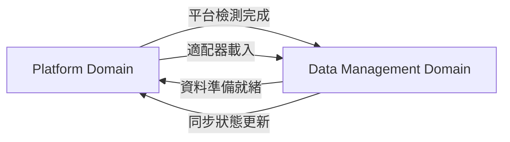
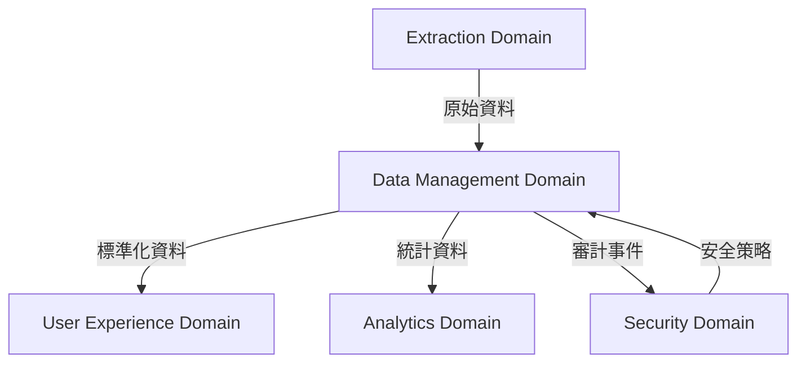

# 📊 Data Management Domain v2.0 完整技術設計文件

**版本**: v2.0.0  
**建立日期**: 2025-08-14  
**狀態**: 架構設計階段  
**負責領域**: 跨平台資料管理、同步、衝突解決、備份恢復

## 🎯 設計目標與核心職責

### 設計目標
Data Management Domain 是 Domain 架構 v2.0 的第二個核心領域，負責建立統一、可靠、高效的跨平台資料管理系統，確保：

- **統一資料模型**: 建立跨平台統一的書籍資料格式標準
- **智能同步機制**: 實現高效的增量同步和衝突自動解決
- **資料完整性**: 保證資料一致性和版本控制管理
- **災難恢復**: 建立完整的備份和恢復機制
- **效能優化**: 優化大資料量的處理和存取效能

### 核心職責 (20字)
跨平台資料同步、衝突解決、格式轉換、版本管理、備份恢復

## 🏗️ 在 Domain v2.0 架構中的定位

### 與 Platform Domain 的整合


**協作關係**:
- **接收**: `PLATFORM.{PLATFORM}.DETECTED` - 平台檢測完成事件
- **接收**: `PLATFORM.{PLATFORM}.ADAPTER.LOADED` - 適配器載入事件
- **發送**: `DATA.{PLATFORM}.READY` - 資料管理準備就緒
- **發送**: `DATA.CROSS_PLATFORM.SYNC.STATUS` - 跨平台同步狀態

### 與其他 Domain 的協作


## 📂 完整架構設計

### 內部服務架構
```
src/background/domains/data-management/
├── data-domain-coordinator.js              # 資料領域協調器 (450行)
├── services/
│   ├── data-validation-service.js          # 統一資料格式驗證與標準化 (400行)
│   ├── schema-migration-service.js         # 資料模型版本管理與自動遷移 (450行)
│   ├── data-synchronization-service.js     # 跨平台資料同步與增量更新 (550行)
│   ├── conflict-resolution-service.js      # 智能衝突檢測與多策略解決方案 (500行)
│   ├── storage-adapter-service.js          # 多種儲存後端統一介面與效能優化 (400行)
│   └── backup-recovery-service.js          # 自動備份與災難恢復機制 (450行)
├── models/
│   ├── unified-book-model.js               # 統一書籍資料模型定義 (300行)
│   ├── sync-metadata-model.js              # 同步元資料模型 (200行)
│   └── conflict-resolution-model.js        # 衝突解決模型 (250行)
├── adapters/
│   ├── chrome-storage-adapter.js           # Chrome 儲存適配器 (300行)
│   ├── indexeddb-adapter.js                # IndexedDB 適配器 (400行)
│   └── local-storage-adapter.js            # 本地儲存適配器 (250行)
└── utils/
    ├── data-transformer.js                 # 資料格式轉換工具 (300行)
    ├── encryption-helper.js                # 資料加密輔助工具 (200行)
    └── performance-monitor.js              # 效能監控工具 (250行)
```

### 核心服務詳細設計

## 🔧 核心服務技術規範

### 1. Data Domain Coordinator - 資料領域協調器

**負責功能**:
- 協調所有資料管理服務的運作
- 管理跨平台資料流程
- 處理領域間事件通訊
- 監控資料管理效能

**技術架構**:
```javascript
/**
 * Data Domain Coordinator v2.0
 * 
 * 負責功能：
 * - 協調所有資料管理服務運作
 * - 管理跨平台資料同步流程  
 * - 處理與其他 Domain 的事件通訊
 * - 監控和優化資料處理效能
 * 
 * 設計考量：
 * - 事件驅動架構，避免直接服務依賴
 * - 統一錯誤處理和恢復機制
 * - 效能監控和自動調優
 * - 支援水平擴展和負載平衡
 */
class DataDomainCoordinator extends DomainCoordinator {
  constructor(eventBus, serviceRegistry, config) {
    super('DataDomainCoordinator', eventBus)
    this.serviceRegistry = serviceRegistry
    this.config = config
    this.activeOperations = new Map()
    this.performanceMetrics = new PerformanceMonitor()
  }

  /**
   * 初始化資料領域服務
   * 
   * 處理流程：
   * 1. 註冊所有核心服務
   * 2. 建立服務間依賴關係
   * 3. 設定事件監聽器
   * 4. 啟動效能監控
   */
  async initialize() {
    await this.registerCoreServices()
    await this.setupServiceDependencies()
    await this.registerEventListeners()
    await this.startPerformanceMonitoring()
    
    await this.emit('DATA.DOMAIN.INITIALIZED', {
      services: this.serviceRegistry.getServiceNames(),
      timestamp: Date.now()
    })
  }

  /**
   * 註冊核心資料管理服務
   */
  async registerCoreServices() {
    const services = [
      { name: 'validation', class: DataValidationService },
      { name: 'migration', class: SchemaMigrationService },
      { name: 'synchronization', class: DataSynchronizationService },
      { name: 'conflictResolution', class: ConflictResolutionService },
      { name: 'storageAdapter', class: StorageAdapterService },
      { name: 'backupRecovery', class: BackupRecoveryService }
    ]

    for (const { name, class: ServiceClass } of services) {
      const service = new ServiceClass(this.eventBus, this.config[name])
      await this.serviceRegistry.register(name, service)
      await service.initialize()
    }
  }

  /**
   * 設定事件監聽器
   */
  async registerEventListeners() {
    // 平台檢測事件
    this.on('PLATFORM.*.DETECTED', this.handlePlatformDetected.bind(this))
    
    // 提取完成事件
    this.on('EXTRACTION.*.COMPLETED', this.handleExtractionCompleted.bind(this))
    
    // 跨平台同步請求
    this.on('DATA.CROSS_PLATFORM.SYNC.REQUESTED', this.handleCrossPlatformSync.bind(this))
    
    // 資料衝突事件
    this.on('DATA.*.CONFLICT.DETECTED', this.handleDataConflict.bind(this))
    
    // 備份恢復請求
    this.on('DATA.BACKUP.RECOVERY.REQUESTED', this.handleBackupRecovery.bind(this))
  }

  /**
   * 處理平台檢測完成事件
   */
  async handlePlatformDetected(event) {
    const { platform, adapter } = event.data
    
    // 初始化平台特定的資料管理設定
    await this.initializePlatformDataManagement(platform, adapter)
    
    // 檢查是否需要資料遷移
    const migrationNeeded = await this.checkMigrationNeeded(platform)
    if (migrationNeeded) {
      await this.emit('DATA.MIGRATION.REQUIRED', {
        platform,
        reason: 'PLATFORM_FIRST_TIME_DETECTION'
      })
    }
    
    await this.emit('DATA.PLATFORM.READY', { platform })
  }

  /**
   * 處理提取完成事件，觸發資料同步
   */
  async handleExtractionCompleted(event) {
    const { platform, books, extractionId } = event.data
    
    try {
      const operationId = this.generateOperationId()
      this.activeOperations.set(operationId, {
        type: 'DATA_PROCESSING',
        platform,
        startTime: Date.now(),
        extractionId
      })

      // 資料驗證
      await this.emit('DATA.VALIDATION.REQUESTED', {
        operationId,
        platform,
        books,
        source: 'EXTRACTION'
      })

      // 等待驗證完成後觸發同步
      // 由事件驅動機制處理後續流程

    } catch (error) {
      await this.emit('DATA.PROCESSING.FAILED', {
        platform,
        extractionId,
        error: error.message,
        operationId
      })
    }
  }

  /**
   * 處理跨平台同步請求
   */
  async handleCrossPlatformSync(event) {
    const { sourcePlatforms, targetPlatforms, syncOptions } = event.data
    
    const syncId = this.generateSyncId()
    await this.emit('DATA.SYNC.STARTED', {
      syncId,
      sourcePlatforms,
      targetPlatforms,
      options: syncOptions
    })

    // 委派給同步服務處理
    const syncService = await this.serviceRegistry.get('synchronization')
    await syncService.initiateCrossPlatformSync(syncId, sourcePlatforms, targetPlatforms, syncOptions)
  }

  /**
   * 處理資料衝突
   */
  async handleDataConflict(event) {
    const { conflictId, platform, conflictData } = event.data
    
    // 委派給衝突解決服務
    const conflictService = await this.serviceRegistry.get('conflictResolution')
    await conflictService.resolveConflict(conflictId, platform, conflictData)
  }

  /**
   * 初始化平台特定的資料管理
   */
  async initializePlatformDataManagement(platform, adapter) {
    // 設定平台特定的儲存適配器
    const storageService = await this.serviceRegistry.get('storageAdapter')
    await storageService.registerPlatformAdapter(platform, adapter)
    
    // 設定平台特定的資料驗證規則
    const validationService = await this.serviceRegistry.get('validation')
    await validationService.loadPlatformValidationRules(platform)
  }

  /**
   * 檢查是否需要資料遷移
   */
  async checkMigrationNeeded(platform) {
    const migrationService = await this.serviceRegistry.get('migration')
    return await migrationService.checkMigrationRequired(platform)
  }

  /**
   * 生成操作ID
   */
  generateOperationId() {
    return `data_op_${Date.now()}_${Math.random().toString(36).substr(2, 9)}`
  }

  /**
   * 生成同步ID
   */
  generateSyncId() {
    return `sync_${Date.now()}_${Math.random().toString(36).substr(2, 9)}`
  }
}
```

### 2. Data Validation Service - 統一資料格式驗證與標準化

**負責功能**:
- 驗證來自不同平台的原始資料格式
- 標準化資料為統一的 v2.0 格式
- 檢測資料完整性和品質
- 提供資料清理和修復功能

**技術架構**:
```javascript
/**
 * Data Validation Service v2.0
 * 
 * 負責功能：
 * - 統一資料格式驗證與標準化
 * - 跨平台資料品質檢測
 * - 自動資料清理和修復
 * - 資料完整性驗證
 * 
 * 設計考量：
 * - 支援多種資料來源和格式
 * - 可擴展的驗證規則引擎
 * - 效能優化的批量處理
 * - 詳細的驗證報告和錯誤追蹤
 */
class DataValidationService extends BaseService {
  constructor(eventBus, config) {
    super('DataValidationService', eventBus)
    this.config = config
    this.validationRules = new Map()
    this.platformSchemas = new Map()
    this.dataQualityMetrics = new Map()
  }

  /**
   * 初始化驗證服務
   */
  async initialize() {
    await this.loadValidationRules()
    await this.loadPlatformSchemas()
    await this.registerEventListeners()
  }

  /**
   * 載入平台特定的驗證規則
   */
  async loadPlatformValidationRules(platform) {
    const rules = await this.loadRulesForPlatform(platform)
    this.validationRules.set(platform, rules)
  }

  /**
   * 驗證和標準化書籍資料
   */
  async validateAndNormalize(books, platform, source = 'UNKNOWN') {
    const validationReport = {
      validationId: this.generateValidationId(),
      platform,
      source,
      totalBooks: books.length,
      validBooks: [],
      invalidBooks: [],
      warnings: [],
      normalizedBooks: [],
      qualityScore: 0,
      startTime: Date.now()
    }

    try {
      for (const book of books) {
        const bookValidation = await this.validateSingleBook(book, platform, source)
        
        if (bookValidation.isValid) {
          const normalizedBook = await this.normalizeBook(bookValidation.book, platform)
          validationReport.validBooks.push(bookValidation)
          validationReport.normalizedBooks.push(normalizedBook)
        } else {
          validationReport.invalidBooks.push(bookValidation)
        }
        
        validationReport.warnings.push(...bookValidation.warnings)
      }

      // 計算資料品質分數
      validationReport.qualityScore = this.calculateQualityScore(validationReport)
      validationReport.endTime = Date.now()
      validationReport.duration = validationReport.endTime - validationReport.startTime

      await this.emit('DATA.VALIDATION.COMPLETED', {
        validationId: validationReport.validationId,
        platform,
        source,
        qualityScore: validationReport.qualityScore,
        validCount: validationReport.validBooks.length,
        invalidCount: validationReport.invalidBooks.length,
        normalizedBooks: validationReport.normalizedBooks
      })

      return validationReport

    } catch (error) {
      await this.emit('DATA.VALIDATION.FAILED', {
        validationId: validationReport.validationId,
        platform,
        source,
        error: error.message
      })
      throw error
    }
  }

  /**
   * 驗證單一書籍資料
   */
  async validateSingleBook(book, platform, source) {
    const validation = {
      bookId: book.id || 'UNKNOWN',
      isValid: true,
      book: { ...book },
      errors: [],
      warnings: [],
      fixes: []
    }

    const rules = this.validationRules.get(platform) || this.validationRules.get('DEFAULT')
    const schema = this.platformSchemas.get(platform)

    // 結構驗證
    await this.validateStructure(validation, schema)
    
    // 必填欄位驗證
    await this.validateRequiredFields(validation, rules.required)
    
    // 資料類型驗證
    await this.validateDataTypes(validation, rules.types)
    
    // 商業邏輯驗證
    await this.validateBusinessRules(validation, rules.business)
    
    // 資料品質檢查
    await this.checkDataQuality(validation, rules.quality)

    // 自動修復常見問題
    if (this.config.autoFix && validation.errors.length === 0) {
      await this.autoFixCommonIssues(validation)
    }

    validation.isValid = validation.errors.length === 0

    return validation
  }

  /**
   * 標準化書籍資料為 v2.0 格式
   */
  async normalizeBook(book, platform) {
    const normalizedBook = {
      // 核心識別資訊
      id: book.id,
      crossPlatformId: await this.generateCrossPlatformId(book),
      platform: platform,

      // 基本書籍資訊
      title: this.normalizeTitle(book.title),
      authors: this.normalizeAuthors(book.authors || book.author),
      publisher: book.publisher || '',
      isbn: this.normalizeISBN(book.isbn),
      
      // 封面圖片標準化
      cover: await this.normalizeCover(book.cover),
      
      // 閱讀狀態標準化
      progress: this.normalizeProgress(book.progress),
      status: this.normalizeStatus(book.status),
      
      // 時間記錄標準化
      purchaseDate: this.normalizeDate(book.purchaseDate),
      lastReadDate: this.normalizeDate(book.lastReadDate),
      addedToLibraryDate: this.normalizeDate(book.addedDate) || new Date().toISOString(),
      
      // 個人化資料
      rating: this.normalizeRating(book.rating),
      tags: this.normalizeTags(book.tags, platform),
      notes: book.notes || '',
      bookmarks: this.normalizeBookmarks(book.bookmarks),
      
      // 平台特定資料
      platformMetadata: {
        [platform]: {
          originalData: book,
          extractionTimestamp: new Date().toISOString(),
          dataQuality: await this.assessDataQuality(book),
          normalizationVersion: '2.0.0'
        }
      },
      
      // 同步管理
      syncStatus: {
        lastSyncTimestamp: new Date().toISOString(),
        conflictResolved: true,
        mergeStrategy: 'LATEST_TIMESTAMP'
      },
      
      // 版本資訊
      version: '1.0.0',
      schemaVersion: '2.0.0',
      createdAt: new Date().toISOString(),
      updatedAt: new Date().toISOString()
    }

    // 生成資料指紋用於重複檢測
    normalizedBook.dataFingerprint = await this.generateDataFingerprint(normalizedBook)

    return normalizedBook
  }

  /**
   * 驗證資料結構
   */
  async validateStructure(validation, schema) {
    if (!schema) return

    try {
      // 使用 JSON Schema 驗證
      const isValid = await schema.validate(validation.book)
      if (!isValid) {
        validation.errors.push({
          type: 'STRUCTURE_ERROR',
          message: 'Book data structure does not match expected schema',
          details: schema.errors
        })
      }
    } catch (error) {
      validation.errors.push({
        type: 'SCHEMA_VALIDATION_ERROR',
        message: error.message
      })
    }
  }

  /**
   * 驗證必填欄位
   */
  async validateRequiredFields(validation, requiredFields) {
    for (const field of requiredFields) {
      const value = this.getNestedValue(validation.book, field)
      if (value === undefined || value === null || value === '') {
        validation.errors.push({
          type: 'MISSING_REQUIRED_FIELD',
          field: field,
          message: `Required field '${field}' is missing or empty`
        })
      }
    }
  }

  /**
   * 驗證資料類型
   */
  async validateDataTypes(validation, typeRules) {
    for (const [field, expectedType] of Object.entries(typeRules)) {
      const value = this.getNestedValue(validation.book, field)
      if (value !== undefined && !this.isCorrectType(value, expectedType)) {
        validation.errors.push({
          type: 'INVALID_DATA_TYPE',
          field: field,
          expectedType: expectedType,
          actualType: typeof value,
          message: `Field '${field}' expected ${expectedType} but got ${typeof value}`
        })
      }
    }
  }

  /**
   * 標準化標題
   */
  normalizeTitle(title) {
    if (!title) return ''
    return title.trim().replace(/\s+/g, ' ')
  }

  /**
   * 標準化作者
   */
  normalizeAuthors(authors) {
    if (!authors) return []
    if (typeof authors === 'string') {
      return [authors.trim()]
    }
    if (Array.isArray(authors)) {
      return authors.map(author => typeof author === 'string' ? author.trim() : String(author).trim())
    }
    return [String(authors).trim()]
  }

  /**
   * 標準化 ISBN
   */
  normalizeISBN(isbn) {
    if (!isbn) return ''
    return isbn.replace(/[^0-9X]/gi, '').toUpperCase()
  }

  /**
   * 標準化封面圖片
   */
  async normalizeCover(cover) {
    if (!cover) {
      return {
        thumbnail: '',
        medium: '',
        large: ''
      }
    }

    if (typeof cover === 'string') {
      return {
        thumbnail: cover,
        medium: cover,
        large: cover
      }
    }

    return {
      thumbnail: cover.thumbnail || cover.small || cover.default || '',
      medium: cover.medium || cover.default || '',
      large: cover.large || cover.default || ''
    }
  }

  /**
   * 標準化閱讀進度
   */
  normalizeProgress(progress) {
    if (!progress) {
      return {
        percentage: 0,
        currentPage: 0,
        totalPages: 0,
        lastPosition: ''
      }
    }

    return {
      percentage: Math.max(0, Math.min(100, Number(progress.percentage || progress.percent || 0))),
      currentPage: Math.max(0, Number(progress.currentPage || progress.page || 0)),
      totalPages: Math.max(0, Number(progress.totalPages || progress.total || 0)),
      lastPosition: String(progress.lastPosition || progress.position || '')
    }
  }

  /**
   * 生成跨平台統一ID
   */
  async generateCrossPlatformId(book) {
    const identifier = `${book.title || ''}-${(book.authors || book.author || [])[0] || ''}-${book.isbn || book.id || ''}`
    return this.hashString(identifier)
  }

  /**
   * 計算資料品質分數
   */
  calculateQualityScore(report) {
    const totalBooks = report.totalBooks
    if (totalBooks === 0) return 0

    const validRatio = report.validBooks.length / totalBooks
    const warningPenalty = Math.min(report.warnings.length * 0.01, 0.2) // 最多扣20%

    return Math.max(0, Math.min(100, (validRatio * 100) - (warningPenalty * 100)))
  }

  /**
   * 生成資料指紋
   */
  async generateDataFingerprint(book) {
    const fingerprint = `${book.title}-${book.authors.join(',')}-${book.isbn}`
    return this.hashString(fingerprint)
  }

  /**
   * 工具方法：字串雜湊
   */
  hashString(str) {
    let hash = 0
    if (str.length === 0) return hash.toString(36)
    for (let i = 0; i < str.length; i++) {
      const char = str.charCodeAt(i)
      hash = ((hash << 5) - hash) + char
      hash = hash & hash // Convert to 32bit integer
    }
    return Math.abs(hash).toString(36)
  }

  /**
   * 工具方法：取得巢狀物件值
   */
  getNestedValue(obj, path) {
    return path.split('.').reduce((current, key) => current?.[key], obj)
  }

  /**
   * 工具方法：檢查資料類型
   */
  isCorrectType(value, expectedType) {
    switch (expectedType) {
      case 'string': return typeof value === 'string'
      case 'number': return typeof value === 'number' && !isNaN(value)
      case 'boolean': return typeof value === 'boolean'
      case 'array': return Array.isArray(value)
      case 'object': return typeof value === 'object' && value !== null && !Array.isArray(value)
      case 'date': return value instanceof Date || (typeof value === 'string' && !isNaN(Date.parse(value)))
      default: return true
    }
  }
}
```

### 3. Schema Migration Service - 資料模型版本管理與自動遷移

**負責功能**:
- 管理資料模型版本演進
- 自動檢測和執行資料遷移
- 保證向後相容性
- 提供回滾機制

**技術架構**:
```javascript
/**
 * Schema Migration Service v2.0
 * 
 * 負責功能：
 * - 資料模型版本管理與自動遷移
 * - 跨版本相容性維護
 * - 遷移腳本管理和執行
 * - 資料備份和回滾機制
 * 
 * 設計考量：
 * - 支援增量遷移和批量遷移
 * - 零停機時間遷移策略
 * - 自動回滾和錯誤恢復
 * - 詳細的遷移日誌和追蹤
 */
class SchemaMigrationService extends BaseService {
  constructor(eventBus, config) {
    super('SchemaMigrationService', eventBus)
    this.config = config
    this.migrations = new Map()
    this.currentVersions = new Map()
    this.migrationHistory = new Map()
  }

  /**
   * 初始化遷移服務
   */
  async initialize() {
    await this.loadMigrationScripts()
    await this.loadCurrentVersions()
    await this.registerEventListeners()
  }

  /**
   * 檢查平台是否需要遷移
   */
  async checkMigrationRequired(platform) {
    const currentVersion = await this.getCurrentVersion(platform)
    const targetVersion = this.config.targetVersion || '2.0.0'
    
    return this.compareVersions(currentVersion, targetVersion) < 0
  }

  /**
   * 執行資料遷移
   */
  async migratePlatformData(platform, fromVersion = null, toVersion = null) {
    const migrationId = this.generateMigrationId()
    const currentVersion = fromVersion || await this.getCurrentVersion(platform)
    const targetVersion = toVersion || this.config.targetVersion || '2.0.0'

    if (this.compareVersions(currentVersion, targetVersion) === 0) {
      return { migrationId, status: 'NO_MIGRATION_NEEDED', currentVersion, targetVersion }
    }

    const migrationPlan = await this.createMigrationPlan(platform, currentVersion, targetVersion)
    
    await this.emit('DATA.MIGRATION.STARTED', {
      migrationId,
      platform,
      fromVersion: currentVersion,
      toVersion: targetVersion,
      steps: migrationPlan.steps.length
    })

    try {
      // 建立備份
      const backupId = await this.createBackup(platform, currentVersion)
      
      // 執行遷移步驟
      const results = await this.executeMigrationPlan(migrationId, platform, migrationPlan)
      
      // 更新版本記錄
      await this.updateCurrentVersion(platform, targetVersion)
      
      // 記錄遷移歷史
      await this.recordMigrationHistory(migrationId, platform, currentVersion, targetVersion, results)

      await this.emit('DATA.MIGRATION.COMPLETED', {
        migrationId,
        platform,
        fromVersion: currentVersion,
        toVersion: targetVersion,
        backupId,
        duration: results.totalDuration,
        migratedRecords: results.totalRecords
      })

      return {
        migrationId,
        status: 'SUCCESS',
        fromVersion: currentVersion,
        toVersion: targetVersion,
        results
      }

    } catch (error) {
      await this.emit('DATA.MIGRATION.FAILED', {
        migrationId,
        platform,
        fromVersion: currentVersion,
        toVersion: targetVersion,
        error: error.message
      })

      // 嘗試回滾
      if (this.config.autoRollback) {
        await this.rollbackMigration(migrationId, platform, currentVersion)
      }

      throw error
    }
  }

  /**
   * 建立遷移計劃
   */
  async createMigrationPlan(platform, fromVersion, toVersion) {
    const plan = {
      platform,
      fromVersion,
      toVersion,
      steps: [],
      estimatedDuration: 0,
      estimatedRecords: 0
    }

    // 找出需要執行的遷移步驟
    const versionPath = this.getVersionPath(fromVersion, toVersion)
    
    for (let i = 0; i < versionPath.length - 1; i++) {
      const stepFromVersion = versionPath[i]
      const stepToVersion = versionPath[i + 1]
      
      const migration = this.findMigration(platform, stepFromVersion, stepToVersion)
      if (!migration) {
        throw new Error(`No migration found from ${stepFromVersion} to ${stepToVersion} for platform ${platform}`)
      }

      plan.steps.push({
        migrationId: migration.id,
        fromVersion: stepFromVersion,
        toVersion: stepToVersion,
        migration: migration,
        estimatedDuration: migration.estimatedDuration || 0
      })

      plan.estimatedDuration += migration.estimatedDuration || 0
    }

    // 估算影響的記錄數
    plan.estimatedRecords = await this.estimateAffectedRecords(platform, fromVersion, toVersion)

    return plan
  }

  /**
   * 執行遷移計劃
   */
  async executeMigrationPlan(migrationId, platform, plan) {
    const results = {
      migrationId,
      platform,
      steps: [],
      totalDuration: 0,
      totalRecords: 0,
      startTime: Date.now()
    }

    for (const [index, step] of plan.steps.entries()) {
      const stepStart = Date.now()
      
      await this.emit('DATA.MIGRATION.STEP.STARTED', {
        migrationId,
        platform,
        stepIndex: index,
        stepId: step.migrationId,
        fromVersion: step.fromVersion,
        toVersion: step.toVersion
      })

      try {
        const stepResult = await this.executeMigrationStep(platform, step)
        
        const stepDuration = Date.now() - stepStart
        const stepResults = {
          stepId: step.migrationId,
          fromVersion: step.fromVersion,
          toVersion: step.toVersion,
          status: 'SUCCESS',
          duration: stepDuration,
          recordsProcessed: stepResult.recordsProcessed,
          recordsUpdated: stepResult.recordsUpdated
        }

        results.steps.push(stepResults)
        results.totalDuration += stepDuration
        results.totalRecords += stepResult.recordsProcessed

        await this.emit('DATA.MIGRATION.STEP.COMPLETED', {
          migrationId,
          platform,
          stepIndex: index,
          ...stepResults
        })

      } catch (error) {
        await this.emit('DATA.MIGRATION.STEP.FAILED', {
          migrationId,
          platform,
          stepIndex: index,
          stepId: step.migrationId,
          error: error.message
        })
        throw error
      }
    }

    results.endTime = Date.now()
    results.totalDuration = results.endTime - results.startTime

    return results
  }

  /**
   * 執行單一遷移步驟
   */
  async executeMigrationStep(platform, step) {
    const migration = step.migration
    const storageAdapter = await this.getStorageAdapter(platform)
    
    // 取得需要遷移的資料
    const records = await storageAdapter.getAllRecords()
    
    const result = {
      recordsProcessed: 0,
      recordsUpdated: 0,
      errors: []
    }

    // 批量處理資料
    const batchSize = this.config.migrationBatchSize || 100
    const batches = this.chunkArray(records, batchSize)

    for (const batch of batches) {
      try {
        const migratedBatch = await migration.transform(batch, {
          fromVersion: step.fromVersion,
          toVersion: step.toVersion,
          platform
        })

        await storageAdapter.updateRecords(migratedBatch)
        
        result.recordsProcessed += batch.length
        result.recordsUpdated += migratedBatch.length

      } catch (error) {
        result.errors.push({
          batchIndex: batches.indexOf(batch),
          error: error.message
        })
        
        if (!this.config.continueOnError) {
          throw error
        }
      }
    }

    return result
  }

  /**
   * 建立資料備份
   */
  async createBackup(platform, version) {
    const backupId = this.generateBackupId()
    const timestamp = new Date().toISOString()
    
    const storageAdapter = await this.getStorageAdapter(platform)
    const allData = await storageAdapter.getAllRecords()
    
    const backup = {
      backupId,
      platform,
      version,
      timestamp,
      recordCount: allData.length,
      data: allData,
      metadata: {
        createdBy: 'SchemaMigrationService',
        purpose: 'PRE_MIGRATION_BACKUP',
        originalSize: JSON.stringify(allData).length
      }
    }

    await this.storeBackup(backup)
    
    await this.emit('DATA.BACKUP.CREATED', {
      backupId,
      platform,
      version,
      recordCount: allData.length
    })

    return backupId
  }

  /**
   * 回滾遷移
   */
  async rollbackMigration(migrationId, platform, targetVersion) {
    try {
      // 找到對應的備份
      const backup = await this.findBackupForMigration(migrationId, platform)
      if (!backup) {
        throw new Error(`No backup found for migration ${migrationId}`)
      }

      // 恢復資料
      const storageAdapter = await this.getStorageAdapter(platform)
      await storageAdapter.replaceAllRecords(backup.data)
      
      // 恢復版本記錄
      await this.updateCurrentVersion(platform, targetVersion)

      await this.emit('DATA.MIGRATION.ROLLBACK.COMPLETED', {
        migrationId,
        platform,
        backupId: backup.backupId,
        restoredVersion: targetVersion
      })

    } catch (error) {
      await this.emit('DATA.MIGRATION.ROLLBACK.FAILED', {
        migrationId,
        platform,
        error: error.message
      })
      throw error
    }
  }

  /**
   * 載入遷移腳本
   */
  async loadMigrationScripts() {
    const migrationConfigs = [
      {
        id: 'v1_to_v2_basic',
        fromVersion: '1.0.0',
        toVersion: '2.0.0',
        platforms: ['READMOO', 'KINDLE', 'KOBO'],
        transform: this.migrateV1ToV2Basic.bind(this)
      },
      {
        id: 'v2_0_0_to_v2_1_0',
        fromVersion: '2.0.0',
        toVersion: '2.1.0',
        platforms: ['ALL'],
        transform: this.migrateV20ToV21.bind(this)
      }
    ]

    for (const config of migrationConfigs) {
      this.migrations.set(config.id, config)
    }
  }

  /**
   * v1.0 到 v2.0 基礎遷移
   */
  async migrateV1ToV2Basic(records, context) {
    return records.map(record => {
      // 如果已經是 v2.0 格式，直接返回
      if (record.schemaVersion === '2.0.0') {
        return record
      }

      return {
        // v2.0 標準格式
        id: record.id,
        crossPlatformId: this.generateCrossPlatformId(record),
        platform: context.platform,
        
        // 基本資訊
        title: record.title,
        authors: Array.isArray(record.author) ? record.author : [record.author || ''],
        publisher: record.publisher || '',
        isbn: record.isbn || '',
        
        // 封面圖片
        cover: {
          thumbnail: record.cover || '',
          medium: record.cover || '',
          large: record.cover || ''
        },
        
        // 閱讀狀態
        progress: {
          percentage: record.progress || 0,
          currentPage: record.currentPage || 0,
          totalPages: record.totalPages || 0,
          lastPosition: ''
        },
        status: record.status || 'UNREAD',
        
        // 時間記錄
        purchaseDate: record.purchaseDate || null,
        lastReadDate: record.lastReadDate || null,
        addedToLibraryDate: record.addedDate || new Date().toISOString(),
        
        // 個人化資料
        rating: record.rating || 0,
        tags: record.tags || [context.platform.toLowerCase()],
        notes: record.notes || '',
        bookmarks: record.bookmarks || [],
        
        // 平台特定資料
        platformMetadata: {
          [context.platform]: {
            originalData: record,
            extractionTimestamp: new Date().toISOString(),
            dataQuality: 'MIGRATED'
          }
        },
        
        // 同步管理
        syncStatus: {
          lastSyncTimestamp: new Date().toISOString(),
          conflictResolved: true,
          mergeStrategy: 'LEGACY_MIGRATION'
        },
        
        // 版本資訊
        version: '1.0.0',
        schemaVersion: '2.0.0',
        migrationHistory: [{
          from: '1.0.0',
          to: '2.0.0',
          timestamp: Date.now(),
          reason: 'AUTOMATIC_MIGRATION'
        }]
      }
    })
  }

  /**
   * 比較版本號
   */
  compareVersions(version1, version2) {
    const v1Parts = version1.split('.').map(Number)
    const v2Parts = version2.split('.').map(Number)
    
    for (let i = 0; i < Math.max(v1Parts.length, v2Parts.length); i++) {
      const v1Part = v1Parts[i] || 0
      const v2Part = v2Parts[i] || 0
      
      if (v1Part < v2Part) return -1
      if (v1Part > v2Part) return 1
    }
    
    return 0
  }

  /**
   * 工具方法
   */
  generateMigrationId() {
    return `migration_${Date.now()}_${Math.random().toString(36).substr(2, 9)}`
  }

  generateBackupId() {
    return `backup_${Date.now()}_${Math.random().toString(36).substr(2, 9)}`
  }

  chunkArray(array, chunkSize) {
    const chunks = []
    for (let i = 0; i < array.length; i += chunkSize) {
      chunks.push(array.slice(i, i + chunkSize))
    }
    return chunks
  }
}
```

## 🎭 事件系統 v2.0 完整整合

### Data Management Domain 事件規範

**事件命名規範**: `DATA.{PLATFORM}.{ACTION}.{STATE}`

#### 發布事件 (Outbound Events)
```javascript
const DataManagementEvents = {
  // 領域初始化
  DOMAIN_INITIALIZED: 'DATA.DOMAIN.INITIALIZED',
  
  // 資料驗證事件
  VALIDATION_STARTED: 'DATA.{PLATFORM}.VALIDATION.STARTED',
  VALIDATION_COMPLETED: 'DATA.{PLATFORM}.VALIDATION.COMPLETED', 
  VALIDATION_FAILED: 'DATA.{PLATFORM}.VALIDATION.FAILED',
  
  // 資料同步事件
  SYNC_STARTED: 'DATA.{PLATFORM}.SYNC.STARTED',
  SYNC_PROGRESS: 'DATA.{PLATFORM}.SYNC.PROGRESS',
  SYNC_COMPLETED: 'DATA.{PLATFORM}.SYNC.COMPLETED',
  SYNC_FAILED: 'DATA.{PLATFORM}.SYNC.FAILED',
  
  // 跨平台同步事件
  CROSS_PLATFORM_SYNC_STARTED: 'DATA.CROSS_PLATFORM.SYNC.STARTED',
  CROSS_PLATFORM_SYNC_COMPLETED: 'DATA.CROSS_PLATFORM.SYNC.COMPLETED',
  
  // 衝突處理事件
  CONFLICT_DETECTED: 'DATA.{PLATFORM}.CONFLICT.DETECTED',
  CONFLICT_RESOLVED: 'DATA.{PLATFORM}.CONFLICT.RESOLVED',
  CONFLICT_RESOLUTION_FAILED: 'DATA.{PLATFORM}.CONFLICT.FAILED',
  
  // 資料遷移事件
  MIGRATION_STARTED: 'DATA.{PLATFORM}.MIGRATION.STARTED',
  MIGRATION_COMPLETED: 'DATA.{PLATFORM}.MIGRATION.COMPLETED',
  MIGRATION_FAILED: 'DATA.{PLATFORM}.MIGRATION.FAILED',
  
  // 備份恢復事件
  BACKUP_CREATED: 'DATA.{PLATFORM}.BACKUP.CREATED',
  RECOVERY_STARTED: 'DATA.{PLATFORM}.RECOVERY.STARTED',
  RECOVERY_COMPLETED: 'DATA.{PLATFORM}.RECOVERY.COMPLETED'
}
```

#### 監聽事件 (Inbound Events)
```javascript
const DataManagementListeners = {
  // 來自 Platform Domain
  PLATFORM_DETECTED: 'PLATFORM.{PLATFORM}.DETECTED',
  PLATFORM_ADAPTER_LOADED: 'PLATFORM.{PLATFORM}.ADAPTER.LOADED',
  
  // 來自 Extraction Domain  
  EXTRACTION_COMPLETED: 'EXTRACTION.{PLATFORM}.COMPLETED',
  EXTRACTION_DATA_READY: 'EXTRACTION.{PLATFORM}.DATA.READY',
  
  // 來自 Security Domain
  SECURITY_POLICY_UPDATED: 'SECURITY.{PLATFORM}.POLICY.UPDATED',
  SECURITY_ENCRYPTION_REQUIRED: 'SECURITY.{PLATFORM}.ENCRYPTION.REQUIRED',
  
  // 跨領域協調事件
  DATA_SYNC_REQUESTED: 'DATA.CROSS_PLATFORM.SYNC.REQUESTED',
  DATA_BACKUP_REQUESTED: 'DATA.BACKUP.RECOVERY.REQUESTED',
  DATA_MIGRATION_REQUESTED: 'DATA.MIGRATION.REQUIRED'
}
```

### 事件優先級設計

```javascript
const DataEventPriorities = {
  // 緊急事件 (0-99)
  DATA_CORRUPTION: 10,
  CRITICAL_SYNC_FAILURE: 20,
  BACKUP_FAILURE: 30,
  
  // 高優先級事件 (100-199)
  CONFLICT_DETECTED: 110,
  MIGRATION_REQUIRED: 120,
  VALIDATION_FAILED: 130,
  
  // 正常優先級事件 (200-299)
  SYNC_STARTED: 210,
  VALIDATION_STARTED: 220,
  BACKUP_CREATED: 230,
  
  // 低優先級事件 (300-399)
  SYNC_PROGRESS: 310,
  STATISTICS_UPDATED: 320,
  CACHE_UPDATED: 330
}
```

## 📊 統一資料模型設計

### Unified Book Model v2.0

```javascript
/**
 * 統一書籍資料模型 v2.0
 * 
 * 設計原則：
 * - 平台無關的標準化格式
 * - 支援多平台資料合併
 * - 包含完整的同步和衝突處理元資料
 * - 向後相容性保證
 */
const UnifiedBookModelV2 = {
  // 核心識別資訊
  id: 'string',                    // 平台特定ID
  crossPlatformId: 'string',       // 跨平台統一ID (雜湊生成)
  platform: 'READMOO|KINDLE|KOBO|BOOKWALKER|BOOKS_COM',
  
  // 基本書籍資訊
  title: 'string',                 // 書名
  authors: ['string'],             // 作者列表
  publisher: 'string',             // 出版社
  isbn: 'string',                  // ISBN (標準化後)
  description: 'string',           // 書籍描述
  language: 'string',              // 語言代碼
  publishedDate: 'ISO_8601_date',  // 出版日期
  pageCount: 'number',             // 頁數
  genres: ['string'],              // 分類/類型
  
  // 封面圖片
  cover: {
    thumbnail: 'url',              // 縮圖
    medium: 'url',                 // 中等尺寸
    large: 'url',                  // 大尺寸
    original: 'url'                // 原始尺寸
  },
  
  // 閱讀狀態
  progress: {
    percentage: 'number',          // 0-100
    currentPage: 'number',         // 當前頁數
    totalPages: 'number',          // 總頁數
    lastPosition: 'string',        // 平台特定位置標記
    estimatedTimeLeft: 'number'    // 預估剩餘閱讀時間(分鐘)
  },
  status: 'UNREAD|READING|COMPLETED|ON_HOLD|ABANDONED',
  
  // 時間記錄
  purchaseDate: 'ISO_8601_date',   // 購買日期
  lastReadDate: 'ISO_8601_date',   // 最後閱讀日期
  addedToLibraryDate: 'ISO_8601_date', // 加入書庫日期
  completedDate: 'ISO_8601_date',  // 完成閱讀日期
  
  // 個人化資料
  rating: 'number',                // 1-5 評分
  tags: ['string'],                // 使用者自定義標籤
  notes: 'string',                 // 閱讀筆記
  bookmarks: [{                    // 書籤列表
    id: 'string',
    position: 'string',
    note: 'string',
    timestamp: 'ISO_8601_date',
    chapter: 'string'
  }],
  highlights: [{                   // 劃線/標記
    id: 'string',
    text: 'string',
    position: 'string',
    color: 'string',
    note: 'string',
    timestamp: 'ISO_8601_date'
  }],
  
  // 閱讀統計
  readingStats: {
    totalReadingTime: 'number',    // 總閱讀時間(分鐘)
    averageReadingSpeed: 'number', // 平均閱讀速度(字/分鐘)
    sessionsCount: 'number',       // 閱讀次數
    longestSession: 'number'       // 最長閱讀時間(分鐘)
  },
  
  // 平台特定資料
  platformMetadata: {
    [platform]: {
      originalData: 'object',      // 原始平台資料
      extractionTimestamp: 'ISO_8601_date',
      dataQuality: 'VERIFIED|PARTIAL|SUSPECT|MIGRATED',
      platformSpecificFields: 'object', // 平台特有欄位
      apiVersion: 'string'         // 提取時使用的 API 版本
    }
  },
  
  // 同步管理
  syncStatus: {
    lastSyncTimestamp: 'ISO_8601_date',
    conflictResolved: 'boolean',
    mergeStrategy: 'LATEST_TIMESTAMP|MANUAL|PLATFORM_PRIORITY|SMART_MERGE',
    syncSources: ['string'],       // 參與同步的平台列表
    pendingSync: 'boolean'         // 是否有待同步的變更
  },
  
  // 衝突記錄
  conflictHistory: [{
    conflictId: 'string',
    timestamp: 'ISO_8601_date',
    conflictType: 'DATA_INCONSISTENCY|VERSION_CONFLICT|PLATFORM_DIVERGENCE',
    involvedPlatforms: ['string'],
    resolutionStrategy: 'string',
    resolvedBy: 'SYSTEM|USER',
    conflictData: 'object'
  }],
  
  // 資料版本控制
  version: 'semantic_version',     // 資料版本
  schemaVersion: '2.0.0',         // 模型版本
  createdAt: 'ISO_8601_date',     // 建立時間
  updatedAt: 'ISO_8601_date',     // 最後更新時間
  dataFingerprint: 'string',      // 資料指紋(用於重複檢測)
  
  // 遷移歷史
  migrationHistory: [{
    from: 'semantic_version',
    to: 'semantic_version', 
    timestamp: 'number',
    reason: 'AUTOMATIC_MIGRATION|MANUAL_UPGRADE|SCHEMA_UPDATE'
  }]
}
```

### Sync Metadata Model

```javascript
/**
 * 同步元資料模型
 * 管理跨平台資料同步的狀態和歷史
 */
const SyncMetadataModel = {
  syncId: 'string',                // 同步操作ID
  type: 'FULL_SYNC|INCREMENTAL_SYNC|CONFLICT_RESOLUTION',
  
  // 參與同步的平台
  platforms: {
    source: ['string'],            // 來源平台
    target: ['string'],            // 目標平台
    excluded: ['string']           // 排除的平台
  },
  
  // 同步範圍
  scope: {
    allBooks: 'boolean',
    bookIds: ['string'],           // 特定書籍ID
    dateRange: {
      from: 'ISO_8601_date',
      to: 'ISO_8601_date'
    },
    platforms: ['string']          // 限制的平台
  },
  
  // 同步狀態
  status: 'PENDING|RUNNING|COMPLETED|FAILED|CANCELLED',
  startTime: 'ISO_8601_date',
  endTime: 'ISO_8601_date',
  duration: 'number',              // 毫秒
  
  // 同步結果
  results: {
    totalBooks: 'number',
    syncedBooks: 'number',
    failedBooks: 'number',
    conflictsDetected: 'number',
    conflictsResolved: 'number',
    errors: [{
      bookId: 'string',
      platform: 'string',
      error: 'string',
      errorCode: 'string'
    }]
  },
  
  // 效能指標
  performance: {
    booksPerSecond: 'number',
    networkUsage: 'number',        // 位元組
    memoryPeak: 'number',          // 位元組
    cpuUsage: 'number'             // 百分比
  }
}
```

## ⚙️ 依賴注入與服務配置

### 服務注入配置

```javascript
/**
 * Data Management Domain 依賴注入配置
 */
const DataManagementDIConfig = {
  services: {
    // 核心協調器
    coordinator: {
      class: 'DataDomainCoordinator',
      dependencies: ['eventBus', 'serviceRegistry', 'config'],
      singleton: true
    },
    
    // 資料驗證服務
    validation: {
      class: 'DataValidationService',
      dependencies: ['eventBus', 'validationConfig'],
      config: {
        autoFix: true,
        strictMode: false,
        batchSize: 100
      }
    },
    
    // 模型遷移服務
    migration: {
      class: 'SchemaMigrationService', 
      dependencies: ['eventBus', 'migrationConfig'],
      config: {
        targetVersion: '2.0.0',
        migrationBatchSize: 50,
        autoRollback: true,
        continueOnError: false
      }
    },
    
    // 資料同步服務
    synchronization: {
      class: 'DataSynchronizationService',
      dependencies: ['eventBus', 'syncConfig'],
      config: {
        maxConcurrentSyncs: 3,
        syncTimeout: 300000,         // 5 分鐘
        retryAttempts: 3,
        conflictResolutionStrategy: 'SMART_MERGE'
      }
    },
    
    // 衝突解決服務
    conflictResolution: {
      class: 'ConflictResolutionService',
      dependencies: ['eventBus', 'conflictConfig'],
      config: {
        autoResolveThreshold: 0.8,   // 80% 信心度自動解決
        userInteractionTimeout: 300000, // 5 分鐘等待使用者
        defaultStrategy: 'LATEST_TIMESTAMP'
      }
    },
    
    // 儲存適配器服務
    storageAdapter: {
      class: 'StorageAdapterService',
      dependencies: ['eventBus', 'storageConfig'],
      config: {
        primaryAdapter: 'chrome-storage',
        fallbackAdapters: ['indexeddb', 'local-storage'],
        cacheEnabled: true,
        cacheSize: 1000
      }
    },
    
    // 備份恢復服務
    backupRecovery: {
      class: 'BackupRecoveryService',
      dependencies: ['eventBus', 'backupConfig'],
      config: {
        autoBackup: true,
        backupFrequency: 86400000,   // 24 小時
        maxBackups: 10,
        compressionEnabled: true
      }
    }
  },
  
  // 外部依賴
  external: {
    eventBus: 'EventBus',
    platformRegistry: 'PlatformRegistry',
    securityManager: 'SecurityManager',
    performanceMonitor: 'PerformanceMonitor'
  }
}
```

### API 接口設計規範

```javascript
/**
 * Data Management Domain 公開 API 接口
 */
class DataManagementAPI {
  constructor(coordinator) {
    this.coordinator = coordinator
  }

  /**
   * 同步特定平台的資料
   */
  async syncPlatformData(platform, options = {}) {
    return await this.coordinator.emit('DATA.SYNC.REQUESTED', {
      platform,
      options: {
        fullSync: options.fullSync || false,
        conflictResolution: options.conflictResolution || 'AUTO',
        timeout: options.timeout || 300000
      }
    })
  }

  /**
   * 跨平台資料同步
   */
  async syncAcrossPlatforms(sourcePlatforms, targetPlatforms, options = {}) {
    return await this.coordinator.emit('DATA.CROSS_PLATFORM.SYNC.REQUESTED', {
      sourcePlatforms,
      targetPlatforms,
      syncOptions: {
        strategy: options.strategy || 'SMART_MERGE',
        conflictResolution: options.conflictResolution || 'AUTO',
        batchSize: options.batchSize || 100
      }
    })
  }

  /**
   * 驗證和標準化資料
   */
  async validateAndNormalizeData(books, platform, source = 'API') {
    const validation = await this.coordinator.serviceRegistry.get('validation')
    return await validation.validateAndNormalize(books, platform, source)
  }

  /**
   * 解決資料衝突
   */
  async resolveDataConflict(conflictId, resolutionStrategy, userChoices = null) {
    return await this.coordinator.emit('DATA.CONFLICT.RESOLUTION.REQUESTED', {
      conflictId,
      strategy: resolutionStrategy,
      userChoices
    })
  }

  /**
   * 建立備份
   */
  async createBackup(platforms = null, options = {}) {
    return await this.coordinator.emit('DATA.BACKUP.REQUESTED', {
      platforms,
      options: {
        compression: options.compression !== false,
        encryption: options.encryption || false,
        metadata: options.metadata || {}
      }
    })
  }

  /**
   * 恢復備份
   */
  async restoreBackup(backupId, options = {}) {
    return await this.coordinator.emit('DATA.RECOVERY.REQUESTED', {
      backupId,
      options: {
        overwrite: options.overwrite || false,
        platforms: options.platforms || null,
        dryRun: options.dryRun || false
      }
    })
  }

  /**
   * 取得同步狀態
   */
  async getSyncStatus(platform = null) {
    if (platform) {
      return await this.coordinator.emit('DATA.SYNC.STATUS.REQUESTED', { platform })
    }
    return await this.coordinator.emit('DATA.CROSS_PLATFORM.SYNC.STATUS.REQUESTED')
  }

  /**
   * 取得資料統計
   */
  async getDataStatistics(platforms = null) {
    return await this.coordinator.emit('DATA.STATISTICS.REQUESTED', { platforms })
  }
}
```

## 🔍 錯誤處理與恢復機制

### 統一錯誤處理策略

```javascript
/**
 * Data Management Domain 錯誤處理機制
 */
class DataManagementErrorHandler {
  constructor(eventBus, config) {
    this.eventBus = eventBus
    this.config = config
    this.errorStrategies = new Map()
    this.setupErrorStrategies()
  }

  /**
   * 設定錯誤處理策略
   */
  setupErrorStrategies() {
    // 驗證錯誤
    this.errorStrategies.set('VALIDATION_ERROR', {
      retry: false,
      fallback: 'SKIP_INVALID_RECORDS',
      notify: true,
      escalate: false
    })

    // 同步錯誤
    this.errorStrategies.set('SYNC_ERROR', {
      retry: true,
      maxRetries: 3,
      backoffStrategy: 'EXPONENTIAL',
      fallback: 'QUEUE_FOR_LATER',
      notify: true,
      escalate: true
    })

    // 衝突解決錯誤
    this.errorStrategies.set('CONFLICT_RESOLUTION_ERROR', {
      retry: false,
      fallback: 'REQUEST_USER_INTERVENTION',
      notify: true,
      escalate: false
    })

    // 儲存錯誤
    this.errorStrategies.set('STORAGE_ERROR', {
      retry: true,
      maxRetries: 5,
      fallback: 'SWITCH_TO_BACKUP_STORAGE',
      notify: true,
      escalate: true
    })
  }

  /**
   * 處理錯誤
   */
  async handleError(error, context) {
    const errorType = this.classifyError(error)
    const strategy = this.errorStrategies.get(errorType) || this.getDefaultStrategy()

    const errorId = this.generateErrorId()
    const errorContext = {
      errorId,
      type: errorType,
      message: error.message,
      stack: error.stack,
      context,
      timestamp: Date.now(),
      strategy: strategy.name
    }

    // 記錄錯誤
    await this.logError(errorContext)

    // 通知相關服務
    if (strategy.notify) {
      await this.notifyError(errorContext)
    }

    // 嘗試重試
    if (strategy.retry && context.retryCount < (strategy.maxRetries || 3)) {
      return await this.retryOperation(error, context, strategy)
    }

    // 執行降級策略
    if (strategy.fallback) {
      return await this.executeFallback(strategy.fallback, error, context)
    }

    // 升級錯誤
    if (strategy.escalate) {
      await this.escalateError(errorContext)
    }

    throw error
  }

  /**
   * 分類錯誤類型
   */
  classifyError(error) {
    if (error.name.includes('Validation')) return 'VALIDATION_ERROR'
    if (error.name.includes('Sync')) return 'SYNC_ERROR'
    if (error.name.includes('Conflict')) return 'CONFLICT_RESOLUTION_ERROR'
    if (error.name.includes('Storage')) return 'STORAGE_ERROR'
    if (error.name.includes('Network')) return 'NETWORK_ERROR'
    if (error.name.includes('Permission')) return 'PERMISSION_ERROR'
    return 'UNKNOWN_ERROR'
  }

  /**
   * 執行重試
   */
  async retryOperation(error, context, strategy) {
    const delay = this.calculateBackoffDelay(context.retryCount, strategy.backoffStrategy)
    
    await this.sleep(delay)
    
    context.retryCount = (context.retryCount || 0) + 1
    
    await this.eventBus.emit('DATA.ERROR.RETRY.ATTEMPTED', {
      errorId: context.errorId,
      retryCount: context.retryCount,
      delay
    })

    // 重新執行原始操作
    return await context.retryFunction()
  }

  /**
   * 執行降級策略
   */
  async executeFallback(fallbackType, error, context) {
    switch (fallbackType) {
      case 'SKIP_INVALID_RECORDS':
        return await this.skipInvalidRecords(context)
      
      case 'QUEUE_FOR_LATER':
        return await this.queueForLaterProcessing(context)
      
      case 'REQUEST_USER_INTERVENTION':
        return await this.requestUserIntervention(error, context)
      
      case 'SWITCH_TO_BACKUP_STORAGE':
        return await this.switchToBackupStorage(context)
      
      default:
        console.warn(`Unknown fallback strategy: ${fallbackType}`)
        return null
    }
  }

  /**
   * 計算回退延遲
   */
  calculateBackoffDelay(retryCount, strategy = 'EXPONENTIAL') {
    switch (strategy) {
      case 'EXPONENTIAL':
        return Math.min(1000 * Math.pow(2, retryCount), 30000) // 最多30秒
      case 'LINEAR':
        return Math.min(1000 * retryCount, 10000) // 最多10秒
      case 'FIXED':
        return 5000 // 固定5秒
      default:
        return 2000 // 預設2秒
    }
  }

  /**
   * 工具方法
   */
  sleep(ms) {
    return new Promise(resolve => setTimeout(resolve, ms))
  }

  generateErrorId() {
    return `error_${Date.now()}_${Math.random().toString(36).substr(2, 9)}`
  }
}
```

## 📊 效能優化策略

### 資料處理效能優化

```javascript
/**
 * Data Management Domain 效能優化策略
 */
class DataManagementPerformanceOptimizer {
  constructor(config) {
    this.config = config
    this.performanceMetrics = new Map()
    this.optimizationStrategies = new Map()
  }

  /**
   * 批量資料處理優化
   */
  async optimizeBatchProcessing(data, processor, options = {}) {
    const batchSize = options.batchSize || this.calculateOptimalBatchSize(data.length)
    const concurrency = options.concurrency || this.calculateOptimalConcurrency()
    
    const batches = this.chunkArray(data, batchSize)
    const results = []

    // 並行處理批次
    const semaphore = new Semaphore(concurrency)
    const promises = batches.map(async (batch, index) => {
      await semaphore.acquire()
      try {
        const startTime = Date.now()
        const result = await processor(batch, index)
        const duration = Date.now() - startTime
        
        this.recordBatchMetrics(index, batch.length, duration)
        return result
      } finally {
        semaphore.release()
      }
    })

    return await Promise.all(promises)
  }

  /**
   * 計算最佳批次大小
   */
  calculateOptimalBatchSize(totalRecords) {
    // 基於總記錄數和系統資源動態計算
    if (totalRecords < 100) return totalRecords
    if (totalRecords < 1000) return 50
    if (totalRecords < 10000) return 100
    return 200
  }

  /**
   * 計算最佳並行度
   */
  calculateOptimalConcurrency() {
    // 基於 CPU 核心數和記憶體使用量
    const cpuCores = navigator.hardwareConcurrency || 4
    const memoryUsage = this.getCurrentMemoryUsage()
    
    if (memoryUsage > 0.8) return Math.max(1, Math.floor(cpuCores / 2))
    if (memoryUsage > 0.6) return Math.max(2, Math.floor(cpuCores * 0.75))
    return Math.max(2, Math.min(cpuCores, 6))
  }

  /**
   * 記憶體使用監控
   */
  getCurrentMemoryUsage() {
    if (performance.memory) {
      return performance.memory.usedJSHeapSize / performance.memory.jsHeapSizeLimit
    }
    return 0.5 // 預設值
  }

  /**
   * 資料快取策略
   */
  setupDataCaching() {
    const cache = new Map()
    const maxCacheSize = this.config.maxCacheSize || 1000
    const ttl = this.config.cacheTTL || 300000 // 5 分鐘

    return {
      get: (key) => {
        const item = cache.get(key)
        if (!item) return null
        
        if (Date.now() - item.timestamp > ttl) {
          cache.delete(key)
          return null
        }
        
        return item.data
      },
      
      set: (key, data) => {
        // LRU 清理
        if (cache.size >= maxCacheSize) {
          const firstKey = cache.keys().next().value
          cache.delete(firstKey)
        }
        
        cache.set(key, {
          data,
          timestamp: Date.now()
        })
      },
      
      clear: () => cache.clear(),
      size: () => cache.size
    }
  }
}

/**
 * 信號量實現用於並行控制
 */
class Semaphore {
  constructor(max) {
    this.max = max
    this.current = 0
    this.queue = []
  }

  async acquire() {
    return new Promise(resolve => {
      if (this.current < this.max) {
        this.current++
        resolve()
      } else {
        this.queue.push(resolve)
      }
    })
  }

  release() {
    this.current--
    if (this.queue.length > 0) {
      this.current++
      const resolve = this.queue.shift()
      resolve()
    }
  }
}
```

## 🧪 測試策略與品質保證

### 單元測試規範

```javascript
/**
 * Data Management Domain 測試規範範例
 */
describe('Data Management Domain v2.0', () => {
  describe('DataValidationService', () => {
    let validationService
    let eventBus

    beforeEach(() => {
      eventBus = new MockEventBus()
      validationService = new DataValidationService(eventBus, testConfig)
    })

    test('should validate and normalize book data correctly', async () => {
      const rawBooks = [
        {
          id: 'book-1',
          title: '  測試書籍  ',
          author: '測試作者',
          progress: 50
        }
      ]

      const result = await validationService.validateAndNormalize(rawBooks, 'READMOO')

      expect(result.validBooks).toHaveLength(1)
      expect(result.normalizedBooks[0]).toMatchObject({
        id: 'book-1',
        title: '測試書籍',
        authors: ['測試作者'],
        platform: 'READMOO',
        schemaVersion: '2.0.0'
      })
    })

    test('should detect data quality issues', async () => {
      const invalidBooks = [
        {
          id: 'book-2',
          title: '', // 空標題
          author: null, // 空作者
        }
      ]

      const result = await validationService.validateAndNormalize(invalidBooks, 'KINDLE')

      expect(result.invalidBooks).toHaveLength(1)
      expect(result.qualityScore).toBeLessThan(50)
    })
  })

  describe('DataSynchronizationService', () => {
    // 同步服務測試
    test('should sync data across platforms', async () => {
      const syncService = new DataSynchronizationService(eventBus, syncConfig)
      
      const result = await syncService.initiateCrossPlatformSync(
        'sync-123',
        ['READMOO'],
        ['KINDLE', 'KOBO'],
        { strategy: 'SMART_MERGE' }
      )

      expect(result.status).toBe('SUCCESS')
      expect(result.syncedBooks).toBeGreaterThan(0)
    })
  })

  describe('ConflictResolutionService', () => {
    // 衝突解決服務測試
    test('should automatically resolve simple conflicts', async () => {
      const conflictService = new ConflictResolutionService(eventBus, conflictConfig)
      
      const conflict = {
        conflictId: 'conflict-123',
        type: 'PROGRESS_MISMATCH',
        data: {
          book1: { progress: 75, platform: 'READMOO' },
          book2: { progress: 80, platform: 'KINDLE' }
        }
      }

      const result = await conflictService.resolveConflict('conflict-123', 'READMOO', conflict)

      expect(result.resolved).toBe(true)
      expect(result.strategy).toBe('LATEST_TIMESTAMP')
    })
  })
})
```

### 整合測試規範

```javascript
describe('Data Management Domain Integration Tests', () => {
  test('should handle complete data flow from extraction to storage', async () => {
    // 模擬完整的資料流程
    const extractedBooks = await mockExtraction('READMOO')
    
    // 觸發驗證
    const validationResult = await dataCoordinator.handleExtractionCompleted({
      data: { platform: 'READMOO', books: extractedBooks }
    })
    
    // 驗證資料已標準化
    expect(validationResult.normalizedBooks).toBeDefined()
    
    // 觸發同步到其他平台
    const syncResult = await dataCoordinator.handleCrossPlatformSync({
      data: {
        sourcePlatforms: ['READMOO'],
        targetPlatforms: ['KINDLE'],
        syncOptions: { strategy: 'SMART_MERGE' }
      }
    })
    
    expect(syncResult.status).toBe('COMPLETED')
  })
})
```

## 🚀 部署與維運考量

### 效能監控指標

```javascript
const DataManagementMetrics = {
  // 資料處理效能
  validation: {
    booksPerSecond: 'gauge',
    validationLatency: 'histogram',
    qualityScore: 'gauge',
    errorRate: 'counter'
  },
  
  // 同步效能
  synchronization: {
    syncDuration: 'histogram',
    syncThroughput: 'gauge',
    conflictRate: 'gauge',
    retryCount: 'counter'
  },
  
  // 儲存效能
  storage: {
    readLatency: 'histogram',
    writeLatency: 'histogram',
    cacheHitRate: 'gauge',
    storageUsage: 'gauge'
  },
  
  // 系統資源
  system: {
    memoryUsage: 'gauge',
    cpuUsage: 'gauge',
    activeOperations: 'gauge'
  }
}
```

### 容量規劃建議

```javascript
const CapacityPlanning = {
  // 資料量估算
  dataVolume: {
    booksPerUser: 500,           // 平均每使用者書籍數
    avgBookSize: 2048,           // 平均書籍資料大小(bytes)
    metadataOverhead: 1.5,       // 元資料開銷倍數
    expectedUsers: 10000         // 預期使用者數
  },
  
  // 效能需求
  performance: {
    validationThroughput: 1000,  // 每秒驗證書籍數
    syncLatency: 5000,           // 同步延遲上限(ms)
    maxConcurrentSyncs: 10,      // 最大並行同步數
    cacheHitRate: 0.8            // 快取命中率目標
  },
  
  // 資源配置
  resources: {
    maxMemoryUsage: '512MB',     // 最大記憶體使用
    maxStorageSize: '2GB',       // 最大儲存空間
    maxCPUUsage: 0.7             // 最大 CPU 使用率
  }
}
```

## 📝 總結

Data Management Domain v2.0 設計文件建立了一個完整、可擴展、高效的跨平台資料管理系統。通過以下核心特性：

### 🎯 核心價值
1. **統一資料模型**: 標準化跨平台書籍資料格式
2. **智能同步機制**: 自動衝突檢測和解決
3. **高效能處理**: 優化的批量處理和並行機制  
4. **完整錯誤處理**: 多層次的錯誤恢復策略
5. **向後相容性**: 平滑的版本遷移和 API 相容

### 🔗 架構整合
- **與 Platform Domain 緊密協作**: 平台檢測和適配器管理
- **事件驅動通訊**: 遵循 v2.0 事件命名規範
- **依賴注入設計**: 模組化和可測試性
- **效能優化**: 智能快取和資源管理

### 📊 品質保證
- **完整測試策略**: 單元、整合、效能測試
- **監控指標**: 詳細的效能和健康監控
- **容量規劃**: 可擴展的資源配置策略

此設計為後續 TDD 實作提供了明確的技術規範和實作指導，確保 Data Management Domain 能夠滿足多平台書庫管理的核心需求。

---

**維護者**: Claude Code 事件驅動架構專家  
**下一步**: 開始 Data Management Domain 的 TDD 實作，從 Data Validation Service 開始  
**審核週期**: 每兩週檢視設計演進和最佳實踐更新