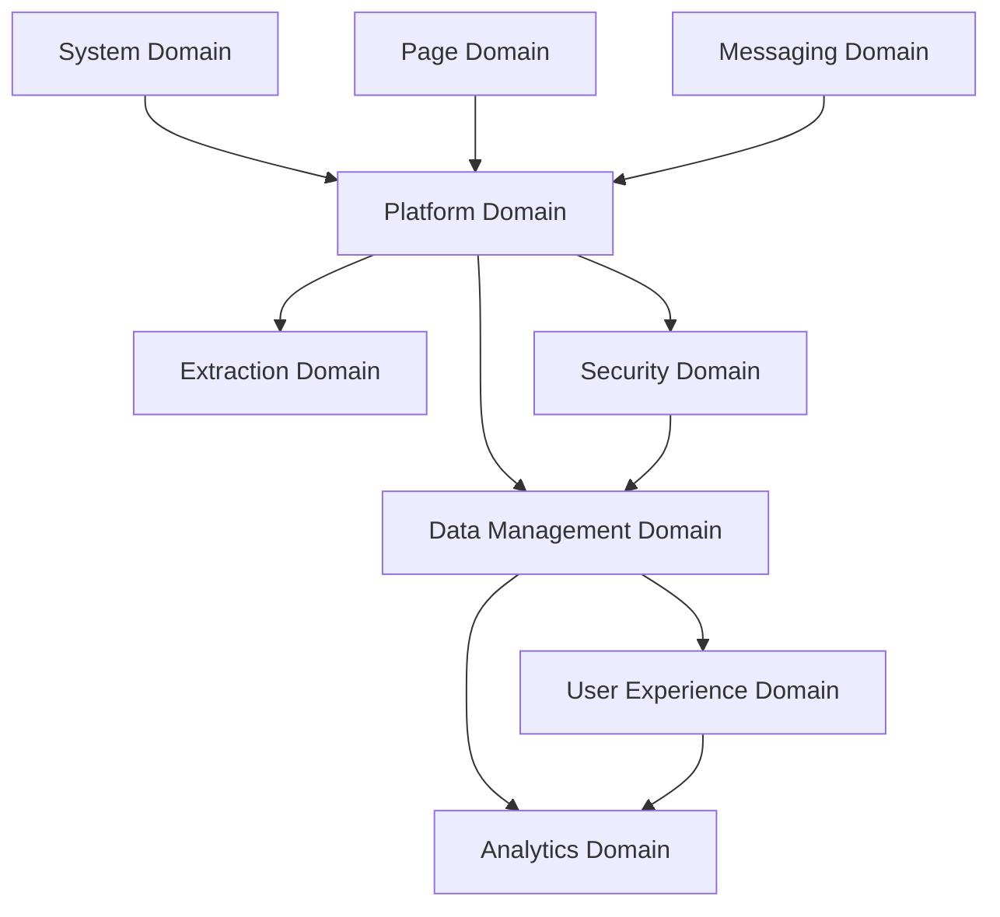

# 🏗️ Domain 架構 v2.0 設計方案

**版本**: v2.0.0  
**建立日期**: 2025-08-13  
**狀態**: 設計階段

## 🎯 設計目標

基於當前 v1.0.0 單一平台架構，重新設計支援 5 個主流書城的多平台架構，確保：
- **平台無關化**：業務邏輯完全獨立於具體平台
- **事件系統擴展**：支援跨平台事件管理和路由  
- **統一資料管理**：跨平台資料同步和衝突解決
- **向後相容性**：現有 Readmoo 功能無縫遷移

## 📋 新增 Domain 架構設計

### 1. **Platform Domain** - 平台管理領域 🆕
```
src/background/domains/platform/
├── platform-domain-coordinator.js      # 平台領域協調器
└── services/
    ├── platform-detection-service.js   # 平台自動識別
    ├── platform-registry-service.js    # 平台註冊管理
    ├── platform-switcher-service.js    # 平台切換控制
    └── adapter-factory-service.js      # 適配器工廠
```

**負責功能：**
- 自動識別當前訪問的電子書平台
- 管理所有平台適配器的註冊和載入
- 提供統一的平台切換和配置管理
- 實現平台間的隔離和資源管理

**關鍵事件：**
```javascript
// 平台檢測事件
'PLATFORM.DETECTED'         // 平台檢測完成
'PLATFORM.CHANGED'          // 平台切換
'PLATFORM.ADAPTER.LOADED'   // 適配器載入
'PLATFORM.ADAPTER.FAILED'   // 適配器失敗

// 多平台協調事件  
'PLATFORM.MULTI.SYNC.STARTED'    // 多平台同步開始
'PLATFORM.MULTI.CONFLICT.DETECTED' // 資料衝突檢測
```

### 2. **Data Management Domain** - 資料管理領域 🆕
```
src/background/domains/data-management/
├── data-domain-coordinator.js          # 資料領域協調器
└── services/
    ├── data-synchronization-service.js # 跨平台資料同步
    ├── conflict-resolution-service.js  # 衝突解決服務
    ├── data-validation-service.js      # 資料驗證服務
    ├── schema-migration-service.js     # 資料模型遷移
    └── backup-recovery-service.js      # 備份與恢復
```

**負責功能：**
- 跨平台資料同步和一致性管理
- 智能資料衝突檢測和解決策略
- 統一資料格式轉換和驗證
- 資料版本管理和遷移策略

**關鍵事件：**
```javascript
// 資料同步事件
'DATA.SYNC.STARTED'         // 同步開始
'DATA.SYNC.PROGRESS'        // 同步進度
'DATA.SYNC.COMPLETED'       // 同步完成
'DATA.CONFLICT.DETECTED'    // 衝突檢測
'DATA.CONFLICT.RESOLVED'    // 衝突解決

// 資料管理事件
'DATA.VALIDATION.PASSED'    // 驗證通過
'DATA.SCHEMA.MIGRATED'      // 模型遷移
'DATA.BACKUP.CREATED'       // 備份建立
```

### 3. **User Experience Domain** - 用戶體驗領域 🆕
```
src/background/domains/user-experience/
├── ux-domain-coordinator.js           # UX 領域協調器  
└── services/
    ├── theme-management-service.js     # 主題管理服務
    ├── preference-service.js           # 偏好設定服務
    ├── notification-service.js         # 通知管理服務
    ├── personalization-service.js      # 個人化服務
    └── accessibility-service.js        # 無障礙服務
```

**負責功能：**
- 統一的主題和外觀管理（深色模式、響應式）
- 跨平台用戶偏好同步和管理
- 智能通知系統和用戶回饋
- 個人化推薦和學習分析

**關鍵事件：**
```javascript
// UI/UX 事件
'UX.THEME.CHANGED'          // 主題變更
'UX.PREFERENCE.UPDATED'     // 偏好更新
'UX.NOTIFICATION.SHOWN'     // 通知顯示
'UX.PERSONALIZATION.APPLIED' // 個人化應用

// 用戶互動事件
'UX.USER.ACTION.RECORDED'   // 用戶行為記錄
'UX.FEEDBACK.COLLECTED'     // 回饋收集
```

### 4. **Analytics Domain** - 分析統計領域 🆕
```
src/background/domains/analytics/
├── analytics-domain-coordinator.js     # 分析領域協調器
└── services/
    ├── reading-analytics-service.js     # 閱讀分析服務
    ├── cross-platform-stats-service.js # 跨平台統計服務
    ├── visualization-service.js         # 視覺化服務
    ├── report-generation-service.js     # 報告生成服務
    └── trend-analysis-service.js        # 趋势分析服務
```

**負責功能：**
- 跨平台閱讀習慣分析和統計
- 書庫管理效率和趨勢分析  
- 智能視覺化圖表和報告生成
- 個人閱讀目標追蹤和建議

**關鍵事件：**
```javascript
// 分析事件
'ANALYTICS.DATA.COLLECTED'   // 資料收集
'ANALYTICS.REPORT.GENERATED' // 報告生成  
'ANALYTICS.INSIGHT.DISCOVERED' // 洞察發現
'ANALYTICS.VISUALIZATION.RENDERED' // 視覺化渲染

// 統計事件
'ANALYTICS.STATS.UPDATED'    // 統計更新
'ANALYTICS.TREND.DETECTED'   // 趨勢檢測
```

### 5. **Security Domain** - 安全隱私領域 🆕
```
src/background/domains/security/
├── security-domain-coordinator.js      # 安全領域協調器
└── services/
    ├── data-encryption-service.js       # 資料加密服務
    ├── privacy-protection-service.js    # 隱私保護服務
    ├── platform-isolation-service.js    # 平台隔離服務
    ├── audit-logging-service.js         # 審計日誌服務  
    └── permission-control-service.js    # 權限控制服務
```

**負責功能：**
- 跨平台資料的加密和隱私保護
- 平台間資料隔離和訪問控制
- 敏感操作的審計日誌和追蹤
- 權限管理和安全策略實施

**關鍵事件：**
```javascript
// 安全事件
'SECURITY.DATA.ENCRYPTED'    // 資料加密
'SECURITY.ACCESS.GRANTED'    // 訪問授權
'SECURITY.VIOLATION.DETECTED' // 安全違規
'SECURITY.AUDIT.LOGGED'      // 審計記錄

// 隱私事件  
'PRIVACY.DATA.ANONYMIZED'    // 資料匿名化
'PRIVACY.CONSENT.UPDATED'    // 同意書更新
```

## 🔄 現有 Domain 架構重構

### 1. **System Domain** - 系統管理領域 (重構)
**新增職責：**
- 多平台系統配置管理
- 跨域生命週期協調
- 系統健康監控擴展

**重構要點：**
```javascript
// 擴展配置管理支援多平台
'SYSTEM.CONFIG.PLATFORM.UPDATED'  // 平台配置更新
'SYSTEM.HEALTH.CROSS_PLATFORM'    // 跨平台健康檢查
```

### 2. **Page Domain** - 頁面管理領域 (重構) 
**新增職責：**
- 多平台頁面檢測和管理
- 跨平台導航狀態同步
- 平台特定權限管理

**重構要點：**
```javascript
// 平台無關化的頁面事件
'PAGE.PLATFORM.DETECTED'          // 平台檢測
'PAGE.CROSS_PLATFORM.NAVIGATION'  // 跨平台導航
```

### 3. **Extraction Domain** - 提取管理領域 (重構)
**新增職責：**
- 多適配器協調和管理  
- 跨平台資料格式標準化
- 提取策略智能選擇

**重構要點：**
```javascript  
// 平台無關的提取事件
'EXTRACTION.PLATFORM.STARTED'     // 平台提取開始
'EXTRACTION.DATA.NORMALIZED'      // 資料格式標準化  
'EXTRACTION.MULTI_PLATFORM.MERGED' // 多平台資料合併
```

### 4. **Messaging Domain** - 通訊管理領域 (重構)
**新增職責：**
- 跨平台訊息路由和轉換
- 多上下文通訊協調
- 訊息優先級和策略管理

## 🎭 事件系統重大升級

### 1. **階層式事件命名**
```javascript
// v1.0 單平台命名
'EXTRACTION.COMPLETED'

// v2.0 多平台命名  
'EXTRACTION.READMOO.COMPLETED'    // 平台特定
'EXTRACTION.KINDLE.COMPLETED'     
'EXTRACTION.UNIFIED.COMPLETED'    // 跨平台統一
'EXTRACTION.MULTI_PLATFORM.SYNC'  // 多平台協調
```

### 2. **平台標識符整合**
```javascript
const EventNaming = {
  // 平台標識符
  PLATFORMS: {
    READMOO: 'READMOO',
    KINDLE: 'KINDLE', 
    KOBO: 'KOBO',
    BOOKWALKER: 'BOOKWALKER',
    BOOKS_COM: 'BOOKS_COM',
    UNIFIED: 'UNIFIED'  // 跨平台統一操作
  },
  
  // 事件構建器
  buildEvent: (domain, platform, action, state) => 
    `${domain}.${platform}.${action}.${state}`,
    
  // 向後相容性支援
  legacySupport: (oldEvent) => {
    // 自動將 v1.0 事件轉換為 v2.0 格式
    return oldEvent.includes('.') 
      ? oldEvent 
      : `EXTRACTION.READMOO.${oldEvent}`
  }
}
```

### 3. **跨平台事件協調**
```javascript
class CrossPlatformEventCoordinator {
  async handleMultiPlatformEvent(baseEvent, platforms) {
    const results = []
    
    // 並行觸發所有平台的對應事件
    for (const platform of platforms) {
      const platformEvent = this.transformEventForPlatform(baseEvent, platform)
      const result = await this.eventBus.emit(platformEvent)
      results.push({ platform, result })
    }
    
    // 觸發統一完成事件
    await this.eventBus.emit('EXTRACTION.UNIFIED.COMPLETED', {
      platforms: results,
      timestamp: Date.now()
    })
    
    return results
  }
}
```

## 🔗 Domain 間協作協議

### 1. **依賴關係圖**


### 2. **核心協作模式**

#### **Platform → Extraction 協作**
```javascript
// Platform Domain 檢測到新平台
await eventBus.emit('PLATFORM.DETECTED', { 
  platform: 'KINDLE',
  adapter: kindleAdapter 
})

// Extraction Domain 自動配置對應提取器
await eventBus.emit('EXTRACTION.KINDLE.CONFIGURED', {
  extractor: kindleExtractor,
  capabilities: ['metadata', 'progress', 'notes']
})
```

#### **Data Management → Analytics 協作** 
```javascript
// Data Management 完成同步
await eventBus.emit('DATA.SYNC.COMPLETED', {
  platforms: ['READMOO', 'KINDLE'],
  syncedBooks: 150,
  conflicts: 2
})

// Analytics 自動更新統計
await eventBus.emit('ANALYTICS.STATS.UPDATED', {
  totalBooks: 150,
  crossPlatformBooks: 25,
  syncEfficiency: 0.987
})
```

## 🚀 實現優先級規劃

### **Phase 1: 基礎平台架構 (v2.1.0)** 🔥
- [ ] **Platform Domain** 完整實現
- [ ] **Data Management Domain** 核心功能  
- [ ] 事件命名系統升級
- [ ] Readmoo 平台無縫遷移

**風險評估**: 低 - 主要是架構重整，功能保持一致

### **Phase 2: 多平台支援 (v2.2.0)** ⚡
- [ ] 博客來 + Kindle 適配器實現
- [ ] **Security Domain** 資料隔離
- [ ] 跨平台資料同步基礎功能

**風險評估**: 中 - 新平台整合存在不確定性

### **Phase 3: 進階體驗 (v2.3.0)** 🌟  
- [ ] **User Experience Domain** 完整實現
- [ ] **Analytics Domain** 基礎統計
- [ ] Kobo + BookWalker 支援

**風險評估**: 中 - UX 設計和用戶接受度挑戰

### **Phase 4: 完整生態 (v2.4.0)** 🎯
- [ ] 全平台支援完成
- [ ] 進階分析和個人化功能
- [ ] 智能推薦和趨勢分析

**風險評估**: 高 - 複雜功能整合和效能挑戰

## 🛡️ 向後相容性保證策略

### 1. **事件系統相容性**
```javascript
class LegacyEventSupport {
  constructor(modernEventBus) {
    this.modernEventBus = modernEventBus
    this.setupLegacyListeners()
  }
  
  setupLegacyListeners() {
    // 攔截舊版事件並轉換
    const legacyEvents = [
      'EXTRACTION.COMPLETED',
      'STORAGE.SAVE.COMPLETED', 
      'UI.POPUP.OPENED'
    ]
    
    legacyEvents.forEach(legacyEvent => {
      this.modernEventBus.on(legacyEvent, async (data) => {
        // 同時觸發新版本事件
        const modernEvent = this.convertToModernEvent(legacyEvent)
        await this.modernEventBus.emit(modernEvent, data)
      })
    })
  }
}
```

### 2. **資料格式相容性**
```javascript
class DataCompatibilityLayer {
  async convertLegacyData(legacyBookData) {
    return {
      // 新格式
      id: legacyBookData.id,
      platform: 'READMOO',  // 默認平台
      title: legacyBookData.title,
      
      // 保留原始資料
      legacy: legacyBookData,
      migrated: true
    }
  }
}
```

### 3. **API 相容性**
```javascript
// 保持現有 API 不變，內部重新路由
class BackwardCompatibleAPI {
  // 舊版方法保持可用
  async extractBooks() {
    return await this.extractBooksFromPlatform('READMOO')
  }
  
  // 新版統一方法
  async extractBooksFromPlatform(platform) {
    return await this.platformCoordinator.extract(platform)
  }
}
```

## 📊 成功指標與驗收標準

### **技術指標**
- [ ] 支援 5 個電子書平台 (100%)
- [ ] 事件處理延遲 < 100ms (95%ile)
- [ ] 跨平台資料同步準確率 > 99.5%
- [ ] 向後相容性測試通過率 100%
- [ ] 記憶體使用增長 < 30%

### **用戶體驗指標**  
- [ ] 多平台切換響應時間 < 2 秒
- [ ] 資料衝突自動解決率 > 90%
- [ ] 用戶滿意度 > 4.5/5.0
- [ ] 功能發現率 > 75%

### **系統健康指標**
- [ ] 系統穩定性 > 99.9%
- [ ] 錯誤恢復時間 < 10 秒
- [ ] 平台適配器載入成功率 > 98%

## 🔮 長期演進路線圖

### **v3.0: AI 智能化 (2026 Q2)**
- AI 驅動的閱讀推薦引擎
- 智能資料衝突解決
- 自然語言查詢介面

### **v3.1: 社群功能 (2026 Q4)**  
- 跨平台閱讀社群
- 書評和推薦分享
- 群組閱讀挑戰

### **v4.0: 開放生態 (2027)**
- 第三方平台 API 支援
- 插件和擴展系統  
- 開發者生態建設

---

**維護者**: Claude Code 事件驅動架構專家  
**審核週期**: 每月檢視架構演進和最佳實踐更新