# 🎭 事件驅動系統架構設計

## 📖 概述

本文件詳細描述了Readmoo書庫數據提取器Chrome Extension的事件驅動架構設計。該架構旨在實現高內聚低耦合的模組化系統，確保各組件之間透過明確定義的事件進行通訊。

## 🎯 設計目標

### 主要目標

- **鬆耦合**：各模組之間透過事件通訊，減少直接依賴
- **高內聚**：每個模組專注於自己的職責
- **可擴展性**：新功能可以透過新增事件處理器輕鬆整合
- **可測試性**：事件驅動的設計便於單元測試和整合測試
- **可維護性**：清晰的事件流程便於理解和維護

### 次要目標

- **錯誤隔離**：一個模組的錯誤不會影響其他模組
- **效能優化**：非同步事件處理避免阻塞
- **調試友好**：事件流程可追蹤和記錄

## 🏗 架構概覽

### 核心組件

```text
┌─────────────────────────────────────────────────────────────┐
│                    事件驅動架構核心                          │
├─────────────────────────────────────────────────────────────┤
│  Event Bus (事件總線)                                       │
│  ├── Event Registry (事件註冊表)                           │
│  ├── Event Dispatcher (事件分發器)                         │
│  └── Event Logger (事件記錄器)                             │
├─────────────────────────────────────────────────────────────┤
│  Event Publishers (事件發布者)                             │
│  ├── User Actions (使用者操作)                             │
│  ├── Chrome APIs (Chrome API 回調)                         │
│  ├── DOM Changes (DOM 變化)                                │
│  └── Timer Events (定時器事件)                             │
├─────────────────────────────────────────────────────────────┤
│  Event Handlers (事件處理器)                               │
│  ├── Data Extraction Handlers (資料提取處理器)             │
│  ├── Storage Handlers (儲存處理器)                         │
│  ├── UI Update Handlers (UI更新處理器)                     │
│  └── Error Handlers (錯誤處理器)                           │
├─────────────────────────────────────────────────────────────┤
│  Event Listeners (事件監聽器)                              │
│  ├── Background Listeners (背景監聽器)                     │
│  ├── Content Script Listeners (內容腳本監聽器)             │
│  ├── Popup Listeners (彈出視窗監聽器)                       │
│  └── Overview Listeners (瀏覽頁面監聽器)                   │
└─────────────────────────────────────────────────────────────┘
```

## 📋 事件分類系統

### 事件命名規範

採用 `模組.動作.狀態` 的三層命名結構：

```javascript
// 格式：[MODULE].[ACTION].[STATE]
// 範例：
'data.extract.started'      // 資料提取開始
'data.extract.progress'     // 資料提取進度
'data.extract.completed'    // 資料提取完成
'data.extract.failed'       // 資料提取失敗

'storage.save.requested'    // 儲存請求
'storage.save.completed'    // 儲存完成
'storage.save.failed'       // 儲存失敗

'ui.popup.opened'          // 彈出視窗開啟
'ui.popup.closed'          // 彈出視窗關閉
'ui.overview.rendered'     // 瀏覽頁面渲染完成
```

### 事件優先級

```javascript
const EVENT_PRIORITY = {
  CRITICAL: 0,    // 關鍵事件（錯誤、安全相關）
  HIGH: 1,        // 高優先級（使用者操作回應）
  NORMAL: 2,      // 一般優先級（資料處理）
  LOW: 3          // 低優先級（統計、日誌）
};
```

## 🔄 事件生命週期

### 事件流程圖

```mermaid
graph TD
    A[事件觸發] --> B[事件驗證]
    B --> C{驗證通過?}
    C -->|是| D[事件分發]
    C -->|否| E[記錄錯誤]
    D --> F[尋找處理器]
    F --> G{找到處理器?}
    G -->|是| H[執行處理器]
    G -->|否| I[記錄警告]
    H --> J{執行成功?}
    J -->|是| K[觸發成功事件]
    J -->|否| L[觸發錯誤事件]
    K --> M[清理資源]
    L --> N[錯誤處理]
    N --> M
    I --> M
    E --> M
    M --> O[事件完成]
```



### 詳細生命週期階段

1. **事件創建** (Event Creation)
   - 定義事件類型和資料
   - 設定優先級和時間戳
   - 分配唯一事件ID

2. **事件驗證** (Event Validation)
   - 檢查事件格式
   - 驗證必要欄位
   - 檢查權限和安全性

3. **事件分發** (Event Dispatching)
   - 查找註冊的處理器
   - 按優先級排序
   - 建立執行佇列

4. **處理器執行** (Handler Execution)
   - 依序執行處理器
   - 監控執行時間
   - 處理例外和錯誤

5. **結果處理** (Result Processing)
   - 收集處理結果
   - 觸發後續事件
   - 更新系統狀態

6. **資源清理** (Resource Cleanup)
   - 釋放記憶體
   - 清理暫存檔案
   - 重置處理器狀態

## 📊 事件資料結構

### 標準事件格式

```javascript
/**
 * 標準事件物件結構
 */
class Event {
  constructor(type, data = {}, options = {}) {
    this.id = generateEventId();
    this.type = type;
    this.data = data;
    this.timestamp = new Date().toISOString();
    this.priority = options.priority || EVENT_PRIORITY.NORMAL;
    this.source = options.source || 'unknown';
    this.correlationId = options.correlationId || null;
    this.metadata = {
      version: '1.0',
      schema: 'standard-event',
      ...options.metadata
    };
  }

  /**
   * 序列化事件為JSON
   */
  toJSON() {
    return {
      id: this.id,
      type: this.type,
      data: this.data,
      timestamp: this.timestamp,
      priority: this.priority,
      source: this.source,
      correlationId: this.correlationId,
      metadata: this.metadata
    };
  }

  /**
   * 檢查事件是否可以取消
   */
  isCancellable() {
    return this.type.endsWith('.requested') || 
           this.type.endsWith('.started');
  }
}
```

### 特定事件類型

```javascript
// 資料提取事件
const DataExtractionEvent = {
  STARTED: 'data.extract.started',
  PROGRESS: 'data.extract.progress',
  COMPLETED: 'data.extract.completed',
  FAILED: 'data.extract.failed',
  
  // 事件資料結構
  createStartedEvent: (url, options) => new Event(
    DataExtractionEvent.STARTED,
    { url, options },
    { priority: EVENT_PRIORITY.HIGH }
  ),
  
  createProgressEvent: (progress, total) => new Event(
    DataExtractionEvent.PROGRESS,
    { progress, total, percentage: (progress / total) * 100 },
    { priority: EVENT_PRIORITY.NORMAL }
  )
};

// 儲存事件
const StorageEvent = {
  SAVE_REQUESTED: 'storage.save.requested',
  SAVE_COMPLETED: 'storage.save.completed',
  SAVE_FAILED: 'storage.save.failed',
  LOAD_REQUESTED: 'storage.load.requested',
  LOAD_COMPLETED: 'storage.load.completed',
  LOAD_FAILED: 'storage.load.failed'
};

// UI事件
const UIEvent = {
  POPUP_OPENED: 'ui.popup.opened',
  POPUP_CLOSED: 'ui.popup.closed',
  OVERVIEW_RENDERED: 'ui.overview.rendered',
  SEARCH_PERFORMED: 'ui.search.performed',
  EXPORT_REQUESTED: 'ui.export.requested'
};
```

## 🔧 事件處理器設計

### 處理器介面規範

```javascript
/**
 * 事件處理器基底類別
 */
class EventHandler {
  constructor(name, priority = EVENT_PRIORITY.NORMAL) {
    this.name = name;
    this.priority = priority;
    this.isEnabled = true;
    this.executionCount = 0;
    this.lastExecutionTime = null;
    this.averageExecutionTime = 0;
  }

  /**
   * 處理事件的主要方法
   * @param {Event} event - 要處理的事件
   * @returns {Promise<any>} 處理結果
   */
  async handle(event) {
    if (!this.isEnabled) {
      return null;
    }

    const startTime = Date.now();
    this.executionCount++;

    try {
      // 預處理
      await this.beforeHandle(event);
      
      // 主要處理邏輯
      const result = await this.process(event);
      
      // 後處理
      await this.afterHandle(event, result);
      
      return result;
    } catch (error) {
      await this.onError(event, error);
      throw error;
    } finally {
      // 更新統計資訊
      const executionTime = Date.now() - startTime;
      this.updateStats(executionTime);
    }
  }

  /**
   * 實際的處理邏輯 - 子類別必須實現
   */
  async process(event) {
    throw new Error('Process method must be implemented by subclass');
  }

  /**
   * 處理前的準備工作
   */
  async beforeHandle(event) {
    // 預設實現：記錄日誌
    console.log(`[${this.name}] Processing event: ${event.type}`);
  }

  /**
   * 處理後的清理工作
   */
  async afterHandle(event, result) {
    // 預設實現：記錄結果
    console.log(`[${this.name}] Completed event: ${event.type}`);
  }

  /**
   * 錯誤處理
   */
  async onError(event, error) {
    console.error(`[${this.name}] Error processing event: ${event.type}`, error);
  }

  /**
   * 更新執行統計
   */
  updateStats(executionTime) {
    this.lastExecutionTime = executionTime;
    this.averageExecutionTime = 
      (this.averageExecutionTime * (this.executionCount - 1) + executionTime) / 
      this.executionCount;
  }

  /**
   * 檢查是否可以處理指定事件
   */
  canHandle(eventType) {
    return this.getSupportedEvents().includes(eventType);
  }

  /**
   * 取得支援的事件類型 - 子類別必須實現
   */
  getSupportedEvents() {
    throw new Error('getSupportedEvents method must be implemented by subclass');
  }

  /**
   * 啟用/停用處理器
   */
  setEnabled(enabled) {
    this.isEnabled = enabled;
  }

  /**
   * 取得處理器統計資訊
   */
  getStats() {
    return {
      name: this.name,
      executionCount: this.executionCount,
      lastExecutionTime: this.lastExecutionTime,
      averageExecutionTime: this.averageExecutionTime,
      isEnabled: this.isEnabled
    };
  }
}
```

### 具體處理器實現範例

```javascript
/**
 * 資料提取處理器
 */
class DataExtractionHandler extends EventHandler {
  constructor() {
    super('DataExtractionHandler', EVENT_PRIORITY.HIGH);
    this.extractor = null;
  }

  getSupportedEvents() {
    return [
      DataExtractionEvent.STARTED,
      'tab.updated.readmoo'
    ];
  }

  async process(event) {
    switch (event.type) {
      case DataExtractionEvent.STARTED:
        return await this.handleExtractionStart(event);
      case 'tab.updated.readmoo':
        return await this.handleTabUpdate(event);
      default:
        throw new Error(`Unsupported event type: ${event.type}`);
    }
  }

  async handleExtractionStart(event) {
    const { url, options } = event.data;
    
    // 建立進度追蹤
    const progressTracker = new ProgressTracker();
    
    // 初始化提取器
    this.extractor = new BookDataExtractor(options);
    
    // 執行提取
    const books = await this.extractor.extract(url, (progress) => {
      // 發布進度事件
      eventBus.publish(
        DataExtractionEvent.createProgressEvent(progress.current, progress.total)
      );
    });

    // 發布完成事件
    eventBus.publish(new Event(
      DataExtractionEvent.COMPLETED,
      { books, extractedAt: new Date().toISOString() },
      { correlationId: event.id }
    ));

    return books;
  }

  async handleTabUpdate(event) {
    const { tabId, changeInfo, tab } = event.data;
    
    if (changeInfo.status === 'complete' && 
        tab.url.includes('readmoo.com/library')) {
      // 自動觸發資料提取
      eventBus.publish(DataExtractionEvent.createStartedEvent(tab.url));
    }
  }
}

/**
 * 儲存處理器
 */
class StorageHandler extends EventHandler {
  constructor() {
    super('StorageHandler', EVENT_PRIORITY.NORMAL);
    this.storageAdapter = new ChromeStorageAdapter();
  }

  getSupportedEvents() {
    return [
      StorageEvent.SAVE_REQUESTED,
      StorageEvent.LOAD_REQUESTED,
      DataExtractionEvent.COMPLETED
    ];
  }

  async process(event) {
    switch (event.type) {
      case StorageEvent.SAVE_REQUESTED:
        return await this.handleSaveRequest(event);
      case StorageEvent.LOAD_REQUESTED:
        return await this.handleLoadRequest(event);
      case DataExtractionEvent.COMPLETED:
        return await this.handleAutoSave(event);
      default:
        throw new Error(`Unsupported event type: ${event.type}`);
    }
  }

  async handleSaveRequest(event) {
    const { key, data, options } = event.data;
    
    try {
      await this.storageAdapter.save(key, data, options);
      
      eventBus.publish(new Event(
        StorageEvent.SAVE_COMPLETED,
        { key, timestamp: new Date().toISOString() },
        { correlationId: event.id }
      ));
      
      return { success: true };
    } catch (error) {
      eventBus.publish(new Event(
        StorageEvent.SAVE_FAILED,
        { key, error: error.message },
        { correlationId: event.id }
      ));
      
      throw error;
    }
  }

  async handleAutoSave(event) {
    const { books } = event.data;
    
    // 自動儲存提取的書籍資料
    return await this.handleSaveRequest(new Event(
      StorageEvent.SAVE_REQUESTED,
      { 
        key: 'extracted_books', 
        data: books,
        options: { autoSave: true }
      }
    ));
  }
}
```

## 🌐 跨模組通訊

### Chrome Extension 模組間通訊

```javascript
/**
 * Chrome Extension 事件橋接器
 * 處理不同腳本環境之間的事件通訊
 */
class ChromeEventBridge {
  constructor() {
    this.messageHandlers = new Map();
    this.setupMessageListeners();
  }

  /**
   * 設定Chrome Runtime消息監聽器
   */
  setupMessageListeners() {
    chrome.runtime.onMessage.addListener((message, sender, sendResponse) => {
      if (message.type === 'CROSS_CONTEXT_EVENT') {
        this.handleCrossContextEvent(message, sender, sendResponse);
        return true; // 保持消息通道開啟
      }
    });
  }

  /**
   * 處理跨上下文事件
   */
  async handleCrossContextEvent(message, sender, sendResponse) {
    const { event, targetContext } = message.data;
    
    try {
      // 在目標上下文中觸發事件
      const result = await this.dispatchToContext(event, targetContext);
      sendResponse({ success: true, result });
    } catch (error) {
      sendResponse({ success: false, error: error.message });
    }
  }

  /**
   * 將事件分發到指定上下文
   */
  async dispatchToContext(event, targetContext) {
    switch (targetContext) {
      case 'background':
        return await this.dispatchToBackground(event);
      case 'content':
        return await this.dispatchToContent(event);
      case 'popup':
        return await this.dispatchToPopup(event);
      default:
        throw new Error(`Unknown target context: ${targetContext}`);
    }
  }

  /**
   * 發送事件到背景腳本
   */
  async dispatchToBackground(event) {
    return new Promise((resolve, reject) => {
      chrome.runtime.sendMessage({
        type: 'BACKGROUND_EVENT',
        event
      }, (response) => {
        if (chrome.runtime.lastError) {
          reject(new Error(chrome.runtime.lastError.message));
        } else {
          resolve(response);
        }
      });
    });
  }

  /**
   * 發送事件到內容腳本
   */
  async dispatchToContent(event) {
    const tabs = await this.getReadmooTabs();
    const results = [];
    
    for (const tab of tabs) {
      try {
        const result = await this.sendToTab(tab.id, {
          type: 'CONTENT_EVENT',
          event
        });
        results.push(result);
      } catch (error) {
        console.warn(`Failed to send event to tab ${tab.id}:`, error);
      }
    }
    
    return results;
  }

  /**
   * 取得Readmoo相關的分頁
   */
  async getReadmooTabs() {
    return new Promise((resolve) => {
      chrome.tabs.query({
        url: ['*://readmoo.com/*', '*://*.readmoo.com/*']
      }, resolve);
    });
  }

  /**
   * 發送消息到指定分頁
   */
  async sendToTab(tabId, message) {
    return new Promise((resolve, reject) => {
      chrome.tabs.sendMessage(tabId, message, (response) => {
        if (chrome.runtime.lastError) {
          reject(new Error(chrome.runtime.lastError.message));
        } else {
          resolve(response);
        }
      });
    });
  }
}
```

## 📈 效能監控與優化

### 事件效能監控

```javascript
/**
 * 事件效能監控器
 */
class EventPerformanceMonitor {
  constructor() {
    this.metrics = new Map();
    this.thresholds = {
      warning: 1000,  // 1秒
      critical: 5000  // 5秒
    };
  }

  /**
   * 開始監控事件
   */
  startMonitoring(event) {
    const eventId = event.id;
    this.metrics.set(eventId, {
      event,
      startTime: performance.now(),
      handlers: []
    });
  }

  /**
   * 記錄處理器執行時間
   */
  recordHandlerExecution(eventId, handlerName, executionTime) {
    const metric = this.metrics.get(eventId);
    if (metric) {
      metric.handlers.push({
        name: handlerName,
        executionTime
      });
    }
  }

  /**
   * 完成事件監控
   */
  completeMonitoring(eventId) {
    const metric = this.metrics.get(eventId);
    if (!metric) return;

    const totalTime = performance.now() - metric.startTime;
    metric.totalTime = totalTime;
    metric.completedAt = new Date().toISOString();

    // 檢查是否超過閾值
    if (totalTime > this.thresholds.critical) {
      this.reportCriticalPerformance(metric);
    } else if (totalTime > this.thresholds.warning) {
      this.reportWarningPerformance(metric);
    }

    // 清理舊的監控資料
    this.metrics.delete(eventId);
  }

  /**
   * 報告關鍵效能問題
   */
  reportCriticalPerformance(metric) {
    console.error('Critical performance issue detected:', {
      eventType: metric.event.type,
      totalTime: metric.totalTime,
      handlers: metric.handlers
    });
    
    // 發送效能警告事件
    eventBus.publish(new Event(
      'system.performance.critical',
      { metric },
      { priority: EVENT_PRIORITY.CRITICAL }
    ));
  }

  /**
   * 報告效能警告
   */
  reportWarningPerformance(metric) {
    console.warn('Performance warning:', {
      eventType: metric.event.type,
      totalTime: metric.totalTime
    });
  }

  /**
   * 取得效能統計
   */
  getPerformanceStats() {
    const activeEvents = Array.from(this.metrics.values());
    return {
      activeEventsCount: activeEvents.length,
      longestRunningEvent: activeEvents.reduce((longest, current) => {
        const currentRunTime = performance.now() - current.startTime;
        return currentRunTime > longest.runTime ? 
          { event: current.event, runTime: currentRunTime } : 
          longest;
      }, { runTime: 0 })
    };
  }
}
```

## 🛡 錯誤處理與復原

### 錯誤處理策略

```javascript
/**
 * 事件錯誤處理器
 */
class EventErrorHandler extends EventHandler {
  constructor() {
    super('EventErrorHandler', EVENT_PRIORITY.CRITICAL);
    this.errorCounts = new Map();
    this.circuitBreaker = new Map();
  }

  getSupportedEvents() {
    return [
      'system.error.occurred',
      'handler.execution.failed',
      'event.processing.timeout'
    ];
  }

  async process(event) {
    switch (event.type) {
      case 'system.error.occurred':
        return await this.handleSystemError(event);
      case 'handler.execution.failed':
        return await this.handleHandlerFailure(event);
      case 'event.processing.timeout':
        return await this.handleProcessingTimeout(event);
    }
  }

  /**
   * 處理系統錯誤
   */
  async handleSystemError(event) {
    const { error, context, severity } = event.data;
    
    // 記錄錯誤
    this.logError(error, context, severity);
    
    // 根據嚴重程度決定處理策略
    switch (severity) {
      case 'critical':
        await this.handleCriticalError(error, context);
        break;
      case 'warning':
        await this.handleWarningError(error, context);
        break;
      default:
        await this.handleGeneralError(error, context);
    }
  }

  /**
   * 處理關鍵錯誤
   */
  async handleCriticalError(error, context) {
    // 啟動斷路器
    this.activateCircuitBreaker(context.component);
    
    // 嘗試系統復原
    await this.attemptSystemRecovery(context);
    
    // 通知使用者
    await this.notifyUser({
      type: 'critical_error',
      message: '系統遇到嚴重錯誤，正在嘗試自動復原',
      canRetry: true
    });
  }

  /**
   * 啟動斷路器
   */
  activateCircuitBreaker(component) {
    const now = Date.now();
    const breakerInfo = this.circuitBreaker.get(component) || {
      isOpen: false,
      failureCount: 0,
      lastFailureTime: 0
    };

    breakerInfo.failureCount++;
    breakerInfo.lastFailureTime = now;

    // 如果失敗次數過多，開啟斷路器
    if (breakerInfo.failureCount >= 3) {
      breakerInfo.isOpen = true;
      breakerInfo.openedAt = now;
      
      // 設定自動復原時間（5分鐘後）
      setTimeout(() => {
        this.resetCircuitBreaker(component);
      }, 5 * 60 * 1000);
    }

    this.circuitBreaker.set(component, breakerInfo);
  }

  /**
   * 重設斷路器
   */
  resetCircuitBreaker(component) {
    const breakerInfo = this.circuitBreaker.get(component);
    if (breakerInfo) {
      breakerInfo.isOpen = false;
      breakerInfo.failureCount = 0;
      this.circuitBreaker.set(component, breakerInfo);
      
      console.log(`Circuit breaker reset for component: ${component}`);
    }
  }

  /**
   * 檢查斷路器狀態
   */
  isCircuitBreakerOpen(component) {
    const breakerInfo = this.circuitBreaker.get(component);
    return breakerInfo && breakerInfo.isOpen;
  }

  /**
   * 嘗試系統復原
   */
  async attemptSystemRecovery(context) {
    try {
      // 清理可能損壞的狀態
      await this.cleanupCorruptedState(context);
      
      // 重新初始化相關組件
      await this.reinitializeComponents(context);
      
      // 驗證系統狀態
      const isHealthy = await this.validateSystemHealth();
      
      if (isHealthy) {
        console.log('System recovery successful');
        return true;
      } else {
        console.error('System recovery failed');
        return false;
      }
    } catch (recoveryError) {
      console.error('Error during system recovery:', recoveryError);
      return false;
    }
  }
}
```

## 📊 監控與除錯

### 事件追蹤與日誌

```javascript
/**
 * 事件追蹤器
 */
class EventTracker {
  constructor() {
    this.eventHistory = [];
    this.maxHistorySize = 1000;
    this.filters = new Set();
  }

  /**
   * 追蹤事件
   */
  trackEvent(event, phase, metadata = {}) {
    const trackingEntry = {
      eventId: event.id,
      eventType: event.type,
      phase,
      timestamp: new Date().toISOString(),
      metadata
    };

    this.eventHistory.push(trackingEntry);

    // 維護歷史記錄大小
    if (this.eventHistory.length > this.maxHistorySize) {
      this.eventHistory.shift();
    }

    // 即時日誌
    if (this.shouldLog(event.type)) {
      console.log(`[EventTracker] ${event.type} - ${phase}`, metadata);
    }
  }

  /**
   * 檢查是否應該記錄此事件
   */
  shouldLog(eventType) {
    if (this.filters.size === 0) return true;
    return Array.from(this.filters).some(filter => 
      eventType.includes(filter)
    );
  }

  /**
   * 設定事件過濾器
   */
  setFilters(filters) {
    this.filters = new Set(filters);
  }

  /**
   * 取得事件歷史
   */
  getEventHistory(eventType = null, limit = 100) {
    let history = this.eventHistory;
    
    if (eventType) {
      history = history.filter(entry => 
        entry.eventType.includes(eventType)
      );
    }
    
    return history.slice(-limit);
  }

  /**
   * 分析事件統計
   */
  analyzeEventStats() {
    const stats = {
      totalEvents: this.eventHistory.length,
      eventTypes: {},
      phases: {},
      timeRange: {
        start: this.eventHistory[0]?.timestamp,
        end: this.eventHistory[this.eventHistory.length - 1]?.timestamp
      }
    };

    this.eventHistory.forEach(entry => {
      // 統計事件類型
      stats.eventTypes[entry.eventType] = 
        (stats.eventTypes[entry.eventType] || 0) + 1;
      
      // 統計階段
      stats.phases[entry.phase] = 
        (stats.phases[entry.phase] || 0) + 1;
    });

    return stats;
  }

  /**
   * 匯出追蹤資料
   */
  exportTrackingData(format = 'json') {
    const data = {
      metadata: {
        exportedAt: new Date().toISOString(),
        totalEvents: this.eventHistory.length,
        format
      },
      events: this.eventHistory
    };

    switch (format) {
      case 'json':
        return JSON.stringify(data, null, 2);
      case 'csv':
        return this.convertToCsv(this.eventHistory);
      default:
        throw new Error(`Unsupported format: ${format}`);
    }
  }

  /**
   * 轉換為CSV格式
   */
  convertToCsv(events) {
    if (events.length === 0) return '';

    const headers = Object.keys(events[0]);
    const csvContent = [
      headers.join(','),
      ...events.map(event => 
        headers.map(header => 
          JSON.stringify(event[header] || '')
        ).join(',')
      )
    ].join('\n');

    return csvContent;
  }
}
```

## 🚀 最佳實踐與指導原則

### 事件設計最佳實踐

1. **事件命名**
   - 使用清晰、描述性的名稱
   - 遵循一致的命名規範
   - 避免使用縮寫或模糊的術語

2. **事件粒度**
   - 保持事件的原子性
   - 避免將多個操作包裝在單一事件中
   - 提供適當的抽象層級

3. **資料結構**
   - 保持事件資料的簡潔性
   - 避免在事件中傳遞大量資料
   - 使用引用而非內嵌大型物件

4. **錯誤處理**
   - 為每個事件定義可能的錯誤狀態
   - 提供明確的錯誤資訊
   - 實現適當的重試機制

5. **效能考量**
   - 避免在事件處理器中執行長時間操作
   - 使用非同步處理避免阻塞
   - 實現適當的節流和防抖機制

### 開發指導原則

1. **測試驅動開發**
   - 先寫測試，再實現功能
   - 確保每個事件處理器都有對應測試
   - 測試各種邊界情況和錯誤場景

2. **文件化**
   - 詳細記錄事件類型和資料結構
   - 提供使用範例和最佳實踐
   - 維護架構決策的記錄

3. **版本控制**
   - 為事件結構變更提供版本控制
   - 實現向後相容的升級策略
   - 明確廢棄政策和遷移路徑

4. **監控與維護**
   - 實施全面的監控和日誌記錄
   - 定期檢查和優化效能
   - 主動識別和解決潛在問題

## 📋 實施檢查清單

### 基礎設施檢查清單

- [ ] 事件總線核心實現
- [ ] 事件註冊和分發機制
- [ ] 基本事件處理器介面
- [ ] Chrome Extension消息橋接
- [ ] 基礎日誌和監控

### 功能實現檢查清單

- [ ] 資料提取事件處理器
- [ ] 儲存管理事件處理器
- [ ] UI更新事件處理器
- [ ] 錯誤處理和復原機制
- [ ] 效能監控和優化

### 測試檢查清單

- [ ] 單元測試覆蓋所有事件處理器
- [ ] 整合測試驗證事件流程
- [ ] 效能測試確保響應時間
- [ ] 錯誤場景測試
- [ ] 跨模組通訊測試

### 文件檢查清單

- [ ] API文件完整
- [ ] 使用指南清晰
- [ ] 架構決策記錄
- [ ] 故障排除指南
- [ ] 最佳實踐指導

---

**本文件將隨著系統發展持續更新，確保架構文件與實際實現保持同步。**

## 🧩 架構決策：初始化競態與介面封裝

### 問題描述（Problem Statement）

- **症狀**：在冷啟動或 Service Worker 重啟時，`CONTENT.EVENT.FORWARD` 與 `EXTRACTION.COMPLETED` 等事件可能早於背景端監聽器完成註冊即抵達，導致事件雖成功 `emit()`，但當下沒有任何監聽器被執行，並伴隨除錯日誌出現不穩定值（例如 `undefined`）。
- **根因**：
  - 事件系統「建立（EventBus/Bridge）」與「監聽器註冊」之間缺少單一就緒屏障（Ready Barrier），訊息入口未等候完整初始化完成便開始分發事件。
  - 外部直接讀取 `eventBus.listeners` 內部結構檢查監聽器，破壞抽象邊界，導致檢查值不穩定。

### 設計原則（Design Principles）

- **單一責任與清晰邊界**：訊息入口只負責「路由 + 等待就緒」，事件系統對外僅以公開方法提供狀態檢查；內部資料結構不可被外部直接依賴。
- **可觀測且可測試**：提供穩定的檢查介面（如 `hasListener(eventType)`、`getListenerCount(eventType)`），避免測試/日誌依賴內部實作細節。
- **防禦式設計**：在不可避免的冷啟動情境下，任何早到事件要嘛被安全緩衝，要嘛在入口處被 gating 直到系統 ready。

### 解決方案（Solution Overview）

- **就緒屏障（Ready Barrier）**：
  - 建立單一「完整初始化承諾」涵蓋「事件總線/橋接器建立 + 監聽器註冊」，例如 `globalThis.__bgInitPromise = initializeBackgroundServiceWorker()`。
  - 訊息入口（`chrome.runtime.onMessage`）一律先 `await __bgInitPromise` 再進行路由與 `emit()`。

- **訊息入口 Gating**：
  - 若事件系統尚未就緒，入口先等待就緒承諾；必要時可加入 timeout 與告警。
  - 在 ready 前將事件放入 pre-init queue，待就緒或註冊到對應監聽器後重放（本專案已採用）。

- **介面封裝與一致性**：
  - 封裝監聽檢查為公開介面：`eventBus.hasListener(eventType)`、`eventBus.getListenerCount(eventType)`。
  - 禁止直接讀取 `eventBus.listeners`。
  - 保持跨模組 API 一致，以利整合測試與診斷。

### 處理流程（Process Flow）

1. 背景初始化啟動 `initializeBackgroundServiceWorker()`，建立事件系統並完成監聽器註冊。
2. 初始化過程完成後呼叫 `resolve` 標記 `__bgInitPromise` 完成（系統 ready）。
3. 訊息入口接收到任何跨上下文訊息時，先 `await __bgInitPromise`，再呼叫對應的 `handle*` 路由與 `eventBus.emit()`。
4. 監聽檢查與診斷一律使用公開介面，避免內部資料結構外洩。

### 使用情境（Usage Context）

- 冷啟動或 Service Worker 被喚醒後立即有 Content Script 傳入 `CONTENT.EVENT.FORWARD`。
- 團隊需要在日誌或測試中確認某事件目前是否有監聽器、有多少監聽器。

### 設計取捨（Trade-offs）

- 等待就緒可能引入極短延遲，但換取事件處理一致性與可靠度。
- 若採用 pre-init queue，需額外記憶體與序列化保證；本階段先採「等待就緒」以降低複雜度。

### 標準化介面（Standardized Interfaces）

```js
// 穩定檢查方式
eventBus.hasListener('EXTRACTION.COMPLETED') // boolean
eventBus.getListenerCount('EXTRACTION.COMPLETED') // number

// 事件系統就緒與重放
eventBus.markReady() // 標記系統就緒，觸發 pre-init 佇列重放

// 統一 emit 介面與回傳
// 傳入 data，處理器收到標準事件物件 { type, data, timestamp }
// 回傳處理結果陣列（每個監聽器的處理結果）
const results = await eventBus.emit('EXTRACTION.COMPLETED', { booksData })
Array.isArray(results) === true
```

### 驗收準則（Acceptance Criteria）

- 冷啟動情境下，`EXTRACTION.COMPLETED` 不再出現「事件成功 emit 但無監聽器執行」的情況。
- 就緒前到達的事件會被暫存於 pre-init queue，並在 `markReady()` 或對應事件監聽器註冊後重放。
- 所有監聽檢查日誌/測試均改用公開 API，不依賴 `listeners` 內部結構。
- 整合測試在多次啟停/重載下事件處理結果一致。

### Pre-init 佇列與就緒屏障設計（新增）

#### 負責功能：
- 暫存系統就緒前抵達的事件，避免資料遺失
- 在系統就緒後安全重放事件，確保處理順序與一致性
- 降低 Service Worker 冷啟動時序不確定性對功能的影響

#### 設計考量：
- Chrome MV3 Service Worker 可能在任何時間被喚醒/終止
- Content Script 可能在背景監聽器註冊完成前即開始發送事件
- 需避免直接依賴內部資料結構（如 listeners Map）

#### 處理流程：
1. emit(eventType, data) 在尚無監聽器且未就緒時，將事件推入 pre-init queue 並返回空陣列
2. on(eventType, handler) 註冊後，非阻塞重放佇列中同型別事件
3. initializeBackgroundServiceWorker() 完成後呼叫 eventBus.markReady()，重放所有佇列事件
4. 後續 emit 直接以已註冊監聽器同步/非同步處理，回傳結果陣列

#### 使用情境：
- 冷啟動立即進行的 `CONTENT.EVENT.FORWARD` 與 `EXTRACTION.*` 事件
- 背景監聽器註冊落後於訊息入口事件到達的情境

#### 狀態轉換：
- [PreInit] → [Ready] 由 `eventBus.markReady()` 觸發
- 在 [PreInit] 狀態，事件進入 `preInitQueue`
- 進入 [Ready] 後，佇列事件依時間順序重放

#### 測試與驗證：
- 新增整合測試：監聽器註冊前 emit，`markReady()` 後 handler 必須收到事件（已通過）
- 驗證 emit 回傳型別統一為陣列，便於統計處理器執行次數

### Overview 資料同步設計（透過 chrome.storage.onChanged）

#### 負責功能：
- 讓 Overview 頁面在提取完成後自動更新書庫資料
- 解耦 Content Script/Background 和 Overview 的跨上下文通訊

#### 設計考量：
- 依據本專案跨上下文通訊規範，Overview ↔ Background 優先透過 `chrome.storage` 進行資料同步
- Background 在接收到 `EXTRACTION.COMPLETED` 後將資料寫入 `chrome.storage.local.readmoo_books`
- Overview 監聽 `chrome.storage.onChanged`，一旦 `readmoo_books` 變更立即更新 UI

#### 處理流程：
1. Content Script 觸發提取 → 事件轉發到 Background
2. Background 監聽 `EXTRACTION.COMPLETED` → 寫入 `chrome.storage.local.readmoo_books`
3. Overview 監聽 `chrome.storage.onChanged` → 讀取變更並更新畫面

### 關鍵監聽器守護（Listener Guard）

為避免冷啟動或例外情況下關鍵監聽器未註冊導致事件流失，背景層加入守護機制：

- 提供 `registerCoreListenersIfNeeded()`：可重入，確保 `EXTRACTION.COMPLETED` 等關鍵監聽器存在
- 在背景初始化流程及 `CONTENT.EVENT.FORWARD` 的 `EXTRACTION.COMPLETED` 路徑上均會呼叫此函式
- 若監聽器缺失則即時補註冊，保障資料寫入 `chrome.storage.local`

驗收準則：
- 在 Content Script 先發 `EXTRACTION.COMPLETED` 再完成背景監聽器註冊時，資料仍會被寫入 storage（靠 pre-init queue + 守護）
- 在任意時序下，`eventBus.hasListener('EXTRACTION.COMPLETED')` 於 emit 前後均為 true 或在 emit 前被補足

#### 介面範例：
```js
// Overview 初始化時註冊 storage 變更監聽
chrome.storage.onChanged.addListener((changes, area) => {
  if (area === 'local' && changes.readmoo_books?.newValue?.books) {
    const { books } = changes.readmoo_books.newValue
    this._updateBooksData(books || [])
    this.updateDisplay()
  }
})
```

#### 驗收準則：
- Background 寫入 `readmoo_books` 後，Overview 應無需手動重載即可顯示最新書庫數量
- 即使 `EXTRACTION.STARTED/PROGRESS` 無監聽器，整體使用者體驗仍正確（完成時自動更新）

## 🔍 EventBus 診斷 API (`getStats()`)

### 功能概述

EventBus 提供 `getStats()` 方法，返回完整的事件系統統計資訊，用於系統監控、效能分析和除錯診斷。此方法是事件系統健康狀態的核心指標來源。

### 方法簽名

```javascript
/**
 * 取得事件系統統計資訊
 * @returns {Object} 完整的統計資訊物件
 */
getStats(): EventBusStats
```

### 返回資料結構

```typescript
interface EventBusStats {
  // === 監聽器相關統計 ===
  totalEventTypes: number;        // 註冊的事件類型總數
  totalListeners: number;         // 監聽器總數量
  eventTypes: string[];          // 所有已註冊事件類型陣列
  listenerCounts: {              // 每種事件類型的監聽器數量
    [eventType: string]: number;
  };
  
  // === 事件觸發相關統計 ===
  totalEvents: number;           // 總事件觸發次數（與 totalEmissions 相同）
  totalEmissions: number;        // 總事件觸發次數（向後相容）
  totalExecutionTime: number;    // 累計執行時間（毫秒）
  lastActivity: string | null;   // 最後活動時間戳（ISO格式）
}
```

### 使用範例

#### 基本統計查詢
```javascript
const eventBus = new EventBus();
eventBus.on('DATA.EXTRACTION.STARTED', handler1);
eventBus.on('DATA.EXTRACTION.STARTED', handler2);
eventBus.on('UI.UPDATE.PROGRESS', handler3);

const stats = eventBus.getStats();
console.log(stats);
/* 輸出：
{
  totalEventTypes: 2,
  totalListeners: 3,
  eventTypes: ['DATA.EXTRACTION.STARTED', 'UI.UPDATE.PROGRESS'],
  listenerCounts: {
    'DATA.EXTRACTION.STARTED': 2,
    'UI.UPDATE.PROGRESS': 1
  },
  totalEvents: 0,
  totalEmissions: 0,
  totalExecutionTime: 0,
  lastActivity: null
}
*/
```

#### 觸發事件後的統計
```javascript
await eventBus.emit('DATA.EXTRACTION.STARTED', { bookId: 123 });
await eventBus.emit('UI.UPDATE.PROGRESS', { progress: 50 });

const stats = eventBus.getStats();
console.log(stats);
/* 輸出：
{
  totalEventTypes: 2,
  totalListeners: 3,
  eventTypes: ['DATA.EXTRACTION.STARTED', 'UI.UPDATE.PROGRESS'],
  listenerCounts: {
    'DATA.EXTRACTION.STARTED': 2,
    'UI.UPDATE.PROGRESS': 1
  },
  totalEvents: 2,
  totalEmissions: 2,
  totalExecutionTime: 15.2,
  lastActivity: '2025-08-12T10:30:45.123Z'
}
*/
```

### 實際應用場景

#### 1. Background Service Worker 健康檢查
```javascript
// src/background/background.js
function getSystemStatus() {
  const stats = eventBus.getStats();
  return {
    eventSystem: {
      active: stats.totalListeners > 0,
      eventsProcessed: stats.totalEvents,
      lastActivity: stats.lastActivity,
      listenerHealth: stats.listenerCounts
    }
  };
}
```

#### 2. 開發除錯與效能監控
```javascript
// 檢查關鍵監聽器是否存在
function validateCriticalListeners() {
  const stats = eventBus.getStats();
  const critical = ['EXTRACTION.COMPLETED', 'STORAGE.SAVE.COMPLETED'];
  
  const missing = critical.filter(event => 
    !stats.eventTypes.includes(event) || 
    stats.listenerCounts[event] === 0
  );
  
  if (missing.length > 0) {
    console.warn('Missing critical listeners:', missing);
  }
  
  return missing.length === 0;
}
```

#### 3. 整合測試驗證
```javascript
// tests/integration/background-event-system.test.js
test('事件系統統計追蹤', async () => {
  const initialStats = eventBus.getStats();
  expect(initialStats.totalEvents).toBe(0);
  
  await eventBus.emit('TEST.EVENT', { data: 'test' });
  
  const finalStats = eventBus.getStats();
  expect(finalStats.totalEvents).toBe(1);
  expect(finalStats.lastActivity).toBeTruthy();
});
```

### 統計資料解讀指南

#### 監聽器健康度指標
- `totalEventTypes`: 反映系統模組化程度，過多可能表示事件切分過細
- `totalListeners`: 反映系統複雜度，異常增長可能表示記憶體洩漏
- `listenerCounts`: 用於驗證關鍵事件是否有足夠處理器

#### 效能指標分析
- `totalEvents`: 系統活躍度指標，可用於負載分析
- `totalExecutionTime`: 整體處理效能，異常增長需檢查處理器效率
- `lastActivity`: 系統生命週期追蹤，用於判斷是否正常運作

### 注意事項與最佳實踐

1. **統計資料即時性**: 所有統計資料都是即時計算，反映當前事件系統狀態
2. **記憶體考量**: 統計資料占用記憶體極少，但在大量事件觸發時 `totalExecutionTime` 會持續累積
3. **除錯應用**: 建議在開發和測試階段頻繁使用，生產環境可用於健康檢查
4. **API 穩定性**: 返回物件結構保持向後相容，新增欄位不會破壞既有代碼

### 相關 API

- `hasListener(eventType)`: 檢查特定事件是否有監聽器
- `getListenerCount(eventType)`: 取得特定事件的監聽器數量
- `getEventStats(eventType)`: 取得特定事件的詳細統計（觸發次數、執行時間等）

### 版本歷史

- **v0.8.8**: 新增 `totalEvents` 和 `lastActivity` 欄位，提升與 Background 整合的相容性
- **v0.8.5**: 建立基礎 `getStats()` 實現，包含監聽器統計
- **初始版本**: 事件系統核心功能建立
