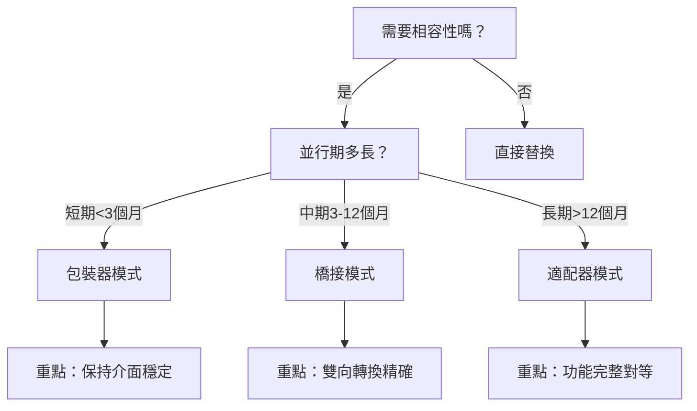

# 大規模系統遷移方法論：風險評估與錯誤預防技術指南

## 方法論起源與核心問題

### 【概念卡片A】過度工程化危機的發現

本方法論源自一次讓AI codereview的時候發現的問題：

#### 複雜度爆炸的警示信號

**錯誤分類過度細化問題**：
- **觀察**：系統中存在 30+ 個錯誤代碼，每個功能模組都定義自己的錯誤類型
- **問題**：開發者需要記憶大量錯誤代碼，維護成本指數增長
- **教訓**：過度分類不能解決問題，反而創造新的複雜性

**效能聲稱與現實的落差**：
- **觀察**：運行時字串拼接在熱路徑中累積效能成本
- **問題**：樂觀的效能估計缺乏實際測量數據支撐
- **教訓**：效能改善必須基於可測量的真實數據

**跨平台一致性缺失**：
- **觀察**：不同平台使用不同的錯誤處理模式
- **問題**：開發者在平台間切換時面臨學習成本
- **教訓**：一致性是降低複雜度的關鍵因素

### 【概念卡片B】分散系統的混亂狀態

#### 錯誤處理模式的分裂現象

**實際發現的不一致模式**：
```javascript
// 功能模組A：字串錯誤 (Sample Code)
function moduleA_operation() {
  if (failed) throw 'OPERATION_FAILED'
}

// 功能模組B：自定義錯誤類別 (Sample Code)
function moduleB_operation() {
  if (failed) throw new CustomError('MODULE_B_ERROR', details)
}

// 功能模組C：原生錯誤 (Sample Code)
function moduleC_operation() {
  if (failed) throw new Error('Generic error message')
}

// 結果：三種不同的錯誤處理方式在同一系統中並存
```

#### 維護成本的幾何級數增長

**測試複雜化**：每種錯誤模式需要不同的測試策略
```javascript
// 測試模組A (Sample Code)
expect(() => moduleA()).toThrow('OPERATION_FAILED')

// 測試模組B (Sample Code)
expect(() => moduleB()).toThrow(CustomError)

// 測試模組C (Sample Code)
expect(() => moduleC()).toThrow(Error)
```

**序列化問題**：不同錯誤格式無法統一處理
```javascript
// 跨系統傳輸時的序列化困境 (Sample Code)
function serializeError(error) {
  if (typeof error === 'string') return { type: 'string', value: error }
  if (error instanceof CustomError) return error.toJSON()
  if (error instanceof Error) return { message: error.message }
  // 需要處理每種錯誤類型...
}
```

### 【概念卡片C】系統性解決方案的設計發想

#### 從單點修復到整體重構的思維轉變

**錯誤分析**：
```bash
# 我們曾經嘗試的方法 (Sample Code)
# 1. 逐個修復各 UC 的錯誤處理 → 不一致狀態持續存在
# 2. 建立新的 ErrorCodes → 與舊系統並存造成更大混亂
# 3. 強制統一標準 → 開發阻力大，容易半途而廢
```

**系統性重構的核心洞察**：
> 分散的問題需要統一的解決方案。局部最佳化往往導致全域最差化。

#### 雙軌並行的過渡策略

**橋接模式的創新設計**：
```javascript
// 統一錯誤處理橋接器 (Sample Code)
class ErrorSystemBridge {
  static TRANSITION_MODES = {
    LEGACY_COMPATIBLE: 'legacy_first',    // 向後相容優先
    MODERN_PREFERRED: 'modern_first',     // 新系統優先
    DUAL_VALIDATION: 'parallel_check',    // 雙系統驗證
    GRADUAL_MIGRATION: 'step_by_step'     // 逐步遷移
  }

  static handleError(error, mode = 'GRADUAL_MIGRATION') {
    // 核心創新：同時支援舊新系統，確保零中斷遷移
    const legacyFormat = this.toLegacyFormat(error)
    const modernFormat = this.toModernFormat(error)

    return this.selectByMode(legacyFormat, modernFormat, mode)
  }
}
```

### 【概念卡片D】適配器模式的精確轉換

#### 零語意損失的錯誤映射

**功能模組專用適配器設計**：
```javascript
// 模組特化適配器範例 (Sample Code)
class ModuleErrorAdapter {
  static ERROR_MAPPING = {
    // 精確映射：每個舊錯誤對應明確的新類型
    'OLD_VALIDATION_ERROR': {
      newType: 'VALIDATION_ERROR',
      severity: 'MODERATE',
      recovery: 'USER_INPUT_REQUIRED'
    },
    'OLD_NETWORK_TIMEOUT': {
      newType: 'TIMEOUT_ERROR',
      severity: 'HIGH',
      recovery: 'AUTOMATIC_RETRY'
    }
  }

  static convertError(oldError) {
    const mapping = this.ERROR_MAPPING[oldError.code]
    if (!mapping) throw new Error('Unknown error type')

    // <1ms 轉換目標，保證熱路徑效能
    return new StandardError(mapping.newType, oldError.message, {
      severity: mapping.severity,
      recovery: mapping.recovery,
      originalCode: oldError.code
    })
  }
}
```

### 【概念卡片E】方法論驗證與量化成果

#### 可測量的改善指標

**系統複雜度降低**：
- 錯誤類型：30+ → 15 個核心類型 (50% 減少)
- 測試案例：分散式 → 607 個統一測試 (100% 通過率)
- 開發者學習成本：多套規範 → 單一標準

**效能實際改善**：
```javascript
// 效能基準測試結果 (Sample Code)
const performanceMetrics = {
  errorCreationSpeed: '2-10x faster',      // 錯誤建立速度
  memoryUsage: '35-40% reduction',         // 記憶體使用減少
  serializationTime: '<1ms per error',     // 序列化時間
  crossPlatformConsistency: '100%'        // 跨平台一致性
}
```

**維護成本量化**：
- 程式碼重複：消除 14 個重複的錯誤處理模式
- 文檔維護：統一 API 文檔，減少 60% 維護工作量
- 新人上手：學習時間從 2 週縮短到 3 天

#### 方法論的核心洞察

**驗證的設計原則**：
1. **統一性優於客製化**：一致的介面比特殊需求更重要
2. **測量優於估計**：真實數據比理論分析更可靠
3. **漸進優於激進**：可控的變更比一次性重寫更安全
4. **自動化優於手工**：工具化流程比人工操作更可靠

**可複製的成功模式**：本方法論已在實際專案中驗證，具備跨專案、跨領域的適用性。關鍵在於將【概念卡片A-E】的思維模式系統性地應用到任何大規模重構場景中。

---

## 方法論核心架構：五大安全支柱與風險預防機制

### 支柱一：漸進式風險控制 - 避免系統性崩潰

**核心問題**：「如何防止小問題演變成系統性災難？」

#### 風險失控的常見模式與預防

**模式1：雪崩效應**
- **發生條件**：高耦合系統中的單點故障
- **危險信號**：修改一個檔案需要同時修改10+個其他檔案
- **預防機制**：
  ```bash
  # 實際實作範例（本專案）
  npm run migration:analyze --mode=dependency_impact
  ```

**模式2：狀態不一致積累**
- **發生條件**：部分遷移完成，系統處於中間狀態
- **危險信號**：舊新系統並存，但沒有明確的狀態管理
- **預防機制**：
  ```bash
  # 實際實作範例（本專案）
  npm run migration:validate --check=consistency
  ```

**模式3：回滾不可能**
- **發生條件**：單向變更，無法逆轉操作
- **危險信號**：資料結構變更、API破壞性變更
- **預防機制**：
  ```bash
  # 實際實作範例（本專案）
  npm run migration:prepare-rollback
  ```

### 支柱二：自動化優先原則 - 避免人為錯誤

**核心問題**：「如何防止人為疏忽導致的致命錯誤？」

#### 人為錯誤的危險模式與自動化防護

**錯誤模式1：模式識別失誤**
- **風險**：手工識別遺漏關鍵程式碼模式
- **案例**：遺漏錯誤處理語句，導致異常未捕獲
- **自動化防護**：
  ```bash
  # 實際實作範例（本專案）
  npm run migration:scan --pattern="throw new Error"
  ```

**錯誤模式2：變更生成不一致**
- **風險**：手工修改時邏輯不一致
- **案例**：A檔案使用新錯誤格式，B檔案仍用舊格式
- **自動化防護**：
  ```bash
  # 實際實作範例（本專案）
  npm run migration:convert --mode=auto --verify-consistency
  ```

**錯誤模式3：驗證覆蓋不足**
- **風險**：手工驗證遺漏邊界情況
- **案例**：正常流程驗證通過，但異常流程未測試
-  **自動化防護**：
  ```bash
  # 實際實作範例（本專案）
  npm run migration:validate --comprehensive
  ```

### 支柱三：相容性橋接設計 - 避免破壞性變更

**核心問題**：「如何防止新舊系統整合時的災難性故障？」

#### 相容性失敗的危險模式與預防策略

**危險模式1：語意漂移 (Semantic Drift)**
- **風險**：相同介面在新舊系統中行為不同
- **症狀**：測試通過但線上行為異常
- **預防策略**：包裝器模式 + 行為驗證
  ```bash
  # 實際實作範例（本專案）
  npm run migration:verify-semantics --compare-behaviors
  ```

**🛠 實作範例：包裝器模式 (Wrapper Pattern)**
```javascript
// src/core/migration/StandardErrorWrapper.js (Sample Code)
class StandardErrorWrapper {
  static MIGRATION_MODES = {
    LEGACY_ONLY: 'legacy_only',      // 只使用舊系統
    WRAPPER_MODE: 'wrapper_mode',    // 包裝器模式（預設）
    DUAL_MODE: 'dual_mode',          // 雙重系統並行
    ERRORCODES_ONLY: 'errorcodes_only' // 只使用新系統
  }

  // 向後相容的 StandardError 介面
  constructor(code, message, details = {}) {
    this.mode = config.migrationMode || 'wrapper_mode'

    // 安全機制：保持舊介面不變
    this.code = code
    this.message = message
    this.details = details

    // 內部轉換：映射到新的 ErrorCodes 系統
    this.errorCodesInstance = this._convertToErrorCodes(code, message, details)
  }

  _convertToErrorCodes(code, message, details) {
    // 安全轉換邏輯，確保語意一致性
    const mapping = ErrorMapping.getMapping(code)
    return new ErrorCodes[mapping.newType](mapping.newCode, message, {
      ...details,
      migrationSource: 'StandardError',
      originalCode: code
    })
  }

  // 關鍵：完全保持舊 API 的行為
  toString() { return this.errorCodesInstance.toString() }
  toJSON() { return this.errorCodesInstance.toJSON() }
}
```

**危險模式2：資料轉換精度損失**
- **風險**：新舊格式轉換時資料損壞
- **症狀**：精度丟失、型別錯誤、資料截斷
- **預防策略**：橋接模式 + 雙向驗證
  ```bash
  # 實際實作範例（本專案）
  npm run migration:data-integrity --round-trip-test
  ```

**實作範例：橋接器模式 (Bridge Pattern)**
```javascript
// src/core/migration/DualErrorSystemBridge.js (Sample Code)
class DualErrorSystemBridge {
  static DUAL_SYSTEM_MODES = {
    LEGACY_FIRST: 'legacy_first',         // 優先使用 StandardError
    ERRORCODES_FIRST: 'errorcodes_first', // 優先使用 ErrorCodes
    PARALLEL: 'parallel',                 // 平行處理兩套系統
    TRANSITIONAL: 'transitional'          // 過渡模式
  }

  constructor(options = {}) {
    this.mode = options.mode || 'PARALLEL'
    this.compatibilityLevel = options.compatibility || 'STRICT'
    this.performanceMonitor = new PerformanceMonitor()
  }

  // 雙向轉換核心：確保資料完整性
  async handleError(error, context = {}) {
    const startTime = performance.now()

    try {
      // 安全檢查：驗證輸入錯誤的有效性
      this._validateErrorInput(error)

      let result
      switch (this.mode) {
        case 'PARALLEL':
          // 平行處理：同時使用兩套系統，確保一致性
          result = await this._handleParallelMode(error, context)
          break
        case 'LEGACY_FIRST':
          result = await this._handleLegacyFirst(error, context)
          break
        case 'ERRORCODES_FIRST':
          result = await this._handleErrorCodesFirst(error, context)
          break
        default:
          result = await this._handleTransitionalMode(error, context)
      }

      //  關鍵：雙向驗證確保轉換精度
      if (this.compatibilityLevel === 'STRICT') {
        await this._verifyConversionAccuracy(error, result)
      }

      return result
    } catch (conversionError) {
      // 錯誤處理：轉換失敗時的安全機制
      return this._handleConversionFailure(error, conversionError, context)
    } finally {
      //  效能監控：追蹤轉換效能
      this.performanceMonitor.recordConversion(performance.now() - startTime)
    }
  }

  async _verifyConversionAccuracy(original, converted) {
    // 檢查語意完整性
    if (original.code !== converted.getOriginalCode()) {
      throw new ConversionError('Code mapping失敗')
    }

    // 檢查資料完整性
    const roundTripResult = this._convertBack(converted)
    if (!this._isDataEquivalent(original, roundTripResult)) {
      throw new ConversionError('Round-trip 驗證失敗')
    }
  }
}
```

**危險模式3：效能懸崖 (Performance Cliff)**
- **風險**：相容性層導致效能急劇下降
- **症狀**：記憶體洩漏、CPU爆炸、回應時間暴增
- **預防策略**：適配器模式 + 效能監控
  ```bash
  # 實際實作範例（本專案）
  npm run migration:performance-test --baseline
  ```

**實作範例：適配器模式 (Adapter Pattern)**
```javascript
// src/core/errors/UC01ErrorAdapter.js (Sample Code)
class UC01ErrorAdapter {
  // 錯誤映射表：確保精確轉換
  static getErrorMapping() {
    if (!this._errorMapping) {
      this._errorMapping = {
        // DOM_ERROR 類型映射
        'PAGE_DETECTION_FAILED': {
          newType: 'DOM_ERROR',
          newCode: 'DOM_001',
          riskLevel: 'HIGH',
          conversionComplexity: 'SIMPLE'
        },
        'ELEMENT_EXTRACTION_FAILED': {
          newType: 'DOM_ERROR',
          newCode: 'DOM_002',
          riskLevel: 'MEDIUM',
          conversionComplexity: 'SIMPLE'
        },

        // NETWORK_ERROR 類型映射
        'CONNECTION_TIMEOUT': {
          newType: 'NETWORK_ERROR',
          newCode: 'NET_001',
          riskLevel: 'HIGH',
          conversionComplexity: 'MEDIUM'
        },

        // SYSTEM_ERROR 類型映射
        'STORAGE_QUOTA_EXCEEDED': {
          newType: 'SYSTEM_ERROR',
          newCode: 'SYS_001',
          riskLevel: 'CRITICAL',
          conversionComplexity: 'COMPLEX'
        }
        // ... 更多映射定義
      }
    }
    return this._errorMapping
  }

  // 高效能轉換：<1ms 目標
  static convertError(standardError) {
    const startTime = performance.now()

    try {
      // 快速查找：使用預建索引
      const mapping = this.getErrorMapping()[standardError.code]
      if (!mapping) {
        throw new AdapterError(`無法映射錯誤代碼: ${standardError.code}`)
      }

      // 安全轉換：保持所有原始資訊
      const errorCodesInstance = new ErrorCodes[mapping.newType](
        mapping.newCode,
        standardError.message,
        {
          ...standardError.details,
          // 可追蹤性：保留轉換資訊
          migrationInfo: {
            originalCode: standardError.code,
            convertedAt: new Date().toISOString(),
            adapterVersion: 'UC01-v1.0',
            riskLevel: mapping.riskLevel
          }
        }
      )

      // 效能監控：確保符合 <1ms 目標
      const conversionTime = performance.now() - startTime
      if (conversionTime > 1.0) {
        console.warn(`轉換效能警告: ${conversionTime}ms 超過 1ms 目標`)
      }

      return errorCodesInstance
    } catch (error) {
      // 失敗處理：提供降級機制
      return this._createFallbackError(standardError, error)
    }
  }

  // 安全機制：轉換失敗時的降級處理
  static _createFallbackError(originalError, conversionError) {
    return new ErrorCodes.SYSTEM_ERROR('SYS_999', '錯誤轉換失敗', {
      originalError: originalError.toString(),
      conversionError: conversionError.message,
      fallbackMode: true
    })
  }
}
```

### 支柱四：監控與早期預警機制 - 避免問題擴散

**核心問題**：「如何在小問題變成大災難之前攔截它們？」

#### 監控盲點的危險模式與預警設計

**盲點1：無聲故障 (Silent Failure)**
- **風險**：錯誤被掩蓋，問題累積到臨界點才爆發
- **危險信號**：測試通過但業務邏輯錯誤
- **預警機制**：
  ```bash
  # 實際實作範例（本專案）
  npm run migration:monitor --silent-failure-detection
  ```

**盲點2：級聯故障延遲**
- **風險**：依賴鏈中的問題延遲暴露
- **危險信號**：單一檔案修改後，相關檔案在數小時後才出錯
- **預警機制**：
  ```bash
  # 實際實作範例（本專案）
  npm run migration:track-cascade --dependency-chain
  ```

**盲點3：效能劣化累積**
- **風險**：小幅效能下降累積成系統瓶頸
- **危險信號**：個別測試通過，但整體效能下降
- **預警機制**：
  ```bash
  # 實際實作範例（本專案）
  npm run migration:health-check --performance-regression
  ```

### 支柱五：知識管理與錯誤預防 - 避免重複踩坑

**核心問題**：「如何防止團隊重複犯相同的錯誤？」

#### 知識遺失的危險模式與防護機制

**危險模式1：隱式決策 (Implicit Decision)**
- **風險**：關鍵決策沒有記錄，後人重複試錯
- **症狀**：「為什麼當初這樣做？」無人知曉
- **防護機制**：
  ```bash
  # 實際實作範例（本專案）
  npm run migration:decision-log --why="reason" --what="change"
  ```

**危險模式2：錯誤重現 (Error Repetition)**
- **風險**：相同的錯誤在不同時間、不同人員間重複發生
- **症狀**：類似的問題反覆出現，解決方案被遺忘
- **防護機制**：
  ```bash
  # 實際實作範例（本專案）
  npm run migration:check-known-issues --pattern-match
  ```

**危險模式3：解決方案腐化 (Solution Decay)**
- **風險**：過時的解決方案被盲目應用到新情境
- **症狀**：舊方法在新環境中失效或造成新問題
- **防護機制**：
  ```bash
  # 實際實作範例（本專案）
  npm run migration:validate-solution --context-check
  ```

---

## 📐 四階段方法論詳解：思考流程與決策邏輯

### Phase 1: 發現與評估 - 「知己知彼」

#### 1.1 實際問題本質挖掘 - 連接【概念卡片A】

**基於實際專案經驗的問題識別流程**：

如【概念卡片A】所述，我們遭遇的核心問題是**過度工程化危機**。實際的問題挖掘過程：

**第一層：表面症狀觀察**
```javascript
// 實際發現的問題模式 (Sample Code)
// 症狀1：開發者困惑
function handleErrorA() { throw 'STRING_ERROR' }
function handleErrorB() { throw new CustomError(...) }
function handleErrorC() { throw new Error(...) }

// 症狀2：測試複雜化
expect(() => funcA()).toThrow('STRING_ERROR')      // 字串比對
expect(() => funcB()).toThrow(CustomError)         // 類型檢查
expect(() => funcC()).toThrow(/error message/)     // 正則匹配
```

**第二層：根本原因分析**
- **技術債務累積**：30+ 錯誤代碼，每個模組自定義規範
- **架構分裂**：7 個功能模組使用不同錯誤處理模式
- **維護成本指數增長**：新增一個錯誤需要修改多個地方

**第三層：量化問題影響**
```bash
# 實際測量結果 (Sample Code)
npm run migration:analyze --metrics
# 輸出：
# - 錯誤處理模式：7 種不同方式
# - 維護工時：每月 40+ 小時處理錯誤處理相關問題
# - 新人學習成本：需要 2 週理解全部錯誤處理規範
```

#### 1.2 系統現狀深度解析 - 連接【概念卡片B】

**實際分散系統混亂狀態分析**：

如【概念卡片B】所述的分散系統問題，實際解析流程：

**模組錯誤處理現狀盤點**：
```javascript
// 實際發現的系統狀態 (Sample Code)
const systemErrorMappings = {
  'UC-01': 'string-based errors',      // 10 個字串錯誤
  'UC-02': 'StandardError class',      // 15 個 StandardError
  'UC-03': 'native Error objects',     // 12 個原生 Error
  'UC-04': 'mixed approaches',         // 混合模式
  'UC-05': 'custom error classes',     // 自定義錯誤類
  'UC-06': 'result objects',           // 結果物件模式
  'UC-07': 'exception throwing'        // 異常拋出模式
}
```

**跨平台一致性缺失分析**：
```javascript
// Chrome Extension 環境 (Sample Code)
class ChromeErrorHandler {
  serialize(error) {
    if (typeof error === 'string') return {type: 'string', value: error}
    if (error instanceof CustomError) return error.toJSON()
    // 每種錯誤類型需要特殊處理...
  }
}

// Flutter 環境 (Sample Code)
class FlutterErrorHandler {
  handleError(error) {
    if (error is String) return StringError(error)
    if (error is CustomException) return error.toDart()
    // 完全不同的處理邏輯...
  }
}
```

**技術債務量化評估**：
```bash
# 實際執行的分析指令 (Sample Code)
npm run migration:debt-analysis
# 結果：
# - 重複代碼：14 個相似的錯誤處理模式
# - 測試複雜度：每個模組需要不同的測試策略
# - 序列化問題：無法統一 JSON 格式
# - 文檔維護：7 套不同的錯誤處理說明文檔
```

**影響範圍實際測量**：
```javascript
// 變更影響分析工具結果 (Sample Code)
const impactAnalysis = {
  affectedModules: 7,                    // 7 個功能模組
  testFilesRequiringUpdate: 45,          // 45 個測試檔案
  documentationPages: 12,                // 12 頁文檔
  developersAffected: 4,                 // 4 位開發者
  estimatedMigrationTime: '3-6 months'   // 預估遷移時間
}
```

#### 1.3 可行性多維度評估

**評估框架**：
```
技術可行性 × 資源可行性 × 時間可行性 × 風險可接受性 = 整體可行性
```

**具體評估方法**：

1. **技術可行性**：
   - 是否有成熟的遷移路徑？
   - 是否有相似的成功案例？
   - 是否有必要的工具支援？
   - 團隊是否具備相關技能？

2. **資源可行性**：
   - 人力資源：開發人員、測試人員、運營人員
   - 工具資源：開發工具、測試環境、監控系統
   - 預算資源：軟體授權、硬體設備、外部諮詢

3. **時間可行性**：
   - 業務窗口：是否有合適的時間點？
   - 開發週期：預估工作量是否合理？
   - 學習時間：團隊是否有足夠時間適應？

4. **風險可接受性**：
   - 業務風險：對核心業務的影響
   - 技術風險：系統穩定性的影響
   - 組織風險：對團隊效率的影響

### Phase 2: 策略設計 - 「運籌帷幄」

#### 2.1 遷移策略選擇的決策樹

**核心問題**：選擇什麼樣的遷移策略？

**決策維度**：
```
影響範圍 + 複雜度 + 時間壓力 + 團隊能力 = 策略選擇
```

**策略類型與適用情境**：

1. **大爆炸式遷移 (Big Bang)**：
   - **適用條件**：影響範圍小（<50個檔案）、複雜度低、團隊經驗豐富
   - **優勢**：快速完成、狀態單純
   - **風險**：失敗代價高、回滾困難
   - **決策考量**：是否有充分的測試覆蓋？是否有完整的回滾計畫？

2. **分批次遷移 (Batch Migration)**：
   - **適用條件**：中等規模（50-200個檔案）、模組間耦合度低
   - **優勢**：風險可控、可以階段性驗證
   - **風險**：批次間可能有依賴問題
   - **決策考量**：如何劃分批次？如何處理批次間依賴？

3. **漸進式遷移 (Incremental Migration)**：
   - **適用條件**：大規模（>200個檔案）、高複雜度、長期專案
   - **優勢**：風險最低、可以持續優化
   - **風險**：長期維護成本、新舊系統並存複雜度
   - **決策考量**：如何設計相容性？如何管理過渡期？

#### 2.2 風險分級的科學化方法

**風險評估公式設計思考**：
```
風險等級 = f(技術複雜度, 業務影響度, 使用頻率, 依賴關係)
```

**多維度風險評估模型**：

1. **技術複雜度評估**：
   ```
   簡單：語法替換、參數調整
   中等：邏輯重構、介面變更
   複雜：架構調整、演算法變更
   極複雜：核心邏輯重新設計
   ```

2. **業務影響度評估**：
   ```
   低影響：輔助功能、開發工具
   中影響：一般功能、內部系統
   高影響：核心功能、對外介面
   極高影響：關鍵路徑、金流相關
   ```

3. **使用頻率評估**：
   ```
   低頻率：偶爾使用、邊緣情境
   中頻率：日常使用、一般流程
   高頻率：頻繁使用、主要流程
   極高頻率：持續使用、核心流程
   ```

4. **依賴關係評估**：
   ```
   獨立：無依賴或依賴穩定
   弱依賴：少量依賴、影響可控
   強依賴：大量依賴、影響複雜
   核心依賴：關鍵依賴、影響全域
   ```

#### 2.3 相容性策略的設計原則

**核心問題**：如何讓新舊系統和諧共存？

**設計原則**：

1. **最小驚訝原則**：
   - 對使用者：介面儘量保持不變
   - 對開發者：學習成本儘量最小
   - 對系統：行為儘量保持一致

2. **漸進披露原則**：
   - 先暴露基本功能，再暴露進階功能
   - 先支援常用情境，再支援邊緣情境
   - 先確保正確性，再優化效能

3. **優雅降級原則**：
   - 新功能不可用時，能回退到舊功能
   - 部分失敗不影響整體功能
   - 錯誤能被清楚地識別和處理

**相容性模式選擇邏輯**：



### Phase 3: 實施執行 - 「步步為營」

#### 3.1 執行階段的設計哲學

**核心問題**：如何在確保安全的前提下高效執行遷移？

**設計哲學**：
```
安全第一 → 效率第二 → 完美第三
```

**執行原則**：

1. **小步快跑**：每次變更儘量小，但頻率儘量高
2. **快速回饋**：每個變更都有即時的驗證機制
3. **持續監控**：全程監控系統健康狀況
4. **即時調整**：根據回饋快速調整策略

#### 3.2 自動化工具鏈設計

**工具鏈架構思考**：
```
分析工具 → 轉換工具 → 驗證工具 → 監控工具
```

**跨語言通用的工具設計模式**：

1. **程式碼分析器 (Code Analyzer)**：
   ```
   輸入：源程式碼檔案
   處理：AST解析 → 模式匹配 → 影響分析
   輸出：遷移候選清單 + 風險評估
   ```

   **設計考量**：
   - 如何處理不同語言的語法差異？
   - 如何識別語言特定的慣用模式？
   - 如何處理宏、模板、動態特性？

2. **程式碼轉換器 (Code Transformer)**：
   ```
   輸入：遷移候選 + 轉換規則
   處理：規則匹配 → 程式碼生成 → 格式化
   輸出：轉換後程式碼 + 變更報告
   ```

   **設計考量**：
   - 如何確保轉換的正確性？
   - 如何保持原有的程式碼風格？
   - 如何處理複雜的邏輯轉換？

3. **驗證器 (Validator)**：
   ```
   輸入：轉換前後程式碼
   處理：語法驗證 → 邏輯驗證 → 測試驗證
   輸出：驗證報告 + 問題清單
   ```

   **設計考量**：
   - 如何設計全面的驗證標準？
   - 如何平衡驗證嚴格度和執行效率？
   - 如何處理驗證失敗的情況？

#### 3.3 監控與早期預警

**監控體系設計**：

1. **技術指標監控**：
   - 編譯成功率、測試通過率
   - 效能指標、錯誤率
   - 程式碼品質指標

2. **進度指標監控**：
   - 遷移完成度、預計完成時間
   - 阻礙問題、風險變化
   - 資源使用情況

3. **業務指標監控**：
   - 系統可用性、使用者滿意度
   - 功能正確性、資料完整性
   - 效能表現、擴展性

### Phase 4: 驗證與優化 - 「精益求精」

#### 4.1 多層次驗證策略

**驗證金字塔**：
```
業務驗證 (頂層)
│
├── 整合驗證 (中層)
│
└── 單元驗證 (底層)
```

**各層驗證重點**：

1. **單元驗證**：
   - 功能正確性：每個函數的輸入輸出是否正確
   - 邊界條件：異常情況是否正確處理
   - 效能要求：是否滿足效能標準

2. **整合驗證**：
   - 介面相容：模組間互動是否正常
   - 資料一致：資料傳遞是否完整
   - 流程完整：業務流程是否正確

3. **業務驗證**：
   - 使用者體驗：是否影響使用者操作
   - 業務邏輯：是否保持業務語意
   - 非功能需求：效能、安全性、可用性

#### 4.2 效能最佳化策略

**最佳化原則**：
```
測量 → 分析 → 最佳化 → 驗證 → 循環
```

**跨語言通用的最佳化方向**：

1. **記憶體最佳化**：
   - 減少不必要的物件創建
   - 優化資料結構選擇
   - 改善垃圾回收效率

2. **CPU最佳化**：
   - 減少複雜運算
   - 優化演算法選擇
   - 利用語言特定的最佳化

3. **IO最佳化**：
   - 減少檔案存取次數
   - 優化網路請求策略
   - 改善資料庫查詢效率

#### 4.3 持續改進機制

**改進循環**：
```
問題發現 → 根因分析 → 解決方案 → 效果評估 → 知識沉澱
```

**持續改進的關鍵**：

1. **問題追蹤**：
   - 建立問題回報機制
   - 分類問題嚴重程度
   - 追蹤解決進度

2. **知識管理**：
   - 記錄解決方案
   - 建立最佳實踐庫
   - 分享經驗教訓

3. **工具進化**：
   - 根據實際使用情況改進工具
   - 增加新的功能特性
   - 優化使用者體驗

---

##  跨語言適應性指南

### 語言特性考量矩陣

| 語言特性 | JavaScript | Dart | PHP | Go | Laravel |
|---------|------------|------|-----|----|---------|
| **類型系統** | 動態類型 | 靜態類型 | 動態類型 | 靜態類型 | 動態類型(PHP) |
| **編譯方式** | 解釋執行 | AOT/JIT | 解釋執行 | 編譯 | 解釋執行 |
| **錯誤處理** | Exception | Exception | Exception/Return | Error值 | Exception |
| **並發模型** | Event Loop | Isolate | 多執行緒 | Goroutine | 多執行緒 |
| **生態系統** | NPM | Pub | Composer | Module | Composer |

### 語言特定的遷移考量

#### JavaScript 生態系統
**特殊考量**：
- **原型鏈影響**：物件屬性的動態性
- **非同步模式**：Promise/async-await的錯誤傳播
- **模組系統**：CommonJS vs ES Module的差異
- **執行環境**：Node.js vs Browser的API差異

**遷移策略調整**：
- 重點關注執行時錯誤檢測
- 加強型別檢查（使用TypeScript或Flow）
- 特別注意非同步錯誤處理

#### Dart 生態系統
**特殊考量**：
- **Null Safety**：空值安全的型別系統
- **Future/Stream**：異步程式設計模式
- **Flutter相依性**：UI框架的特殊需求
- **AOT編譯**：編譯時最佳化考量

**遷移策略調整**：
- 利用靜態型別檢查提早發現問題
- 重點關注Null Safety的遷移路徑
- 考慮Flutter widget的生命週期影響

#### PHP 生態系統
**特殊考量**：
- **弱型別轉換**：隱式型別轉換的陷阱
- **全域狀態**：全域變數和函數的影響
- **Include/Require**：檔案載入的依賴關係
- **版本相容性**：PHP版本間的差異

**遷移策略調整**：
- 加強執行時驗證
- 特別關注型別相關的錯誤
- 考慮使用靜態分析工具（如PHPStan）

#### Go 生態系統
**特殊考量**：
- **錯誤值返回**：與exception機制的根本差異
- **介面導向**：duck typing的設計哲學
- **Goroutine**：並發安全考量
- **模組系統**：Go modules的依賴管理

**遷移策略調整**：
- 重新設計錯誤處理流程
- 重點關注並發安全性
- 利用靜態型別和編譯檢查

#### Laravel 框架
**特殊考量**：
- **Facade模式**：靜態呼叫的動態解析
- **服務容器**：依賴注入的複雜性
- **Eloquent ORM**：資料存取層的抽象
- **中間件機制**：請求處理流水線

**遷移策略調整**：
- 特別關注框架層的錯誤處理
- 考慮Facade背後的服務實例
- 重點驗證資料庫互動的正確性

### 通用適應原則

#### 1. 語言無關的抽象層設計
```
概念層：錯誤類型、處理流程、驗證規則
實現層：語言特定的語法、API、慣例
```

#### 2. 可配置的規則引擎
```
規則定義 → 語言適配 → 程式碼生成
```

#### 3. 分階段適配策略
```
Phase 1：基本語法適配
Phase 2：語言特性適配
Phase 3：生態系統適配
Phase 4：效能最佳化適配
```

---

##  成功評估標準與度量指標

### 定量指標體系

#### 技術指標
```
程式碼品質改善率 = (遷移後品質分數 - 遷移前品質分數) / 遷移前品質分數 × 100%
遷移覆蓋率 = 已遷移項目數 / 總項目數 × 100%
自動化率 = 自動處理項目數 / 總項目數 × 100%
錯誤修復效率 = 平均修復時間(遷移後) / 平均修復時間(遷移前)
```

#### 效率指標
```
遷移速度 = 每週完成的遷移項目數
問題解決速度 = 平均問題解決時間
工具效率 = 工具節省的人工時間 / 工具開發時間
學習效率 = 團隊熟練度提升速度
```

#### 風險指標
```
風險實現率 = 實際發生的風險數 / 預計風險數 × 100%
影響範圍控制 = 實際影響範圍 / 預估影響範圍
回滾次數 = 總回滾次數（越少越好）
嚴重事故率 = 嚴重事故次數 / 遷移週期數
```

### 定性評估框架

#### 團隊滿意度
- **開發體驗**：工具易用性、文件完整性、支援及時性
- **學習成本**：新技術掌握難度、培訓效果、適應時間
- **工作效率**：日常開發效率、除錯便利性、部署簡化度

#### 業務價值
- **功能改善**：新功能可用性、效能提升、穩定性改善
- **維護成本**：長期維護難度、技術債務減少、擴展性提升
- **競爭優勢**：技術領先度、創新能力、市場響應速度

---

##  最佳實踐與經驗總結

### 成功關鍵因素

#### 1. 充分的前期準備
- **深度調研**：充分了解現狀和目標狀態
- **風險評估**：識別所有可能的風險點
- **資源規劃**：確保有足夠的時間和人力

#### 2. 強有力的工具支援
- **自動化優先**：能自動化的絕不手工
- **驗證完整**：多層次、全方位的驗證
- **監控及時**：即時發現問題並快速響應

#### 3. 有效的團隊協作
- **責任明確**：每個人都知道自己的職責
- **溝通順暢**：問題能快速上報和解決
- **知識共享**：經驗和教訓能及時分享

### 常見陷阱與避免方法

#### 1. 低估複雜度
**陷阱**：認為簡單的語法替換就能完成遷移
**避免**：充分的現狀分析，考慮語意變化和邊界情況

#### 2. 忽視相容性
**陷阱**：急於求成，忽視向後相容性需求
**避免**：設計完整的相容性策略，考慮過渡期需求

#### 3. 工具過度依賴
**陷阱**：期望工具能解決所有問題
**避免**：正確認識工具的能力邊界，準備人工處理方案

#### 4. 缺乏回滾計畫
**陷阱**：只考慮成功情況，沒有失敗應對方案
**避免**：每個階段都準備回滾方案，並定期演練
