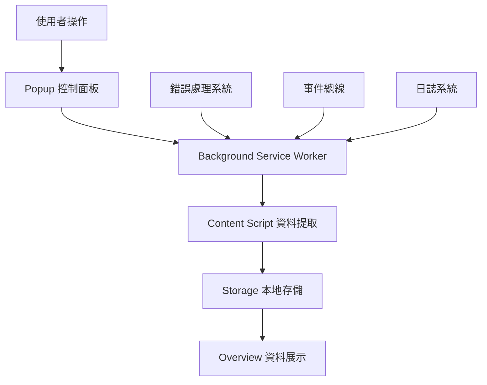

# 🚀 Readmoo 書庫管理器 - 快速上手指南

> **版本**: v0.10.x  
> **預計閱讀時間**: 10 分鐘  
> **適用對象**: 所有新加入工程師

---

## 🎯 專案基本資訊

### **專案定位**
Readmoo 書庫管理器是一個 Chrome Extension，專門為 Readmoo 電子書用戶提供：
- 📚 **一鍵書庫資料提取**: 從 Readmoo 網站提取完整書籍資訊
- 💾 **本地安全存儲**: 使用 Chrome Storage API 本地保存
- 🔍 **智能搜尋篩選**: 強大的書籍搜尋和分類功能
- 📊 **多格式匯出**: 支援 CSV、JSON 等格式備份

### **核心價值主張**
- ✅ **隱私優先**: 100% 本地處理，不上傳任何資料到雲端
- ✅ **資料永久化**: 不依賴 Readmoo 網站，隨時查看完整閱讀記錄
- ✅ **高效管理**: 一鍵操作，快速整理大量書籍資料

---

## 🏗️ 技術架構概覽

### **技術棧**
- **平台**: Chrome Extension (Manifest V3)
- **前端**: Vanilla JavaScript + HTML5 + CSS3
- **架構**: Domain-Driven Design (DDD) + Event-Driven Architecture
- **儲存**: Chrome Storage API
- **測試**: Jest + Chrome Extension Testing Framework

### **核心設計原則**


### **模組責任劃分**

| 模組 | 主要職責 | 關鍵檔案 |
|------|----------|----------|
| **Background** | Service Worker 生命週期管理 | `src/background/background.js` |
| **Content Scripts** | Readmoo 頁面資料提取 | `src/content/content-modular.js` |
| **Popup** | 使用者互動界面 | `src/popup/popup.js` |
| **Overview** | 書庫管理主頁面 | `src/overview/overview.js` |
| **Core System** | 錯誤處理、日誌、事件管理 | `src/core/` |

---

## 🛠️ 開發環境快速設置

### **系統要求**
- Node.js 16.x+
- Chrome 瀏覽器 88+
- Git

### **一鍵啟動**
```bash
# 1. 克隆專案
git clone <repository-url>
cd book_overview_v1

# 2. 安裝依賴
npm install --legacy-peer-deps

# 3. 開發建置
npm run build:dev

# 4. 載入 Chrome Extension
# 開啟 Chrome -> 擴充功能 -> 開發者模式 -> 載入未封裝項目 -> 選擇 build/development/
```

### **開發工作流程**
1. **TMux 環境 (推薦)**: `./scripts/setup-tmux-layout.sh`
2. **監控建置**: `npm run watch`
3. **執行測試**: `npm test`
4. **程式碼檢查**: `npm run lint`

---

## 📚 關鍵概念理解

### **1. v0.10.x 標準化錯誤處理系統**

這是本版本的重大更新，建立了完整的錯誤處理架構：

```javascript
// ✅ 新的標準化方式
import { OperationResult, BookValidationError } from '../core/errors';

try {
  const books = await extractBooks();
  return OperationResult.success(books);
} catch (error) {
  if (error instanceof BookValidationError) {
    return OperationResult.failure('VALIDATION_ERROR', error.message);
  }
  throw error;
}
```

**核心效益**:
- 🎯 **統一錯誤格式**: 所有模組使用相同的錯誤回應格式
- 🔍 **更好的除錯**: 結構化錯誤訊息，便於問題診斷
- 🧪 **測試穩定**: 消除字串比對導致的測試失敗

### **2. 事件驅動架構**

系統使用中央事件總線協調模組間通訊：

```javascript
// 發佈事件
EventBus.emit('EXTRACTION.DATA.EXTRACTED', { books, timestamp });

// 監聽事件  
EventBus.on('EXTRACTION.DATA.EXTRACTED', (data) => {
  console.log(`提取了 ${data.books.length} 本書籍`);
});
```

### **3. 領域驅動設計 (DDD)**

專案採用 7 個清晰劃分的領域：

```text
src/background/domains/
├── page/              # 頁面管理領域
├── data-management/   # 資料管理領域  
├── platform/          # 平台管理領域
├── system/            # 系統管理領域
├── user-experience/   # 用戶體驗領域
├── extraction/        # 資料提取領域
└── messaging/         # 通訊管理領域
```

---

## 🐛 常見問題快速解決

### **環境問題**

**Q: npm install 失敗**
```bash
# A: 使用 legacy peer deps
npm install --legacy-peer-deps --force
```

**Q: Chrome Extension 載入失敗**
```bash
# A: 確認建置完成
npm run build:dev
# 然後載入 build/development/ 資料夾
```

### **開發問題**

**Q: 測試失敗**
```bash
# A: 檢查測試環境
npm run test -- --verbose
```

**Q: 程式碼 lint 錯誤**
```bash
# A: 自動修復
npm run lint:fix
```

---

## 🔄 下一步學習路徑

### **完成快速上手後，建議閱讀順序**:

1. **🏗️ [核心架構總覽](./core-architecture.md)** (10分鐘)
   - 深入理解 DDD 架構設計
   - 掌握事件系統運作原理

2. **🛡️ [標準化錯誤處理](./error-handling-overview.md)** (10分鐘)
   - 學習 v0.10.x 錯誤處理最佳實踐
   - 掌握結構化錯誤處理模式

3. **📖 選擇開發領域**:
   - **後端開發** → [架構設計文件](../02-development/architecture/)
   - **前端開發** → [UI/UX 開發指南](../02-development/ui-ux/)
   - **測試開發** → [測試策略文件](../02-development/testing/)

---

## 🤝 需要幫助？

- **📋 問題回報**: [GitHub Issues](https://github.com/your-repo/issues)
- **💡 功能建議**: [GitHub Discussions](https://github.com/your-repo/discussions)  
- **📖 詳細文件**: [技術文件導覽](../README.md)
- **🔧 開發問題**: 查閱 [問題診斷指南](../03-reference/troubleshooting/)

---

**⏰ 預計完成時間**: 如果跟著本指南操作，應該可以在 10 分鐘內完成環境設置並理解專案基本概念。

**🎯 成功指標**: 能夠成功載入 Chrome Extension 並理解專案的核心架構原理。