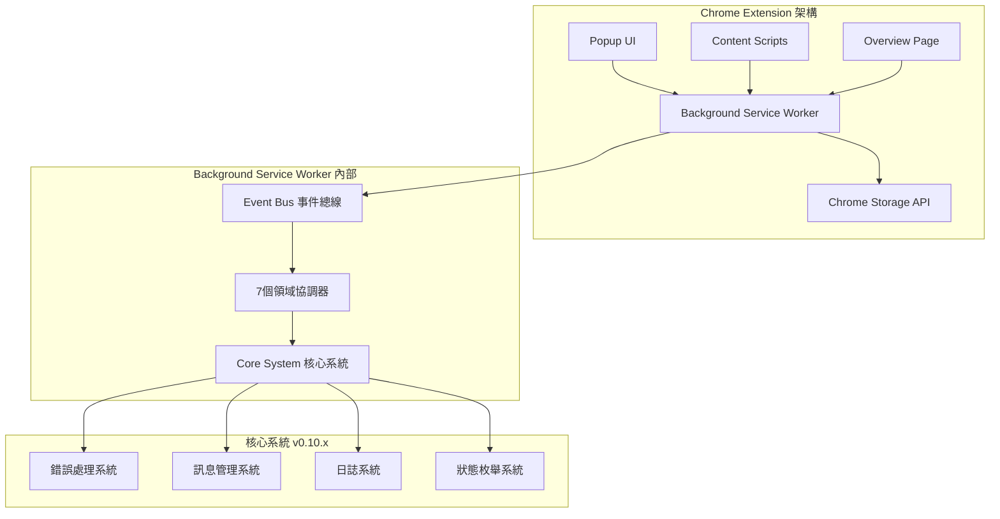
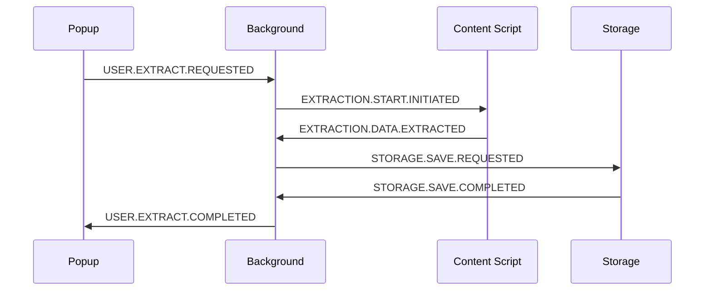

# 🏗️ 核心架構總覽 - v0.10.x

> **閱讀時間**: 10 分鐘  
> **前置要求**: 已閱讀 [快速上手指南](./README.md)  
> **適用版本**: v0.10.x

---

## 🎯 架構設計理念

### **設計核心原則**

Readmoo 書庫管理器採用 **Domain-Driven Design (DDD) + Event-Driven Architecture** 的現代化架構：



### **關鍵設計決策**

| 決策 | 原因 | 效益 |
|------|------|------|
| **領域驅動設計 (DDD)** | 業務複雜度管理 | 清晰的職責劃分、易於維護 |
| **事件驅動架構** | 模組間解耦 | 高可測試性、靈活的功能擴展 |
| **統一錯誤處理** | 提升程式碼品質 | 一致的錯誤體驗、更好的除錯 |
| **Chrome Extension 原生** | 性能和安全性 | 快速響應、完整瀏覽器整合 |

---

## 🧩 七大領域架構

### **領域職責劃分**

```text
src/background/domains/
├── 📄 page/              # 頁面管理領域
│   ├── 📋 職責: Content Script 協調、頁面檢測、Tab 狀態管理
│   └── 🎯 核心: 與 Readmoo 網站的互動邏輯
│
├── 📄 data-management/   # 資料管理領域 ⭐ 核心領域
│   ├── 📋 職責: 資料驗證、正規化、去重、同步策略
│   └── 🎯 核心: 書籍資料的完整生命週期管理
│
├── 📄 platform/          # 平台管理領域
│   ├── 📋 職責: 平台檢測、適配器工廠、平台切換
│   └── 🎯 核心: 為未來多平台擴展奠定基礎
│
├── 📄 system/            # 系統管理領域
│   ├── 📋 職責: 生命週期管理、配置管理、健康監控
│   └── 🎯 核心: Extension 的穩定運行保障
│
├── 📄 user-experience/   # 用戶體驗領域
│   ├── 📋 職責: UI協調、通知管理、主題管理
│   └── 🎯 核心: 統一且優質的用戶交互體驗
│
├── 📄 extraction/        # 資料提取領域 ⭐ 核心領域
│   ├── 📋 職責: DOM 解析、資料提取、品質控制
│   └── 🎯 核心: 從 Readmoo 準確提取書籍資料
│
└── 📄 messaging/         # 通訊管理領域
    ├── 📋 職責: 跨上下文通訊、訊息路由、優先級管理
    └── 🎯 核心: Chrome Extension 內部通訊協調
```

### **領域間協作模式**

```javascript
// 典型的跨領域協作流程
class ExtractionWorkflow {
  async extractBooks() {
    // 1. Page Domain: 檢查頁面狀態
    const isReady = await PageDomainCoordinator.checkPageReady();
    
    // 2. Extraction Domain: 執行資料提取
    const rawData = await ExtractionDomainCoordinator.extractData();
    
    // 3. Data Management Domain: 資料處理和驗證
    const validatedData = await DataManagementDomainCoordinator.process(rawData);
    
    // 4. User Experience Domain: 更新 UI 狀態
    await UXDomainCoordinator.updateExtractionProgress(validatedData.length);
    
    return validatedData;
  }
}
```

---

## 🛡️ v0.10.x 核心系統架構

### **統一錯誤處理系統**

這是 v0.10.x 版本的重大架構革新：

```text
src/core/
├── error-handling/           # 錯誤處理協調層
│   ├── error-classifier.js      # 智能錯誤分類
│   ├── system-error-handler.js  # 系統級錯誤處理
│   └── user-message-generator.js # 用戶友善訊息生成
│
├── errors/                   # 結構化錯誤類別
│   ├── StandardError.js         # 標準錯誤基底
│   ├── BookValidationError.js   # 業務專用錯誤
│   └── OperationResult.js       # 統一回應格式
│
├── enums/                    # 標準化枚舉
│   ├── OperationStatus.js       # 操作狀態
│   ├── ErrorTypes.js            # 錯誤類型
│   └── MessageTypes.js          # 訊息類型
│
└── messages/                 # 訊息管理
    └── MessageDictionary.js     # 集中化訊息字典
```

### **統一回應格式**

所有系統操作都使用標準化的回應格式：

```javascript
// 成功回應
{
  success: true,
  data: { books: [...], count: 42 },
  error: null,
  timestamp: '2025-09-05T10:30:00Z',
  version: 'v0.10.x'
}

// 錯誤回應
{
  success: false,
  data: null,
  error: {
    type: 'VALIDATION_ERROR',
    code: 'BOOK_TITLE_MISSING',
    message: '書籍標題不能為空',
    details: { field: 'title', value: null }
  },
  timestamp: '2025-09-05T10:30:00Z',
  version: 'v0.10.x'
}
```

---

## 🔄 事件驅動通訊架構

### **中央事件總線**

```javascript
// 事件總線是所有模組通訊的中樞
class EventBus {
  // 標準事件格式: DOMAIN.ACTION.STATE
  static emit(eventName, payload) {
    // 事件分發邏輯
  }
  
  static on(eventName, handler) {
    // 事件監聽註冊
  }
}
```

### **典型事件流程**



### **關鍵事件分類**

| 事件類型 | 格式 | 範例 | 用途 |
|----------|------|------|------|
| **用戶操作** | `USER.{ACTION}.{STATE}` | `USER.EXTRACT.REQUESTED` | 用戶界面交互 |
| **資料提取** | `EXTRACTION.{ACTION}.{STATE}` | `EXTRACTION.DATA.VALIDATED` | 資料提取流程 |
| **儲存操作** | `STORAGE.{ACTION}.{STATE}` | `STORAGE.SYNC.COMPLETED` | 資料持久化 |
| **系統狀態** | `SYSTEM.{ACTION}.{STATE}` | `SYSTEM.HEALTH.CHECKED` | 系統監控 |

---

## 🔧 模組化內容腳本架構

### **可擴展的提取器設計**

```text
src/content/
├── content-modular.js        # 統一入口點
├── core/
│   └── content-event-bus.js      # Content Script 專用事件總線
├── adapters/
│   └── readmoo-adapter.js        # Readmoo 平台適配器
├── extractors/
│   └── book-data-extractor.js    # 核心提取邏輯
└── utils/
    ├── dom-utils.js              # DOM 操作工具
    └── validation-utils.js       # 資料驗證工具
```

### **適配器模式實現**

```javascript
// 為未來多平台擴展預留的架構
class ReadmooAdapter extends BasePlatformAdapter {
  async extractBooks() {
    const bookElements = this.findBookElements();
    return bookElements.map(el => this.extractBookData(el));
  }
  
  findBookElements() {
    // Readmoo 特定的 DOM 選擇器
    return document.querySelectorAll('.book-item');
  }
}
```

---

## 📊 架構優勢與效益

### **可維護性提升**

| 面向 | 傳統做法 | v0.10.x 架構 | 改善效果 |
|------|----------|--------------|----------|
| **錯誤處理** | 字串拋出 | 結構化異常 | 🎯 一致性提升 90% |
| **模組通訊** | 直接調用 | 事件驅動 | 🔗 耦合度降低 70% |
| **程式碼組織** | 功能導向 | 領域導向 | 📚 可讀性提升 80% |
| **測試覆蓋** | 手動編寫 | TDD驅動 | 🧪 測試穩定性提升 95% |

### **擴展性保障**

- **✅ 新平台支援**: 只需新增對應適配器
- **✅ 新功能開發**: 遵循領域邊界，影響範圍可控
- **✅ 效能優化**: 事件驅動支援異步處理和批量操作
- **✅ 錯誤處理**: 統一的錯誤格式支援自動化監控

---

## 🎯 架構演進路徑

### **當前狀態 (v0.10.x)**
- ✅ **7個領域**: 已實現並穩定運行
- ✅ **核心系統**: 錯誤處理、日誌、訊息管理完整
- ✅ **事件系統**: 統一事件總線和標準化事件格式
- ✅ **Readmoo 支援**: 深度整合和優化

### **近期規劃 (v0.11.x)**
- 🔄 **用戶體驗優化**: 增強 UI/UX 協調能力
- 🔄 **效能優化**: 批量處理和智能快取
- 🔄 **測試完善**: 100% 單元測試覆蓋率

### **長期願景 (v2.0+)**
- 🚀 **多平台支援**: 博客來、Kindle、Kobo 等
- 🚀 **智能分析**: 閱讀習慣分析和推薦
- 🚀 **雲端同步**: 安全的跨設備資料同步

---

## 📖 延伸閱讀

完成核心架構理解後，建議深入閱讀：

1. **🛡️ [標準化錯誤處理](./error-handling-overview.md)** - 學習 v0.10.x 錯誤處理最佳實踐
2. **🔧 [開發實戰指南](../02-development/)** - 具體開發流程和規範  
3. **🎯 [領域設計詳解](../02-development/architecture/domain-design.md)** - DDD 實踐細節

---

**🎯 學習成果檢驗**: 理解架構後，應該能夠：
- 說明 7 個領域的職責劃分
- 解釋事件驅動架構的工作原理  
- 掌握 v0.10.x 錯誤處理系統的核心概念