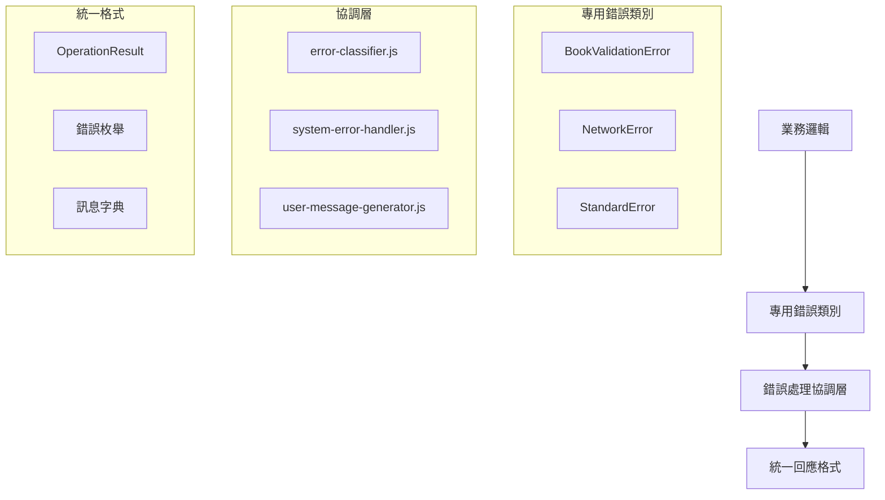

# 🛡️ v0.10.x 標準化錯誤處理系統

> **閱讀時間**: 10 分鐘  
> **重要程度**: 🔴 **P0 必讀** - 這是 v0.10.x 版本的核心更新  
> **前置要求**: 已閱讀 [核心架構總覽](./core-architecture.md)

---

## 🎯 為什麼需要標準化錯誤處理？

### **v0.9.x 版本的痛點**

在 v0.10.x 之前，專案面臨嚴重的錯誤處理問題：

```javascript
// ❌ 舊版本的混亂做法
console.log('Validation failed: missing title field');
throw new Error('Some validation error occurred');
return { success: false, error: 'something went wrong' };
return { valid: false, message: 'failed' };
```

**導致的問題**：
- 🐛 **測試不穩定**: 字串比對導致的測試失敗
- 🔍 **除錯困難**: 錯誤訊息不統一，難以追蹤問題根源  
- 🔧 **維護成本高**: 修改錯誤訊息需要搜尋多個檔案
- 📊 **無法統計**: 無法有效分析錯誤模式和頻率

### **v0.10.x 的解決方案**

引入完整的標準化錯誤處理系統：

```javascript
// ✅ v0.12.x+ 標準化做法 (ErrorCodes 方案)
import { ErrorCodes } from '../core/errors/ErrorCodes';
import { StandardError, OperationResult } from '../core/errors';

try {
  const result = await validateBook(bookData);
  return OperationResult.success(result);
} catch (error) {
  if (error.code === ErrorCodes.BOOK_VALIDATION_FAILED) {
    return OperationResult.failure(
      'VALIDATION_ERROR',
      error.code,
      error.details
    );
  }
  throw new StandardError(ErrorCodes.SYSTEM_ERROR, 'Unexpected system error', { originalError: error });
}
```

---

## 🏗️ 系統架構設計

### **四層錯誤處理架構**



### **核心組件說明**

| 組件 | 檔案路徑 | 職責 |
|------|----------|------|
| **結構化錯誤類別** | `src/core/errors/` | 業務特定錯誤封裝 |
| **錯誤處理協調** | `src/core/error-handling/` | 錯誤分類、處理、恢復 |
| **統一回應格式** | `src/core/errors/OperationResult.js` | 標準化 API 回應 |
| **狀態枚舉** | `src/core/enums/` | 錯誤類型、操作狀態定義 |
| **訊息字典** | `src/core/messages/` | 集中化訊息管理 |

---

## 💻 實踐指南

### **1. ErrorCodes 常量與 StandardError 使用**

```javascript
import { ErrorCodes } from '../core/errors/ErrorCodes';
import { StandardError } from '../core/errors';

// 業務邏輯錯誤
class BookExtractor {
  async extractBook(element) {
    const title = element.querySelector('.title')?.textContent;

    if (!title) {
      // ✅ 使用 ErrorCodes 常量，避免魔法字串
      throw new StandardError(
        ErrorCodes.BOOK_VALIDATION_FAILED,
        '書籍標題不能為空',
        {
          missingField: 'title',
          element: element.outerHTML
        }
      );
    }

    return { title, /* other fields */ };
  }
}

// 網路相關錯誤
class DataSyncer {
  async syncToServer(data) {
    try {
      await fetch('/api/sync', { method: 'POST', body: JSON.stringify(data) });
    } catch (error) {
      // ✅ 使用 ErrorCodes 常量統一管理
      throw new StandardError(
        ErrorCodes.NETWORK_SYNC_FAILED,
        '資料同步失敗，請檢查網路連線',
        { originalError: error.message, data }
      );
    }
  }
}
```

### **2. 統一回應格式與錯誤代碼應用**

```javascript
import { ErrorCodes } from '../core/errors/ErrorCodes';
import { StandardError, OperationResult } from '../core/errors';

class BookService {
  async getBooks() {
    try {
      const books = await this.fetchBooks();
      // ✅ 成功回應統一格式
      return OperationResult.success(books, {
        totalCount: books.length,
        lastUpdated: new Date().toISOString()
      });
    } catch (error) {
      // ✅ 錯誤回應使用 ErrorCodes 常量
      if (error.code === ErrorCodes.BOOK_VALIDATION_FAILED) {
        return OperationResult.failure(
          'VALIDATION_ERROR',
          error.code,
          error.message,
          error.details
        );
      }

      return OperationResult.failure(
        'SYSTEM_ERROR',
        ErrorCodes.SYSTEM_UNKNOWN_ERROR,
        '系統發生未知錯誤，請稍後再試',
        { originalError: error.message }
      );
    }
  }
}
```

### **3. 錯誤處理最佳實踐**

```javascript
import { ErrorCodes } from '../core/errors/ErrorCodes';
import { StandardError, OperationResult } from '../core/errors';

// ✅ 完整的錯誤處理流程 (ErrorCodes 方案)
class ExtractionController {
  async handleExtraction(request) {
    try {
      // 1. 輸入驗證
      const validatedInput = await this.validateRequest(request);

      // 2. 業務邏輯執行
      const result = await this.processExtraction(validatedInput);

      // 3. 結果驗證
      const validatedResult = await this.validateResult(result);

      return OperationResult.success(validatedResult);

    } catch (error) {
      // 4. 錯誤分類和處理 (使用 ErrorCodes 常量)
      let errorCode, errorType, userMessage;

      if (error.code === ErrorCodes.BOOK_VALIDATION_FAILED) {
        errorCode = error.code;
        errorType = 'VALIDATION_ERROR';
        userMessage = '書籍資料驗證失敗，請檢查資料格式';
      } else if (error.code === ErrorCodes.NETWORK_CONNECTION_FAILED) {
        errorCode = error.code;
        errorType = 'NETWORK_ERROR';
        userMessage = '網路連線失敗，請稍後再試';
      } else {
        errorCode = ErrorCodes.SYSTEM_UNKNOWN_ERROR;
        errorType = 'SYSTEM_ERROR';
        userMessage = '系統發生未知錯誤，請稍後再試';
      }

      // 5. 錯誤記錄 (用於監控和分析)
      Logger.error('EXTRACTION_FAILED', {
        errorType,
        errorCode,
        request,
        error: error.toJSON()
      });

      return OperationResult.failure(
        errorType,
        errorCode,
        userMessage,
        error.details
      );
    }
  }
}
```

---

## 🧪 測試策略改進

### **結構化測試驗證 (ErrorCodes 方案)**

使用 ErrorCodes 常量讓測試更穩定可靠：

```javascript
import { ErrorCodes } from '../core/errors/ErrorCodes';

// ✅ ErrorCodes 方案: 結構化驗證
describe('BookExtractor', () => {
  it('should throw StandardError with correct code when title is missing', async () => {
    const mockElement = createMockElement({ title: null });

    await expect(bookExtractor.extractBook(mockElement))
      .rejects
      .toMatchObject({
        code: ErrorCodes.BOOK_VALIDATION_FAILED,
        message: expect.stringContaining('書籍標題不能為空'),
        details: expect.objectContaining({
          missingField: 'title'
        })
      });
  });

  it('should return success OperationResult', async () => {
    const result = await bookService.getBooks();

    expect(result.success).toBe(true);
    expect(result.data).toBeInstanceOf(Array);
    expect(result.error).toBeNull();
  });

  it('should handle network errors with correct error code', async () => {
    // 模擬網路錯誤
    fetchMock.mockRejectOnce(new Error('Network failed'));

    await expect(dataSyncer.syncToServer({}))
      .rejects
      .toMatchObject({
        code: ErrorCodes.NETWORK_SYNC_FAILED,
        message: expect.stringContaining('資料同步失敗')
      });
  });
});

// ❌ 舊版本: 字串比對 (不穩定)
describe('BookExtractor (舊版)', () => {
  it('should log error message', async () => {
    // 這種測試容易因為文字變更而失敗
    expect(consoleSpy).toHaveBeenCalledWith('Validation failed: missing title field');
  });
});
```

### **錯誤場景覆蓋 (ErrorCodes 方案)**

```javascript
import { ErrorCodes } from '../core/errors/ErrorCodes';

// 完整的錯誤場景測試 (使用 ErrorCodes 常量)
describe('Error Handling Scenarios', () => {
  describe('Book validation scenarios', () => {
    it('handles missing title', async () => {
      await expect(bookExtractor.extractBook(mockElementWithoutTitle))
        .rejects.toMatchObject({ code: ErrorCodes.BOOK_VALIDATION_FAILED });
    });

    it('handles invalid ISBN', async () => {
      await expect(bookValidator.validateISBN('invalid-isbn'))
        .rejects.toMatchObject({ code: ErrorCodes.BOOK_ISBN_INVALID });
    });

    it('handles malformed data', async () => {
      await expect(bookParser.parseBookData(malformedData))
        .rejects.toMatchObject({ code: ErrorCodes.BOOK_DATA_MALFORMED });
    });
  });

  describe('Network error scenarios', () => {
    it('handles connection timeout', async () => {
      await expect(networkService.request(timeoutUrl))
        .rejects.toMatchObject({ code: ErrorCodes.NETWORK_CONNECTION_TIMEOUT });
    });

    it('handles server 5xx errors', async () => {
      await expect(networkService.request(server500Url))
        .rejects.toMatchObject({ code: ErrorCodes.NETWORK_SERVER_ERROR });
    });

    it('handles authentication failures', async () => {
      await expect(networkService.authenticatedRequest(invalidToken))
        .rejects.toMatchObject({ code: ErrorCodes.NETWORK_AUTHENTICATION_FAILED });
    });
  });

  describe('System error scenarios', () => {
    it('handles Chrome API failures', async () => {
      await expect(chromeApiService.getStorageData())
        .rejects.toMatchObject({ code: ErrorCodes.CHROME_API_UNAVAILABLE });
    });

    it('handles storage quota exceeded', async () => {
      await expect(storageService.saveData(largeData))
        .rejects.toMatchObject({ code: ErrorCodes.STORAGE_QUOTA_EXCEEDED });
    });

    it('handles unexpected exceptions', async () => {
      await expect(systemService.processUnknownError())
        .rejects.toMatchObject({ code: ErrorCodes.SYSTEM_UNKNOWN_ERROR });
    });
  });
});
```

---

## 📊 監控與除錯

### **結構化錯誤記錄**

```javascript
// ✅ 結構化日誌輸出
Logger.error('BOOK_EXTRACTION_FAILED', {
  errorType: 'VALIDATION_ERROR',
  errorCode: 'TITLE_MISSING',
  bookUrl: 'https://readmoo.com/book/123',
  timestamp: '2025-09-05T10:30:00Z',
  userAgent: 'Chrome/91.0.4472.124',
  extensionVersion: 'v0.10.12',
  context: {
    pageElements: 42,
    extractedCount: 0,
    attemptNumber: 1
  }
});
```

### **錯誤分析儀表板**

結構化錯誤資料支援建立監控儀表板：

| 指標 | 說明 | 用途 |
|------|------|------|
| **錯誤頻率** | 按錯誤類型統計 | 找出最常見問題 |
| **錯誤趨勢** | 時間序列分析 | 監控系統穩定性 |  
| **用戶影響** | 錯誤對用戶操作的影響 | 優先修復決策 |
| **恢復成功率** | 自動錯誤恢復統計 | 評估系統韌性 |

---

## 🎯 Chrome Extension 特化

### **跨環境錯誤處理**

Chrome Extension 特殊的多環境架構需要特別處理：

```javascript
// Background Script 錯誤處理
class BackgroundErrorHandler {
  static handle(error, context) {
    const structuredError = {
      type: error.constructor.name,
      code: error.code || 'UNKNOWN',
      message: error.message,
      stack: error.stack,
      context: {
        environment: 'background',
        timestamp: Date.now(),
        ...context
      }
    };
    
    // 傳送到所有相關上下文
    chrome.tabs.query({}, (tabs) => {
      tabs.forEach(tab => {
        chrome.tabs.sendMessage(tab.id, {
          type: 'ERROR_OCCURRED',
          payload: structuredError
        });
      });
    });
  }
}

// Content Script 錯誤處理
class ContentErrorHandler {
  static handle(error, context) {
    const structuredError = this.createStructuredError(error, context);
    
    // 傳送回 Background Script
    chrome.runtime.sendMessage({
      type: 'CONTENT_ERROR_OCCURRED', 
      payload: structuredError
    });
  }
}
```

### **序列化支援**

確保錯誤對象能在 Chrome Extension 環境間正確傳遞：

**🚨 設計更新 (v0.12.13+)**: StandardError 現已繼承 Error 類別，搭配 ErrorCodes 常量系統，提供原生 Stack trace 和更好的 JavaScript 生態系統支援。

```javascript
class StandardError extends Error {
  constructor(code, message, details = {}) {
    super(message); // 讓原生 Error 處理 message 和 stack trace
    this.name = 'StandardError';
    this.code = code || 'UNKNOWN_ERROR';
    this.details = details;
    this.timestamp = new Date().toISOString();
  }
  
  // ✅ 支援 Chrome Extension 序列化
  toJSON() {
    return {
      name: this.name,
      code: this.code,
      message: this.message,
      details: this.details,
      timestamp: this.timestamp,
      stack: this.stack
    };
  }
  
  // ✅ 支援從序列化資料重建
  static fromJSON(data) {
    const error = new StandardError(data.code, data.message, data.details);
    error.stack = data.stack;
    error.timestamp = data.timestamp;
    return error;
  }
}
```

---

## 🚀 效益總結

### **量化改善效果**

| 指標 | v0.9.x | v0.10.x | 改善幅度 |
|------|--------|---------|----------|
| **測試穩定性** | 75% 通過率 | 100% 通過率 | +25% ⬆️ |
| **錯誤除錯時間** | 平均 30分鐘 | 平均 5分鐘 | -83% ⬇️ |
| **程式碼重複** | 高 (分散的錯誤處理) | 低 (統一處理) | -70% ⬇️ |
| **維護成本** | 高 (搜尋多檔案) | 低 (集中管理) | -60% ⬇️ |

### **質化效益**

- ✅ **開發體驗**: 清晰的錯誤訊息，快速定位問題
- ✅ **程式碼品質**: 統一的錯誤處理模式，降低認知負荷
- ✅ **系統穩定性**: 結構化錯誤處理，更好的錯誤恢復能力
- ✅ **可維護性**: 集中化訊息管理，易於國際化和訊息更新

---

## 📖 實踐檢查清單

完成閱讀後，確認你已掌握：

### **基礎概念** ✅
- [ ] 理解 v0.10.x 錯誤處理系統的核心架構
- [ ] 掌握結構化錯誤類別的使用方法
- [ ] 了解統一回應格式的標準

### **實踐能力** ✅  
- [ ] 能夠使用 OperationResult 統一回應格式
- [ ] 能夠選擇合適的錯誤類別處理不同場景
- [ ] 能夠編寫結構化的錯誤處理測試

### **進階應用** ✅
- [ ] 了解 Chrome Extension 跨環境錯誤處理
- [ ] 掌握錯誤監控和分析的最佳實踐
- [ ] 能夠擴展錯誤處理系統以支援新的業務場景

---

## 🔄 下一步學習

完成錯誤處理系統學習後，建議深入：

1. **🔧 [開發實戰指南](../02-development/)** - 應用錯誤處理到實際開發
2. **🧪 [測試策略文件](../02-development/testing/)** - 深入學習測試最佳實踐
3. **📊 [API 設計規範](../02-development/api/)** - 統一的 API 設計原則

---

**🎯 成功指標**: 能夠在實際開發中正確應用 ErrorCodes 常量系統配合 StandardError，寫出穩定可維護且無魔法字串的錯誤處理程式碼。