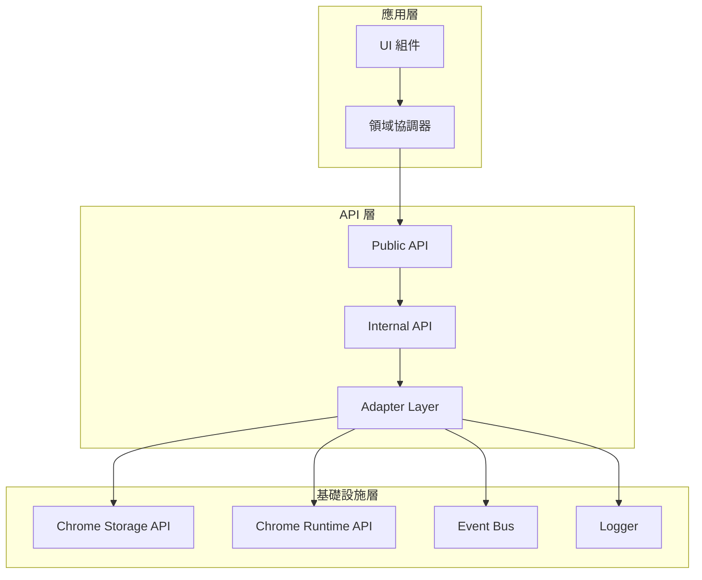

# 📡 內部 API 設計規範

> **閱讀時間**: 15 分鐘  
> **適用對象**: 需要設計 API 或事件介面的開發者  
> **重要程度**: 🟡 P1 重要  
> **前置要求**: 已掌握 [領域設計](../architecture/domain-design.md) 和 [事件系統](../architecture/event-system.md)

---

## 🎯 內部 API 設計理念

### **Readmoo 書庫管理器的 API 需求**

Chrome Extension 的多環境架構需要清晰的內部 API：

```text
API 使用場景：
├── Background ↔ Content Script 通訊
├── 領域間服務調用
├── Chrome Storage API 抽象化
├── 事件總線標準化介面
└── 外部服務整合（未來擴展）
```

**設計原則**：
- 🎯 **一致性**: 統一的介面格式和錯誤處理
- 🔒 **型別安全**: 明確的輸入輸出型別定義
- 📊 **可觀測**: 完整的日誌和監控支援
- 🧪 **可測試**: 易於 Mock 和自動化測試
- 🔄 **向後相容**: 版本變更不破壞現有調用

---

## 🏗️ API 架構設計

### **分層 API 架構**



### **統一 API 回應格式**

```javascript
// OperationResult.js - 標準化回應格式
class OperationResult {
  constructor(success, data = null, error = null, metadata = {}) {
    this.success = success;
    this.data = data;
    this.error = error;
    this.metadata = {
      timestamp: new Date().toISOString(),
      version: 'v1.0',
      ...metadata
    };
  }
  
  static success(data, metadata = {}) {
    return new OperationResult(true, data, null, metadata);
  }
  
  static failure(errorType, errorCode, message, details = {}) {
    const error = {
      type: errorType,
      code: errorCode,
      message,
      details,
      timestamp: new Date().toISOString()
    };
    
    return new OperationResult(false, null, error);
  }
  
  static fromPromise(promise) {
    return promise
      .then(data => OperationResult.success(data))
      .catch(error => OperationResult.failure(
        error.type || 'SYSTEM_ERROR',
        error.code || 'UNKNOWN_ERROR',
        error.message || '發生未知錯誤',
        error.details || {}
      ));
  }
  
  // 鏈式操作支援
  map(transformer) {
    if (!this.success) return this;
    
    try {
      const transformedData = transformer(this.data);
      return OperationResult.success(transformedData, this.metadata);
    } catch (error) {
      return OperationResult.failure(
        'TRANSFORMATION_ERROR',
        'DATA_TRANSFORMATION_FAILED',
        '資料轉換失敗',
        { originalData: this.data, error: error.message }
      );
    }
  }
  
  flatMap(asyncTransformer) {
    if (!this.success) return Promise.resolve(this);
    
    try {
      return asyncTransformer(this.data);
    } catch (error) {
      return Promise.resolve(OperationResult.failure(
        'TRANSFORMATION_ERROR',
        'ASYNC_TRANSFORMATION_FAILED', 
        '異步轉換失敗',
        { originalData: this.data, error: error.message }
      ));
    }
  }
}
```

---

## 🔧 領域服務 API 設計

### **標準服務介面模式**

```javascript
// 標準服務介面定義
class BaseService {
  constructor(dependencies) {
    this.logger = dependencies.logger;
    this.eventBus = dependencies.eventBus;
    this.config = dependencies.config || {};
  }
  
  // 標準化的服務方法簽名
  async execute(operation, payload, options = {}) {
    const operationId = generateId();
    const startTime = performance.now();
    
    try {
      // 前置驗證
      await this.validateInput(operation, payload);
      
      // 記錄開始
      this.logger.info(`${this.constructor.name}.${operation}.STARTED`, {
        operationId,
        payload: this.sanitizePayload(payload),
        options
      });
      
      // 執行業務邏輯
      const result = await this.performOperation(operation, payload, options);
      
      // 記錄完成
      const duration = performance.now() - startTime;
      this.logger.info(`${this.constructor.name}.${operation}.COMPLETED`, {
        operationId,
        duration,
        resultSize: JSON.stringify(result).length
      });
      
      return OperationResult.success(result, {
        operationId,
        duration,
        service: this.constructor.name,
        operation
      });
      
    } catch (error) {
      const duration = performance.now() - startTime;
      this.logger.error(`${this.constructor.name}.${operation}.FAILED`, {
        operationId,
        duration,
        error: error.toJSON ? error.toJSON() : error.message
      });
      
      if (error instanceof BusinessError) {
        return OperationResult.failure(
          error.type,
          error.code,
          error.message,
          error.details
        );
      }
      
      throw new SystemError(
        'SERVICE_EXECUTION_FAILED',
        `服務執行失敗: ${this.constructor.name}.${operation}`,
        { operationId, originalError: error }
      );
    }
  }
  
  // 抽象方法，由子類實現
  async validateInput(operation, payload) {
    throw new Error('validateInput must be implemented by subclass');
  }
  
  async performOperation(operation, payload, options) {
    throw new Error('performOperation must be implemented by subclass');
  }
  
  // 工具方法
  sanitizePayload(payload) {
    // 移除敏感資訊用於日誌記錄
    const sanitized = { ...payload };
    delete sanitized.password;
    delete sanitized.token;
    return sanitized;
  }
}
```

### **領域服務實際範例**

```javascript
// BookValidationService.js - 書籍驗證服務
class BookValidationService extends BaseService {
  constructor(dependencies) {
    super(dependencies);
    this.validationRules = dependencies.validationRules;
  }
  
  async validateInput(operation, payload) {
    const operationSchema = {
      'validateSingle': {
        book: 'object',
        options: 'object?'
      },
      'validateBatch': {
        books: 'array',
        batchSize: 'number?',
        options: 'object?'
      }
    };
    
    const schema = operationSchema[operation];
    if (!schema) {
      throw new ValidationError(
        'INVALID_OPERATION',
        `不支援的操作: ${operation}`
      );
    }
    
    // 這裡可以使用 JSON Schema 或其他驗證庫
    this.validatePayloadSchema(payload, schema);
  }
  
  async performOperation(operation, payload, options) {
    switch (operation) {
      case 'validateSingle':
        return this.validateSingleBook(payload.book, payload.options);
        
      case 'validateBatch':
        return this.validateBookBatch(
          payload.books, 
          payload.batchSize || 50,
          payload.options
        );
        
      default:
        throw new ValidationError(
          'OPERATION_NOT_SUPPORTED',
          `操作不支援: ${operation}`
        );
    }
  }
  
  async validateSingleBook(book, options = {}) {
    const validationChain = [
      this.validateRequiredFields,
      this.validateTitle,
      this.validateAuthor,
      this.validateISBN,
      this.validatePrice,
      options.strict ? this.validateAllFields : null
    ].filter(Boolean);
    
    let validatedBook = { ...book };
    
    for (const validator of validationChain) {
      validatedBook = await validator.call(this, validatedBook, options);
    }
    
    return this.addValidationMetadata(validatedBook);
  }
  
  async validateBookBatch(books, batchSize, options = {}) {
    const batches = this.createBatches(books, batchSize);
    const results = [];
    const errors = [];
    
    for (const [batchIndex, batch] of batches.entries()) {
      try {
        const batchResults = await Promise.allSettled(
          batch.map(book => this.validateSingleBook(book, options))
        );
        
        batchResults.forEach((result, index) => {
          if (result.status === 'fulfilled') {
            results.push(result.value);
          } else {
            errors.push({
              bookIndex: batchIndex * batchSize + index,
              book: batch[index],
              error: result.reason
            });
          }
        });
        
        // 發送批次進度事件
        await this.eventBus.emit('VALIDATION.BATCH.COMPLETED', {
          batchIndex,
          batchSize: batch.length,
          totalBatches: batches.length,
          progress: ((batchIndex + 1) / batches.length * 100).toFixed(2)
        });
        
      } catch (error) {
        throw new ValidationError(
          'BATCH_VALIDATION_FAILED',
          `批次驗證失敗: batch ${batchIndex}`,
          { batchIndex, error }
        );
      }
    }
    
    return {
      validBooks: results,
      invalidBooks: errors,
      summary: {
        total: books.length,
        valid: results.length,
        invalid: errors.length,
        validationRate: (results.length / books.length * 100).toFixed(2)
      }
    };
  }
  
  // 私有方法
  validateRequiredFields(book) {
    const requiredFields = ['title', 'author'];
    const missingFields = requiredFields.filter(field => !book[field]);
    
    if (missingFields.length > 0) {
      throw new BookValidationError(
        'REQUIRED_FIELDS_MISSING',
        `缺少必填欄位: ${missingFields.join(', ')}`,
        { missingFields, book }
      );
    }
    
    return book;
  }
  
  addValidationMetadata(book) {
    return {
      ...book,
      _validation: {
        validatedAt: new Date().toISOString(),
        validationVersion: '1.0',
        service: 'BookValidationService'
      }
    };
  }
}
```

---

## 🔌 儲存抽象化 API

### **Chrome Storage 抽象層**

```javascript
// StorageAdapter.js - Chrome Storage API 抽象化
class StorageAdapter {
  constructor(dependencies = {}) {
    this.logger = dependencies.logger;
    this.encryption = dependencies.encryption;
    this.storageArea = dependencies.storageArea || chrome.storage.local;
    this.keyPrefix = dependencies.keyPrefix || 'readmoo_';
    
    // 儲存配額管理
    this.quotaManager = new StorageQuotaManager();
  }
  
  // 統一的存取介面
  async get(key, defaultValue = null) {
    const fullKey = this.getFullKey(key);
    
    try {
      const result = await this.chromeStorageGet(fullKey);
      const value = result[fullKey];
      
      if (value === undefined) {
        return defaultValue;
      }
      
      // 解密（如果啟用）
      const decryptedValue = this.encryption 
        ? await this.encryption.decrypt(value)
        : value;
      
      this.logger.debug('STORAGE.GET.SUCCESS', {
        key: fullKey,
        hasValue: value !== undefined,
        valueSize: JSON.stringify(value).length
      });
      
      return decryptedValue;
      
    } catch (error) {
      this.logger.error('STORAGE.GET.FAILED', {
        key: fullKey,
        error: error.message
      });
      
      throw new StorageError(
        'STORAGE_GET_FAILED',
        `讀取資料失敗: ${key}`,
        { key, error }
      );
    }
  }
  
  async set(key, value) {
    const fullKey = this.getFullKey(key);
    
    try {
      // 檢查配額
      await this.quotaManager.checkQuota(key, value);
      
      // 加密（如果啟用）
      const encryptedValue = this.encryption 
        ? await this.encryption.encrypt(value)
        : value;
      
      await this.chromeStorageSet({
        [fullKey]: encryptedValue
      });
      
      this.logger.debug('STORAGE.SET.SUCCESS', {
        key: fullKey,
        valueSize: JSON.stringify(value).length
      });
      
      return OperationResult.success({ key, size: JSON.stringify(value).length });
      
    } catch (error) {
      if (error.message && error.message.includes('QUOTA_EXCEEDED')) {
        // 嘗試清理舊資料
        await this.quotaManager.cleanup();
        
        // 重試一次
        try {
          await this.chromeStorageSet({
            [fullKey]: this.encryption 
              ? await this.encryption.encrypt(value)
              : value
          });
          
          return OperationResult.success({ key, size: JSON.stringify(value).length });
          
        } catch (retryError) {
          throw new StorageError(
            'STORAGE_QUOTA_EXCEEDED',
            '儲存空間不足，請清理資料',
            { key, error: retryError }
          );
        }
      }
      
      this.logger.error('STORAGE.SET.FAILED', {
        key: fullKey,
        error: error.message
      });
      
      throw new StorageError(
        'STORAGE_SET_FAILED',
        `儲存資料失敗: ${key}`,
        { key, error }
      );
    }
  }
  
  async remove(key) {
    const fullKey = this.getFullKey(key);
    
    try {
      await this.chromeStorageRemove(fullKey);
      
      this.logger.debug('STORAGE.REMOVE.SUCCESS', {
        key: fullKey
      });
      
      return OperationResult.success({ key });
      
    } catch (error) {
      this.logger.error('STORAGE.REMOVE.FAILED', {
        key: fullKey,
        error: error.message
      });
      
      throw new StorageError(
        'STORAGE_REMOVE_FAILED',
        `刪除資料失敗: ${key}`,
        { key, error }
      );
    }
  }
  
  // 批量操作
  async getBatch(keys) {
    const fullKeys = keys.map(key => this.getFullKey(key));
    
    try {
      const result = await this.chromeStorageGet(fullKeys);
      const batch = {};
      
      for (const key of keys) {
        const fullKey = this.getFullKey(key);
        const value = result[fullKey];
        
        batch[key] = value !== undefined 
          ? (this.encryption ? await this.encryption.decrypt(value) : value)
          : null;
      }
      
      return OperationResult.success(batch);
      
    } catch (error) {
      throw new StorageError(
        'STORAGE_BATCH_GET_FAILED',
        '批量讀取資料失敗',
        { keys, error }
      );
    }
  }
  
  async setBatch(dataMap) {
    const encryptedData = {};
    
    try {
      for (const [key, value] of Object.entries(dataMap)) {
        const fullKey = this.getFullKey(key);
        encryptedData[fullKey] = this.encryption 
          ? await this.encryption.encrypt(value)
          : value;
      }
      
      await this.chromeStorageSet(encryptedData);
      
      return OperationResult.success({ 
        count: Object.keys(dataMap).length,
        totalSize: JSON.stringify(encryptedData).length
      });
      
    } catch (error) {
      throw new StorageError(
        'STORAGE_BATCH_SET_FAILED',
        '批量儲存資料失敗',
        { dataMap, error }
      );
    }
  }
  
  // Promise 化的 Chrome Storage API
  chromeStorageGet(keys) {
    return new Promise((resolve, reject) => {
      this.storageArea.get(keys, result => {
        if (chrome.runtime.lastError) {
          reject(new Error(chrome.runtime.lastError.message));
        } else {
          resolve(result);
        }
      });
    });
  }
  
  chromeStorageSet(data) {
    return new Promise((resolve, reject) => {
      this.storageArea.set(data, () => {
        if (chrome.runtime.lastError) {
          reject(new Error(chrome.runtime.lastError.message));
        } else {
          resolve();
        }
      });
    });
  }
  
  chromeStorageRemove(keys) {
    return new Promise((resolve, reject) => {
      this.storageArea.remove(keys, () => {
        if (chrome.runtime.lastError) {
          reject(new Error(chrome.runtime.lastError.message));
        } else {
          resolve();
        }
      });
    });
  }
  
  getFullKey(key) {
    return `${this.keyPrefix}${key}`;
  }
}
```

### **Repository 模式實現**

```javascript
// BookRepository.js - 書籍資料存取抽象
class BookRepository {
  constructor(dependencies) {
    this.storageAdapter = dependencies.storageAdapter;
    this.logger = dependencies.logger;
    this.cacheManager = dependencies.cacheManager;
    
    // 資料表結構定義
    this.schema = {
      books: 'books_data',
      metadata: 'books_metadata',
      index: 'books_index'
    };
  }
  
  // CRUD 操作
  async saveBooks(books) {
    try {
      const timestamp = new Date().toISOString();
      const booksWithMeta = books.map(book => ({
        ...book,
        id: book.id || generateId(),
        savedAt: timestamp,
        version: '1.0'
      }));
      
      // 批量儲存
      const batchData = {
        [this.schema.books]: booksWithMeta,
        [this.schema.metadata]: {
          totalCount: booksWithMeta.length,
          lastUpdated: timestamp,
          version: '1.0'
        }
      };
      
      const result = await this.storageAdapter.setBatch(batchData);
      
      // 更新快取
      await this.cacheManager.invalidate('books');
      
      // 更新索引
      await this.updateIndex(booksWithMeta);
      
      return OperationResult.success(booksWithMeta, {
        savedCount: booksWithMeta.length,
        totalSize: result.data.totalSize
      });
      
    } catch (error) {
      throw new RepositoryError(
        'BOOKS_SAVE_FAILED',
        '書籍資料儲存失敗',
        { bookCount: books.length, error }
      );
    }
  }
  
  async findBooks(query = {}) {
    try {
      // 檢查快取
      const cacheKey = `books_query_${JSON.stringify(query)}`;
      const cachedResult = await this.cacheManager.get(cacheKey);
      
      if (cachedResult) {
        return OperationResult.success(cachedResult, { fromCache: true });
      }
      
      // 從儲存讀取
      const allBooks = await this.storageAdapter.get(this.schema.books, []);
      
      // 應用查詢條件
      const filteredBooks = this.applyQuery(allBooks, query);
      
      // 更新快取
      await this.cacheManager.set(cacheKey, filteredBooks, { ttl: 300000 }); // 5分鐘
      
      return OperationResult.success(filteredBooks, {
        totalCount: allBooks.length,
        filteredCount: filteredBooks.length,
        fromCache: false
      });
      
    } catch (error) {
      throw new RepositoryError(
        'BOOKS_QUERY_FAILED',
        '書籍查詢失敗',
        { query, error }
      );
    }
  }
  
  async findBookById(id) {
    try {
      const allBooks = await this.storageAdapter.get(this.schema.books, []);
      const book = allBooks.find(book => book.id === id);
      
      if (!book) {
        return OperationResult.failure(
          'BOOK_NOT_FOUND',
          'BOOK_NOT_FOUND',
          `找不到指定的書籍: ${id}`,
          { id }
        );
      }
      
      return OperationResult.success(book);
      
    } catch (error) {
      throw new RepositoryError(
        'BOOK_FIND_BY_ID_FAILED',
        `查找書籍失敗: ${id}`,
        { id, error }
      );
    }
  }
  
  async updateBook(id, updates) {
    try {
      const allBooks = await this.storageAdapter.get(this.schema.books, []);
      const bookIndex = allBooks.findIndex(book => book.id === id);
      
      if (bookIndex === -1) {
        return OperationResult.failure(
          'BOOK_NOT_FOUND',
          'BOOK_NOT_FOUND',
          `找不到要更新的書籍: ${id}`,
          { id }
        );
      }
      
      // 更新書籍
      const updatedBook = {
        ...allBooks[bookIndex],
        ...updates,
        updatedAt: new Date().toISOString()
      };
      
      allBooks[bookIndex] = updatedBook;
      
      // 儲存更新
      await this.storageAdapter.set(this.schema.books, allBooks);
      
      // 清理快取
      await this.cacheManager.invalidate('books');
      
      return OperationResult.success(updatedBook);
      
    } catch (error) {
      throw new RepositoryError(
        'BOOK_UPDATE_FAILED',
        `更新書籍失敗: ${id}`,
        { id, updates, error }
      );
    }
  }
  
  async deleteBook(id) {
    try {
      const allBooks = await this.storageAdapter.get(this.schema.books, []);
      const filteredBooks = allBooks.filter(book => book.id !== id);
      
      if (filteredBooks.length === allBooks.length) {
        return OperationResult.failure(
          'BOOK_NOT_FOUND',
          'BOOK_NOT_FOUND',
          `找不到要刪除的書籍: ${id}`,
          { id }
        );
      }
      
      // 儲存更新
      await this.storageAdapter.set(this.schema.books, filteredBooks);
      
      // 清理快取
      await this.cacheManager.invalidate('books');
      
      return OperationResult.success({ deletedId: id });
      
    } catch (error) {
      throw new RepositoryError(
        'BOOK_DELETE_FAILED',
        `刪除書籍失敗: ${id}`,
        { id, error }
      );
    }
  }
  
  // 查詢條件應用
  applyQuery(books, query) {
    let filtered = [...books];
    
    // 文字搜尋
    if (query.search) {
      const searchLower = query.search.toLowerCase();
      filtered = filtered.filter(book =>
        book.title.toLowerCase().includes(searchLower) ||
        book.author.toLowerCase().includes(searchLower)
      );
    }
    
    // 價格範圍
    if (query.priceMin !== undefined) {
      filtered = filtered.filter(book => book.price >= query.priceMin);
    }
    if (query.priceMax !== undefined) {
      filtered = filtered.filter(book => book.price <= query.priceMax);
    }
    
    // 排序
    if (query.sortBy) {
      const { field, order = 'asc' } = query.sortBy;
      filtered.sort((a, b) => {
        const aVal = a[field];
        const bVal = b[field];
        
        if (aVal < bVal) return order === 'asc' ? -1 : 1;
        if (aVal > bVal) return order === 'asc' ? 1 : -1;
        return 0;
      });
    }
    
    // 分頁
    if (query.limit) {
      const offset = query.offset || 0;
      filtered = filtered.slice(offset, offset + query.limit);
    }
    
    return filtered;
  }
  
  // 索引管理
  async updateIndex(books) {
    try {
      const index = {
        byTitle: this.createTitleIndex(books),
        byAuthor: this.createAuthorIndex(books),
        byPrice: this.createPriceIndex(books),
        updatedAt: new Date().toISOString()
      };
      
      await this.storageAdapter.set(this.schema.index, index);
      
    } catch (error) {
      this.logger.warn('INDEX_UPDATE_FAILED', {
        error: error.message
      });
      // 索引更新失敗不應該影響主要功能
    }
  }
}
```

---

## 🧪 API 測試策略

### **單元測試範例**

```javascript
// BookValidationService.test.js
describe('BookValidationService', () => {
  let service;
  let mockDependencies;
  
  beforeEach(() => {
    mockDependencies = {
      logger: createMockLogger(),
      eventBus: createMockEventBus(),
      validationRules: {
        maxTitleLength: 200,
        maxAuthorLength: 100
      }
    };
    
    service = new BookValidationService(mockDependencies);
  });
  
  describe('execute API', () => {
    it('should validate single book successfully', async () => {
      // Arrange
      const payload = {
        book: {
          title: 'JavaScript 權威指南',
          author: 'David Flanagan',
          isbn: '9787115275790',
          price: 580
        }
      };
      
      // Act
      const result = await service.execute('validateSingle', payload);
      
      // Assert
      expect(result.success).toBe(true);
      expect(result.data).toEqual(
        expect.objectContaining({
          title: payload.book.title,
          author: payload.book.author,
          _validation: expect.objectContaining({
            validatedAt: expect.any(String),
            service: 'BookValidationService'
          })
        })
      );
      
      expect(result.metadata).toEqual(
        expect.objectContaining({
          operationId: expect.any(String),
          duration: expect.any(Number),
          service: 'BookValidationService',
          operation: 'validateSingle'
        })
      );
    });
    
    it('should handle validation errors properly', async () => {
      // Arrange
      const payload = {
        book: {
          title: '', // 無效標題
          author: 'Test Author'
        }
      };
      
      // Act
      const result = await service.execute('validateSingle', payload);
      
      // Assert
      expect(result.success).toBe(false);
      expect(result.error).toEqual(
        expect.objectContaining({
          type: 'VALIDATION_ERROR',
          code: 'REQUIRED_FIELDS_MISSING',
          message: expect.stringContaining('缺少必填欄位')
        })
      );
    });
    
    it('should reject invalid operations', async () => {
      // Act & Assert
      await expect(
        service.execute('invalidOperation', {})
      ).rejects.toThrow('操作不支援: invalidOperation');
    });
  });
  
  describe('batch validation', () => {
    it('should process batch with progress events', async () => {
      // Arrange
      const books = Array.from({ length: 150 }, (_, i) => ({
        title: `Book ${i + 1}`,
        author: `Author ${i + 1}`,
        isbn: `97812345678${String(i).padStart(2, '0')}`
      }));
      
      const payload = {
        books,
        batchSize: 50
      };
      
      // Act
      const result = await service.execute('validateBatch', payload);
      
      // Assert
      expect(result.success).toBe(true);
      expect(result.data.validBooks).toHaveLength(150);
      expect(result.data.summary.validationRate).toBe('100.00');
      
      // 驗證進度事件
      expect(mockDependencies.eventBus.emit).toHaveBeenCalledWith(
        'VALIDATION.BATCH.COMPLETED',
        expect.objectContaining({
          batchIndex: 0,
          progress: expect.any(String)
        })
      );
    });
  });
});
```

### **整合測試範例**

```javascript
// StorageAdapter.integration.test.js
describe('StorageAdapter Integration', () => {
  let adapter;
  let mockChrome;
  
  beforeEach(() => {
    // 模擬 Chrome Storage API
    mockChrome = {
      storage: {
        local: {
          get: jest.fn(),
          set: jest.fn(),
          remove: jest.fn()
        }
      },
      runtime: {
        lastError: null
      }
    };
    
    global.chrome = mockChrome;
    
    adapter = new StorageAdapter({
      logger: createMockLogger(),
      keyPrefix: 'test_'
    });
  });
  
  it('should handle Chrome Storage API integration', async () => {
    // Arrange
    const testData = { books: [{ id: 1, title: 'Test Book' }] };
    
    mockChrome.storage.local.set.mockImplementation((data, callback) => {
      setTimeout(() => callback(), 0);
    });
    
    mockChrome.storage.local.get.mockImplementation((keys, callback) => {
      setTimeout(() => callback({ 'test_books': testData }), 0);
    });
    
    // Act - 儲存資料
    const saveResult = await adapter.set('books', testData);
    
    // Assert
    expect(saveResult.success).toBe(true);
    expect(mockChrome.storage.local.set).toHaveBeenCalledWith(
      { 'test_books': testData },
      expect.any(Function)
    );
    
    // Act - 讀取資料
    const retrievedData = await adapter.get('books');
    
    // Assert
    expect(retrievedData).toEqual(testData);
    expect(mockChrome.storage.local.get).toHaveBeenCalledWith(
      'test_books',
      expect.any(Function)
    );
  });
  
  it('should handle storage quota exceeded error', async () => {
    // Arrange
    const largeData = { books: new Array(10000).fill({ title: 'Large Dataset' }) };
    
    mockChrome.storage.local.set.mockImplementation((data, callback) => {
      mockChrome.runtime.lastError = { message: 'QUOTA_EXCEEDED_ERR' };
      setTimeout(() => callback(), 0);
    });
    
    // Act & Assert
    await expect(adapter.set('books', largeData))
      .rejects
      .toThrow('STORAGE_QUOTA_EXCEEDED');
  });
});
```

---

## 📊 API 監控與分析

### **API 效能監控**

```javascript
// APIMonitor.js - API 調用監控
class APIMonitor {
  constructor() {
    this.metrics = new Map();
    this.alertThresholds = {
      slowRequest: 1000,      // 1秒
      highErrorRate: 0.05,    // 5%
      highMemoryUsage: 50 * 1024 * 1024  // 50MB
    };
  }
  
  recordAPICall(service, operation, duration, success, error = null) {
    const key = `${service}.${operation}`;
    
    if (!this.metrics.has(key)) {
      this.metrics.set(key, {
        totalCalls: 0,
        successfulCalls: 0,
        failedCalls: 0,
        totalDuration: 0,
        averageDuration: 0,
        maxDuration: 0,
        minDuration: Infinity,
        recentErrors: []
      });
    }
    
    const metric = this.metrics.get(key);
    metric.totalCalls++;
    
    if (success) {
      metric.successfulCalls++;
    } else {
      metric.failedCalls++;
      metric.recentErrors.push({
        timestamp: new Date().toISOString(),
        error: error ? error.message : 'Unknown error'
      });
      
      // 保持最近的 10 個錯誤
      if (metric.recentErrors.length > 10) {
        metric.recentErrors.shift();
      }
    }
    
    metric.totalDuration += duration;
    metric.averageDuration = metric.totalDuration / metric.totalCalls;
    metric.maxDuration = Math.max(metric.maxDuration, duration);
    metric.minDuration = Math.min(metric.minDuration, duration);
    
    // 檢查警報條件
    this.checkAlerts(key, metric, duration, success);
  }
  
  checkAlerts(apiKey, metric, duration, success) {
    const errorRate = metric.failedCalls / metric.totalCalls;
    
    // 慢請求警報
    if (duration > this.alertThresholds.slowRequest) {
      console.warn(`🐌 API 請求過慢: ${apiKey} - ${duration}ms`);
    }
    
    // 高錯誤率警報
    if (metric.totalCalls >= 10 && errorRate > this.alertThresholds.highErrorRate) {
      console.warn(`⚠️ API 錯誤率過高: ${apiKey} - ${(errorRate * 100).toFixed(2)}%`);
    }
    
    // 效能趨勢警報
    if (metric.averageDuration > this.alertThresholds.slowRequest * 0.8) {
      console.warn(`📈 API 平均響應時間趨慢: ${apiKey} - ${metric.averageDuration.toFixed(2)}ms`);
    }
  }
  
  generateReport() {
    const report = {
      timestamp: new Date().toISOString(),
      totalAPIs: this.metrics.size,
      apiMetrics: {}
    };
    
    this.metrics.forEach((metric, apiKey) => {
      const successRate = metric.successfulCalls / metric.totalCalls;
      const errorRate = metric.failedCalls / metric.totalCalls;
      
      report.apiMetrics[apiKey] = {
        ...metric,
        successRate: (successRate * 100).toFixed(2) + '%',
        errorRate: (errorRate * 100).toFixed(2) + '%',
        healthStatus: this.calculateHealthStatus(metric)
      };
    });
    
    return report;
  }
  
  calculateHealthStatus(metric) {
    const successRate = metric.successfulCalls / metric.totalCalls;
    const avgDuration = metric.averageDuration;
    
    if (successRate >= 0.99 && avgDuration < 200) return 'EXCELLENT';
    if (successRate >= 0.95 && avgDuration < 500) return 'GOOD';  
    if (successRate >= 0.90 && avgDuration < 1000) return 'FAIR';
    return 'POOR';
  }
}

// 全域監控實例
const apiMonitor = new APIMonitor();

// 在 BaseService 中整合監控
class BaseService {
  async execute(operation, payload, options = {}) {
    const startTime = performance.now();
    let success = false;
    let error = null;
    
    try {
      const result = await this.performOperation(operation, payload, options);
      success = true;
      return result;
    } catch (err) {
      success = false;
      error = err;
      throw err;
    } finally {
      const duration = performance.now() - startTime;
      apiMonitor.recordAPICall(
        this.constructor.name,
        operation,
        duration,
        success,
        error
      );
    }
  }
}
```

---

## 🚀 API 設計最佳實踐

### **設計原則檢查清單**
- [ ] **統一回應格式**: 所有 API 都使用 OperationResult 格式
- [ ] **完整錯誤處理**: 區分業務錯誤和系統錯誤，提供詳細資訊
- [ ] **輸入驗證**: 所有輸入都經過嚴格驗證和消毒
- [ ] **日誌記錄**: 關鍵操作都有適當的日誌記錄

### **效能優化策略**
- [ ] **批量操作**: 支援批量處理減少 API 調用次數
- [ ] **快取機制**: 適當使用快取減少重複計算
- [ ] **異步處理**: 長時間操作使用異步模式
- [ ] **配額管理**: Chrome Storage 使用配額管理避免超限

### **可測試性保證**
- [ ] **依賴注入**: 所有外部依賴都可以注入和替換
- [ ] **Mock 友善**: 介面設計便於 Mock 和測試
- [ ] **錯誤模擬**: 支援錯誤情況的模擬測試
- [ ] **監控整合**: 內建效能監控和健康檢查

---

## 🎯 實踐檢查清單

### **API 設計完整性**
- [ ] 所有 API 都遵循統一的介面格式
- [ ] 錯誤處理覆蓋業務邏輯和系統異常
- [ ] 輸入驗證包含格式、範圍、安全性檢查
- [ ] 回應格式包含必要的元資料和追蹤資訊

### **Chrome Extension 適配**
- [ ] Storage API 抽象化處理配額和錯誤
- [ ] 跨環境通訊支援序列化和錯誤恢復
- [ ] 權限使用最小化，避免不必要的 API 調用
- [ ] 效能考量適合 Extension 環境限制

### **監控和維護**
- [ ] API 調用有完整的監控和分析
- [ ] 效能指標包含響應時間、成功率、錯誤分布
- [ ] 警報機制涵蓋慢請求、高錯誤率、資源使用
- [ ] 定期回顧 API 使用情況並優化設計

---

## 🔄 下一步學習

掌握內部 API 設計後，建議深入學習：

1. **📡 [事件接口規範](./event-interfaces.md)** - 事件驅動的 API 設計
2. **📊 [資料格式標準](./data-formats.md)** - JSON Schema 和資料驗證  
3. **🚑 [常見問題手冊](../../03-reference/troubleshooting/common-issues.md)** - API 相關問題排查

---

**🎯 學習成果驗證**: 能夠設計一致的內部 API 介面，實現完整的錯誤處理和監控，並編寫相應的測試用例。