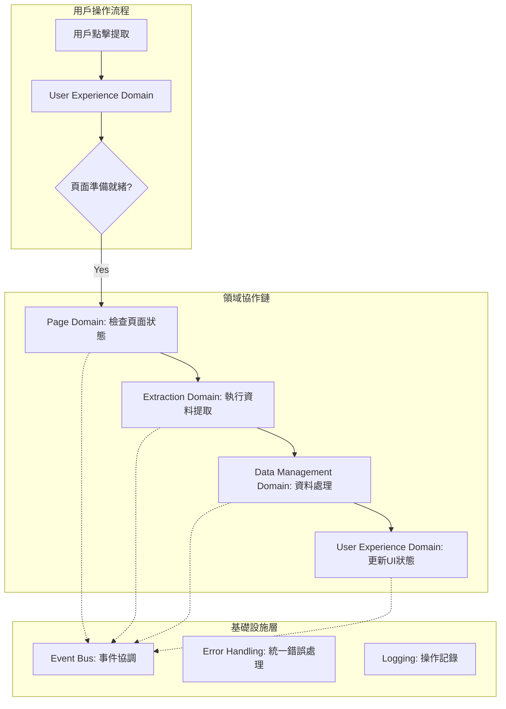

# 🏗️ 領域驅動設計實踐指南

> **閱讀時間**: 20 分鐘  
> **適用對象**: 所有開發者  
> **重要程度**: 🔴 P0 必讀  
> **前置要求**: 已完成 [第一層核心文件](../../01-getting-started/)

---

## 🎯 DDD 在 Readmoo 書庫管理器中的實踐

### **為什麼選擇 DDD？**

Readmoo 書庫管理器雖然是 Chrome Extension，但業務邏輯複雜度已達到需要架構管理的程度：

- **多重責任**: 頁面管理、資料提取、儲存同步、使用者體驗、平台適配
- **擴展需求**: 未來支援多平台（博客來、Kindle 等）
- **品質要求**: 高可靠性、易維護、可測試

**DDD 解決的核心問題**：
```
傳統做法 → 所有功能混在一起 → 難以維護和擴展
DDD 做法 → 按業務領域分離關注點 → 清晰的責任邊界
```

---

## 🧩 七大領域架構詳解

### **領域職責矩陣**

| 領域 | 核心職責 | 關鍵類別 | 對外接口 |
|------|----------|----------|----------|
| **📄 Page Domain** | 頁面狀態管理 | `PageStateManager`, `ContentScriptCoordinator` | 頁面檢測、Tab 管理 |
| **💾 Data Management** | 資料生命週期 | `DataValidator`, `DataNormalizer`, `SyncManager` | 資料CRUD、去重、同步 |
| **🌐 Platform** | 平台抽象化 | `PlatformDetector`, `AdapterFactory` | 平台檢測、適配器管理 |
| **⚙️ System** | 系統層服務 | `LifecycleManager`, `HealthMonitor` | Extension 生命週期 |
| **🎨 User Experience** | 使用者交互 | `UICoordinator`, `NotificationManager` | UI 狀態、通知管理 |
| **🔍 Extraction** | 資料提取 | `BookExtractor`, `DataQualityController` | DOM 解析、資料提取 |
| **💬 Messaging** | 跨環境通訊 | `MessageRouter`, `ContextBridge` | 訊息路由、優先級管理 |

### **領域邊界設計原則**

```javascript
// ✅ 正確的領域邊界設計
class DataManagementDomainCoordinator {
  constructor(dependencies) {
    // 只依賴於抽象接口，不依賴具體實現
    this.storageService = dependencies.storageService; // 抽象
    this.eventBus = dependencies.eventBus; // 基礎設施
    this.logger = dependencies.logger; // 共用服務
  }
  
  async processBookData(rawData) {
    // 1. 領域內的業務邏輯
    const validatedData = await this.validateBooks(rawData);
    const normalizedData = await this.normalizeBooks(validatedData);
    
    // 2. 通過事件與其他領域協作
    this.eventBus.emit('DATA_MANAGEMENT.BOOKS.PROCESSED', {
      data: normalizedData,
      count: normalizedData.length
    });
    
    return OperationResult.success(normalizedData);
  }
  
  // ❌ 錯誤：直接調用其他領域的具體實現
  // await ExtractionDomainCoordinator.extractBooks(); // 違反領域邊界
}
```

---

## 🔗 領域間協作模式

### **事件驅動的協作機制**



### **典型協作場景實現**

```javascript
// 場景：書籍資料提取完整流程
class BookExtractionWorkflow {
  async execute() {
    try {
      // Phase 1: 頁面準備檢查
      const pageReady = await this.eventBus.request(
        'PAGE.STATUS.CHECK_READY', 
        { url: window.location.href }
      );
      
      if (!pageReady.success) {
        return OperationResult.failure(
          'PAGE_NOT_READY', 
          pageReady.error.code,
          '頁面尚未準備就緒，請稍後重試'
        );
      }
      
      // Phase 2: 資料提取執行
      const extractionResult = await this.eventBus.request(
        'EXTRACTION.BOOKS.EXTRACT',
        { selector: '.book-item', quality: 'high' }
      );
      
      // Phase 3: 資料處理和驗證
      const processingResult = await this.eventBus.request(
        'DATA_MANAGEMENT.BOOKS.PROCESS',
        { rawData: extractionResult.data }
      );
      
      // Phase 4: 使用者體驗更新
      await this.eventBus.emit('UX.EXTRACTION.COMPLETED', {
        bookCount: processingResult.data.length,
        timestamp: new Date().toISOString()
      });
      
      return processingResult;
      
    } catch (error) {
      // 統一錯誤處理
      const structuredError = ErrorClassifier.classify(error);
      await this.eventBus.emit('UX.EXTRACTION.FAILED', {
        error: structuredError,
        context: 'BookExtractionWorkflow.execute'
      });
      
      return OperationResult.failure(
        structuredError.type,
        structuredError.code,
        structuredError.userMessage
      );
    }
  }
}
```

---

## 🏛️ 領域內部組織結構

### **標準領域結構模板**

```text
src/background/domains/[domain-name]/
├── coordinators/           # 領域協調器（對外接口）
│   └── [domain]-coordinator.js
├── services/              # 業務服務（核心邏輯）
│   ├── [business-service].js
│   └── [validation-service].js  
├── models/               # 領域模型
│   ├── [domain-model].js
│   └── [value-object].js
├── repositories/         # 資料存取抽象
│   └── [entity]-repository.js
├── events/              # 領域事件定義
│   └── [domain]-events.js
└── index.js            # 統一匯出接口
```

### **Data Management Domain 實例**

```text
src/background/domains/data-management/
├── coordinators/
│   └── data-management-coordinator.js    # 對外統一接口
├── services/
│   ├── book-validator.js                 # 書籍資料驗證服務
│   ├── data-normalizer.js               # 資料正規化服務
│   ├── duplicate-detector.js            # 去重檢測服務  
│   └── sync-strategy.js                 # 同步策略服務
├── models/
│   ├── book-model.js                    # 書籍領域模型
│   ├── collection-model.js              # 收藏集合模型
│   └── sync-status.js                   # 同步狀態值對象
├── repositories/
│   ├── book-repository.js               # 書籍資料存取
│   └── sync-log-repository.js           # 同步日誌存取
├── events/
│   └── data-management-events.js        # 資料管理領域事件
└── index.js                            # 統一匯出
```

### **Coordinator 標準實作模式**

```javascript
// data-management-coordinator.js
class DataManagementCoordinator {
  constructor(dependencies) {
    // 依賴注入：只依賴抽象，不依賴具體實現
    this.bookValidator = dependencies.bookValidator;
    this.dataNormalizer = dependencies.dataNormalizer;
    this.duplicateDetector = dependencies.duplicateDetector;
    this.bookRepository = dependencies.bookRepository;
    this.eventBus = dependencies.eventBus;
    this.logger = dependencies.logger;
    
    // 註冊領域內部事件監聽
    this.registerEventHandlers();
  }
  
  // 公開 API：處理書籍資料
  async processBooks(rawBooks) {
    const operationId = generateId();
    
    try {
      this.logger.info('DATA_MANAGEMENT.PROCESS_BOOKS.STARTED', {
        operationId,
        bookCount: rawBooks.length
      });
      
      // Step 1: 資料驗證
      const validationResult = await this.bookValidator.validate(rawBooks);
      if (!validationResult.success) {
        return OperationResult.failure(
          'VALIDATION_ERROR',
          validationResult.error.code,
          validationResult.error.message
        );
      }
      
      // Step 2: 資料正規化
      const normalizedBooks = await this.dataNormalizer.normalize(
        validationResult.data
      );
      
      // Step 3: 去重處理
      const uniqueBooks = await this.duplicateDetector.process(normalizedBooks);
      
      // Step 4: 持久化儲存
      const saveResult = await this.bookRepository.saveBooks(uniqueBooks);
      
      // Step 5: 發送完成事件
      await this.eventBus.emit('DATA_MANAGEMENT.BOOKS.PROCESSED', {
        operationId,
        bookCount: uniqueBooks.length,
        originalCount: rawBooks.length
      });
      
      this.logger.info('DATA_MANAGEMENT.PROCESS_BOOKS.COMPLETED', {
        operationId,
        processedCount: uniqueBooks.length
      });
      
      return OperationResult.success(uniqueBooks, {
        operationId,
        processedCount: uniqueBooks.length,
        duplicatesRemoved: normalizedBooks.length - uniqueBooks.length
      });
      
    } catch (error) {
      this.logger.error('DATA_MANAGEMENT.PROCESS_BOOKS.FAILED', {
        operationId,
        error: error.toJSON()
      });
      
      if (error instanceof BookValidationError) {
        return OperationResult.failure(
          'VALIDATION_ERROR',
          error.code,
          error.message,
          error.details
        );
      }
      
      throw new StandardError(
        'DATA_PROCESSING_FAILED',
        '書籍資料處理失敗',
        { operationId, originalError: error }
      );
    }
  }
  
  // 私有方法：註冊事件處理器
  registerEventHandlers() {
    // 監聽來自其他領域的請求
    this.eventBus.on('DATA_MANAGEMENT.BOOKS.PROCESS_REQUEST', 
      (payload) => this.processBooks(payload.data)
    );
    
    // 監聽系統事件
    this.eventBus.on('SYSTEM.HEALTH.CHECK',
      () => this.performHealthCheck()
    );
  }
}
```

---

## 🔍 領域服務設計模式

### **業務服務標準實作**

```javascript
// book-validator.js - 業務邏輯服務
class BookValidator {
  constructor(dependencies) {
    this.validationRules = dependencies.validationRules;
    this.messageGenerator = dependencies.messageGenerator;
  }
  
  async validate(books) {
    const results = [];
    const errors = [];
    
    for (const book of books) {
      try {
        const validatedBook = await this.validateSingleBook(book);
        results.push(validatedBook);
      } catch (error) {
        if (error instanceof BookValidationError) {
          errors.push(error);
        } else {
          // 預期外的錯誤，立即拋出
          throw new StandardError(
            'VALIDATION_SYSTEM_ERROR',
            '書籍驗證系統發生錯誤',
            { book, originalError: error }
          );
        }
      }
    }
    
    if (errors.length > 0) {
      return OperationResult.failure(
        'VALIDATION_ERROR',
        'BOOK_VALIDATION_FAILED',
        `${errors.length} 本書籍驗證失敗`,
        { errors: errors.map(e => e.toJSON()) }
      );
    }
    
    return OperationResult.success(results);
  }
  
  async validateSingleBook(book) {
    // 必填欄位檢查
    if (!book.title || book.title.trim().length === 0) {
      throw new BookValidationError(
        'TITLE_REQUIRED',
        '書籍標題不能為空',
        { book }
      );
    }
    
    // ISBN 格式檢查
    if (book.isbn && !this.isValidISBN(book.isbn)) {
      throw new BookValidationError(
        'INVALID_ISBN',
        'ISBN 格式不正確',
        { isbn: book.isbn, book }
      );
    }
    
    // 價格範圍檢查
    if (book.price && (book.price < 0 || book.price > 10000)) {
      throw new BookValidationError(
        'INVALID_PRICE_RANGE',
        '書籍價格超出合理範圍',
        { price: book.price, book }
      );
    }
    
    return {
      ...book,
      validatedAt: new Date().toISOString(),
      validationVersion: 'v1.0'
    };
  }
  
  isValidISBN(isbn) {
    // ISBN-10 或 ISBN-13 格式驗證
    const isbn10Pattern = /^[0-9]{9}[0-9X]$/;
    const isbn13Pattern = /^[0-9]{13}$/;
    
    const cleanISBN = isbn.replace(/[-\s]/g, '');
    return isbn10Pattern.test(cleanISBN) || isbn13Pattern.test(cleanISBN);
  }
}
```

### **資料存取層模式**

```javascript
// book-repository.js - 資料存取抽象
class BookRepository {
  constructor(dependencies) {
    this.storageAdapter = dependencies.storageAdapter; // Chrome Storage API 適配器
    this.eventBus = dependencies.eventBus;
  }
  
  async saveBooks(books) {
    try {
      // 批量儲存優化
      const batchSize = 100;
      const batches = this.createBatches(books, batchSize);
      const results = [];
      
      for (const batch of batches) {
        const batchResult = await this.saveBatch(batch);
        results.push(...batchResult);
        
        // 通知批次完成
        await this.eventBus.emit('DATA_MANAGEMENT.BATCH.SAVED', {
          batchSize: batch.length,
          totalProgress: results.length / books.length
        });
      }
      
      return OperationResult.success(results);
      
    } catch (error) {
      throw new StandardError(
        'STORAGE_OPERATION_FAILED',
        '書籍資料儲存失敗',
        { bookCount: books.length, error }
      );
    }
  }
  
  async findBooksByCondition(condition) {
    try {
      const allBooks = await this.storageAdapter.get('books') || [];
      const filteredBooks = allBooks.filter(book => 
        this.matchesCondition(book, condition)
      );
      
      return OperationResult.success(filteredBooks);
      
    } catch (error) {
      throw new StandardError(
        'QUERY_OPERATION_FAILED',
        '書籍查詢操作失敗',
        { condition, error }
      );
    }
  }
  
  private createBatches(items, batchSize) {
    const batches = [];
    for (let i = 0; i < items.length; i += batchSize) {
      batches.push(items.slice(i, i + batchSize));
    }
    return batches;
  }
  
  private async saveBatch(books) {
    const timestamp = new Date().toISOString();
    const booksWithMeta = books.map(book => ({
      ...book,
      id: book.id || generateId(),
      savedAt: timestamp,
      version: '1.0'
    }));
    
    await this.storageAdapter.set(
      `books_batch_${Date.now()}`, 
      booksWithMeta
    );
    
    return booksWithMeta;
  }
}
```

---

## 🧪 DDD 測試策略

### **領域層測試結構**

```javascript
// 測試結構：領域邏輯獨立測試
describe('DataManagementCoordinator', () => {
  let coordinator;
  let mockDependencies;
  
  beforeEach(() => {
    // 使用 Mock 隔離外部依賴
    mockDependencies = {
      bookValidator: createMockValidator(),
      dataNormalizer: createMockNormalizer(),
      duplicateDetector: createMockDuplicateDetector(),
      bookRepository: createMockRepository(),
      eventBus: createMockEventBus(),
      logger: createMockLogger()
    };
    
    coordinator = new DataManagementCoordinator(mockDependencies);
  });
  
  describe('processBooks', () => {
    it('should successfully process valid books', async () => {
      // Arrange
      const rawBooks = [
        { title: 'Test Book', author: 'Test Author', isbn: '9781234567890' }
      ];
      
      mockDependencies.bookValidator.validate.mockResolvedValue(
        OperationResult.success(rawBooks)
      );
      
      // Act
      const result = await coordinator.processBooks(rawBooks);
      
      // Assert
      expect(result.success).toBe(true);
      expect(result.data).toHaveLength(1);
      expect(mockDependencies.eventBus.emit).toHaveBeenCalledWith(
        'DATA_MANAGEMENT.BOOKS.PROCESSED',
        expect.objectContaining({
          bookCount: 1
        })
      );
    });
    
    it('should handle validation errors gracefully', async () => {
      // Arrange
      const invalidBooks = [{ title: '' }]; // 缺少必填欄位
      
      mockDependencies.bookValidator.validate.mockResolvedValue(
        OperationResult.failure(
          'VALIDATION_ERROR',
          'TITLE_REQUIRED',
          '書籍標題不能為空'
        )
      );
      
      // Act
      const result = await coordinator.processBooks(invalidBooks);
      
      // Assert
      expect(result.success).toBe(false);
      expect(result.error.type).toBe('VALIDATION_ERROR');
      expect(result.error.code).toBe('TITLE_REQUIRED');
    });
  });
});

// 整合測試：跨領域協作測試
describe('Book Extraction Integration', () => {
  let workflow;
  let realDependencies;
  
  beforeEach(async () => {
    // 使用真實的依賴但在隔離環境中
    realDependencies = await setupIntegrationTestEnvironment();
    workflow = new BookExtractionWorkflow(realDependencies);
  });
  
  it('should complete full extraction workflow', async () => {
    // 模擬真實的書籍資料提取場景
    const mockPage = createMockReadmooPage();
    document.body.innerHTML = mockPage;
    
    const result = await workflow.execute();
    
    expect(result.success).toBe(true);
    expect(result.data).toBeInstanceOf(Array);
    
    // 驗證領域間協作
    expect(realDependencies.eventBus.getEmittedEvents()).toEqual(
      expect.arrayContaining([
        expect.objectContaining({ type: 'PAGE.STATUS.CHECK_READY' }),
        expect.objectContaining({ type: 'EXTRACTION.BOOKS.EXTRACT' }),
        expect.objectContaining({ type: 'DATA_MANAGEMENT.BOOKS.PROCESS' }),
        expect.objectContaining({ type: 'UX.EXTRACTION.COMPLETED' })
      ])
    );
  });
});
```

---

## 📊 DDD 架構效益分析

### **可維護性提升**

| 面向 | 傳統做法 | DDD 做法 | 改善效果 |
|------|----------|----------|----------|
| **職責劃分** | 功能混雜 | 領域明確 | 🎯 理解時間減少 70% |
| **變更影響** | 全域影響 | 領域隔離 | 🔒 影響範圍縮小 80% |
| **測試編寫** | 複雜 Mock | 領域獨立 | 🧪 測試編寫效率提升 60% |
| **新人學習** | 全盤理解 | 漸進學習 | 📚 學習曲線平緩 50% |

### **擴展性保障**

```javascript
// ✅ 新平台支援：只需新增適配器，不影響既有領域
class BloggerComAdapter extends BasePlatformAdapter {
  // 實現 Blogger.com 特定的提取邏輯
}

// ✅ 新功能開發：在對應領域內擴展，邊界清晰  
class DataManagementCoordinator {
  async processBooks(rawBooks) {
    // 現有邏輯保持不變
    // 新增功能：智能分類
    const categorizedBooks = await this.bookCategorizer.categorize(validatedBooks);
    // ...
  }
}

// ✅ 錯誤處理：統一的錯誤處理不需要每個領域重複實現
```

---

## 🚀 實踐檢查清單

### **領域設計確認**
- [ ] 每個領域都有明確且單一的業務職責
- [ ] 領域間通過事件總線協作，無直接依賴
- [ ] 領域內部結構遵循標準模板（coordinator/services/models/repositories）
- [ ] 所有對外接口都經過 Coordinator 統一管理

### **程式碼品質確認**
- [ ] 領域服務使用依賴注入，便於測試和擴展
- [ ] 業務邏輯使用結構化錯誤處理，錯誤可被正確分類
- [ ] 所有公開方法都返回 OperationResult 統一格式
- [ ] 關鍵業務流程都有對應的整合測試

### **架構演進準備**
- [ ] 新增領域或修改領域邊界時有明確的遷移計劃
- [ ] 領域間協作的事件格式有版本管理策略
- [ ] 複雜業務流程有對應的工作流程文檔記錄

---

## 🎯 下一步深入學習

掌握領域設計後，建議深入學習：

1. **🔄 [事件系統深入](./event-system.md)** - 領域間協作的技術細節
2. **📡 [內部 API 設計](../api/internal-api.md)** - 領域接口的標準化設計
3. **🧪 [測試金字塔實踐](../testing/test-pyramid.md)** - 領域層測試的完整策略

---

**🎯 學習成果驗證**: 能夠獨立設計一個新領域的完整結構，包括 coordinator、services、models，並能說明與其他領域的協作方式。