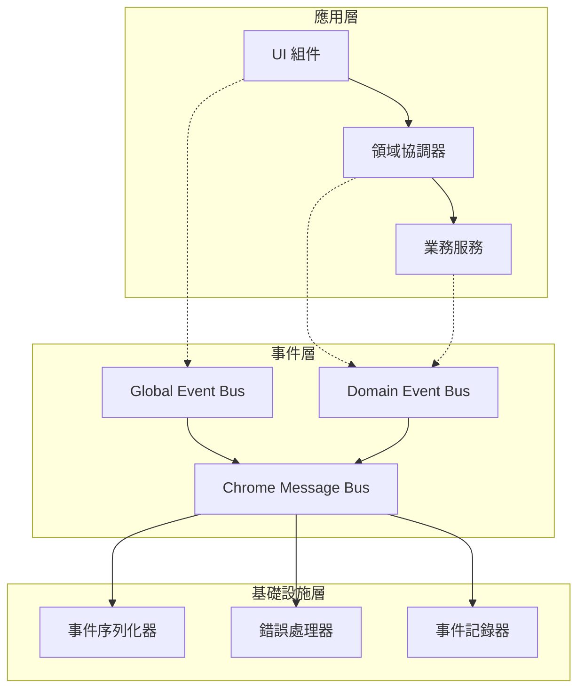

# 🔄 事件驅動架構深入指南

> **閱讀時間**: 15 分鐘  
> **適用對象**: 所有開發者  
> **重要程度**: 🔴 P0 必讀  
> **前置要求**: 已閱讀 [領域驅動設計實踐](./domain-design.md)

---

## 🎯 為什麼選擇事件驅動架構？

### **Chrome Extension 的特殊挑戰**

Chrome Extension 環境帶來獨特的架構挑戰：

```text
Background Service Worker ←→ Content Script ←→ Popup UI
        ↕️                        ↕️                ↕️
    持久化服務              DOM 操作          用戶界面
   (限制性環境)          (隔離沙盒)         (短暫生命週期)
```

**傳統直接調用的問題**：
- ❌ **環境隔離**: 無法直接跨環境調用函數
- ❌ **生命週期不同**: Popup 關閉後調用失效
- ❌ **錯誤傳播**: 跨環境錯誤處理複雜
- ❌ **測試困難**: 難以模擬跨環境交互

**事件驅動的解決方案**：
- ✅ **解耦架構**: 組件間無直接依賴
- ✅ **跨環境通訊**: 統一的訊息傳遞機制
- ✅ **錯誤隔離**: 錯誤不會級聯傳播
- ✅ **可測試性**: 易於 Mock 和單元測試

---

## 🏗️ 事件總線架構設計

### **分層事件系統**



### **核心事件總線實現**

```javascript
// event-bus.js - 統一事件總線
class EventBus {
  constructor() {
    this.listeners = new Map(); // 事件監聽器
    this.requestHandlers = new Map(); // 請求處理器
    this.middleware = []; // 中間件鏈
    this.logger = new EventLogger();
  }
  
  // 發射事件（異步，不等待回應）
  async emit(eventName, payload = {}) {
    const event = this.createEvent(eventName, payload, 'emit');
    
    try {
      // 應用中間件
      const processedEvent = await this.applyMiddleware(event);
      
      // 記錄事件
      this.logger.logEvent('EMITTED', processedEvent);
      
      // 分發到所有監聽器
      const listeners = this.listeners.get(eventName) || [];
      const promises = listeners.map(listener => 
        this.safeExecuteListener(listener, processedEvent)
      );
      
      await Promise.allSettled(promises);
      
    } catch (error) {
      this.logger.logEvent('EMIT_FAILED', event, error);
      throw new StandardError(
        'EVENT_EMIT_FAILED',
        `事件發射失敗: ${eventName}`,
        { event, error }
      );
    }
  }
  
  // 請求-回應模式（同步等待回應）
  async request(eventName, payload = {}, timeout = 5000) {
    const event = this.createEvent(eventName, payload, 'request');
    
    return new Promise(async (resolve, reject) => {
      const timeoutId = setTimeout(() => {
        reject(new StandardError(
          'REQUEST_TIMEOUT',
          `請求超時: ${eventName}`,
          { event, timeout }
        ));
      }, timeout);
      
      try {
        // 尋找請求處理器
        const handler = this.requestHandlers.get(eventName);
        if (!handler) {
          throw new StandardError(
            'NO_REQUEST_HANDLER',
            `未找到請求處理器: ${eventName}`,
            { event }
          );
        }
        
        // 執行處理器
        const result = await handler(event.payload);
        
        clearTimeout(timeoutId);
        this.logger.logEvent('REQUEST_COMPLETED', event, result);
        resolve(result);
        
      } catch (error) {
        clearTimeout(timeoutId);
        this.logger.logEvent('REQUEST_FAILED', event, error);
        reject(error);
      }
    });
  }
  
  // 註冊事件監聽器
  on(eventName, listener) {
    if (!this.listeners.has(eventName)) {
      this.listeners.set(eventName, []);
    }
    
    this.listeners.get(eventName).push({
      id: generateId(),
      listener,
      registeredAt: new Date().toISOString()
    });
    
    // 返回取消監聽的函數
    return () => this.off(eventName, listener);
  }
  
  // 註冊請求處理器
  onRequest(eventName, handler) {
    if (this.requestHandlers.has(eventName)) {
      throw new StandardError(
        'DUPLICATE_REQUEST_HANDLER',
        `重複的請求處理器: ${eventName}`,
        { eventName }
      );
    }
    
    this.requestHandlers.set(eventName, handler);
    
    // 返回取消處理器的函數
    return () => this.requestHandlers.delete(eventName);
  }
  
  // 創建標準事件對象
  createEvent(name, payload, type) {
    return {
      id: generateId(),
      name,
      type,
      payload,
      timestamp: new Date().toISOString(),
      source: 'EventBus',
      version: '1.0'
    };
  }
  
  // 安全執行監聽器
  async safeExecuteListener(listenerInfo, event) {
    try {
      await listenerInfo.listener(event.payload);
    } catch (error) {
      this.logger.logEvent('LISTENER_ERROR', event, error);
      // 不拋出錯誤，避免影響其他監聽器
    }
  }
  
  // 應用中間件
  async applyMiddleware(event) {
    let processedEvent = event;
    
    for (const middleware of this.middleware) {
      processedEvent = await middleware(processedEvent);
    }
    
    return processedEvent;
  }
}
```

---

## 📝 事件命名規範與分類

### **標準事件命名格式**

```text
事件命名格式: {DOMAIN}.{ACTION}.{STATE}

DOMAIN: 發起領域 (PAGE, EXTRACTION, DATA_MANAGEMENT 等)
ACTION: 具體動作 (BOOKS, STATUS, SYNC 等)  
STATE:  操作狀態 (REQUESTED, STARTED, COMPLETED, FAILED 等)
```

### **事件分類體系**

```javascript
// 事件類型定義
const EventTypes = {
  // 用戶操作事件
  USER: {
    EXTRACT: {
      REQUESTED: 'USER.EXTRACT.REQUESTED',
      STARTED: 'USER.EXTRACT.STARTED', 
      COMPLETED: 'USER.EXTRACT.COMPLETED',
      FAILED: 'USER.EXTRACT.FAILED'
    },
    SETTINGS: {
      UPDATED: 'USER.SETTINGS.UPDATED',
      RESET: 'USER.SETTINGS.RESET'
    }
  },
  
  // 頁面管理事件
  PAGE: {
    STATUS: {
      CHECK_READY: 'PAGE.STATUS.CHECK_READY',
      READY_CONFIRMED: 'PAGE.STATUS.READY_CONFIRMED',
      NOT_READY: 'PAGE.STATUS.NOT_READY'
    },
    NAVIGATION: {
      CHANGED: 'PAGE.NAVIGATION.CHANGED',
      LOADING: 'PAGE.NAVIGATION.LOADING'
    }
  },
  
  // 資料提取事件
  EXTRACTION: {
    BOOKS: {
      EXTRACT_REQUEST: 'EXTRACTION.BOOKS.EXTRACT_REQUEST',
      EXTRACTING: 'EXTRACTION.BOOKS.EXTRACTING',
      EXTRACTED: 'EXTRACTION.BOOKS.EXTRACTED',
      EXTRACT_FAILED: 'EXTRACTION.BOOKS.EXTRACT_FAILED'
    },
    QUALITY: {
      CHECK_STARTED: 'EXTRACTION.QUALITY.CHECK_STARTED',
      CHECK_COMPLETED: 'EXTRACTION.QUALITY.CHECK_COMPLETED'
    }
  },
  
  // 資料管理事件  
  DATA_MANAGEMENT: {
    BOOKS: {
      PROCESS_REQUEST: 'DATA_MANAGEMENT.BOOKS.PROCESS_REQUEST',
      PROCESSING: 'DATA_MANAGEMENT.BOOKS.PROCESSING',
      PROCESSED: 'DATA_MANAGEMENT.BOOKS.PROCESSED',
      PROCESS_FAILED: 'DATA_MANAGEMENT.BOOKS.PROCESS_FAILED'
    },
    SYNC: {
      STARTED: 'DATA_MANAGEMENT.SYNC.STARTED',
      COMPLETED: 'DATA_MANAGEMENT.SYNC.COMPLETED',
      FAILED: 'DATA_MANAGEMENT.SYNC.FAILED'
    }
  },
  
  // 系統管理事件
  SYSTEM: {
    HEALTH: {
      CHECK: 'SYSTEM.HEALTH.CHECK',
      HEALTHY: 'SYSTEM.HEALTH.HEALTHY',
      UNHEALTHY: 'SYSTEM.HEALTH.UNHEALTHY'
    },
    LIFECYCLE: {
      STARTED: 'SYSTEM.LIFECYCLE.STARTED',
      STOPPING: 'SYSTEM.LIFECYCLE.STOPPING',
      STOPPED: 'SYSTEM.LIFECYCLE.STOPPED'
    }
  }
};
```

### **事件載荷標準格式**

```javascript
// 標準事件載荷結構
const EventPayloadStandards = {
  // 操作類事件載荷
  operation: {
    operationId: 'uuid',      // 操作唯一識別碼
    userId: 'string',         // 用戶識別碼（可選）
    timestamp: 'ISO8601',     // 操作時間戳
    context: {                // 操作上下文
      source: 'string',       // 觸發來源
      metadata: 'object'      // 額外元資料
    }
  },
  
  // 資料類事件載荷
  data: {
    entityType: 'string',     // 實體類型 (books, users 等)
    entityId: 'string',       // 實體識別碼（可選）
    data: 'object|array',     // 實體資料
    count: 'number',          // 資料數量
    version: 'string'         // 資料版本
  },
  
  // 錯誤類事件載荷
  error: {
    errorType: 'string',      // 錯誤類型
    errorCode: 'string',      // 錯誤代碼
    message: 'string',        // 錯誤訊息
    details: 'object',        // 錯誤詳情
    stackTrace: 'string',     // 堆疊追蹤（開發模式）
    recoverable: 'boolean'    // 是否可恢復
  }
};
```

---

## 🌐 Chrome Extension 跨環境事件通訊

### **Background ↔ Content Script 通訊**

```javascript
// chrome-message-bridge.js - Chrome Extension 訊息橋接器
class ChromeMessageBridge {
  constructor(eventBus) {
    this.eventBus = eventBus;
    this.setupMessageHandlers();
  }
  
  // Background Script 端設置
  setupBackgroundMessageHandlers() {
    chrome.runtime.onMessage.addListener((message, sender, sendResponse) => {
      this.handleIncomingMessage(message, sender)
        .then(result => sendResponse(result))
        .catch(error => sendResponse({
          success: false,
          error: error.toJSON()
        }));
      
      return true; // 保持訊息通道開啟
    });
    
    // 監聽需要發送到 Content Script 的事件
    this.eventBus.on('SEND_TO_CONTENT', (payload) => {
      this.sendToContentScript(payload);
    });
  }
  
  // Content Script 端設置
  setupContentMessageHandlers() {
    chrome.runtime.onMessage.addListener((message, sender, sendResponse) => {
      this.handleIncomingMessage(message, sender)
        .then(result => sendResponse(result))
        .catch(error => sendResponse({
          success: false,
          error: error.toJSON()
        }));
      
      return true;
    });
    
    // 監聽需要發送到 Background 的事件
    this.eventBus.on('SEND_TO_BACKGROUND', (payload) => {
      this.sendToBackground(payload);
    });
  }
  
  async handleIncomingMessage(message, sender) {
    const { type, eventName, payload, requestId } = message;
    
    switch (type) {
      case 'EVENT_EMIT':
        await this.eventBus.emit(eventName, payload);
        return { success: true };
        
      case 'EVENT_REQUEST':
        try {
          const result = await this.eventBus.request(eventName, payload);
          return { success: true, data: result };
        } catch (error) {
          return { success: false, error: error.toJSON() };
        }
        
      default:
        throw new StandardError(
          'UNKNOWN_MESSAGE_TYPE',
          `未知的訊息類型: ${type}`,
          { message }
        );
    }
  }
  
  async sendToContentScript(payload) {
    const tabs = await chrome.tabs.query({});
    
    for (const tab of tabs) {
      try {
        await chrome.tabs.sendMessage(tab.id, {
          type: 'EVENT_EMIT',
          eventName: payload.eventName,
          payload: payload.data,
          timestamp: new Date().toISOString()
        });
      } catch (error) {
        // 忽略無 Content Script 的分頁
      }
    }
  }
  
  async sendToBackground(payload) {
    return chrome.runtime.sendMessage({
      type: 'EVENT_EMIT',
      eventName: payload.eventName,
      payload: payload.data,
      timestamp: new Date().toISOString()
    });
  }
}
```

### **跨環境事件協作範例**

```javascript
// 完整的書籍提取跨環境協作流程
class CrossContextBookExtraction {
  constructor(eventBus, messageBridge) {
    this.eventBus = eventBus;
    this.messageBridge = messageBridge;
    this.setupEventHandlers();
  }
  
  // Background Script: 協調整體流程
  async coordinateExtraction() {
    try {
      // Step 1: 檢查 Content Script 是否就緒
      const contentReady = await this.eventBus.request(
        'PAGE.CONTENT_SCRIPT.CHECK_READY',
        { timeout: 3000 }
      );
      
      if (!contentReady.success) {
        throw new StandardError(
          'CONTENT_SCRIPT_NOT_READY',
          'Content Script 未就緒'
        );
      }
      
      // Step 2: 請求開始提取
      const extractionResult = await this.eventBus.request(
        'EXTRACTION.BOOKS.START_EXTRACTION',
        { 
          url: contentReady.data.url,
          extractorConfig: { quality: 'high' }
        }
      );
      
      // Step 3: 處理提取結果
      const processingResult = await this.eventBus.request(
        'DATA_MANAGEMENT.BOOKS.PROCESS',
        { rawData: extractionResult.data }
      );
      
      // Step 4: 通知所有相關環境完成
      await this.eventBus.emit('EXTRACTION.WORKFLOW.COMPLETED', {
        bookCount: processingResult.data.length,
        extractionId: generateId(),
        completedAt: new Date().toISOString()
      });
      
      return processingResult;
      
    } catch (error) {
      await this.eventBus.emit('EXTRACTION.WORKFLOW.FAILED', {
        error: error.toJSON(),
        failedAt: new Date().toISOString()
      });
      
      throw error;
    }
  }
  
  // Content Script: 執行實際的 DOM 提取
  setupContentScriptHandlers() {
    // 響應就緒檢查
    this.eventBus.onRequest('PAGE.CONTENT_SCRIPT.CHECK_READY', async () => {
      const isReady = document.readyState === 'complete' && 
                      document.querySelector('.book-item') !== null;
      
      return OperationResult.success({
        ready: isReady,
        url: window.location.href,
        bookElements: document.querySelectorAll('.book-item').length
      });
    });
    
    // 響應提取請求
    this.eventBus.onRequest('EXTRACTION.BOOKS.START_EXTRACTION', async (payload) => {
      const extractor = new BookDataExtractor(payload.extractorConfig);
      const books = await extractor.extractFromPage();
      
      // 發送進度更新
      await this.eventBus.emit('EXTRACTION.BOOKS.PROGRESS_UPDATE', {
        extractedCount: books.length,
        currentUrl: window.location.href
      });
      
      return OperationResult.success(books);
    });
  }
  
  // Popup UI: 顯示進度和結果
  setupPopupHandlers() {
    // 監聽提取進度
    this.eventBus.on('EXTRACTION.BOOKS.PROGRESS_UPDATE', (payload) => {
      this.updateProgressUI(payload.extractedCount);
    });
    
    // 監聽完成事件
    this.eventBus.on('EXTRACTION.WORKFLOW.COMPLETED', (payload) => {
      this.showSuccessMessage(`成功提取 ${payload.bookCount} 本書籍`);
    });
    
    // 監聽失敗事件
    this.eventBus.on('EXTRACTION.WORKFLOW.FAILED', (payload) => {
      this.showErrorMessage(payload.error.message);
    });
  }
}
```

---

## 🔧 事件中間件與外掛機制

### **事件處理中間件**

```javascript
// 事件中間件範例
class EventMiddleware {
  // 事件驗證中間件
  static createValidationMiddleware(schema) {
    return async (event) => {
      const validationResult = validateEventSchema(event, schema);
      
      if (!validationResult.valid) {
        throw new StandardError(
          'INVALID_EVENT_SCHEMA',
          '事件格式驗證失敗',
          { 
            event, 
            errors: validationResult.errors 
          }
        );
      }
      
      return event;
    };
  }
  
  // 事件記錄中間件
  static createLoggingMiddleware(logger) {
    return async (event) => {
      logger.info('EVENT_PROCESSED', {
        eventName: event.name,
        eventId: event.id,
        timestamp: event.timestamp,
        payloadSize: JSON.stringify(event.payload).length
      });
      
      return event;
    };
  }
  
  // 效能監控中間件
  static createPerformanceMiddleware() {
    return async (event) => {
      const startTime = performance.now();
      
      // 在事件中添加效能標記
      event.performance = {
        startTime,
        middlewareProcessingTime: performance.now() - startTime
      };
      
      return event;
    };
  }
  
  // 事件轉換中間件
  static createTransformMiddleware(transformer) {
    return async (event) => {
      // 根據需要轉換事件載荷
      const transformedPayload = await transformer(event.payload);
      
      return {
        ...event,
        payload: transformedPayload,
        transformed: true
      };
    };
  }
}

// 中間件使用範例
const eventBus = new EventBus();

// 註冊中間件
eventBus.use(EventMiddleware.createValidationMiddleware(EventSchemas));
eventBus.use(EventMiddleware.createLoggingMiddleware(logger));
eventBus.use(EventMiddleware.createPerformanceMiddleware());
```

### **事件訂閱管理器**

```javascript
// subscription-manager.js - 事件訂閱生命週期管理
class SubscriptionManager {
  constructor(eventBus) {
    this.eventBus = eventBus;
    this.subscriptions = new Map();
    this.subscriptionGroups = new Map();
  }
  
  // 創建訂閱組（可批量管理）
  createSubscriptionGroup(groupName) {
    if (this.subscriptionGroups.has(groupName)) {
      throw new StandardError(
        'SUBSCRIPTION_GROUP_EXISTS',
        `訂閱組已存在: ${groupName}`
      );
    }
    
    const group = {
      name: groupName,
      subscriptions: [],
      active: true,
      createdAt: new Date().toISOString()
    };
    
    this.subscriptionGroups.set(groupName, group);
    return group;
  }
  
  // 向組內添加訂閱
  addToGroup(groupName, eventName, handler) {
    const group = this.subscriptionGroups.get(groupName);
    if (!group) {
      throw new StandardError(
        'SUBSCRIPTION_GROUP_NOT_FOUND',
        `訂閱組不存在: ${groupName}`
      );
    }
    
    if (!group.active) {
      throw new StandardError(
        'SUBSCRIPTION_GROUP_INACTIVE',
        `訂閱組已停用: ${groupName}`
      );
    }
    
    const unsubscribe = this.eventBus.on(eventName, handler);
    const subscription = {
      id: generateId(),
      eventName,
      handler,
      unsubscribe,
      groupName,
      createdAt: new Date().toISOString()
    };
    
    this.subscriptions.set(subscription.id, subscription);
    group.subscriptions.push(subscription.id);
    
    return subscription.id;
  }
  
  // 停用整個訂閱組
  deactivateGroup(groupName) {
    const group = this.subscriptionGroups.get(groupName);
    if (!group) return;
    
    group.active = false;
    
    // 取消組內所有訂閱
    group.subscriptions.forEach(subscriptionId => {
      const subscription = this.subscriptions.get(subscriptionId);
      if (subscription) {
        subscription.unsubscribe();
        this.subscriptions.delete(subscriptionId);
      }
    });
    
    group.subscriptions = [];
  }
  
  // 重新啟動訂閱組（需要重新註冊處理器）
  reactivateGroup(groupName, handlers) {
    const group = this.subscriptionGroups.get(groupName);
    if (!group) return;
    
    group.active = true;
    
    // 重新註冊處理器
    handlers.forEach(({ eventName, handler }) => {
      this.addToGroup(groupName, eventName, handler);
    });
  }
}
```

---

## 🧪 事件驅動測試策略

### **事件系統單元測試**

```javascript
describe('EventBus', () => {
  let eventBus;
  let mockLogger;
  
  beforeEach(() => {
    mockLogger = createMockLogger();
    eventBus = new EventBus({ logger: mockLogger });
  });
  
  describe('emit', () => {
    it('should emit event to all registered listeners', async () => {
      // Arrange
      const listener1 = jest.fn();
      const listener2 = jest.fn();
      const payload = { test: 'data' };
      
      eventBus.on('TEST_EVENT', listener1);
      eventBus.on('TEST_EVENT', listener2);
      
      // Act
      await eventBus.emit('TEST_EVENT', payload);
      
      // Assert
      expect(listener1).toHaveBeenCalledWith(payload);
      expect(listener2).toHaveBeenCalledWith(payload);
    });
    
    it('should handle listener errors gracefully', async () => {
      // Arrange
      const errorListener = jest.fn().mockRejectedValue(new Error('Listener error'));
      const normalListener = jest.fn();
      
      eventBus.on('TEST_EVENT', errorListener);
      eventBus.on('TEST_EVENT', normalListener);
      
      // Act & Assert - 不應該拋出錯誤
      await expect(eventBus.emit('TEST_EVENT', {})).resolves.toBeUndefined();
      expect(normalListener).toHaveBeenCalled();
      expect(mockLogger.logEvent).toHaveBeenCalledWith(
        'LISTENER_ERROR',
        expect.any(Object),
        expect.any(Error)
      );
    });
  });
  
  describe('request', () => {
    it('should handle request-response pattern', async () => {
      // Arrange
      const expectedResponse = OperationResult.success({ result: 'test' });
      eventBus.onRequest('TEST_REQUEST', async (payload) => {
        return expectedResponse;
      });
      
      // Act
      const result = await eventBus.request('TEST_REQUEST', { input: 'test' });
      
      // Assert
      expect(result).toEqual(expectedResponse);
    });
    
    it('should timeout on long-running requests', async () => {
      // Arrange
      eventBus.onRequest('SLOW_REQUEST', async () => {
        await new Promise(resolve => setTimeout(resolve, 1000));
        return OperationResult.success({});
      });
      
      // Act & Assert
      await expect(
        eventBus.request('SLOW_REQUEST', {}, 100) // 100ms timeout
      ).rejects.toThrow('REQUEST_TIMEOUT');
    });
  });
});
```

### **跨環境整合測試**

```javascript
describe('Cross-Context Communication', () => {
  let backgroundEventBus;
  let contentEventBus;
  let messageBridge;
  
  beforeEach(async () => {
    // 設置模擬的 Chrome Extension 環境
    global.chrome = createMockChromeAPI();
    
    backgroundEventBus = new EventBus();
    contentEventBus = new EventBus();
    
    messageBridge = new ChromeMessageBridge(backgroundEventBus);
    messageBridge.setupBackgroundMessageHandlers();
  });
  
  it('should coordinate book extraction across contexts', async () => {
    // 設置 Content Script 模擬響應
    contentEventBus.onRequest('PAGE.CONTENT_SCRIPT.CHECK_READY', async () => {
      return OperationResult.success({
        ready: true,
        url: 'https://readmoo.com/explore',
        bookElements: 10
      });
    });
    
    contentEventBus.onRequest('EXTRACTION.BOOKS.START_EXTRACTION', async () => {
      const mockBooks = createMockBooks(10);
      return OperationResult.success(mockBooks);
    });
    
    // 模擬跨環境通訊
    const extractionCoordinator = new CrossContextBookExtraction(
      backgroundEventBus,
      messageBridge
    );
    
    // 執行測試
    const result = await extractionCoordinator.coordinateExtraction();
    
    // 驗證結果
    expect(result.success).toBe(true);
    expect(result.data).toHaveLength(10);
    
    // 驗證事件流程
    expect(backgroundEventBus.getEmittedEvents()).toContainEqual(
      expect.objectContaining({
        name: 'EXTRACTION.WORKFLOW.COMPLETED'
      })
    );
  });
});
```

---

## 📊 事件系統效能監控

### **事件效能分析器**

```javascript
// event-performance-analyzer.js
class EventPerformanceAnalyzer {
  constructor() {
    this.metrics = new Map();
    this.thresholds = {
      slowEventThreshold: 100,      // 100ms
      highFrequencyThreshold: 10,   // 10 events/second
      memoryLeakThreshold: 1000     // 1000 accumulated events
    };
  }
  
  analyzeEvent(event, executionTime) {
    const eventName = event.name;
    
    if (!this.metrics.has(eventName)) {
      this.metrics.set(eventName, {
        count: 0,
        totalTime: 0,
        averageTime: 0,
        maxTime: 0,
        minTime: Infinity,
        lastExecuted: null,
        frequency: 0
      });
    }
    
    const metric = this.metrics.get(eventName);
    metric.count++;
    metric.totalTime += executionTime;
    metric.averageTime = metric.totalTime / metric.count;
    metric.maxTime = Math.max(metric.maxTime, executionTime);
    metric.minTime = Math.min(metric.minTime, executionTime);
    metric.lastExecuted = new Date();
    
    // 計算事件頻率（每秒）
    this.calculateEventFrequency(eventName);
    
    // 檢查效能警告
    this.checkPerformanceWarnings(eventName, executionTime);
  }
  
  generatePerformanceReport() {
    const report = {
      timestamp: new Date().toISOString(),
      totalEvents: Array.from(this.metrics.values())
        .reduce((sum, metric) => sum + metric.count, 0),
      eventMetrics: {},
      warnings: [],
      recommendations: []
    };
    
    // 事件效能統計
    this.metrics.forEach((metric, eventName) => {
      report.eventMetrics[eventName] = {
        ...metric,
        performanceGrade: this.calculatePerformanceGrade(metric)
      };
      
      // 效能建議
      if (metric.averageTime > this.thresholds.slowEventThreshold) {
        report.recommendations.push({
          type: 'PERFORMANCE',
          eventName,
          issue: '平均執行時間過長',
          suggestion: '考慮優化事件處理邏輯或使用異步處理'
        });
      }
    });
    
    return report;
  }
  
  calculatePerformanceGrade(metric) {
    if (metric.averageTime < 10) return 'A';
    if (metric.averageTime < 50) return 'B';
    if (metric.averageTime < 100) return 'C';
    if (metric.averageTime < 200) return 'D';
    return 'F';
  }
}
```

---

## 🚀 最佳實踐總結

### **事件設計原則**
- [ ] **單一職責**: 每個事件只傳達一種特定的業務意義
- [ ] **不可變載荷**: 事件載荷應該是不可變的，避免副作用
- [ ] **明確命名**: 使用 `DOMAIN.ACTION.STATE` 格式，語義清晰
- [ ] **版本化**: 重要事件格式變更時要考慮向後兼容

### **效能最佳實踐**
- [ ] **避免事件風暴**: 批量處理相似事件，避免頻繁發射
- [ ] **異步處理**: 長時間操作使用異步事件處理
- [ ] **記憶體管理**: 及時清理無用的事件監聽器
- [ ] **錯誤隔離**: 事件處理器錯誤不應影響其他處理器

### **可測試性原則**
- [ ] **Mock 友善**: 事件系統易於 Mock 和測試
- [ ] **狀態獨立**: 事件處理器不依賴全域狀態
- [ ] **確定性**: 相同輸入產生相同輸出
- [ ] **可觀察性**: 提供足夠的日誌和監控資訊

---

## 🎯 下一步學習

掌握事件驅動架構後，建議深入：

1. **🔄 [TDD 開發流程](../workflows/tdd-process.md)** - 在事件驅動架構中應用 TDD
2. **🧪 [測試金字塔實踐](../testing/test-pyramid.md)** - 事件系統的完整測試策略
3. **📡 [事件接口規範](../api/event-interfaces.md)** - 標準化事件接口設計

---

**🎯 學習成果驗證**: 能夠設計完整的事件驅動業務流程，包括跨環境通訊、錯誤處理和效能監控。