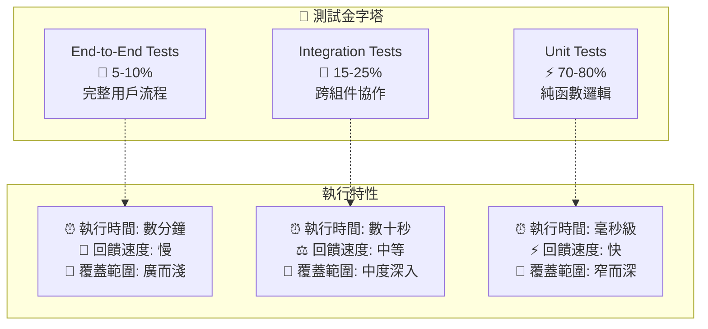

# 🧪 測試金字塔實踐指南

> **閱讀時間**: 20 分鐘  
> **適用對象**: 需要寫測試的開發者  
> **重要程度**: 🔴 P0 必讀  
> **前置要求**: 已掌握 [TDD 開發流程](../workflows/tdd-process.md)

---

## 🏛️ 測試金字塔架構設計

### **為什麼需要測試金字塔？**

Readmoo 書庫管理器的多層架構需要分層測試策略：

```text
Chrome Extension 複雜性：
├── Background Service Worker (業務邏輯核心)
├── Content Scripts (DOM 操作和資料提取)  
├── Popup UI (用戶界面交互)
├── Storage API (資料持久化)
└── Event Bus (跨環境通訊)
```

**傳統測試方式的問題**：
- ❌ **過度依賴手動測試**: 成本高且不可重複
- ❌ **缺乏分層覆蓋**: 只有 E2E 測試，問題定位困難
- ❌ **測試執行緩慢**: 所有測試都需要完整環境
- ❌ **維護成本高**: 環境變更導致大量測試失效

**測試金字塔的優勢**：
- ✅ **快速反饋**: 大量單元測試提供即時反饋
- ✅ **精確定位**: 分層測試快速找到問題根源
- ✅ **執行效率**: 自底向上的執行時間遞減
- ✅ **維護性**: 各層測試職責清晰，維護簡單

---

## 🔺 三層測試金字塔結構

### **Chrome Extension 特化的測試金字塔**



### **各層測試職責劃分**

| 測試層級 | 測試範圍 | 執行環境 | 主要工具 | 典型執行時間 |
|----------|----------|----------|----------|--------------|
| **E2E Tests** | 完整用戶旅程 | 真實瀏覽器 | Puppeteer + Chrome Extension | 30s - 2分鐘/測試 |
| **Integration Tests** | 模組間協作 | Node.js + Mock Chrome APIs | Jest + 模擬環境 | 1s - 10s/測試 |
| **Unit Tests** | 純函數邏輯 | Node.js | Jest | 10ms - 100ms/測試 |

---

## ⚡ 第一層：單元測試 (70-80%)

### **單元測試覆蓋範圍**

```javascript
// 目標：測試最小單位的業務邏輯
describe('Unit Tests Coverage', () => {
  // ✅ 純函數邏輯
  describe('DataValidator', () => {
    it('should validate book title format');
    it('should reject invalid ISBN checksum');
    it('should normalize price format');
  });
  
  // ✅ 領域模型行為
  describe('BookModel', () => {
    it('should calculate reading progress');
    it('should format display information');
    it('should validate required fields');
  });
  
  // ✅ 工具函數
  describe('UtilityFunctions', () => {
    it('should parse ISBN from various formats');
    it('should generate unique identifiers');
    it('should format dates consistently');
  });
  
  // ❌ 不適合單元測試的範圍
  // - DOM 操作（應在整合測試）
  // - 跨環境通訊（應在整合測試）
  // - Chrome API 調用（應在整合測試）
});
```

### **單元測試實作範例**

```javascript
// book-validator.unit.test.js
import { BookValidator } from '../../../src/domains/data-management/services/book-validator';
import { BookValidationError } from '../../../src/core/errors';

describe('BookValidator - Unit Tests', () => {
  let validator;
  
  beforeEach(() => {
    // 純粹的依賴注入，無需複雜設置
    validator = new BookValidator({
      validationRules: {
        maxTitleLength: 200,
        maxAuthorLength: 100,
        minPrice: 0,
        maxPrice: 10000
      }
    });
  });
  
  describe('validateTitle', () => {
    it('should accept valid title', async () => {
      // Arrange
      const book = { title: 'JavaScript 權威指南' };
      
      // Act
      const result = await validator.validateTitle(book);
      
      // Assert
      expect(result).toEqual(book);
    });
    
    it('should reject empty title', async () => {
      // Arrange
      const book = { title: '' };
      
      // Act & Assert
      await expect(validator.validateTitle(book))
        .rejects
        .toThrow(BookValidationError);
    });
    
    it('should reject title exceeding max length', async () => {
      // Arrange  
      const book = { title: 'A'.repeat(250) };
      
      // Act & Assert
      await expect(validator.validateTitle(book))
        .rejects
        .toThrow('TITLE_TOO_LONG');
    });
  });
  
  describe('validateISBN', () => {
    const validISBNs = [
      '9787115275790',
      '978-7-115-27579-0',
      '0123456789',
      '0-123-45678-9'
    ];
    
    const invalidISBNs = [
      '12345',
      '9787115275791', // 錯誤校驗碼
      'abcdefghij',
      ''
    ];
    
    validISBNs.forEach(isbn => {
      it(`should accept valid ISBN: ${isbn}`, async () => {
        const book = { title: 'Test', isbn };
        const result = await validator.validateISBN(book);
        expect(result.isbn).toBeDefined();
      });
    });
    
    invalidISBNs.forEach(isbn => {
      it(`should reject invalid ISBN: ${isbn}`, async () => {
        const book = { title: 'Test', isbn };
        await expect(validator.validateISBN(book))
          .rejects
          .toThrow(BookValidationError);
      });
    });
  });
  
  describe('price validation', () => {
    it('should accept valid price range', async () => {
      const validPrices = [0, 100, 500, 9999];
      
      for (const price of validPrices) {
        const book = { title: 'Test', price };
        const result = await validator.validatePrice(book);
        expect(result.price).toBe(price);
      }
    });
    
    it('should reject invalid price range', async () => {
      const invalidPrices = [-1, 10001, NaN, Infinity];
      
      for (const price of invalidPrices) {
        const book = { title: 'Test', price };
        await expect(validator.validatePrice(book))
          .rejects
          .toThrow(BookValidationError);
      }
    });
  });
});
```

### **單元測試工具配置**

```javascript
// jest.unit.config.js
module.exports = {
  displayName: 'Unit Tests',
  testMatch: ['**/*.unit.test.js'],
  testEnvironment: 'node',
  
  // 快速執行配置
  collectCoverage: false, // 單元測試階段關閉覆蓋率收集
  verbose: false,
  silent: true,
  
  // 隔離配置
  clearMocks: true,
  resetMocks: true,
  restoreMocks: true,
  
  // 單元測試不需要複雜設置
  setupFilesAfterEnv: ['<rootDir>/tests/setup/unit-setup.js'],
  
  // 性能優化
  maxWorkers: '50%',
  cache: true
};

// tests/setup/unit-setup.js  
// 單元測試環境最小化設置
global.generateId = () => 'test-id-' + Math.random().toString(36).substr(2, 9);

// 全域 Mock 工具
global.createMockLogger = () => ({
  info: jest.fn(),
  warn: jest.fn(), 
  error: jest.fn()
});
```

---

## 🔗 第二層：整合測試 (15-25%)

### **整合測試覆蓋範圍**

```javascript
// 目標：測試模組間協作和外部依賴整合
describe('Integration Tests Coverage', () => {
  // ✅ 領域間協作
  describe('Domain Coordination', () => {
    it('should coordinate book extraction workflow');
    it('should handle cross-domain error propagation');
  });
  
  // ✅ 事件總線通訊
  describe('Event Bus Integration', () => {
    it('should route events between domains');
    it('should handle event middleware processing');
  });
  
  // ✅ 儲存層整合
  describe('Storage Integration', () => {
    it('should persist and retrieve book data');
    it('should handle storage quota limits');
  });
  
  // ✅ Chrome Extension API 整合
  describe('Chrome API Integration', () => {
    it('should handle background-content communication');
    it('should manage extension lifecycle events');
  });
});
```

### **領域協作整合測試**

```javascript
// data-management.integration.test.js
import { DataManagementCoordinator } from '../../../src/domains/data-management';
import { EventBus } from '../../../src/core/event-bus';
import { createMockStorage, createMockLogger } from '../../utils/test-helpers';

describe('DataManagementCoordinator - Integration Tests', () => {
  let coordinator;
  let eventBus;
  let mockStorage;
  let mockLogger;
  
  beforeEach(async () => {
    // 使用真實的事件總線和模擬的外部依賴
    eventBus = new EventBus();
    mockStorage = createMockStorage();
    mockLogger = createMockLogger();
    
    // 創建具有實際依賴的協調器
    coordinator = new DataManagementCoordinator({
      eventBus,
      storageAdapter: mockStorage,
      logger: mockLogger
    });
    
    await coordinator.initialize();
  });
  
  afterEach(async () => {
    await coordinator.dispose();
  });
  
  describe('book processing workflow', () => {
    it('should complete full book processing pipeline', async () => {
      // Arrange
      const rawBooks = [
        { title: 'Book 1', author: 'Author 1', isbn: '9787115275790' },
        { title: 'Book 2', author: 'Author 2', isbn: '9787115275791' },
        { title: 'Book 1', author: 'Author 1', isbn: '9787115275790' } // 重複書籍
      ];
      
      // Act
      const result = await coordinator.processBooks(rawBooks);
      
      // Assert
      expect(result.success).toBe(true);
      expect(result.data).toHaveLength(2); // 去重後剩下 2 本
      expect(result.metadata.duplicatesRemoved).toBe(1);
      
      // 驗證儲存整合
      expect(mockStorage.set).toHaveBeenCalledWith(
        expect.stringMatching(/books_batch_/),
        expect.arrayContaining([
          expect.objectContaining({ title: 'Book 1' }),
          expect.objectContaining({ title: 'Book 2' })
        ])
      );
      
      // 驗證事件發射
      const emittedEvents = eventBus.getEmittedEvents();
      expect(emittedEvents).toContainEqual(
        expect.objectContaining({
          name: 'DATA_MANAGEMENT.BOOKS.PROCESSED',
          payload: expect.objectContaining({
            bookCount: 2
          })
        })
      );
    });
    
    it('should handle validation errors in pipeline', async () => {
      // Arrange
      const invalidBooks = [
        { title: '', author: 'Author 1' }, // 無效標題
        { title: 'Valid Book', author: 'Author 2', isbn: 'invalid-isbn' } // 無效 ISBN
      ];
      
      // Act
      const result = await coordinator.processBooks(invalidBooks);
      
      // Assert
      expect(result.success).toBe(false);
      expect(result.error.type).toBe('VALIDATION_ERROR');
      
      // 驗證錯誤記錄
      expect(mockLogger.error).toHaveBeenCalledWith(
        'DATA_MANAGEMENT.PROCESS_BOOKS.FAILED',
        expect.objectContaining({
          error: expect.any(Object)
        })
      );
      
      // 驗證沒有進行儲存操作
      expect(mockStorage.set).not.toHaveBeenCalled();
    });
  });
  
  describe('event-driven interactions', () => {
    it('should respond to external process requests', async () => {
      // Arrange
      const requestPayload = {
        data: [{ title: 'Event Test Book', author: 'Test Author' }]
      };
      
      // Act - 通過事件總線觸發處理
      const result = await eventBus.request(
        'DATA_MANAGEMENT.BOOKS.PROCESS_REQUEST',
        requestPayload
      );
      
      // Assert
      expect(result.success).toBe(true);
      expect(result.data).toHaveLength(1);
      
      // 驗證事件響應鏈
      const emittedEvents = eventBus.getEmittedEvents();
      expect(emittedEvents).toContainEqual(
        expect.objectContaining({
          name: 'DATA_MANAGEMENT.BOOKS.PROCESSED'
        })
      );
    });
  });
});
```

### **Chrome Extension API 整合測試**

```javascript
// chrome-extension.integration.test.js
import { ChromeMessageBridge } from '../../../src/core/chrome-message-bridge';
import { EventBus } from '../../../src/core/event-bus';
import { createMockChromeAPI } from '../../utils/chrome-api-mock';

describe('Chrome Extension Integration Tests', () => {
  let eventBus;
  let messageBridge;
  let mockChrome;
  
  beforeEach(() => {
    // 模擬完整的 Chrome Extension 環境
    mockChrome = createMockChromeAPI();
    global.chrome = mockChrome;
    
    eventBus = new EventBus();
    messageBridge = new ChromeMessageBridge(eventBus);
    messageBridge.setupBackgroundMessageHandlers();
  });
  
  afterEach(() => {
    delete global.chrome;
  });
  
  describe('background-content communication', () => {
    it('should send events from background to content script', async () => {
      // Arrange
      const testPayload = { bookCount: 5, status: 'completed' };
      
      mockChrome.tabs.query.mockResolvedValue([
        { id: 123, url: 'https://readmoo.com/explore' },
        { id: 124, url: 'https://readmoo.com/library' }
      ]);
      
      mockChrome.tabs.sendMessage.mockResolvedValue({ success: true });
      
      // Act
      await eventBus.emit('SEND_TO_CONTENT', {
        eventName: 'EXTRACTION.PROGRESS.UPDATE',
        data: testPayload
      });
      
      // 等待異步操作完成
      await new Promise(resolve => setTimeout(resolve, 10));
      
      // Assert
      expect(mockChrome.tabs.query).toHaveBeenCalled();
      expect(mockChrome.tabs.sendMessage).toHaveBeenCalledTimes(2);
      expect(mockChrome.tabs.sendMessage).toHaveBeenCalledWith(
        123,
        expect.objectContaining({
          type: 'EVENT_EMIT',
          eventName: 'EXTRACTION.PROGRESS.UPDATE',
          payload: testPayload
        })
      );
    });
    
    it('should handle content script responses', async () => {
      // Arrange
      const responseData = { ready: true, bookElements: 10 };
      
      // 模擬訊息處理器
      const messageHandler = mockChrome.runtime.onMessage.addListener.mock.calls[0][0];
      
      // Act - 模擬來自 Content Script 的請求
      const sendResponse = jest.fn();
      const promise = messageHandler(
        {
          type: 'EVENT_REQUEST',
          eventName: 'PAGE.STATUS.CHECK_READY',
          payload: { url: 'https://readmoo.com' },
          requestId: 'test-request-id'
        },
        { tab: { id: 123 } },
        sendResponse
      );
      
      // 設置請求處理器
      eventBus.onRequest('PAGE.STATUS.CHECK_READY', async (payload) => {
        return OperationResult.success(responseData);
      });
      
      await promise;
      
      // Assert
      expect(sendResponse).toHaveBeenCalledWith({
        success: true,
        data: expect.objectContaining(responseData)
      });
    });
  });
  
  describe('storage integration', () => {
    it('should persist data through Chrome Storage API', async () => {
      // Arrange
      const testData = { books: [{ id: 1, title: 'Test Book' }] };
      
      mockChrome.storage.local.set.mockImplementation((data, callback) => {
        setTimeout(() => callback && callback(), 0);
      });
      
      mockChrome.storage.local.get.mockImplementation((keys, callback) => {
        setTimeout(() => callback && callback(testData), 0);
      });
      
      // Act
      await new Promise(resolve => {
        chrome.storage.local.set(testData, resolve);
      });
      
      const retrievedData = await new Promise(resolve => {
        chrome.storage.local.get(['books'], resolve);
      });
      
      // Assert
      expect(mockChrome.storage.local.set).toHaveBeenCalledWith(testData, expect.any(Function));
      expect(retrievedData).toEqual(testData);
    });
  });
});
```

### **整合測試工具配置**

```javascript
// jest.integration.config.js
module.exports = {
  displayName: 'Integration Tests',
  testMatch: ['**/*.integration.test.js'],
  testEnvironment: 'jsdom', // 支援 DOM 相關操作
  
  // 整合測試需要更多時間
  testTimeout: 10000,
  
  // 設置檔案
  setupFilesAfterEnv: [
    '<rootDir>/tests/setup/integration-setup.js',
    '<rootDir>/tests/setup/chrome-api-setup.js'
  ],
  
  // 覆蓋率配置
  collectCoverage: true,
  collectCoverageFrom: [
    'src/**/*.js',
    '!src/**/*.unit.test.js',
    '!src/**/*.e2e.test.js'
  ],
  
  // 性能配置
  maxWorkers: '25%', // 整合測試較重，減少並發數
  cache: true
};
```

---

## 📱 第三層：端到端測試 (5-10%)

### **E2E 測試覆蓋範圍**

```javascript
// 目標：測試完整用戶流程和關鍵業務場景
describe('End-to-End Tests Coverage', () => {
  // ✅ 關鍵用戶旅程
  describe('Critical User Journeys', () => {
    it('should complete book extraction from Readmoo');
    it('should sync data across multiple tabs');
    it('should handle extension installation flow');
  });
  
  // ✅ 跨瀏覽器兼容性
  describe('Browser Compatibility', () => {
    it('should work in Chrome stable');
    it('should work in Chrome beta');
  });
  
  // ✅ 錯誤恢復場景  
  describe('Error Recovery', () => {
    it('should recover from network failures');
    it('should handle storage quota exceeded');
  });
});
```

### **E2E 測試實作範例**

```javascript
// book-extraction.e2e.test.js
import puppeteer from 'puppeteer';
import path from 'path';

describe('Book Extraction E2E Tests', () => {
  let browser;
  let page;
  const extensionPath = path.join(__dirname, '../../../dist');
  
  beforeAll(async () => {
    // 載入真實的 Chrome Extension
    browser = await puppeteer.launch({
      headless: false, // E2E 測試建議可視化執行
      args: [
        `--disable-extensions-except=${extensionPath}`,
        `--load-extension=${extensionPath}`,
        '--no-sandbox',
        '--disable-setuid-sandbox'
      ]
    });
  });
  
  afterAll(async () => {
    await browser.close();
  });
  
  beforeEach(async () => {
    page = await browser.newPage();
    
    // 設置控制台監聽
    page.on('console', msg => {
      if (msg.type() === 'error') {
        console.error('Page Error:', msg.text());
      }
    });
    
    // 設置錯誤監聽
    page.on('pageerror', error => {
      console.error('Page Error:', error.message);
    });
  });
  
  afterEach(async () => {
    await page.close();
  });
  
  describe('Complete Book Extraction Flow', () => {
    it('should extract books from Readmoo explore page', async () => {
      // 步驟 1: 導航到 Readmoo 頁面
      await page.goto('https://readmoo.com/explore', { 
        waitUntil: 'networkidle2',
        timeout: 10000 
      });
      
      // 步驟 2: 等待書籍元素載入
      await page.waitForSelector('.book-item', { timeout: 5000 });
      
      // 步驟 3: 點擊 Extension 圖示開啟 Popup
      const extensionId = await getExtensionId(page);
      await page.goto(`chrome-extension://${extensionId}/popup.html`);
      
      // 步驟 4: 點擊提取按鈕
      await page.waitForSelector('#extract-button');
      await page.click('#extract-button');
      
      // 步驟 5: 等待提取完成
      await page.waitForSelector('.extraction-success', { timeout: 15000 });
      
      // 步驟 6: 驗證結果
      const resultText = await page.$eval('.extraction-result', 
        el => el.textContent
      );
      
      expect(resultText).toMatch(/成功提取 \d+ 本書籍/);
      
      // 步驟 7: 驗證資料儲存
      const storedData = await page.evaluate(() => {
        return new Promise(resolve => {
          chrome.storage.local.get(['books'], result => resolve(result.books));
        });
      });
      
      expect(storedData).toBeInstanceOf(Array);
      expect(storedData.length).toBeGreaterThan(0);
      
      // 驗證書籍資料結構
      expect(storedData[0]).toEqual(
        expect.objectContaining({
          title: expect.any(String),
          author: expect.any(String),
          price: expect.any(Number)
        })
      );
    });
    
    it('should handle extraction errors gracefully', async () => {
      // 步驟 1: 導航到不支援的頁面
      await page.goto('https://example.com', { waitUntil: 'networkidle2' });
      
      // 步驟 2: 開啟 Extension Popup
      const extensionId = await getExtensionId(page);
      await page.goto(`chrome-extension://${extensionId}/popup.html`);
      
      // 步驟 3: 嘗試提取
      await page.waitForSelector('#extract-button');
      await page.click('#extract-button');
      
      // 步驟 4: 驗證錯誤訊息
      await page.waitForSelector('.extraction-error', { timeout: 10000 });
      
      const errorText = await page.$eval('.extraction-error', 
        el => el.textContent
      );
      
      expect(errorText).toMatch(/不支援的網站|頁面未就緒/);
    });
  });
  
  describe('Cross-Tab Synchronization', () => {
    it('should sync extraction results across multiple tabs', async () => {
      // 步驟 1: 在第一個分頁提取書籍
      await page.goto('https://readmoo.com/explore');
      await performBookExtraction(page);
      
      // 步驟 2: 開啟第二個分頁
      const page2 = await browser.newPage();
      const extensionId = await getExtensionId(page);
      await page2.goto(`chrome-extension://${extensionId}/popup.html`);
      
      // 步驟 3: 檢查第二個分頁是否顯示同步的資料
      await page2.waitForSelector('.book-count');
      const bookCountText = await page2.$eval('.book-count', 
        el => el.textContent
      );
      
      expect(bookCountText).toMatch(/\d+ 本書籍/);
      
      await page2.close();
    });
  });
  
  // 輔助函數
  async function getExtensionId(page) {
    const extensionPages = await browser.pages();
    const extensionPage = extensionPages.find(p => 
      p.url().startsWith('chrome-extension://')
    );
    
    if (extensionPage) {
      const url = extensionPage.url();
      return url.split('/')[2];
    }
    
    // 如果找不到，嘗試載入 popup
    await page.goto('chrome://extensions/');
    await page.waitForSelector('#toggle-dev-mode');
    
    // 獲取 Extension ID
    const extensionId = await page.evaluate(() => {
      const extensions = document.querySelectorAll('extensions-item');
      for (const ext of extensions) {
        const name = ext.shadowRoot.querySelector('#name').textContent;
        if (name.includes('Readmoo')) {
          return ext.getAttribute('id');
        }
      }
      return null;
    });
    
    return extensionId;
  }
  
  async function performBookExtraction(page) {
    await page.waitForSelector('.book-item');
    
    const extensionId = await getExtensionId(page);
    await page.goto(`chrome-extension://${extensionId}/popup.html`);
    
    await page.waitForSelector('#extract-button');
    await page.click('#extract-button');
    
    await page.waitForSelector('.extraction-success', { timeout: 15000 });
  }
});
```

### **E2E 測試工具配置**

```javascript
// jest.e2e.config.js
module.exports = {
  displayName: 'E2E Tests',
  testMatch: ['**/*.e2e.test.js'],
  testEnvironment: 'node',
  
  // E2E 測試需要更多時間
  testTimeout: 60000,
  
  // 全域設置
  globalSetup: '<rootDir>/tests/setup/e2e-global-setup.js',
  globalTeardown: '<rootDir>/tests/setup/e2e-global-teardown.js',
  
  // 設置檔案
  setupFilesAfterEnv: ['<rootDir>/tests/setup/e2e-setup.js'],
  
  // 執行配置
  maxWorkers: 1, // E2E 測試序列執行
  cache: false,  // 避免快取問題
  
  // 不收集覆蓋率（太慢）
  collectCoverage: false
};

// tests/setup/e2e-global-setup.js
const { execSync } = require('child_process');

module.exports = async () => {
  // 建置 Extension
  console.log('Building Chrome Extension for E2E tests...');
  execSync('npm run build:dev', { stdio: 'inherit' });
  
  // 設置測試資料
  console.log('Setting up E2E test data...');
  // 如需要，可以設置測試用的 Mock 服務
};

// tests/setup/e2e-global-teardown.js  
module.exports = async () => {
  // 清理測試資料
  console.log('Cleaning up E2E test data...');
};
```

---

## 📊 測試執行與監控

### **測試執行策略**

```json
// package.json - 測試指令配置
{
  "scripts": {
    // 分層測試執行
    "test:unit": "jest --config jest.unit.config.js",
    "test:integration": "jest --config jest.integration.config.js", 
    "test:e2e": "jest --config jest.e2e.config.js",
    
    // 組合執行
    "test:fast": "npm run test:unit", 
    "test:ci": "npm run test:unit && npm run test:integration",
    "test:full": "npm run test:unit && npm run test:integration && npm run test:e2e",
    
    // 監控模式
    "test:watch": "jest --config jest.unit.config.js --watch",
    "test:watch:integration": "jest --config jest.integration.config.js --watch",
    
    // 覆蓋率報告
    "test:coverage": "jest --config jest.integration.config.js --coverage",
    "test:coverage:report": "npm run test:coverage && open coverage/lcov-report/index.html"
  }
}
```

### **CI/CD 整合**

```yaml
# .github/workflows/test.yml
name: Test Pipeline

on: [push, pull_request]

jobs:
  unit-tests:
    runs-on: ubuntu-latest
    steps:
      - uses: actions/checkout@v3
      - uses: actions/setup-node@v3
        with:
          node-version: '18'
      - run: npm ci
      - run: npm run test:unit
      
  integration-tests:
    runs-on: ubuntu-latest
    needs: unit-tests
    steps:
      - uses: actions/checkout@v3
      - uses: actions/setup-node@v3
        with:
          node-version: '18'
      - run: npm ci
      - run: npm run test:integration
      - uses: codecov/codecov-action@v3
        with:
          file: ./coverage/lcov.info
          
  e2e-tests:
    runs-on: ubuntu-latest
    needs: integration-tests
    steps:
      - uses: actions/checkout@v3
      - uses: actions/setup-node@v3
        with:
          node-version: '18'
      - run: npm ci
      - run: npm run build:dev
      - run: npm run test:e2e
        env:
          HEADLESS: true
```

### **測試品質監控**

```javascript
// test-quality-monitor.js
class TestQualityMonitor {
  constructor() {
    this.metrics = {
      unitTests: { count: 0, passRate: 0, avgTime: 0 },
      integrationTests: { count: 0, passRate: 0, avgTime: 0 },
      e2eTests: { count: 0, passRate: 0, avgTime: 0 },
      coverage: { statements: 0, branches: 0, functions: 0, lines: 0 }
    };
    
    this.thresholds = {
      unitTestRatio: 0.7,        // 70% 單元測試
      integrationTestRatio: 0.2,  // 20% 整合測試
      e2eTestRatio: 0.1,         // 10% E2E 測試
      minCoverage: 80,           // 80% 最低覆蓋率
      maxE2ETime: 300000         // E2E 測試最長 5 分鐘
    };
  }
  
  analyzeTestDistribution() {
    const total = this.metrics.unitTests.count + 
                  this.metrics.integrationTests.count + 
                  this.metrics.e2eTests.count;
    
    const distribution = {
      unit: (this.metrics.unitTests.count / total * 100).toFixed(1),
      integration: (this.metrics.integrationTests.count / total * 100).toFixed(1),
      e2e: (this.metrics.e2eTests.count / total * 100).toFixed(1)
    };
    
    console.log(`
📊 測試分佈分析
═══════════════════════════════════
⚡ 單元測試: ${distribution.unit}% (目標: ${this.thresholds.unitTestRatio * 100}%)
🔗 整合測試: ${distribution.integration}% (目標: ${this.thresholds.integrationTestRatio * 100}%)
📱 E2E 測試: ${distribution.e2e}% (目標: ${this.thresholds.e2eTestRatio * 100}%)
═══════════════════════════════════
    `);
    
    // 檢查是否符合金字塔原則
    this.validatePyramidStructure(distribution);
  }
  
  validatePyramidStructure(distribution) {
    const warnings = [];
    
    if (parseFloat(distribution.unit) < this.thresholds.unitTestRatio * 100) {
      warnings.push('⚠️ 單元測試比例過低，建議增加純函數邏輯測試');
    }
    
    if (parseFloat(distribution.e2e) > this.thresholds.e2eTestRatio * 100) {
      warnings.push('⚠️ E2E 測試比例過高，可能導致測試執行緩慢');
    }
    
    if (this.metrics.e2eTests.avgTime > this.thresholds.maxE2ETime) {
      warnings.push('⚠️ E2E 測試執行時間過長，考慮拆分或優化');
    }
    
    if (warnings.length > 0) {
      console.log('\n🚨 測試結構建議：');
      warnings.forEach(warning => console.log(warning));
    } else {
      console.log('\n✅ 測試結構符合金字塔原則');
    }
  }
  
  generateQualityReport() {
    return {
      timestamp: new Date().toISOString(),
      testDistribution: this.analyzeTestDistribution(),
      coverageStatus: this.analyzeCoverage(),
      performanceMetrics: this.analyzePerformance(),
      recommendations: this.generateRecommendations()
    };
  }
}
```

---

## 🚀 測試策略最佳實踐

### **測試分層原則**
- [ ] **單元測試**: 專注純函數、業務邏輯、資料驗證
- [ ] **整合測試**: 專注模組協作、事件通訊、外部依賴  
- [ ] **E2E 測試**: 專注關鍵用戶流程、跨瀏覽器兼容性

### **執行效率優化**
- [ ] **並行執行**: 單元測試和整合測試支援並行執行
- [ ] **選擇性執行**: 程式碼變更時只執行相關測試
- [ ] **快速反饋**: 開發階段主要依賴單元測試
- [ ] **分階段 CI**: 失敗時提前終止，節省資源

### **維護性保證**  
- [ ] **測試資料管理**: 使用 Factory 模式統一管理測試資料
- [ ] **Mock 標準化**: 建立統一的 Mock 工具和模式
- [ ] **測試環境隔離**: 不同層級測試使用對應的環境配置
- [ ] **定期重構**: 隨程式碼變更同步重構測試代碼

---

## 🎯 實踐檢查清單

### **測試覆蓋完整性**
- [ ] 單元測試覆蓋所有純函數和業務邏輯
- [ ] 整合測試覆蓋主要的跨模組協作場景
- [ ] E2E 測試覆蓋關鍵用戶旅程和錯誤恢復
- [ ] 測試分佈符合金字塔結構（70%-20%-10%）

### **測試品質標準**
- [ ] 測試命名清晰表達預期行為和測試條件
- [ ] 每個測試獨立執行，無外部依賴
- [ ] 測試執行時間合理（單元測試 < 100ms）
- [ ] 程式碼覆蓋率達到設定門檻值

### **工具鏈完整性**
- [ ] Jest 配置符合不同測試層級需求
- [ ] CI/CD 管道支援分階段測試執行
- [ ] 覆蓋率報告整合和可視化
- [ ] 測試失敗時有清晰的錯誤資訊

---

## 🔄 下一步學習

掌握測試金字塔後，建議深入學習：

1. **🔍 [Chrome Extension 測試](./extension-testing.md)** - Extension 特殊測試場景
2. **🔧 [測試工具鏈](./testing-tools.md)** - Jest、Mock、Coverage 工具配置
3. **🚑 [效能問題診斷](../../03-reference/troubleshooting/performance-troubleshooting.md)** - 測試效能優化

---

**🎯 學習成果驗證**: 能夠為新功能設計完整的三層測試策略，並正確配置測試環境和執行管道。