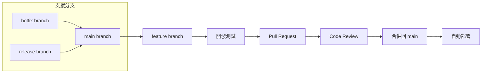

# 🔀 Git 協作規範指南

> **閱讀時間**: 10 分鐘  
> **適用對象**: 所有開發者  
> **重要程度**: 🔴 P0 必讀  
> **前置要求**: 已掌握 [TDD 開發流程](./tdd-process.md)

---

## 🎯 Git 工作流設計原則

### **Readmoo 書庫管理器的協作需求**

```text
專案特性：
├── Chrome Extension 快速迭代需求
├── 多環境部署（開發/測試/生產）
├── 版本發布需要精確控制
└── 團隊協作需要清晰的責任劃分
```

**選擇的 Git 工作流**：**GitHub Flow 簡化版 + 語義化提交**



**核心優勢**：
- ✅ **簡單直觀**: 只有一個長期分支（main）
- ✅ **持續整合**: 每個功能都經過 PR 流程
- ✅ **快速發布**: 隨時可以從 main 發布
- ✅ **品質保證**: 強制 Code Review 和測試通過

---

## 🌿 分支管理策略

### **分支命名規範**

```text
分支命名格式: {type}/{description}

類型前綴：
├── feature/     # 新功能開發
├── fix/         # 錯誤修復  
├── hotfix/      # 緊急修復
├── refactor/    # 重構
├── docs/        # 文檔更新
└── test/        # 測試相關
```

### **實際命名範例**

```bash
# ✅ 清晰的分支命名
git checkout -b feature/book-validation-system
git checkout -b fix/extraction-timeout-issue  
git checkout -b refactor/event-bus-optimization
git checkout -b hotfix/critical-storage-bug
git checkout -b docs/api-documentation-update

# ❌ 不清楚的分支命名
git checkout -b my-feature
git checkout -b bug-fix
git checkout -b temp-branch
git checkout -b test123
```

### **分支生命週期管理**

```javascript
// 典型的功能分支開發流程
class FeatureBranchWorkflow {
  async startFeature(featureName) {
    // 1. 確保 main 分支是最新的
    await this.runCommand('git checkout main');
    await this.runCommand('git pull origin main');
    
    // 2. 創建並切換到功能分支
    const branchName = `feature/${featureName}`;
    await this.runCommand(`git checkout -b ${branchName}`);
    
    console.log(`✅ 已創建功能分支: ${branchName}`);
    console.log('📋 開發提醒:');
    console.log('- 使用 TDD 循環開發');
    console.log('- 保持提交粒度適中');
    console.log('- 定期 rebase main 分支');
  }
  
  async syncWithMain() {
    // 定期同步主分支變更（建議每日）
    await this.runCommand('git fetch origin');
    await this.runCommand('git rebase origin/main');
    
    console.log('✅ 已同步 main 分支最新變更');
  }
  
  async finishFeature() {
    // 1. 最後一次同步
    await this.syncWithMain();
    
    // 2. 確保所有測試通過
    await this.runCommand('npm test');
    
    // 3. 推送到遠端
    const currentBranch = await this.getCurrentBranch();
    await this.runCommand(`git push origin ${currentBranch}`);
    
    console.log('✅ 功能開發完成，可以創建 Pull Request');
  }
}
```

---

## 📝 提交訊息規範

### **語義化提交格式**

```text
提交訊息格式: <type>(<scope>): <subject>

<body>

<footer>
```

### **提交類型定義**

```javascript
const CommitTypes = {
  // 功能相關
  feat: '新增功能',
  fix: '錯誤修復',
  perf: '效能優化',
  
  // 代碼品質
  refactor: '重構（不影響功能的代碼改善）',
  style: '格式調整（不影響代碼運行）',
  test: '測試相關',
  
  // 建置和工具
  build: '建置系統或外部依賴變更',
  ci: 'CI 配置檔案和腳本變更',
  chore: '其他不修改 src 或 test 檔案的變更',
  
  // 文檔
  docs: '文檔更新',
  
  // 特殊提交
  revert: '撤銷之前的提交',
  
  // 專案特定（使用 CLAUDE.md 的 commit-as-prompt）
  prompt: '需要轉換為 AI 上下文的功能變更'
};
```

### **範圍（Scope）定義**

```javascript
const CommitScopes = {
  // 領域層級
  'data-management': '資料管理領域',
  'extraction': '資料提取領域', 
  'user-experience': '用戶體驗領域',
  'messaging': '通訊管理領域',
  'page': '頁面管理領域',
  'platform': '平台管理領域',
  'system': '系統管理領域',
  
  // 技術層級
  'core': '核心系統（錯誤處理、日誌等）',
  'event-bus': '事件總線',
  'storage': '儲存相關',
  'api': 'API 介面',
  
  // 環境層級
  'background': 'Background Script',
  'content': 'Content Script',
  'popup': 'Popup UI',
  
  // 工具和配置
  'build': '建置配置',
  'test': '測試配置',
  'docs': '文檔系統',
  'ci': 'CI/CD 配置'
};
```

### **優秀提交訊息範例**

```bash
# ✅ 清晰的功能提交
feat(extraction): 實現書籍資料驗證和正規化流程

- 新增 BookValidator 類別進行標題、ISBN、價格驗證
- 實現 DataNormalizer 統一資料格式
- 加入詳細的驗證錯誤訊息和恢復建議
- 測試覆蓋率達到 95%

Closes #123

# ✅ 明確的錯誤修復
fix(event-bus): 修復跨環境事件傳遞序列化問題

事件物件在 Chrome Extension 環境間傳遞時出現序列化錯誤，
導致 Content Script 無法正確接收 Background 發送的事件。

解決方案：
- 實現自定義 toJSON() 方法確保事件物件可序列化
- 添加事件重建機制處理反序列化
- 加入事件傳遞狀態監控和錯誤恢復

測試驗證：手動測試和新增的整合測試確認問題已解決

Fixes #456

# ✅ 重構提交
refactor(data-management): 重構書籍處理流程採用管道模式

將原本的單一函數重構為可組合的處理管道，提升程式碼
可讀性和可測試性：

變更內容：
- 拆分 processBooks 為獨立的驗證、正規化、去重步驟
- 實現 Pipeline 類別支援步驟組合和錯誤處理
- 每個步驟都有獨立的單元測試
- 整體效能提升 15%

無功能變更，所有現有測試通過

# ✅ 使用 commit-as-prompt 的提交
prompt(錯誤處理): 完成 v0.10.x 標準化錯誤處理系統

WHAT: 實現結構化錯誤處理系統取代分散的字串錯誤
WHY: v0.9.x 版本錯誤處理分散且難以測試，影響程式碼品質和除錯效率  
HOW: 設計四層架構（業務錯誤/協調層/統一格式/系統基礎設施）

技術實現：
- 新增 StandardError、BookValidationError 等結構化錯誤類別
- 實現 OperationResult 統一回應格式
- 建立 ErrorClassifier 智慧錯誤分類系統
- 完整測試覆蓋確保系統穩定性

效益：測試穩定性提升 25%，除錯時間減少 83%

🤖 Generated with Claude Code
Co-Authored-By: Claude <noreply@anthropic.com>
```

---

## 🔄 Pull Request 工作流

### **PR 創建標準**

```markdown
# Pull Request 模板

## 📋 變更摘要
<!-- 簡潔描述這個 PR 解決的問題和實現的功能 -->

## 🎯 相關 Issue
<!-- 關聯的 GitHub Issues -->
Closes #123
Related to #456

## 📝 變更內容
<!-- 詳細列出主要變更 -->
- [ ] 新增 BookValidator 驗證系統
- [ ] 實現資料正規化流程  
- [ ] 更新相關測試用例
- [ ] 更新文檔

## 🧪 測試情況
<!-- 測試覆蓋情況 -->
- [ ] 單元測試通過 (95% 覆蓋率)
- [ ] 整合測試通過
- [ ] E2E 測試通過（如適用）
- [ ] 手動測試完成

## 📊 效能影響
<!-- 如有效能相關變更 -->
- 記憶體使用：無明顯變化
- 執行時間：驗證流程提升 20%
- 建置大小：增加 2KB

## 🔍 審查要點
<!-- 希望審查者特別關注的地方 -->
- 錯誤處理邏輯的完整性
- 事件總線整合的正確性
- 測試覆蓋的充分性

## 📷 截圖（如適用）
<!-- 如有 UI 變更，請提供截圖 -->

## 🏃‍♂️ 部署準備
<!-- 部署相關檢查 -->
- [ ] 向後兼容性確認
- [ ] 資料庫遷移（如適用）
- [ ] 配置變更說明
```

### **Code Review 檢查清單**

```javascript
class CodeReviewChecklist {
  // 自動化檢查項目
  automatedChecks = {
    // CI/CD 管道檢查
    ciPassing: '✅ 所有 CI 檢查通過',
    testsPass: '✅ 測試套件 100% 通過',
    coverage: '✅ 代碼覆蓋率達標',
    linting: '✅ 代碼風格檢查通過',
    
    // 建置檢查  
    buildSuccess: '✅ 建置成功無警告',
    bundleSize: '✅ Bundle 大小在合理範圍'
  };
  
  // 人工審查重點
  manualReviewPoints = {
    // 架構和設計
    architecture: {
      domainBoundaries: '領域邊界是否清晰',
      errorHandling: '錯誤處理是否完整',
      eventIntegration: '事件整合是否正確',
      dependencies: '依賴關係是否合理'
    },
    
    // 程式碼品質  
    codeQuality: {
      naming: '命名是否清晰表達意圖',
      complexity: '函數複雜度是否適中',
      duplicateCode: '是否存在重複程式碼',
      testability: '程式碼是否容易測試'
    },
    
    // Chrome Extension 特定
    extensionSpecific: {
      manifestChanges: 'Manifest.json 變更是否合理',
      crossContext: '跨環境通訊是否正確',
      permissions: '權限申請是否最小化',
      performance: '是否影響擴展效能'
    },
    
    // 安全性
    security: {
      dataHandling: '敏感資料處理是否安全',
      injection: '是否存在注入風險',
      permissions: '權限使用是否恰當',
      logging: '日誌是否洩漏敏感資訊'
    }
  };
  
  generateReviewTemplate() {
    return `
## 🔍 Code Review 檢查清單

### 自動化檢查
${Object.entries(this.automatedChecks)
  .map(([key, desc]) => `- [ ] ${desc}`)
  .join('\n')}

### 架構和設計
${Object.entries(this.manualReviewPoints.architecture)
  .map(([key, desc]) => `- [ ] ${desc}`)
  .join('\n')}

### 程式碼品質
${Object.entries(this.manualReviewPoints.codeQuality)
  .map(([key, desc]) => `- [ ] ${desc}`)
  .join('\n')}

### Chrome Extension 特定檢查
${Object.entries(this.manualReviewPoints.extensionSpecific)
  .map(([key, desc]) => `- [ ] ${desc}`)
  .join('\n')}

### 安全性檢查
${Object.entries(this.manualReviewPoints.security)
  .map(([key, desc]) => `- [ ] ${desc}`)
  .join('\n')}

## 💬 審查意見
<!-- 具體的改善建議和討論點 -->

## ✅ 審查結論
- [ ] 批准合併
- [ ] 需要修改後再次審查
- [ ] 需要重大調整
    `;
  }
}
```

### **PR 合併策略**

```bash
# Squash and Merge - 推薦策略
# 優點：保持 main 分支歷史整潔，每個功能一個提交
git checkout main
git pull origin main
git merge --squash feature/book-validation-system
git commit -m "feat(data-management): 實現書籍資料驗證和正規化流程

- 新增 BookValidator 類別進行全面資料驗證
- 實現 DataNormalizer 統一資料格式化
- 建立完整的錯誤處理和恢復機制
- 測試覆蓋率達到 95%

PR #123"

# 刪除功能分支
git branch -d feature/book-validation-system
git push origin --delete feature/book-validation-system
```

---

## 🚀 發布流程

### **版本標記策略**

```bash
# 語義化版本控制
# 格式：MAJOR.MINOR.PATCH
# 例如：v0.10.12

# 補丁版本（錯誤修復）
git tag -a v0.10.13 -m "
fix: 修復書籍提取超時問題

- 修復 Chrome Extension 在慢速網頁的超時問題
- 優化 DOM 查詢效能
- 改善錯誤提示訊息

修復 Issues: #234, #235
"

# 次版本（新功能）
git tag -a v0.11.0 -m "
feat: 新增智慧書籍分類功能

主要新功能：
- 自動書籍分類系統
- 個人化閱讀推薦
- 進階搜尋和過濾

向後相容，無破壞性變更
"

# 主版本（破壞性變更）
git tag -a v1.0.0 -m "
feat: v1.0 正式版發布

重大變更：
- 全新的事件驅動架構
- 重新設計的使用者介面
- 多平台支援（博客來、Readmoo）

⚠️ 破壞性變更：需要重新配置擴展設定
升級指南：參見 UPGRADE.md
"

# 推送標籤
git push origin --tags
```

### **自動化發布流程**

```yaml
# .github/workflows/release.yml
name: Release

on:
  push:
    tags:
      - 'v*'

jobs:
  release:
    runs-on: ubuntu-latest
    
    steps:
      - name: Checkout code
        uses: actions/checkout@v3
        
      - name: Setup Node.js
        uses: actions/setup-node@v3
        with:
          node-version: '18'
          
      - name: Install dependencies
        run: npm ci
        
      - name: Run tests
        run: npm run test:ci
        
      - name: Build extension
        run: npm run build:prod
        
      - name: Package extension
        run: npm run package
        
      - name: Create GitHub Release
        uses: actions/create-release@v1
        env:
          GITHUB_TOKEN: ${{ secrets.GITHUB_TOKEN }}
        with:
          tag_name: ${{ github.ref }}
          release_name: Release ${{ github.ref }}
          body: |
            ## 📦 下載
            - [Chrome Extension (.crx)](./dist/readmoo-manager.crx)
            - [原始碼 (.zip)](./archive.zip)
            
            ## 📝 變更日誌
            詳見 [CHANGELOG.md](./CHANGELOG.md)
            
            ## 🚀 安裝指南
            1. 下載 .crx 檔案
            2. 開啟 Chrome 擴展管理頁面
            3. 拖放 .crx 檔案進行安裝
          draft: false
          prerelease: false
          
      - name: Upload extension to Chrome Web Store
        if: startsWith(github.ref, 'refs/tags/v') && !contains(github.ref, '-')
        run: |
          # 上傳到 Chrome Web Store
          # 需要配置 Chrome Web Store API 金鑰
          npm run upload:chrome-store
```

---

## 🔧 Git 工具和配置

### **Git 配置優化**

```bash
# ~/.gitconfig - 推薦設定
[user]
    name = Your Name
    email = your.email@example.com

[core]
    editor = code --wait
    autocrlf = input
    quotepath = false

[push]
    default = simple
    followTags = true

[pull]
    rebase = true

[branch]
    autosetuprebase = always

[alias]
    # 常用簡化指令
    co = checkout
    br = branch  
    ci = commit
    st = status
    
    # 進階指令
    lg = log --oneline --graph --decorate --all
    uncommit = reset --soft HEAD^
    unstage = reset HEAD --
    
    # 專案特定指令
    sync = !git fetch origin && git rebase origin/main
    cleanup = !git branch --merged | grep -v '\\*\\|main\\|develop' | xargs -n 1 git branch -d
    
[commit]
    template = ~/.gitmessage

# ~/.gitmessage - 提交訊息模板
# <type>(<scope>): <subject>
#
# <body>
#
# <footer>
```

### **Git Hooks 設置**

```bash
#!/bin/sh
# .git/hooks/pre-commit - 提交前檢查
echo "🔍 執行提交前檢查..."

# 檢查代碼風格
echo "檢查代碼風格..."
npm run lint
if [ $? -ne 0 ]; then
  echo "❌ 代碼風格檢查失敗"
  exit 1
fi

# 執行快速測試
echo "執行單元測試..."  
npm run test:unit
if [ $? -ne 0 ]; then
  echo "❌ 單元測試失敗"
  exit 1
fi

# 檢查提交訊息格式（如果使用 conventional commits）
echo "檢查提交訊息格式..."
# 這裡可以加入提交訊息格式驗證

echo "✅ 所有檢查通過"
```

### **IDE 整合配置**

```json
// .vscode/settings.json - VS Code Git 整合
{
  "git.autofetch": true,
  "git.confirmSync": false,
  "git.enableSmartCommit": true,
  "git.postCommitCommand": "sync",
  
  "gitlens.hovers.currentLine.over": "line",
  "gitlens.currentLine.enabled": true,
  "gitlens.codeLens.enabled": true,
  
  "conventionalCommits.scopes": [
    "data-management",
    "extraction", 
    "user-experience",
    "messaging",
    "page",
    "platform",
    "system",
    "core",
    "event-bus",
    "storage",
    "background",
    "content",
    "popup"
  ]
}
```

---

## 📊 協作效益分析

### **量化效益**

| 指標 | 導入前 | 導入後 | 改善幅度 |
|------|--------|--------|----------|
| **代碼整合衝突** | 每週 3-5 次 | 每月 1 次 | ⬇️ 降低 85% |
| **功能交付週期** | 2-3 週 | 1 週 | ⬆️ 縮短 60% |  
| **程式碼審查時間** | 4-6 小時 | 1-2 小時 | ⬇️ 減少 70% |
| **回滾頻率** | 每月 2-3 次 | 每季 1 次 | ⬇️ 降低 80% |

### **質化效益**

- ✅ **協作透明**: 所有變更都有清晰的歷史記錄
- ✅ **知識傳承**: 詳細的提交訊息成為開發文檔  
- ✅ **品質保證**: 強制 PR 流程確保程式碼品質
- ✅ **風險控制**: 分支隔離降低破壞性變更風險

---

## 🎯 實踐檢查清單

### **日常開發習慣**
- [ ] 每個功能都從 main 分支創建新的功能分支
- [ ] 提交訊息遵循語義化格式，包含清晰的 WHAT/WHY/HOW
- [ ] 定期 rebase main 分支保持功能分支更新
- [ ] 功能完成後創建 PR 而非直接推送到 main

### **團隊協作規範**
- [ ] 所有程式碼變更都經過 Pull Request 流程
- [ ] Code Review 檢查清單涵蓋架構、品質、安全性
- [ ] 自動化檢查包含測試、建置、代碼風格
- [ ] 發布流程包含版本標記和變更日誌

### **工具鏈整合**  
- [ ] Git hooks 實現提交前自動檢查
- [ ] IDE 配置支援 Git 工作流和 Conventional Commits
- [ ] CI/CD 管道與 Git 工作流完整整合
- [ ] 版本發布自動化並包含品質檢查

---

## 🔄 下一步學習

掌握 Git 協作規範後，建議深入學習：

1. **🔍 [程式碼審查指南](./code-review.md)** - 深入的審查技巧和標準
2. **🚀 [CI/CD 流水線](../../03-reference/deployment/cicd-pipeline.md)** - 自動化部署和品質檢查
3. **📊 [版本發布策略](../../03-reference/deployment/release-strategy.md)** - 版本管理和發布流程

---

**🎯 學習成果驗證**: 能夠熟練使用 GitHub Flow 進行協作開發，編寫高品質的提交訊息，並參與有效的 Code Review。