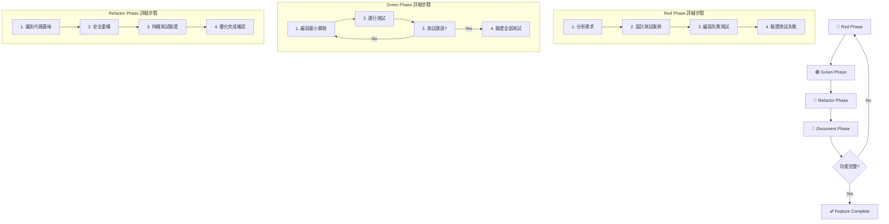

# 🔄 TDD 開發流程實踐指南

> **閱讀時間**: 20 分鐘  
> **適用對象**: 所有開發者  
> **重要程度**: 🔴 P0 必讀  
> **前置要求**: 已掌握 [領域設計](../architecture/domain-design.md) 和 [事件系統](../architecture/event-system.md)

---

## 🎯 為什麼堅持 TDD？

### **Readmoo 書庫管理器的複雜性挑戰**

Chrome Extension 開發環境帶來特殊的測試挑戰：

```text
多環境執行：Background ↔ Content Script ↔ Popup
跨域通訊：事件驅動 + 訊息傳遞
異步操作：DOM 操作 + 儲存 API + 網路請求
狀態管理：7個領域的複雜狀態協調
```

**傳統開發方式的問題**：
- ❌ **手動測試困難**: 多環境手動驗證耗時且易錯
- ❌ **回歸風險高**: 功能互相影響，改一處壞多處  
- ❌ **重構恐懼**: 沒有測試保護，不敢優化代碼
- ❌ **除錯時間長**: 問題定位困難，修復成本高

**TDD 的解決方案**：
- ✅ **設計驅動**: 先寫測試強迫思考介面設計
- ✅ **即時反饋**: 每個變更立即知道是否破壞功能
- ✅ **重構信心**: 完整測試覆蓋支持大膽重構
- ✅ **文檔作用**: 測試代碼是最準確的使用說明

---

## 🔴🟢🔵 Red-Green-Refactor 循環

### **四階段完整 TDD 流程**



### **實際範例：書籍驗證器開發**

#### **Phase 1: 🔴 Red - 編寫失敗測試**

```javascript
// tests/book-validator.test.js
describe('BookValidator', () => {
  let validator;
  
  beforeEach(() => {
    validator = new BookValidator();
  });
  
  describe('validateSingleBook', () => {
    it('should reject book with empty title', async () => {
      // Arrange - 準備測試資料
      const invalidBook = {
        title: '',
        author: 'Test Author',
        isbn: '9781234567890'
      };
      
      // Act & Assert - 驗證預期行為
      await expect(validator.validateSingleBook(invalidBook))
        .rejects
        .toThrow(BookValidationError);
      
      // 更詳細的驗證
      try {
        await validator.validateSingleBook(invalidBook);
      } catch (error) {
        expect(error.code).toBe('TITLE_REQUIRED');
        expect(error.message).toBe('書籍標題不能為空');
        expect(error.details).toHaveProperty('book', invalidBook);
      }
    });
    
    it('should accept valid book with all required fields', async () => {
      // Arrange
      const validBook = {
        title: 'JavaScript 權威指南',
        author: 'David Flanagan',
        isbn: '9787115275790',
        price: 580
      };
      
      // Act
      const result = await validator.validateSingleBook(validBook);
      
      // Assert
      expect(result).toEqual(
        expect.objectContaining({
          title: validBook.title,
          author: validBook.author,
          isbn: validBook.isbn,
          price: validBook.price,
          validatedAt: expect.any(String),
          validationVersion: 'v1.0'
        })
      );
    });
    
    it('should reject book with invalid ISBN format', async () => {
      // Arrange
      const bookWithInvalidISBN = {
        title: 'Test Book',
        author: 'Test Author',
        isbn: '12345' // 無效的 ISBN
      };
      
      // Act & Assert
      await expect(validator.validateSingleBook(bookWithInvalidISBN))
        .rejects
        .toThrow(BookValidationError);
      
      try {
        await validator.validateSingleBook(bookWithInvalidISBN);
      } catch (error) {
        expect(error.code).toBe('INVALID_ISBN');
      }
    });
  });
});

// 運行測試 - 應該全部失敗（Red Phase）
// npm test -- book-validator.test.js
// ❌ BookValidator is not defined
```

#### **Phase 2: 🟢 Green - 最小實現**

```javascript
// src/background/domains/data-management/services/book-validator.js
import { BookValidationError } from '../../../core/errors';

class BookValidator {
  constructor(dependencies = {}) {
    this.validationRules = dependencies.validationRules || {};
    this.messageGenerator = dependencies.messageGenerator;
  }
  
  async validateSingleBook(book) {
    // 最基本實現 - 讓測試通過
    
    // 檢查標題
    if (!book.title || book.title.trim().length === 0) {
      throw new BookValidationError(
        'TITLE_REQUIRED',
        '書籍標題不能為空',
        { book }
      );
    }
    
    // 檢查 ISBN 格式
    if (book.isbn && !this.isValidISBN(book.isbn)) {
      throw new BookValidationError(
        'INVALID_ISBN',
        'ISBN 格式不正確',
        { isbn: book.isbn, book }
      );
    }
    
    // 返回驗證後的書籍
    return {
      ...book,
      validatedAt: new Date().toISOString(),
      validationVersion: 'v1.0'
    };
  }
  
  // 簡單的 ISBN 驗證實現
  isValidISBN(isbn) {
    const cleanISBN = isbn.replace(/[-\s]/g, '');
    return /^[0-9]{10}$/.test(cleanISBN) || /^[0-9]{13}$/.test(cleanISBN);
  }
}

export { BookValidator };

// 運行測試 - 應該全部通過（Green Phase）
// npm test -- book-validator.test.js  
// ✅ All tests pass
```

#### **Phase 3: 🔵 Refactor - 重構優化**

```javascript
// 識別改進點並重構
class BookValidator {
  constructor(dependencies = {}) {
    this.validationRules = dependencies.validationRules || this.getDefaultRules();
    this.messageGenerator = dependencies.messageGenerator;
  }
  
  async validateSingleBook(book) {
    // 重構：使用驗證鏈模式
    const validationChain = [
      this.validateTitle,
      this.validateAuthor,
      this.validateISBN,
      this.validatePrice,
      this.validatePublicationDate
    ];
    
    let validatedBook = { ...book };
    
    for (const validator of validationChain) {
      validatedBook = await validator.call(this, validatedBook);
    }
    
    // 添加驗證元資料
    return this.addValidationMetadata(validatedBook);
  }
  
  // 將驗證邏輯拆分為獨立函數
  async validateTitle(book) {
    if (!book.title || book.title.trim().length === 0) {
      throw new BookValidationError(
        'TITLE_REQUIRED',
        this.getErrorMessage('TITLE_REQUIRED'),
        { book }
      );
    }
    
    if (book.title.length > this.validationRules.maxTitleLength) {
      throw new BookValidationError(
        'TITLE_TOO_LONG',
        this.getErrorMessage('TITLE_TOO_LONG'),
        { 
          book,
          maxLength: this.validationRules.maxTitleLength,
          actualLength: book.title.length
        }
      );
    }
    
    return book;
  }
  
  async validateISBN(book) {
    if (!book.isbn) return book;
    
    const cleanISBN = book.isbn.replace(/[-\s]/g, '');
    
    if (!this.isValidISBNFormat(cleanISBN)) {
      throw new BookValidationError(
        'INVALID_ISBN',
        this.getErrorMessage('INVALID_ISBN'),
        { isbn: book.isbn, book }
      );
    }
    
    // 進階驗證：檢查校驗碼
    if (!this.validateISBNChecksum(cleanISBN)) {
      throw new BookValidationError(
        'INVALID_ISBN_CHECKSUM',
        this.getErrorMessage('INVALID_ISBN_CHECKSUM'),
        { isbn: book.isbn, book }
      );
    }
    
    return {
      ...book,
      isbn: this.formatISBN(cleanISBN) // 標準化格式
    };
  }
  
  // 重構：提取配置和工具方法
  getDefaultRules() {
    return {
      maxTitleLength: 200,
      maxAuthorLength: 100,
      minPrice: 0,
      maxPrice: 10000
    };
  }
  
  getErrorMessage(code) {
    const messages = {
      'TITLE_REQUIRED': '書籍標題不能為空',
      'TITLE_TOO_LONG': '書籍標題過長',
      'INVALID_ISBN': 'ISBN 格式不正確',
      'INVALID_ISBN_CHECKSUM': 'ISBN 校驗碼錯誤'
    };
    
    return messages[code] || '驗證錯誤';
  }
  
  addValidationMetadata(book) {
    return {
      ...book,
      validatedAt: new Date().toISOString(),
      validationVersion: 'v1.1',
      validationRules: this.validationRules
    };
  }
}

// 運行測試 - 確保重構沒有破壞功能
// npm test -- book-validator.test.js
// ✅ All tests still pass after refactoring
```

#### **Phase 4: 📝 Document - 文檔更新**

```javascript
// 添加更多測試用例覆蓋重構後的功能
describe('BookValidator (Enhanced)', () => {
  it('should handle title length validation', async () => {
    const bookWithLongTitle = {
      title: 'A'.repeat(250), // 超過 200 字符限制
      author: 'Test Author'
    };
    
    await expect(validator.validateSingleBook(bookWithLongTitle))
      .rejects
      .toThrow('TITLE_TOO_LONG');
  });
  
  it('should format ISBN to standard format', async () => {
    const bookWithUnformattedISBN = {
      title: 'Test Book',
      author: 'Test Author',
      isbn: '978-7-115-27579-0' // 有分隔符
    };
    
    const result = await validator.validateSingleBook(bookWithUnformattedISBN);
    
    expect(result.isbn).toBe('9787115275790'); // 標準化格式
  });
});
```

---

## 🏗️ 架構層級 TDD 策略

### **領域層 TDD**

```javascript
// 領域協調器的 TDD 開發
describe('DataManagementCoordinator', () => {
  let coordinator;
  let mockDependencies;
  
  beforeEach(() => {
    mockDependencies = createMockDependencies();
    coordinator = new DataManagementCoordinator(mockDependencies);
  });
  
  // 📍 先寫測試定義期望行為
  it('should process books in correct sequence', async () => {
    // Arrange
    const rawBooks = createMockRawBooks(3);
    const validatedBooks = createMockValidatedBooks(3);
    const normalizedBooks = createMockNormalizedBooks(3);
    const uniqueBooks = createMockUniqueBooks(2); // 去重後少一本
    
    mockDependencies.bookValidator.validate
      .mockResolvedValue(OperationResult.success(validatedBooks));
    mockDependencies.dataNormalizer.normalize
      .mockResolvedValue(normalizedBooks);
    mockDependencies.duplicateDetector.process  
      .mockResolvedValue(uniqueBooks);
    mockDependencies.bookRepository.saveBooks
      .mockResolvedValue(OperationResult.success(uniqueBooks));
    
    // Act
    const result = await coordinator.processBooks(rawBooks);
    
    // Assert
    expect(result.success).toBe(true);
    expect(result.data).toEqual(uniqueBooks);
    expect(result.metadata.duplicatesRemoved).toBe(1);
    
    // 驗證調用順序
    expect(mockDependencies.bookValidator.validate).toHaveBeenCalledWith(rawBooks);
    expect(mockDependencies.dataNormalizer.normalize).toHaveBeenCalledWith(validatedBooks);
    expect(mockDependencies.duplicateDetector.process).toHaveBeenCalledWith(normalizedBooks);
    expect(mockDependencies.bookRepository.saveBooks).toHaveBeenCalledWith(uniqueBooks);
    
    // 驗證事件發射
    expect(mockDependencies.eventBus.emit).toHaveBeenCalledWith(
      'DATA_MANAGEMENT.BOOKS.PROCESSED',
      expect.objectContaining({
        bookCount: uniqueBooks.length
      })
    );
  });
});
```

### **跨領域整合 TDD**

```javascript
// 跨領域工作流的 TDD
describe('BookExtractionWorkflow Integration', () => {
  let workflow;
  let realEventBus;
  let mockDomains;
  
  beforeEach(async () => {
    // 使用真實事件總線但模擬領域
    realEventBus = new EventBus();
    mockDomains = setupMockDomains(realEventBus);
    workflow = new BookExtractionWorkflow(realEventBus);
  });
  
  it('should coordinate complete extraction workflow', async () => {
    // Arrange - 設置各領域的模擬響應
    mockDomains.page.setupMockResponse('PAGE.STATUS.CHECK_READY', {
      success: true,
      data: { ready: true, url: 'https://readmoo.com/explore' }
    });
    
    mockDomains.extraction.setupMockResponse('EXTRACTION.BOOKS.EXTRACT', {
      success: true,
      data: createMockBooks(5)
    });
    
    mockDomains.dataManagement.setupMockResponse('DATA_MANAGEMENT.BOOKS.PROCESS', {
      success: true,
      data: createMockProcessedBooks(5)
    });
    
    // Act - 執行完整工作流
    const result = await workflow.execute();
    
    // Assert - 驗證結果和事件流
    expect(result.success).toBe(true);
    expect(result.data).toHaveLength(5);
    
    // 驗證事件順序
    const emittedEvents = realEventBus.getEmittedEvents();
    expect(emittedEvents).toEqual([
      expect.objectContaining({ name: 'PAGE.STATUS.CHECK_READY' }),
      expect.objectContaining({ name: 'EXTRACTION.BOOKS.EXTRACT' }),
      expect.objectContaining({ name: 'DATA_MANAGEMENT.BOOKS.PROCESS' }),
      expect.objectContaining({ name: 'UX.EXTRACTION.COMPLETED' })
    ]);
  });
  
  it('should handle domain failure gracefully', async () => {
    // Arrange - 模擬頁面檢查失敗
    mockDomains.page.setupMockResponse('PAGE.STATUS.CHECK_READY', {
      success: false,
      error: { code: 'PAGE_NOT_READY', message: '頁面未就緒' }
    });
    
    // Act
    const result = await workflow.execute();
    
    // Assert
    expect(result.success).toBe(false);
    expect(result.error.code).toBe('PAGE_NOT_READY');
    
    // 驗證錯誤事件
    const emittedEvents = realEventBus.getEmittedEvents();
    expect(emittedEvents).toContainEqual(
      expect.objectContaining({ name: 'UX.EXTRACTION.FAILED' })
    );
  });
});
```

---

## 🧪 Chrome Extension 特殊測試場景

### **跨環境通訊測試**

```javascript
// 測試 Background ↔ Content Script 通訊
describe('Chrome Extension Cross-Context Communication', () => {
  let backgroundEventBus;
  let contentEventBus;  
  let messageBridge;
  
  beforeEach(() => {
    // 模擬 Chrome Extension API
    global.chrome = {
      runtime: {
        sendMessage: jest.fn(),
        onMessage: {
          addListener: jest.fn()
        }
      },
      tabs: {
        sendMessage: jest.fn(),
        query: jest.fn()
      }
    };
    
    backgroundEventBus = new EventBus();
    contentEventBus = new EventBus();
    messageBridge = new ChromeMessageBridge(backgroundEventBus);
  });
  
  it('should handle background to content script communication', async () => {
    // Arrange
    const testPayload = { bookCount: 5 };
    chrome.tabs.query.mockResolvedValue([
      { id: 123, url: 'https://readmoo.com' }
    ]);
    chrome.tabs.sendMessage.mockResolvedValue({ success: true });
    
    // Act
    await backgroundEventBus.emit('SEND_TO_CONTENT', {
      eventName: 'EXTRACTION.PROGRESS.UPDATE',
      data: testPayload
    });
    
    // Assert
    expect(chrome.tabs.query).toHaveBeenCalled();
    expect(chrome.tabs.sendMessage).toHaveBeenCalledWith(
      123,
      expect.objectContaining({
        type: 'EVENT_EMIT',
        eventName: 'EXTRACTION.PROGRESS.UPDATE',
        payload: testPayload
      })
    );
  });
  
  it('should handle request-response across contexts', async () => {
    // Arrange
    const requestPayload = { url: 'https://readmoo.com/explore' };
    const responsePayload = { ready: true, bookElements: 10 };
    
    chrome.runtime.sendMessage.mockImplementation((message, callback) => {
      // 模擬 Content Script 回應
      setTimeout(() => {
        callback({
          success: true,
          data: responsePayload
        });
      }, 0);
      return true;
    });
    
    // Act
    const result = await contentEventBus.request(
      'PAGE.STATUS.CHECK_READY',
      requestPayload
    );
    
    // Assert
    expect(result.success).toBe(true);
    expect(result.data).toEqual(responsePayload);
  });
});
```

### **DOM 操作測試**

```javascript
// Content Script DOM 操作測試
describe('BookDataExtractor', () => {
  let extractor;
  let mockDocument;
  
  beforeEach(() => {
    // 建立模擬 DOM 環境
    mockDocument = createMockReadmooPage();
    global.document = mockDocument;
    
    extractor = new BookDataExtractor({
      quality: 'high',
      timeout: 5000
    });
  });
  
  it('should extract books from Readmoo page', async () => {
    // Arrange
    const mockBookElements = createMockBookElements(3);
    mockDocument.querySelectorAll.mockReturnValue(mockBookElements);
    
    // Act
    const result = await extractor.extractFromPage();
    
    // Assert
    expect(result).toHaveLength(3);
    expect(result[0]).toEqual(
      expect.objectContaining({
        title: expect.any(String),
        author: expect.any(String),
        price: expect.any(Number),
        isbn: expect.any(String)
      })
    );
  });
  
  it('should handle missing book elements gracefully', async () => {
    // Arrange
    mockDocument.querySelectorAll.mockReturnValue([]);
    
    // Act & Assert
    await expect(extractor.extractFromPage())
      .rejects
      .toThrow(BookExtractionError);
  });
  
  it('should retry extraction on transient failures', async () => {
    // Arrange
    let attemptCount = 0;
    mockDocument.querySelectorAll.mockImplementation(() => {
      attemptCount++;
      if (attemptCount < 3) {
        return []; // 前兩次失敗
      }
      return createMockBookElements(2); // 第三次成功
    });
    
    // Act
    const result = await extractor.extractFromPage();
    
    // Assert
    expect(result).toHaveLength(2);
    expect(attemptCount).toBe(3);
  });
});
```

---

## 📊 TDD 指標監控

### **測試覆蓋率管理**

```javascript
// jest.config.js
module.exports = {
  collectCoverageFrom: [
    'src/**/*.js',
    '!src/**/*.test.js',
    '!src/manifest.json'
  ],
  coverageThreshold: {
    global: {
      branches: 80,
      functions: 80,
      lines: 80,
      statements: 80
    },
    // 核心領域要求更高覆蓋率
    './src/background/domains/data-management/': {
      branches: 90,
      functions: 90,
      lines: 90,
      statements: 90
    },
    './src/background/domains/extraction/': {
      branches: 90,
      functions: 90,
      lines: 90,
      statements: 90
    }
  },
  coverageReporters: ['text', 'lcov', 'html']
};

// package.json scripts
{
  "scripts": {
    "test": "jest",
    "test:watch": "jest --watch",
    "test:coverage": "jest --coverage",
    "test:coverage:report": "jest --coverage && open coverage/lcov-report/index.html"
  }
}
```

### **測試執行監控**

```javascript
// test-monitor.js - 測試執行監控腳本
class TestMonitor {
  constructor() {
    this.metrics = {
      totalTests: 0,
      passedTests: 0,
      failedTests: 0,
      skippedTests: 0,
      executionTime: 0,
      coveragePercentage: 0
    };
    
    this.history = [];
  }
  
  recordTestRun(results) {
    const testRun = {
      timestamp: new Date().toISOString(),
      metrics: {
        ...results,
        passRate: (results.passedTests / results.totalTests * 100).toFixed(2)
      },
      buildNumber: process.env.BUILD_NUMBER || 'local',
      gitCommit: process.env.GIT_COMMIT || 'unknown'
    };
    
    this.history.push(testRun);
    
    // 分析測試趨勢
    this.analyzeTrends();
    
    // 生成報告
    this.generateReport(testRun);
  }
  
  analyzeTrends() {
    if (this.history.length < 2) return;
    
    const current = this.history[this.history.length - 1];
    const previous = this.history[this.history.length - 2];
    
    const trends = {
      passRateChange: current.metrics.passRate - previous.metrics.passRate,
      executionTimeChange: current.metrics.executionTime - previous.metrics.executionTime,
      coverageChange: current.metrics.coveragePercentage - previous.metrics.coveragePercentage
    };
    
    // 警報檢查
    if (trends.passRateChange < -5) {
      console.warn('⚠️ 測試通過率下降超過 5%');
    }
    
    if (trends.executionTimeChange > 10000) {
      console.warn('⚠️ 測試執行時間增加超過 10 秒');  
    }
    
    if (trends.coverageChange < -2) {
      console.warn('⚠️ 測試覆蓋率下降超過 2%');
    }
  }
  
  generateReport(testRun) {
    console.log(`
📊 測試執行報告
═══════════════════════════════════════
⏰ 執行時間: ${new Date(testRun.timestamp).toLocaleString()}
🔢 總測試數: ${testRun.metrics.totalTests}
✅ 通過: ${testRun.metrics.passedTests}
❌ 失敗: ${testRun.metrics.failedTests}
⏭️ 跳過: ${testRun.metrics.skippedTests}
📈 通過率: ${testRun.metrics.passRate}%
🕐 執行時間: ${(testRun.metrics.executionTime / 1000).toFixed(2)}s
📊 覆蓋率: ${testRun.metrics.coveragePercentage}%
🏗️ 建置: ${testRun.buildNumber}
💾 提交: ${testRun.gitCommit.substring(0, 8)}
═══════════════════════════════════════
    `);
  }
}
```

---

## 🚀 TDD 最佳實踐

### **測試命名規範**

```javascript
// ✅ 清晰的測試命名
describe('BookValidator', () => {
  describe('validateSingleBook', () => {
    // 格式：should [預期行為] when [特定條件]
    it('should throw BookValidationError when title is empty', async () => {});
    it('should return validated book when all fields are valid', async () => {});
    it('should normalize ISBN format when ISBN contains dashes', async () => {});
    
    // 格式：should [預期行為] for [特定場景]
    it('should reject book for invalid ISBN checksum', async () => {});
    it('should accept book for valid ISBN-13 format', async () => {});
  });
});

// ❌ 不清楚的測試命名
describe('BookValidator', () => {
  it('test title', () => {}); // 太模糊
  it('validates book correctly', () => {}); // 不明確
  it('should work', () => {}); // 無意義
});
```

### **測試數據管理**

```javascript
// test-data-factory.js - 測試數據工廠
class TestDataFactory {
  static createValidBook(overrides = {}) {
    return {
      id: generateId(),
      title: 'JavaScript 權威指南',
      author: 'David Flanagan',
      isbn: '9787115275790',
      price: 580,
      publisher: 'O\'Reilly Media',
      publishedDate: '2020-01-01',
      ...overrides
    };
  }
  
  static createInvalidBook(field, value) {
    const book = this.createValidBook();
    book[field] = value;
    return book;
  }
  
  static createBookList(count, factory = this.createValidBook) {
    return Array.from({ length: count }, (_, index) => 
      factory({ 
        id: `book-${index + 1}`,
        title: `Book ${index + 1}`
      })
    );
  }
  
  static createMockReadmooPage(bookCount = 5) {
    const bookElements = Array.from({ length: bookCount }, (_, index) => ({
      querySelector: jest.fn((selector) => {
        const selectors = {
          '.title': { textContent: `Book ${index + 1}` },
          '.author': { textContent: `Author ${index + 1}` },
          '.price': { textContent: `$${(index + 1) * 100}` },
          '.isbn': { textContent: `97812345678${index}0` }
        };
        return selectors[selector] || null;
      })
    }));
    
    return {
      querySelectorAll: jest.fn().mockReturnValue(bookElements),
      readyState: 'complete'
    };
  }
}
```

### **測試工具函數**

```javascript
// test-utils.js - 測試工具函數
export const TestUtils = {
  // 異步測試工具
  async waitFor(condition, timeout = 5000, interval = 100) {
    const start = Date.now();
    
    while (Date.now() - start < timeout) {
      if (await condition()) {
        return true;
      }
      await new Promise(resolve => setTimeout(resolve, interval));
    }
    
    throw new Error(`等待條件超時 (${timeout}ms)`);
  },
  
  // 事件測試工具
  createMockEventBus() {
    const events = [];
    const requests = new Map();
    
    return {
      emit: jest.fn().mockImplementation(async (eventName, payload) => {
        events.push({ type: 'emit', eventName, payload, timestamp: Date.now() });
      }),
      
      request: jest.fn().mockImplementation(async (eventName, payload) => {
        const handler = requests.get(eventName);
        if (!handler) {
          throw new Error(`No request handler for: ${eventName}`);
        }
        return handler(payload);
      }),
      
      on: jest.fn(),
      onRequest: jest.fn().mockImplementation((eventName, handler) => {
        requests.set(eventName, handler);
      }),
      
      // 測試專用方法
      getEmittedEvents: () => events,
      clearEvents: () => events.length = 0
    };
  },
  
  // Chrome API 模擬工具
  createMockChromeAPI() {
    return {
      storage: {
        local: {
          get: jest.fn().mockResolvedValue({}),
          set: jest.fn().mockResolvedValue(),
          remove: jest.fn().mockResolvedValue()
        }
      },
      runtime: {
        sendMessage: jest.fn(),
        onMessage: { addListener: jest.fn() }
      },
      tabs: {
        query: jest.fn(),
        sendMessage: jest.fn()
      }
    };
  }
};
```

---

## 📈 TDD 效益評估

### **量化指標**

| 指標 | 導入前 | 導入後 | 改善幅度 |
|------|--------|--------|----------|
| **缺陷發現時間** | 開發完成後 | 開發過程中 | ⬆️ 提前 80% |
| **修復成本** | 高（影響範圍大） | 低（局部修改） | ⬇️ 降低 70% |
| **回歸風險** | 高（手動驗證） | 低（自動化測試） | ⬇️ 降低 90% |
| **重構信心** | 低（害怕破壞功能） | 高（測試保護） | ⬆️ 提升 85% |

### **質化效益**

- ✅ **設計改善**: 先寫測試促使思考介面設計
- ✅ **文檔作用**: 測試代碼成為最準確的使用說明
- ✅ **團隊協作**: 統一的測試標準提升協作效率
- ✅ **知識傳承**: 新人可通過測試理解系統行為

---

## 🎯 實踐檢查清單

### **個人開發習慣**
- [ ] 每個新功能都從編寫失敗測試開始
- [ ] 實現代碼時只寫讓測試通過的最小代碼
- [ ] 測試通過後立即進行代碼重構和優化
- [ ] 每次提交前確保所有測試都通過

### **測試品質標準**
- [ ] 測試命名清晰表達預期行為和測試條件
- [ ] 每個測試只驗證一個特定行為
- [ ] 測試資料使用工廠模式管理，避免硬編碼
- [ ] 核心業務邏輯達到 90% 以上測試覆蓋率

### **團隊協作規範**  
- [ ] 程式碼審查時重點檢查測試品質
- [ ] 破壞測試的變更必須立即修復
- [ ] 定期審查測試套件，移除過時測試
- [ ] 新人入職培訓包含 TDD 實踐指導

---

## 🔄 下一步學習

掌握 TDD 流程後，建議深入學習：

1. **🧪 [測試金字塔實踐](../testing/test-pyramid.md)** - 完整的測試策略設計
2. **🔍 [代碼審查指南](./code-review.md)** - TDD 品質檢查要點
3. **📊 [效能監控體系](../../03-reference/performance/monitoring-system.md)** - 測試效能優化

---

**🎯 學習成果驗證**: 能夠使用 TDD 方式獨立開發一個完整功能，包括單元測試、整合測試和跨環境測試。