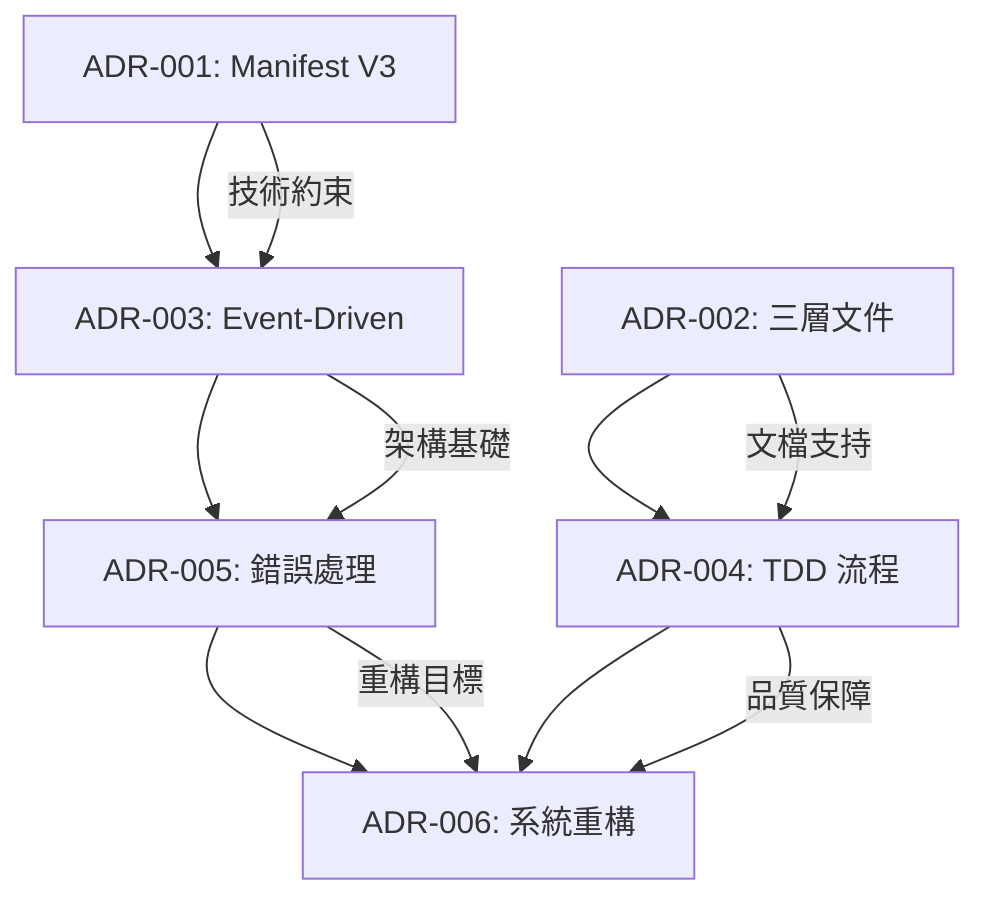

# 📋 架構決策記錄 (ADR)

> **第三層參考文件** - 重要技術和架構決策的歷史記錄  
> **適用對象**: 架構師、技術主管、資深開發者  
> **預期閱讀時間**: 45-60 分鐘  

## 🎯 概述

本文件記錄 Readmoo 書庫提取器專案的重要架構決策記錄（Architecture Decision Records, ADR），包含決策背景、考量因素、選擇方案和後果影響。幫助團隊理解架構演進的歷史脈絡和決策邏輯。

## 📏 ADR 記錄格式標準

### ADR 標準模板

```markdown
# ADR-{編號}: {決策簡述}

**狀態**: {已提案|已接受|已棄用|已取代}  
**決策者**: {決策負責人}  
**決策日期**: {YYYY-MM-DD}  
**技術債務**: {無|低|中|高}  

## 🎯 背景與問題

{描述需要做決策的背景情況和具體問題}

## 🤔 考慮的方案

### 方案 A: {方案名稱}
- **優點**: {列出優勢}
- **缺點**: {列出劣勢}
- **實施成本**: {評估}
- **風險評估**: {評估}

### 方案 B: {方案名稱}
{同上格式}

## ✅ 決策

{描述最終選擇的方案和理由}

## 🔄 後果影響

### 正面影響
- {影響1}
- {影響2}

### 負面影響  
- {影響1}
- {影響2}

### 未來考量
- {考量1}
- {考量2}

## 🔗 相關決策

- ADR-{編號}: {相關決策}
```

## 📚 架構決策記錄清單

### 核心架構決策

| ADR 編號 | 決策標題 | 狀態 | 決策日期 | 影響範圍 |
|---------|---------|------|----------|----------|
| [ADR-001](#adr-001) | Chrome Extension Manifest V3 採用 | 已接受 | 2025-08-10 | 整體架構 |
| [ADR-002](#adr-002) | 三層文件管理架構設計 | 已接受 | 2025-08-25 | 文件管理 |
| [ADR-003](#adr-003) | Event-Driven 架構模式 | 已接受 | 2025-08-28 | 系統架構 |
| [ADR-004](#adr-004) | TDD 開發流程標準化 | 已接受 | 2025-09-01 | 開發流程 |
| [ADR-005](#adr-005) | 錯誤處理統一化策略 | 已接受 | 2025-09-04 | 錯誤管理 |
| [ADR-006](#adr-006) | 系統化重構方法論 | 已接受 | 2025-09-05 | 程式碼品質 |

---

## ADR-001: Chrome Extension Manifest V3 採用

**狀態**: 已接受  
**決策者**: 專案架構師  
**決策日期**: 2025-08-10  
**技術債務**: 中  

### 🎯 背景與問題

Google Chrome 宣布將於 2024 年停止支援 Manifest V2，要求所有 Chrome Extension 遷移至 Manifest V3。新的書庫提取器專案需要選擇適當的 Extension 架構基礎。

### 🤔 考慮的方案

#### 方案 A: 使用 Manifest V2 (舊版)
- **優點**: 
  - 開發資源豐富，社群支援完整
  - API 功能強大，限制較少
  - 現有工具和庫支援良好
- **缺點**:
  - 即將被棄用，未來無法上架 Chrome Web Store
  - 安全性較低，容易被濫用
  - 不符合現代安全標準
- **實施成本**: 低
- **風險評估**: 高（未來不可持續）

#### 方案 B: 直接採用 Manifest V3 (新版)
- **優點**:
  - 符合未來趨勢，可長期維護
  - 安全性更高，權限管理更精細
  - 效能優化，Service Worker 模式
- **缺點**:
  - 學習曲線陡峭，開發資源較少
  - 某些 API 功能受限
  - 需要適應新的開發模式
- **實施成本**: 高
- **風險評估**: 中（技術挑戰但長期穩定）

#### 方案 C: 先使用 V2 後期遷移
- **優點**:
  - 快速啟動開發
  - 利用現有經驗
- **缺點**:
  - 需要額外遷移成本
  - 可能面臨兩套架構維護
- **實施成本**: 極高（雙重開發）
- **風險評估**: 高

### ✅ 決策

**選擇方案 B**: 直接採用 Manifest V3 架構

**決策理由**:
1. 技術前瞻性：符合 Google 長期發展方向
2. 安全性提升：減少潛在安全風險
3. 避免遷移成本：一次性投資避免後續重構
4. 學習機會：團隊技術能力提升

### 🔄 後果影響

#### 正面影響
- 專案具備長期可維護性
- 提升團隊 Modern Web Extension 開發能力
- 安全性和效能表現優異
- 符合 Chrome Web Store 上架要求

#### 負面影響
- 初期開發速度較慢
- 需要投入更多學習成本
- 某些複雜功能實現困難

#### 未來考量
- 持續關注 Manifest V3 API 更新
- 建立最佳實踐文件庫
- 培養團隊相關技能

### 🔗 相關決策
- ADR-003: Event-Driven 架構模式（V3 Service Worker 導致）

---

## ADR-002: 三層文件管理架構設計

**狀態**: 已接受  
**決策者**: 專案經理、技術主管  
**決策日期**: 2025-08-25  
**技術債務**: 低  

### 🎯 背景與問題

專案快速發展過程中，文件管理變得複雜且缺乏一致性。不同層級的資訊需要不同的詳細程度和更新頻率，需要設計一個系統化的文件管理架構。

### 🤔 考慮的方案

#### 方案 A: 平面化文件結構
- **優點**: 簡單直觀，易於維護
- **缺點**: 缺乏層次，難以管理複雜資訊
- **實施成本**: 低
- **風險評估**: 中（擴展性不足）

#### 方案 B: 三層文件管理架構
- **優點**: 
  - 清晰的資訊層次
  - 不同受眾的專屬內容
  - 漸進式詳細程度
- **缺點**: 
  - 初期設計複雜
  - 需要維護多層文件
- **實施成本**: 中
- **風險評估**: 低

#### 方案 C: 動態生成文件系統
- **優點**: 自動化程度高
- **缺點**: 技術複雜度極高，缺乏靈活性
- **實施成本**: 極高
- **風險評估**: 高

### ✅ 決策

**選擇方案 B**: 三層文件管理架構

**架構設計**:
```markdown
# 三層文件架構

## 第一層：快速導覽 (30分鐘內閱讀完成)
- 目標受眾：新加入成員、快速了解者
- 內容重點：核心概念、主要功能、快速上手
- 更新頻率：重大版本更新時

## 第二層：深度理解 (1-2小時閱讀完成)  
- 目標受眾：開發者、維運人員
- 內容重點：技術細節、實作指引、最佳實踐
- 更新頻率：功能更新時

## 第三層：完整參考 (按需深入研讀)
- 目標受眾：專家、特定領域深度使用者
- 內容重點：完整規範、進階主題、歷史脈絡
- 更新頻率：重要變更或專題研究時
```

### 🔄 後果影響

#### 正面影響
- 大幅提升文件使用效率
- 不同層級使用者都能快速找到所需資訊
- 建立了可擴展的知識管理體系
- 降低了新成員的學習曲線

#### 負面影響
- 文件維護工作量增加
- 需要確保各層文件間的一致性
- 初期建立成本較高

#### 未來考量
- 建立自動化檢查機制確保文件同步
- 開發文件生成工具提升效率
- 定期評估文件架構的適用性

### 🔗 相關決策
- ADR-004: TDD 開發流程標準化（影響文件更新流程）

---

## ADR-003: Event-Driven 架構模式

**狀態**: 已接受  
**決策者**: 系統架構師  
**決策日期**: 2025-08-28  
**技術債務**: 中  

### 🎯 背景與問題

Chrome Extension Manifest V3 使用 Service Worker 替代 Background Page，導致傳統的 RPC 通訊模式不再適用。需要重新設計 Extension 內部組件間的通訊架構。

### 🤔 考慮的方案

#### 方案 A: 直接使用 Chrome Message API
- **優點**: 簡單直接，Chrome 原生支援
- **缺點**: 缺乏型別安全，錯誤處理困難
- **實施成本**: 低
- **風險評估**: 中（維護性差）

#### 方案 B: Event-Driven 架構模式
- **優點**:
  - 組件間解耦
  - 易於測試和維護
  - 支援中間件機制
  - 型別安全
- **缺點**:
  - 學習曲線較陡
  - 初期實作複雜
- **實施成本**: 中
- **風險評估**: 低

#### 方案 C: 第三方狀態管理庫 (如 Redux)
- **優點**: 成熟的生態系統
- **缺點**: 過度複雜，增加包體積
- **實施成本**: 高
- **風險評估**: 中

### ✅ 決策

**選擇方案 B**: Event-Driven 架構模式

**核心設計**:
```javascript
// 事件驅動架構核心組件
class ExtensionEventBus {
  constructor() {
    this.handlers = new Map();
    this.middlewares = [];
  }

  // 事件註冊
  on(eventType, handler) { }
  
  // 事件發送
  async emit(eventType, payload) { }
  
  // 中間件支援
  use(middleware) { }
}

// 標準化事件結構
class ExtensionMessage {
  constructor(type, payload, metadata) {
    this.id = generateId();
    this.type = type;
    this.payload = payload;
    this.metadata = metadata;
  }
}
```

### 🔄 後果影響

#### 正面影響
- 組件間高度解耦，易於單元測試
- 統一的錯誤處理和日誌機制
- 支援中間件擴展（驗證、日誌、限流等）
- 型別安全，減少運行時錯誤

#### 負面影響
- 增加了系統複雜度
- 團隊需要學習新的開發模式
- 調試時事件流跟蹤較困難

#### 未來考量
- 建立事件流可視化調試工具
- 完善中間件生態系統
- 監控事件系統效能表現

### 🔗 相關決策
- ADR-001: Chrome Extension Manifest V3 採用（技術基礎）
- ADR-005: 錯誤處理統一化策略（實作細節）

---

## ADR-004: TDD 開發流程標準化

**狀態**: 已接受  
**決策者**: 開發團隊、技術主管  
**決策日期**: 2025-09-01  
**技術債務**: 低  

### 🎯 背景與問題

專案發展初期缺乏統一的開發流程，代碼品質不一致，bug 修復成本高。需要建立標準化的開發流程以確保代碼品質和團隊協作效率。

### 🤔 考慮的方案

#### 方案 A: 傳統瀑布式開發
- **優點**: 流程清晰，文件完整
- **缺點**: 反應速度慢，不適合敏捷環境
- **實施成本**: 中
- **風險評估**: 高（不符合專案需求）

#### 方案 B: TDD (Test-Driven Development)
- **優點**:
  - 代碼品質高，bug 率低
  - 重構安全，易於維護
  - 文件化測試，規格清晰
- **缺點**:
  - 學習曲線陡峭
  - 初期開發速度較慢
- **實施成本**: 中
- **風險評估**: 低

#### 方案 C: 純敏捷開發（無測試約束）
- **優點**: 開發速度快，靈活性高
- **缺點**: 代碼品質無保障，技術債務累積快
- **實施成本**: 低
- **風險評估**: 高

### ✅ 決策

**選擇方案 B**: TDD 開發流程標準化

**實作架構**:
```markdown
# TDD 四階段流程

## Phase 1: 功能設計 (RED)
- lavender-interface-designer: 功能規劃和需求分析
- 建立清楚的功能需求和設計規範

## Phase 2: 測試設計 (RED) 
- sage-test-architect: 測試案例設計和實作
- 確保測試先行的開發原則

## Phase 3: 實作規劃 (GREEN)
- pepper-test-implementer: 實作策略規劃
- 提供完整實作指引

## Phase 4: TDD 驅動重構 (REFACTOR)
- cinnamon-refactor-owl: 重構設計和執行
- 改善程式碼品質和架構
```

### 🔄 後果影響

#### 正面影響
- 代碼品質顯著提升（目標測試覆蓋率 100%）
- 重構更加安全和有信心
- 團隊協作模式統一化
- 文件化測試成為活文檔

#### 負面影響
- 初期團隊需要學習適應
- 短期開發速度可能較慢
- 需要投入額外的測試基礎設施

#### 未來考量
- 持續改進 TDD 工作流程
- 建立 TDD 最佳實踐文件庫
- 定期評估和調整流程效果

### 🔗 相關決策
- ADR-002: 三層文件管理架構（支援 TDD 文檔化）
- ADR-006: 系統化重構方法論（TDD 重構階段）

---

## ADR-005: 錯誤處理統一化策略

**狀態**: 已接受  
**決策者**: 系統架構師、開發團隊  
**決策日期**: 2025-09-04  
**技術債務**: 中  

### 🎯 背景與問題

專案中的錯誤處理機制不統一，導致使用者體驗不一致，除錯困難，且缺乏有效的錯誤監控和恢復機制。

### 🤔 考慮的方案

#### 方案 A: 分散式錯誤處理
- **優點**: 各模組獨立處理，靈活性高
- **缺點**: 不一致，難以統一管理和監控
- **實施成本**: 低
- **風險評估**: 高（維護性差）

#### 方案 B: 統一化錯誤處理系統
- **優點**:
  - 一致的錯誤體驗
  - 集中式錯誤監控
  - 標準化恢復機制
- **缺點**:
  - 實作複雜度較高
  - 需要重構現有代碼
- **實施成本**: 中
- **風險評估**: 低

#### 方案 C: 第三方錯誤監控服務
- **優點**: 功能完整，免維護
- **缺點**: 成本高，隱私風險，依賴外部服務
- **實施成本**: 低
- **風險評估**: 中

### ✅ 決策

**選擇方案 B**: 統一化錯誤處理系統

**系統設計**:
```javascript
// 錯誤分類體系
class ErrorClassifier {
  static ERROR_TYPES = {
    VALIDATION_ERROR: 'validation',
    NETWORK_ERROR: 'network',
    PARSING_ERROR: 'parsing',
    STORAGE_ERROR: 'storage',
    PERMISSION_ERROR: 'permission',
    SYSTEM_ERROR: 'system'
  };
}

// 統一錯誤處理器
class UnifiedErrorHandler {
  constructor() {
    this.strategies = new Map();
    this.monitors = [];
  }

  handle(error, context) {
    // 錯誤分類
    const errorType = this.classify(error);
    
    // 執行處理策略
    const strategy = this.strategies.get(errorType);
    if (strategy) {
      return strategy.handle(error, context);
    }
    
    // 預設處理
    return this.defaultHandler(error, context);
  }
}
```

### 🔄 後果影響

#### 正面影響
- 使用者體驗一致性大幅提升
- 錯誤監控和分析能力增強
- 開發者除錯效率提高
- 系統穩定性和恢復能力提升

#### 負面影響
- 需要重構大量現有錯誤處理代碼
- 系統複雜度增加
- 團隊需要學習新的錯誤處理模式

#### 未來考量
- 持續完善錯誤分類和處理策略
- 建立錯誤趨勢分析和預警機制
- 考慮引入 AI 輔助的智能錯誤診斷

### 🔗 相關決策
- ADR-003: Event-Driven 架構模式（錯誤事件傳播）
- ADR-006: 系統化重構方法論（錯誤處理重構）

---

## ADR-006: 系統化重構方法論

**狀態**: 已接受  
**決策者**: 技術主管、架構師  
**決策日期**: 2025-09-05  
**技術債務**: 高  

### 🎯 背景與問題

專案發展到 v0.11.0 版本時，累積了 3760 個 lint 錯誤和大量技術債務。需要制定系統化的重構方法論來改善代碼品質，同時不影響功能開發。

### 🤔 考慮的方案

#### 方案 A: 大爆炸式重構
- **優點**: 一次性解決所有問題
- **缺點**: 風險極高，可能造成長期開發停滯
- **實施成本**: 極高
- **風險評估**: 極高

#### 方案 B: 系統化漸進重構
- **優點**:
  - 風險可控
  - 持續交付不中斷
  - 分階段驗證效果
- **缺點**:
  - 時程較長
  - 需要精密規劃
- **實施成本**: 中
- **風險評估**: 低

#### 方案 C: 選擇性重構
- **優點**: 成本最低，影響最小
- **缺點**: 無法根本解決問題，技術債務持續累積
- **實施成本**: 低
- **風險評估**: 中

### ✅ 決策

**選擇方案 B**: 系統化漸進重構

**重構方法論**:
```markdown
# 四階段重構策略

## 階段 1: 問題識別和分類 (1週)
- 自動化掃描所有 lint 錯誤
- 按嚴重程度和修復成本分類
- 建立重構優先級矩陣

## 階段 2: 基礎設施建立 (1週)  
- 強化測試覆蓋率至 100%
- 建立自動化品質檢查流程
- 設置重構安全網

## 階段 3: 分批重構執行 (4-6週)
- 按模組分批進行重構
- 每批重構完成後驗證功能
- 持續監控品質指標

## 階段 4: 品質標準化 (1週)
- 建立代碼品質維護機制
- 更新開發流程和標準
- 團隊培訓和知識轉移
```

**重構決策框架**:
```javascript
class RefactoringDecisionTree {
  evaluateRefactoringCandidate(issue) {
    const score = this.calculatePriorityScore(issue);
    const risk = this.assessRisk(issue);
    const cost = this.estimateCost(issue);
    
    return {
      priority: this.getPriority(score),
      recommendation: this.generateRecommendation(score, risk, cost),
      timeline: this.estimateTimeline(issue)
    };
  }
}
```

### 🔄 後果影響

#### 正面影響
- 代碼品質標準化，技術債務清零
- 開發效率長期提升
- 系統穩定性和可維護性大幅改善
- 建立了可重複應用的重構方法論

#### 負面影響
- 短期內開發資源投入增加
- 功能開發進度可能略微延遲
- 團隊需要適應新的重構流程

#### 未來考量
- 建立持續的代碼品質監控機制
- 定期評估重構效果和投資回報
- 將重構方法論標準化為團隊最佳實踐

### 🔗 相關決策
- ADR-004: TDD 開發流程標準化（重構測試保障）
- ADR-005: 錯誤處理統一化策略（重構目標之一）

---

## 📊 決策影響分析

### 決策相互關係圖



### 決策成熟度評估

| ADR | 決策成熟度 | 實施完成度 | 效果驗證 | 風險狀態 |
|-----|-----------|------------|----------|----------|
| ADR-001 | 成熟 | 100% | 已驗證 | 低風險 |
| ADR-002 | 成熟 | 95% | 持續驗證 | 低風險 |
| ADR-003 | 成熟 | 85% | 部分驗證 | 中風險 |
| ADR-004 | 發展中 | 70% | 初步驗證 | 中風險 |
| ADR-005 | 發展中 | 60% | 待驗證 | 中風險 |
| ADR-006 | 早期 | 25% | 待驗證 | 高風險 |

### 技術債務追蹤

```javascript
const technicalDebtTracking = {
  overall_status: {
    total_decisions: 6,
    high_debt_decisions: 1, // ADR-006
    medium_debt_decisions: 3, // ADR-001, ADR-003, ADR-005
    low_debt_decisions: 2 // ADR-002, ADR-004
  },
  
  debt_resolution_timeline: {
    'ADR-001': {
      initial_debt: 'MEDIUM',
      current_status: 'LOW',
      resolution_date: '2025-08-28',
      actions_taken: ['團隊培訓', 'best practices建立']
    },
    'ADR-006': {
      initial_debt: 'HIGH',
      current_status: 'HIGH',
      estimated_resolution: '2025-10-01',
      actions_planned: ['系統化重構執行', '品質標準建立']
    }
  }
};
```

## 🔮 未來決策規劃

### 待決策項目

| 優先級 | 決策項目 | 預計時程 | 影響範圍 |
|--------|----------|----------|----------|
| 高 | 效能優化策略選擇 | v0.11.2 | 系統效能 |
| 中 | 多平台支援架構 | v0.12.x | 功能擴展 |
| 中 | AI 功能整合方案 | v0.12.x | 產品特色 |
| 低 | 企業級功能架構 | v0.13.x | 商業化 |

### ADR 管理流程

```markdown
# 📋 ADR 管理標準流程

## 1. 決策提案階段
- 識別需要架構決策的問題
- 使用 ADR 模板撰寫提案
- 技術團隊內部討論

## 2. 評估和決策階段  
- 多方案比較分析
- 風險和成本評估
- 利害關係人會議決策

## 3. 記錄和發佈階段
- 正式記錄決策內容
- 更新相關文件
- 團隊溝通和培訓

## 4. 追蹤和評估階段
- 定期檢視決策效果
- 技術債務狀態追蹤
- 必要時修正或取代決策
```

## 🔗 相關文件

- [架構演進史](./architecture-evolution.md) - 系統架構的演進過程
- [版本發布日誌](./release-history.md) - 決策實施的歷史軌跡
- [重構決策樹](../refactoring/refactoring-decision-tree.md) - 重構相關決策框架
- [案例研究](../refactoring/case-studies.md) - 決策實施的實際案例

---

**📝 文件狀態**: 已完成 | **ADR 記錄數**: 6 | **最後更新**: 2025-09-06 | **版本**: v0.11.0