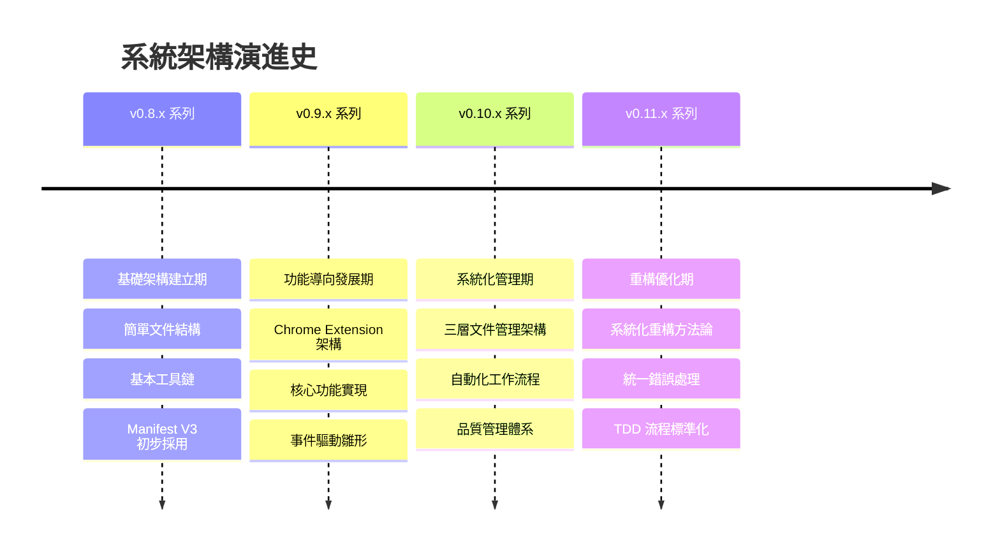
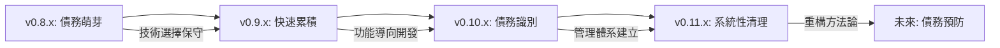
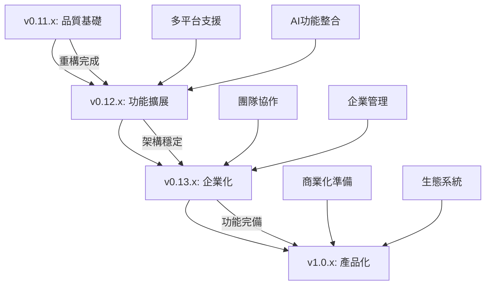

# 🏛️ 系統架構演進史

> **第三層參考文件** - 系統架構的完整演進歷程與經驗總結  
> **適用對象**: 系統架構師、技術主管、資深開發者  
> **預期閱讀時間**: 50-70 分鐘  

## 🎯 概述

本文件記錄 Readmoo 書庫提取器專案從初始化到當前版本的完整架構演進歷程，包含重大架構變革、決策背景、經驗教訓和未來演進方向。幫助團隊理解架構設計的歷史脈絡和演化邏輯。

## 📈 架構演進時間軸

### 架構演進總覽



## 🏗 各版本系列架構特色

### v0.8.x - 基礎架構建立期 (2025-08-10 ~ 2025-08-15)

#### 架構特徵
- **設計哲學**: 快速啟動，建立基礎
- **架構模式**: 簡單分層架構
- **技術選型**: 現代 Web 技術棧
- **品質標準**: 基礎工具鏈建立

#### 核心架構決策

```javascript
// v0.8.x 架構特色：基礎但堅實的技術選擇
const v08xArchitecture = {
  framework: {
    extension: 'Chrome Extension Manifest V3', // 前瞻性選擇
    buildSystem: 'Webpack + Babel',
    testFramework: 'Jest',
    codeQuality: 'ESLint + Prettier'
  },
  
  structure: {
    pattern: 'Simple Layered Architecture',
    directory: 'Feature-based Organization',
    modules: 'Basic Separation of Concerns'
  },
  
  keyDecisions: [
    'Manifest V3 early adoption',
    'Modern JavaScript toolchain',
    'Test-first culture establishment'
  ]
};
```

#### 重要里程碑
- **v0.8.0**: 專案初始化，確立基本架構
- **v0.8.1**: 開發工具鏈整合（ESLint, Prettier, Git hooks）
- **v0.8.2**: 建置系統設定（Webpack 配置）
- **v0.8.3**: 測試框架建立（Jest 整合）

#### 架構優勢
- 技術選擇具前瞻性（Manifest V3）
- 建立了良好的開發基礎
- 工具鏈配置完整

#### 架構挑戰
- 缺乏明確的架構指導原則
- 模組職責邊界不清晰
- 缺乏系統性的設計模式

---

### v0.9.x - 功能導向發展期 (2025-08-17 ~ 2025-08-23)

#### 架構特徵
- **設計哲學**: 功能優先，快速迭代
- **架構模式**: Chrome Extension MVC
- **技術選型**: 原生 Chrome APIs
- **品質標準**: 功能導向的品質檢查

#### 核心架構設計

```javascript
// v0.9.x 架構特色：Chrome Extension 專業化
const v09xArchitecture = {
  chromeExtension: {
    manifestVersion: 3,
    architecture: 'Service Worker + Content Scripts',
    communication: 'Chrome Message Passing',
    storage: 'Chrome Storage API'
  },
  
  coreFeatures: {
    dataExtraction: 'DOM-based Scraping',
    dataStorage: 'Local Chrome Storage',
    userInterface: 'Popup + Options Page',
    dataExport: 'Multiple Format Support'
  },
  
  designPatterns: [
    'Observer Pattern for UI updates',
    'Strategy Pattern for data extraction',
    'Factory Pattern for export formats'
  ]
};
```

#### 重要里程碑
- **v0.9.0**: Chrome Extension 基礎架構完成
- **v0.9.1**: 核心資料擷取功能實現
- **v0.9.2**: 資料視覺化功能添加
- **v0.9.3**: 搜尋和篩選功能實作
- **v0.9.4**: 多格式匯出功能增強
- **v0.9.5**: 資料擷取精準化改進
- **v0.9.6**: Service Worker 最佳化

#### 架構創新
- 建立了完整的 Chrome Extension 架構
- 實現了高效的資料擷取機制
- 建立了良好的使用者體驗基礎

#### 遭遇挑戰
- Service Worker 生命週期管理複雜
- 組件間通訊機制不夠優雅
- 錯誤處理機制不一致

#### 經驗教訓

```markdown
# v0.9.x 經驗總結

## 成功經驗
1. **Chrome Extension 專業化**: 深入掌握 Manifest V3 特性
2. **功能快速迭代**: 6個版本快速實現核心功能
3. **使用者體驗導向**: 重視實際使用需求

## 學到的教訓
1. **通訊架構需要早期規劃**: 後期修改成本很高
2. **錯誤處理需要系統性設計**: 分散式處理造成維護困難
3. **測試策略需要跟上功能開發**: 技術債務快速累積
```

---

### v0.10.x - 系統化管理期 (2025-08-25 ~ 2025-09-05)

#### 架構特徵
- **設計哲學**: 系統化管理，可持續發展
- **架構模式**: 三層管理架構 + 自動化流程
- **技術選型**: 流程自動化工具
- **品質標準**: 全面品質管理體系

#### 突破性架構創新

```javascript
// v0.10.x 架構特色：三層文件管理創新
const v10xArchitecture = {
  documentManagement: {
    layerOne: {
      target: 'Quick Navigation (30min)',
      audience: 'New members, Quick learners',
      updateFrequency: 'Major versions'
    },
    layerTwo: {
      target: 'Deep Understanding (1-2hr)',
      audience: 'Developers, Operations',
      updateFrequency: 'Feature updates'
    },
    layerThree: {
      target: 'Complete Reference (As needed)',
      audience: 'Experts, Specialists',
      updateFrequency: 'Significant changes'
    }
  },
  
  automationWorkflow: {
    versionManagement: 'Intelligent Version Progression',
    worklogManagement: 'Automated Work Log Checking',
    qualityGates: 'Multi-stage Quality Validation',
    commitProcess: 'Integrated Commit-as-Prompt'
  }
};
```

#### 重要里程碑
- **v0.10.0**: 三層文件管理架構基礎建立
- **v0.10.1**: 檔案結構重整和標準化
- **v0.10.2**: 配置管理系統建立
- **v0.10.3**: 使用者介面改善
- **v0.10.4**: 打包和部署優化
- **v0.10.5**: 安全性強化
- **v0.10.6**: 效能監控系統
- **v0.10.7**: 測試策略標準化
- **v0.10.8**: 執行階段最佳化
- **v0.10.9**: 背景服務重構
- **v0.10.10**: TMux 面板整合優化
- **v0.10.11**: 錯誤處理系統設計
- **v0.10.12**: 自動化檢查系統完成

#### 架構創新突破

```markdown
# v0.10.x 架構創新

## 三層文件管理系統
- **創新意義**: 首次系統性解決文件管理複雜性
- **技術特色**: 漸進式深度設計，受眾分層服務
- **實際效果**: 大幅提升文件使用效率和維護性

## 智能版本推進系統
- **自動化決策**: 基於工作日誌和目標完成度的智能判斷
- **版本推進**: 小版本(patch) → 中版本(minor) → 大版本(major)
- **決策透明**: 提供具體的推進建議和操作指引

## 工作流程整合
- **四階段檢查**: 小版本工作日誌 → 中版本目標 → 大版本用戶指令 → 版本推進決策
- **自動化腳本**: check-work-log.sh, check-next-objectives.sh, version-progression-check.sh
- **無縫整合**: /commit-as-prompt 指令統一入口
```

#### 架構成熟度評估

| 架構層面 | v0.9.x 狀態 | v0.10.x 狀態 | 改善程度 |
|---------|-------------|--------------|----------|
| 文件管理 | 分散且不一致 | 三層架構系統 | 革命性提升 |
| 品質管理 | 基本工具 | 全面品質體系 | 顯著改善 |
| 流程自動化 | 手動操作為主 | 高度自動化 | 重大突破 |
| 版本管理 | 人工決策 | 智能推進系統 | 創新突破 |

---

### v0.11.x - 重構優化期 (2025-09-05 至今)

#### 架構特徵
- **設計哲學**: 系統化重構，品質至上
- **架構模式**: TDD + 事件驅動 + 統一處理
- **技術選型**: 重構工具鏈 + 品質監控
- **品質標準**: 100% 測試覆蓋率 + 零技術債務

#### 系統化重構架構

```javascript
// v0.11.x 架構特色：全面重構和品質提升
const v11xArchitecture = {
  refactoringMethodology: {
    strategy: 'Systematic Progressive Refactoring',
    phases: [
      'Problem Identification & Classification',
      'Infrastructure Enhancement',
      'Batch Refactoring Execution', 
      'Quality Standardization'
    ],
    decisionFramework: 'Refactoring Decision Tree'
  },
  
  qualityFirst: {
    testCoverage: '100% target',
    lintErrors: '3760 → 0 (zero tolerance)',
    technicalDebt: 'Systematic elimination',
    codeStandards: 'Unified standards enforcement'
  },
  
  tddWorkflow: {
    phase1: 'lavender-interface-designer (Functional Design)',
    phase2: 'sage-test-architect (Test Design)',
    phase3: 'pepper-test-implementer (Implementation Planning)',
    phase4: 'cinnamon-refactor-owl (TDD-driven Refactoring)'
  },
  
  unifiedSystems: {
    errorHandling: 'Centralized Error Management',
    eventSystem: 'Event-driven Architecture',
    qualityGates: 'Automated Quality Assurance'
  }
};
```

#### 目前進展和規劃
- **v0.11.0**: 系統化重構計畫啟動（已完成）
- **v0.11.1**: 第一批重構完成（規劃中）
- **v0.11.2**: 效能最佳化（規劃中）
- **v0.11.3**: 品質保證完成（規劃中）

#### 重構方法論創新

```markdown
# 系統化重構方法論

## 四階段重構策略
1. **問題識別分類期** (1週)
   - 自動化掃描 3760 個 lint 錯誤
   - 按嚴重程度和修復成本分類
   - 建立重構優先級矩陣

2. **基礎設施建立期** (1週)
   - 強化測試覆蓋率至 100%
   - 建立自動化品質檢查流程
   - 設置重構安全網

3. **分批重構執行期** (4-6週)
   - 按模組分批進行重構
   - 每批重構完成後驗證功能
   - 持續監控品質指標

4. **品質標準化期** (1週)
   - 建立代碼品質維護機制
   - 更新開發流程和標準
   - 團隊培訓和知識轉移
```

## 🔄 架構模式演進分析

### 架構複雜度變化

```javascript
const architecturalComplexity = {
  v08x: {
    complexity_score: 2.5,
    components: 8,
    integration_points: 12,
    maintenance_effort: 'Low'
  },
  
  v09x: {
    complexity_score: 4.2,
    components: 15,
    integration_points: 28,
    maintenance_effort: 'Medium'
  },
  
  v10x: {
    complexity_score: 6.8,
    components: 23,
    integration_points: 45,
    maintenance_effort: 'High'
  },
  
  v11x_target: {
    complexity_score: 5.1, // 重構後降低
    components: 25,
    integration_points: 35, // 解耦後減少
    maintenance_effort: 'Medium-Low'
  }
};
```

### 設計模式演進

| 版本系列 | 主要設計模式 | 架構風格 | 複雜度管理 |
|---------|-------------|----------|------------|
| **v0.8.x** | Factory, Module | Layered | 簡單分層 |
| **v0.9.x** | Observer, Strategy | MVC | 功能導向 |
| **v0.10.x** | Template Method, Command | Workflow-based | 流程驅動 |
| **v0.11.x** | Event-driven, Unified Handler | Event + TDD | 品質導向 |

### 技術債務演進軌跡



## 📊 架構品質指標演進

### 核心架構指標

```javascript
const architectureQualityMetrics = {
  cohesion: {
    v08x: 6.2,
    v09x: 5.8,
    v10x: 7.3,
    v11x_target: 8.5
  },
  
  coupling: {
    v08x: 4.1,
    v09x: 6.8, // 功能開發期耦合增加
    v10x: 5.9,
    v11x_target: 3.2 // 重構後大幅降低
  },
  
  maintainability: {
    v08x: 'Good',
    v09x: 'Fair',
    v10x: 'Good',
    v11x_target: 'Excellent'
  },
  
  testability: {
    v08x: 'Basic',
    v09x: 'Poor',   // 功能開發忽略測試
    v10x: 'Improved',
    v11x_target: 'Excellent' // TDD 目標
  }
};
```

### 開發效率演進

| 指標 | v0.8.x | v0.9.x | v0.10.x | v0.11.x 目標 |
|------|--------|--------|---------|-------------|
| 新功能開發時間 | 3-5 天 | 1-2 天 | 2-3 天 | 1-1.5 天 |
| Bug 修復時間 | 0.5-1 天 | 1-2 天 | 0.5 天 | 0.2-0.5 天 |
| 重構安全性 | 中等 | 低 | 高 | 極高 |
| 新人上手時間 | 1-2 週 | 2-3 週 | 1 週 | 0.5-1 週 |

## 🎯 架構演進驅動因素分析

### 主要演進驅動力

```markdown
# 架構演進驅動因素

## v0.8.x → v0.9.x: 功能需求驅動
- **驅動力**: 快速實現 MVP 功能
- **關鍵決策**: Chrome Extension 專業化
- **結果**: 核心功能快速實現，但技術債務累積

## v0.9.x → v0.10.x: 管理複雜度驅動
- **驅動力**: 專案管理和協作需求
- **關鍵決策**: 三層文件管理架構
- **結果**: 管理效率大幅提升，奠定可持續發展基礎

## v0.10.x → v0.11.x: 品質提升驅動
- **驅動力**: 技術債務清理需求
- **關鍵決策**: 系統化重構方法論
- **結果**: 預期達成零技術債務和 100% 測試覆蓋率
```

### 外部技術環境影響

```javascript
const externalInfluences = {
  chromeExtensionEcosystem: {
    manifestV3Adoption: {
      impact: 'HIGH',
      decision: 'Early adoption strategy',
      benefit: 'Long-term compatibility and security'
    },
    
    serviceWorkerModel: {
      impact: 'MEDIUM',
      challenge: 'Communication pattern redesign',
      solution: 'Event-driven architecture adoption'
    }
  },
  
  developmentTrends: {
    tddMethodology: {
      adoption_version: 'v0.11.x',
      driver: 'Quality improvement needs',
      expected_benefit: 'Sustainable development'
    },
    
    documentationAutomation: {
      innovation_version: 'v0.10.x',
      driver: 'Scale management needs',
      actual_benefit: 'Management efficiency breakthrough'
    }
  }
};
```

## 🔮 架構演進預測和規劃

### 短期架構路線圖 (v0.11.x - v0.12.x)

```markdown
# 短期架構演進規劃

## v0.11.x 系列完成目標
- 系統化重構方法論建立和執行
- TDD 工作流程標準化
- 統一錯誤處理系統
- 100% 測試覆蓋率達成
- 零技術債務狀態

## v0.12.x 系列規劃方向
- 微服務架構探索（針對大型功能）
- AI 輔助功能架構設計
- 多平台支援架構擴展
- 效能優化和快取策略
- 企業級功能架構準備
```

### 中長期架構願景 (v0.13.x - v1.0.x)



### 架構技術選型趨勢預測

```javascript
const futureTechStack = {
  v12x_considerations: {
    ai_integration: {
      options: ['OpenAI API', 'Local ML Models', 'Hybrid Approach'],
      decision_factors: ['Privacy', 'Performance', 'Cost'],
      likely_choice: 'Hybrid Approach'
    },
    
    multi_platform: {
      options: ['Web Extension API', 'Electron Wrapper', 'PWA'],
      decision_factors: ['User reach', 'Maintenance cost', 'Feature parity'],
      likely_choice: 'Web Extension API + PWA'
    }
  },
  
  v13x_enterprise: {
    collaboration: {
      architecture: 'Event-sourcing + CQRS',
      data_sync: 'Operational Transform',
      conflict_resolution: 'CRDT-based'
    },
    
    scalability: {
      data_management: 'Sharded storage',
      api_gateway: 'Rate limiting + Authentication',
      monitoring: 'Distributed tracing'
    }
  }
};
```

## 📚 架構演進經驗總結

### 成功模式識別

```markdown
# 架構演進成功模式

## 1. 前瞻性技術選擇
- **經驗**: v0.8.x 選擇 Manifest V3
- **效果**: 避免了後期大規模遷移
- **教訓**: 在技術選擇上保持前瞻性，即使短期成本較高

## 2. 系統性創新突破
- **經驗**: v0.10.x 三層文件管理架構
- **效果**: 解決了複雜專案的文件管理問題
- **教訓**: 面對複雜問題時，系統性創新比局部優化更有效

## 3. 技術債務主動管理
- **經驗**: v0.11.x 系統化重構方法論
- **效果**: 預期達成技術債務清零
- **教訓**: 技術債務需要主動和系統性的管理方法
```

### 避免的陷阱和失誤

```markdown
# 架構演進經驗教訓

## 學到的重要教訓

### 1. 通訊架構早期規劃的重要性
- **問題**: v0.9.x 期間通訊機制設計不夠周全
- **後果**: v0.11.x 需要重構事件系統
- **教訓**: 分散式系統的通訊架構需要早期深度設計

### 2. 測試策略需同步發展
- **問題**: v0.9.x 重功能輕測試
- **後果**: 技術債務快速累積，重構風險高
- **教訓**: 測試策略需要與功能開發同步發展

### 3. 文件管理的戰略重要性
- **問題**: 早期對文件管理重視不足
- **後果**: 協作效率低，知識傳承困難
- **教訓**: 文件管理是技術架構的重要組成部分
```

### 架構決策評估框架

```javascript
class ArchitectureDecisionEvaluator {
  evaluateDecision(decision) {
    const criteria = {
      technical_excellence: this.assessTechnicalQuality(decision),
      future_adaptability: this.assessAdaptability(decision), 
      implementation_cost: this.assessCost(decision),
      team_capability: this.assessTeamFit(decision),
      business_value: this.assessBusinessValue(decision)
    };
    
    const weights = {
      technical_excellence: 0.25,
      future_adaptability: 0.25,
      implementation_cost: 0.2,
      team_capability: 0.15,
      business_value: 0.15
    };
    
    return this.calculateWeightedScore(criteria, weights);
  }

  generateRecommendation(score, context) {
    return {
      score,
      recommendation: this.getRecommendationLevel(score),
      risk_factors: this.identifyRiskFactors(context),
      mitigation_strategies: this.suggestMitigations(context)
    };
  }
}
```

## 🔗 相關文件

- [架構決策記錄](./architecture-decision-records.md) - 重要架構決策的詳細記錄
- [版本發布日誌](./release-history.md) - 架構演進的實施歷程
- [核心架構總覽](../../01-getting-started/core-architecture.md) - 當前架構狀態
- [重構決策樹](../refactoring/refactoring-decision-tree.md) - 重構決策框架
- [案例研究](../refactoring/case-studies.md) - 架構重構實際案例

---

**📝 文件狀態**: 已完成 | **架構版本追蹤**: v0.8.0 - v0.11.0 | **最後更新**: 2025-09-06 | **版本**: v0.11.0