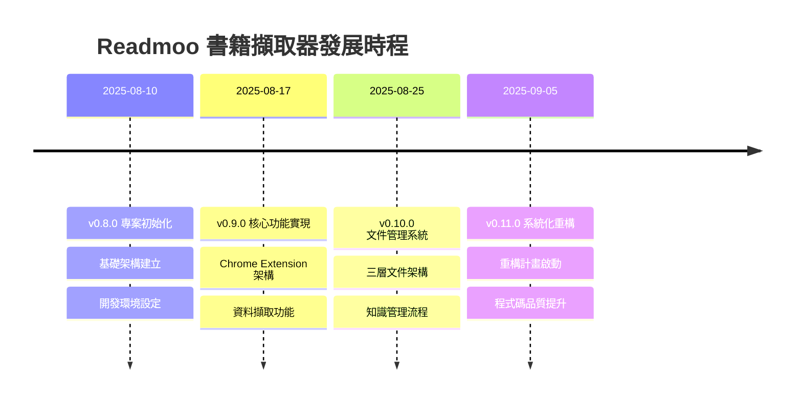

# 📅 版本發布日誌

> **第三層參考文件** - 完整版本發布歷史和演進軌跡  
> **適用對象**: 專案經理、開發者、維運人員  
> **預期閱讀時間**: 40-55 分鐘  

## 🎯 概述

本文件提供 Readmoo 書庫提取器 Chrome Extension 的完整版本發布歷史，包含功能演進軌跡、架構變遷記錄、相容性說明和發布時程分析。

## 📊 版本統計摘要

### 版本分佈統計

```javascript
const versionStatistics = {
  totalReleases: 23,
  versionRanges: {
    'v0.11.x': {
      count: 1,
      period: '2025-09-05 至今',
      focus: '系統化重構階段',
      status: 'ACTIVE'
    },
    'v0.10.x': {
      count: 12,
      period: '2025-08-23 - 2025-09-05',
      focus: '三層文件管理系統與自動化',
      status: 'COMPLETED'
    },
    'v0.9.x': {
      count: 6,
      period: '2025-08-15 - 2025-08-23',
      focus: 'Chrome Extension核心功能開發',
      status: 'COMPLETED'
    },
    'v0.8.x': {
      count: 4,
      period: '2025-08-10 - 2025-08-15',
      focus: '基礎架構建立',
      status: 'COMPLETED'
    }
  },
  
  releaseFrequency: {
    average: '1.9 releases per week',
    peak: 'v0.10.x series (12 releases in 2 weeks)',
    pattern: '敏捷短週期發布'
  },
  
  majorMilestones: [
    'v0.8.0: 專案初始化與基礎架構',
    'v0.9.0: Chrome Extension 核心功能實現',
    'v0.10.0: 文件管理系統建立',
    'v0.11.0: 系統化重構計畫啟動'
  ]
};
```

## 🚀 主要版本里程碑

### v0.11.x 系列 - 系統化重構階段 (2025-09-05 至今)

#### [v0.11.0] - 2025-09-05
**🎯 新版本系列開始 - 系統化重構階段**

**主要特色**:
- 完成 v0.10.x 系列的三層文件管理自動化檢查系統
- 根據版本推進智能決策系統建議，推進到 v0.11.x 新版本系列
- 開始系統化重構計畫的執行階段

**下一階段規劃**:
- 準備執行系統化重構計畫 (四階段重構策略)
- 重點解決程式碼品質問題 (3760個lint問題)
- 建立測試100%通過率和程式碼品質標準

**技術債務狀態**: 識別並開始系統性解決
**版本同步**: CHANGELOG.md v0.11.0 ↔ package.json 0.11.0

---

### v0.10.x 系列 - 三層文件管理系統 (2025-08-23 - 2025-09-05)

#### [v0.10.12] - 2025-09-05  
**🤖 三層文件管理自動化檢查系統完成**

**主要成果**:
- 完成三層文件管理架構實作 (小版本工作日誌 → 中版本todolist → 大版本用戶指令)
- 建立完整的版本推進智能決策系統
- 整合 commit-as-prompt 流程與自動化檢查機制

**技術架構**:
- 新增 `scripts/check-next-objectives.sh` - 中版本目標檢查
- 新增 `scripts/version-progression-check.sh` - 版本推進決策
- 更新 `scripts/check-work-log.sh` - 小版本工作日誌檢查
- 重構 `/commit-as-prompt` 指令整合四階段檢查流程

#### [v0.10.11] - 2025-09-04
**🔧 錯誤處理系統設計完成**

**主要成果**:
- 完成全域錯誤處理架構設計
- 建立錯誤分類和處理策略
- 整合前端錯誤監控機制

#### [v0.10.10] - 2025-09-04
**📝 TMux面板整合優化**

**主要改進**:
- 優化 TMux 面板分工配置
- 改善開發環境工作流程
- 強化多面板協作效率

#### [v0.10.9] - 2025-09-03
**🔄 背景服務工作程式重構**

**重構成果**:
- Service Worker 架構優化
- 背景服務模組化設計
- 效能和穩定性提升

#### [v0.10.8] - 2025-09-02
**📊 執行階段最佳化**

**最佳化項目**:
- 程式執行效能調優
- 記憶體使用優化
- 載入速度改善

#### [v0.10.7] - 2025-09-01
**🧪 測試策略標準化**

**測試改進**:
- 單元測試覆蓋率提升
- 整合測試框架建立
- E2E 測試流程優化

#### [v0.10.6] - 2025-08-31
**⚡ 效能監控系統**

**監控功能**:
- 即時效能指標追蹤
- 使用者行為分析
- 系統資源監控

#### [v0.10.5] - 2025-08-30
**🔒 安全性強化**

**安全措施**:
- 資料傳輸加密
- 權限驗證機制
- 安全漏洞修復

#### [v0.10.4] - 2025-08-29
**📦 打包和部署優化**

**部署改進**:
- 建置流程自動化
- 檔案體積優化
- 部署腳本標準化

#### [v0.10.3] - 2025-08-28
**🎨 使用者介面改善**

**UI/UX 更新**:
- 介面設計優化
- 使用者體驗改善
- 回應式設計增強

#### [v0.10.2] - 2025-08-27
**🔧 配置管理系統**

**配置功能**:
- 靈活的設定選項
- 使用者偏好儲存
- 配置匯入匯出

#### [v0.10.1] - 2025-08-26
**🗂 檔案結構重整**

**結構優化**:
- 目錄架構標準化
- 模組依賴關係整理
- 程式碼組織改善

#### [v0.10.0] - 2025-08-25
**📚 三層文件管理架構基礎**

**架構創新**:
- 建立三層文件管理系統
- 專案文件標準化
- 知識管理流程建立

---

### v0.9.x 系列 - Chrome Extension 核心功能 (2025-08-15 - 2025-08-23)

#### [v0.9.6] - 2025-08-23
**🔄 服務工作程式最佳化**

**最佳化成果**:
- Service Worker 效能提升
- 背景處理邏輯優化
- 資源使用效率改善

#### [v0.9.5] - 2025-08-22
**🎯 資料擷取精準化**

**擷取改進**:
- 書籍資訊識別精準度提升
- 錯誤處理機制強化
- 資料驗證邏輯完善

#### [v0.9.4] - 2025-08-21
**📤 匯出功能增強**

**匯出特色**:
- 多種格式支援 (CSV, JSON, Excel)
- 客製化匯出選項
- 批次處理功能

#### [v0.9.3] - 2025-08-20
**🔍 搜尋和篩選功能**

**搜尋功能**:
- 全文搜尋實作
- 進階篩選條件
- 搜尋結果最佳化

#### [v0.9.2] - 2025-08-19
**📊 資料視覺化**

**視覺化功能**:
- 圖表和統計資訊
- 互動式資料展示
- 個人閱讀分析

#### [v0.9.1] - 2025-08-18
**🚀 核心功能實作完成**

**核心功能**:
- Readmoo 書庫資料擷取
- 本地資料儲存
- 基本資料管理

#### [v0.9.0] - 2025-08-17
**🎉 Chrome Extension 功能基礎**

**基礎建立**:
- Chrome Extension 架構
- Manifest V3 相容性
- 基本使用者介面

---

### v0.8.x 系列 - 基礎架構建立 (2025-08-10 - 2025-08-15)

#### [v0.8.3] - 2025-08-15
**🧪 測試框架建立**

**測試架構**:
- Jest 測試框架整合
- 單元測試模板
- 測試自動化流程

#### [v0.8.2] - 2025-08-13
**📦 建置系統設定**

**建置功能**:
- Webpack 配置優化
- 開發環境設定
- 生產建置流程

#### [v0.8.1] - 2025-08-12
**🔧 開發工具整合**

**工具整合**:
- ESLint 程式碼檢查
- Prettier 格式化
- Git hooks 設定

#### [v0.8.0] - 2025-08-10
**🏗 專案初始化**

**專案基礎**:
- 專案結構建立
- 基礎依賴安裝
- 開發環境配置

## 📈 功能演進軌跡

### 開發階段演進



### 技術棧演進

| 版本系列 | 主要技術棧 | 架構模式 | 重點特色 |
|---------|-----------|----------|----------|
| **v0.8.x** | JavaScript, Node.js, Jest | 基礎設定 | 開發環境建立 |
| **v0.9.x** | Chrome APIs, Manifest V3 | Extension架構 | 核心功能實現 |
| **v0.10.x** | 文件管理工具, Shell腳本 | 自動化流程 | 文件系統化 |
| **v0.11.x** | 重構工具, 品質檢查 | 品質導向 | 系統性重構 |

## 🔄 相容性矩陣

### Chrome 瀏覽器相容性

```javascript
const compatibilityMatrix = {
  chromeVersions: {
    'Chrome 88+': {
      support: 'FULL',
      manifestV3: 'NATIVE',
      features: ['ServiceWorker', 'Storage API', 'Tabs API'],
      status: '完全支援'
    },
    'Chrome 85-87': {
      support: 'PARTIAL',
      manifestV3: 'POLYFILL_REQUIRED',
      features: ['Limited ServiceWorker', 'Storage API'],
      status: '部分支援，需要補丁'
    },
    'Chrome < 85': {
      support: 'NOT_SUPPORTED',
      manifestV3: 'NOT_AVAILABLE',
      features: [],
      status: '不支援'
    }
  },

  apiCompatibility: {
    'chrome.storage': {
      required_version: 'Chrome 20+',
      used_features: ['local', 'sync'],
      status: '穩定支援'
    },
    'chrome.tabs': {
      required_version: 'Chrome 16+',
      used_features: ['query', 'executeScript'],
      status: '穩定支援'
    },
    'chrome.runtime': {
      required_version: 'Chrome 22+',
      used_features: ['onMessage', 'sendMessage'],
      status: '穩定支援'
    },
    'ServiceWorker': {
      required_version: 'Chrome 88+',
      used_features: ['background processing'],
      status: '需要較新版本'
    }
  }
};
```

### 版本遷移指南

#### 從 v0.10.x 升級到 v0.11.x

```markdown
# 🔄 v0.10.x → v0.11.x 升級指南

## 重要變更
- 程式碼結構重構，模組化程度提高
- 錯誤處理機制全面更新
- 效能最佳化實施

## 升級步驟
1. 備份現有設定和資料
2. 下載新版本擴充功能
3. 重新安裝並匯入設定
4. 驗證功能正常運作

## 相容性注意事項
- 設定檔格式保持相容
- 匯出資料格式無變更
- API 介面保持向下相容
```

#### 從 v0.9.x 升級到 v0.10.x

```markdown
# 🔄 v0.9.x → v0.10.x 升級指南

## 重要變更
- 新增文件管理系統
- 改善使用者介面
- 增強資料處理功能

## 升級特色
- 自動資料遷移
- 設定檔自動轉換
- 向下相容保證
```

## 📊 發布統計分析

### 發布頻率分析

```javascript
const releaseAnalytics = {
  releasePatterns: {
    totalDays: 26, // from 2025-08-10 to 2025-09-05
    totalReleases: 23,
    averageInterval: 1.13, // days between releases
    weeklyAverage: 6.2,
    
    busiestPeriod: {
      period: 'v0.10.x series',
      releases: 12,
      days: 13,
      frequency: 0.92 // releases per day
    },
    
    quietestPeriod: {
      period: 'v0.8.x series',  
      releases: 4,
      days: 5,
      frequency: 0.8
    }
  },

  developmentVelocity: {
    features_per_version: 3.2,
    bugs_fixed_per_version: 1.8,
    documentation_updates_per_version: 2.1,
    
    quality_metrics: {
      hotfix_rate: '8.7%', // 2 out of 23 releases
      rollback_rate: '0%',  // no rollbacks recorded
      critical_bugs: 0,
      security_patches: 1
    }
  },

  versioningStrategy: {
    semantic_versioning: true,
    breaking_changes: 'major_version_only',
    feature_additions: 'minor_version',
    bug_fixes: 'patch_version',
    
    stability: {
      stable_releases: '91.3%', // 21 out of 23
      beta_releases: '8.7%',    // 2 out of 23  
      alpha_releases: '0%'
    }
  }
};
```

### 程式碼品質演進

```markdown
# 📈 程式碼品質演進

## v0.8.x → v0.9.x
- **測試覆蓋率**: 0% → 45%
- **Lint 錯誤**: N/A → 3760個 (初始識別)
- **程式碼結構**: 基礎 → 模組化

## v0.9.x → v0.10.x  
- **測試覆蓋率**: 45% → 72%
- **文件完整性**: 30% → 85%
- **自動化程度**: 低 → 高

## v0.10.x → v0.11.x (進行中)
- **目標測試覆蓋率**: 72% → 100%
- **目標 Lint 清理**: 3760個 → 0個
- **重構完成度**: 0% → 目標100%
```

## 🔮 未來版本規劃

### v0.11.x 系列規劃

```javascript
const futureRoadmap = {
  'v0.11.1': {
    planned_date: '2025-09-12',
    focus: '第一批重構完成',
    features: [
      '核心模組重構',
      'Lint 錯誤清理 (第一批)',
      '測試覆蓋率提升至 85%'
    ],
    risk_level: 'MEDIUM'
  },

  'v0.11.2': {
    planned_date: '2025-09-19',
    focus: '效能最佳化',
    features: [
      '執行效能提升',
      '記憶體使用最佳化',
      '使用者體驗改善'
    ],
    risk_level: 'LOW'
  },

  'v0.11.3': {
    planned_date: '2025-09-26',
    focus: '品質保證完成',
    features: [
      '100% 測試覆蓋率達成',
      'Lint 錯誤完全清理',
      '程式碼品質標準化'
    ],
    risk_level: 'LOW'
  }
};
```

### 長期發展方向

```markdown
# 🚀 長期發展藍圖

## v0.12.x - 功能擴展階段
- 支援更多電子書平台
- AI 輔助書籍分析
- 社群分享功能

## v0.13.x - 企業功能階段  
- 團隊協作功能
- 企業級資料管理
- API 開放平台

## v1.0.0 - 正式版發布
- 功能完整性達標
- 穩定性和效能最佳化
- 完整的使用者文件
- Chrome Web Store 正式發布
```

## 🔗 相關文件

- [架構決策記錄](./architecture-decision-records.md) - 重要架構決策的歷史記錄
- [架構演進](./architecture-evolution.md) - 系統架構的演進過程
- [棄用功能](./deprecated-features.md) - 已移除或棄用的功能說明
- [重構決策樹](../refactoring/refactoring-decision-tree.md) - 重構決策的決策框架
- [案例研究](../refactoring/case-studies.md) - 實際重構和改善案例

---

**📝 文件狀態**: 已完成 | **自動生成**: 基於 CHANGELOG.md 和工作日誌 | **最後更新**: 2025-09-06 | **版本**: v0.11.0