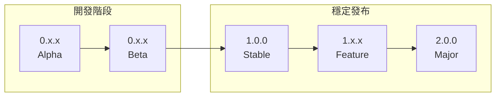

# 🚀 版本發布策略

> **第三層參考文件** - 完整的版本管理與發布策略指南  
> **目標讀者**: 版本管理者、DevOps 工程師、開發團隊長  
> **文件類型**: 版本控制與發布管理手册  

本文件提供 Readmoo 書庫提取器 Chrome Extension 的完整版本管理策略，包含語意化版本控制、發布流程設計及緊急回應程序。

## 🎯 版本管理總覽

### 版本命名策略
遵循 [Semantic Versioning 2.0.0](https://semver.org/) 規範：

```
版本格式: MAJOR.MINOR.PATCH

範例: 1.2.3
 │    │  │
 │    │  └─ PATCH: 向下相容的錯誤修復
 │    └──── MINOR: 向下相容的新功能
 └─────── MAJOR: 不相容的 API 變更
```

### 版本生命週期


### 目前版本狀況
```javascript
// 版本目標與里程碑
const versionRoadmap = {
  "0.11.x": {
    status: "current", 
    focus: "三層文件架構重構和基礎功能完善",
    expected: "2024 Q1"
  },
  
  "0.12.x": {
    status: "planned",
    focus: "核心功能開發和測試框架建置",
    expected: "2024 Q1-Q2"
  },
  
  "1.0.0": {
    status: "milestone",
    focus: "Chrome Web Store 正式上架版本",
    expected: "2024 Q2"
  },
  
  "1.x.x": {
    status: "future",
    focus: "用戶回饋導向的功能進化",
    expected: "2024 Q3+"
  }
};
```

## 🔄 發布流程設計

### 核心發布流程
```
┌─────────────────────────────────────────────────┐
│                版本發布流程                │
├─────────────────────────────────────────────────┤
│  Phase 1: 📋 發布準備 (1-2 天)             │
│    - 功能凍結 (Feature Freeze)              │
│    - 回歸測試執行                         │
│    - 文件更新確認                         │
├─────────────────────────────────────────────────┤
│  Phase 2: 🏷️ 版本標籤建立 (30分鐘)       │
│    - 自動版本號遞增                     │
│    - Git Tag 建立與推送                 │
│    - CHANGELOG.md 生成                    │
├─────────────────────────────────────────────────┤
│  Phase 3: 🏧 生產建置 (5分鐘)               │
│    - 自動化生產版本建置               │
│    - Chrome Extension 打包                │
│    - 測試執行與驗證                       │
├─────────────────────────────────────────────────┤
│  Phase 4: 🚀 發布部署 (1-7 天)             │
│    - GitHub Release 建立                  │
│    - Chrome Web Store 上傳             │
│    - 用戶通知與文件更新                 │
└─────────────────────────────────────────────────┘
```

### 分支管理策略

#### Git Flow 模式適配
```bash
# 分支結構
── main (production-ready)
    ├── release/v1.2.x (release preparation)
    │   └── hotfix/critical-fix (emergency fixes)
    ── develop (integration)
        └── feature/new-functionality (feature development)

# 分支責任
main:     永遠穩定，直接部署至 Chrome Web Store
develop:  開發整合，包含下個版本的所有功能
release:  版本準備，僅允許 bug 修復和文件更新
feature:  新功能開發，從 develop 分支出
hotfix:   緊急修復，直接從 main 分支出
```

#### 分支保護規則
```yaml
# GitHub 分支保護設置
branch_protection:
  main:
    required_status_checks:
      strict: true
      contexts: ["ci/lint", "ci/test", "ci/build"]
    required_pull_request_reviews:
      required_approving_review_count: 2
      dismiss_stale_reviews: true
      require_code_owner_reviews: true
    enforce_admins: true
    allow_force_pushes: false
    allow_deletions: false
    
  develop:
    required_status_checks:
      strict: true
      contexts: ["ci/lint", "ci/test"]
    required_pull_request_reviews:
      required_approving_review_count: 1
    allow_force_pushes: false
```

### 自動化版本控制

#### 版本號自動遞增系統
```javascript
// scripts/version-manager.js
class VersionManager {
  constructor() {
    this.packageJson = require('../package.json');
    this.currentVersion = this.packageJson.version;
  }
  
  determineVersionType(commits) {
    const conventionalCommits = commits.map(this.parseCommit);
    
    // 檢查是否有 BREAKING CHANGE
    if (conventionalCommits.some(c => c.breaking)) {
      return 'major';
    }
    
    // 檢查是否有新功能
    if (conventionalCommits.some(c => c.type === 'feat')) {
      return 'minor';
    }
    
    // 預設為 patch
    return 'patch';
  }
  
  generateChangelog(fromTag, toTag) {
    const commits = this.getCommitsBetween(fromTag, toTag);
    const grouped = this.groupCommitsByType(commits);
    
    return this.formatChangelog(grouped, toTag);
  }
  
  updateVersion(type) {
    const semver = require('semver');
    const newVersion = semver.inc(this.currentVersion, type);
    
    // 更新 package.json
    this.packageJson.version = newVersion;
    fs.writeFileSync('package.json', JSON.stringify(this.packageJson, null, 2));
    
    // 更新 manifest.json (在建置時自動同步)
    return newVersion;
  }
}
```

#### GitHub Actions 版本管理整合
```yaml
# .github/workflows/auto-release.yml
name: '✨ 自動版本發布'

on:
  workflow_dispatch:
    inputs:
      release_type:
        type: choice
        description: '發布類型'
        options:
          - 'auto'   # 自動判斷
          - 'patch'  # 0.1.0 → 0.1.1
          - 'minor'  # 0.1.0 → 0.2.0
          - 'major'  # 0.1.0 → 1.0.0
        default: 'auto'
        
jobs:
  auto-release:
    runs-on: ubuntu-latest
    permissions:
      contents: write
      pull-requests: write
      
    steps:
      - name: '📋 Checkout 程式碼'
        uses: actions/checkout@v4
        with:
          fetch-depth: 0  # 完整歷史記錄
          
      - name: '⚙️ 設置 Node.js 環境'
        uses: actions/setup-node@v4
        with:
          node-version: '20'
          cache: 'npm'
          
      - name: '📦 安裝依賴套件'
        run: npm ci --legacy-peer-deps
        
      - name: '🔍 判斷版本類型'
        id: version-type
        run: |
          if [ "${{ github.event.inputs.release_type }}" = "auto" ]; then
            # 分析 commit 訊息自動判斷
            TYPE=$(node scripts/determine-version-type.js)
            echo "version_type=$TYPE" >> $GITHUB_OUTPUT
          else
            echo "version_type=${{ github.event.inputs.release_type }}" >> $GITHUB_OUTPUT
          fi
          
      - name: '🔢 更新版本號'
        id: version
        run: |
          NEW_VERSION=$(npm version ${{ steps.version-type.outputs.version_type }} --no-git-tag-version)
          echo "new_version=$NEW_VERSION" >> $GITHUB_OUTPUT
          echo "version_number=${NEW_VERSION#v}" >> $GITHUB_OUTPUT
          
      - name: '📝 生成 CHANGELOG'
        run: |
          node scripts/generate-changelog.js ${{ steps.version.outputs.new_version }}
          
      - name: '🏧 建置發布版本'
        run: npm run build:prod
        
      - name: '🧪 執行最終測試'
        run: |
          npm run test:unit
          npm run test:integration
          
      - name: '💾 提交版本更新'
        run: |
          git config --local user.email "action@github.com"
          git config --local user.name "Release Bot"
          git add package.json package-lock.json CHANGELOG.md
          git commit -m "chore(release): bump version to ${{ steps.version.outputs.new_version }}"
          git tag ${{ steps.version.outputs.new_version }}
          
      - name: '🚀 推送版本與標籤'
        run: |
          git push origin ${{ github.ref_name }}
          git push origin ${{ steps.version.outputs.new_version }}
```

## 📅 發布排程管理

### 月度發布計劃

#### 2024 Q1 版本計劃
```markdown
## 2024 第一季度發布計劃

### v0.11.x 系列 - 三層文件架構
**目標日期**: 2024/01 - 2024/02

- **v0.11.0** (已完成): 文件架構重構基礎
- **v0.11.1** (已完成): 文件結構優化與工作流程修復
- **v0.11.2** (規劃中): 待定 - 根據 todolist 重新排序後決定  
- **v0.11.3** (規劃中): 文件架構完整化

### v0.12.x 系列 - 核心功能開發
**目標日期**: 2024/02 - 2024/04

- **v0.12.0**: Readmoo API 整合基礎
- **v0.12.1**: 書庫同步功能實作
- **v0.12.2**: 筆記管理功能開發
- **v0.12.3**: 效能優化和穩定性提升
```

#### 版本內容規劃標準
```javascript
// 版本內容管理原則
const versionContentRules = {
  major: {
    max_features: 5,
    must_include: [
      '完整測試覆蓋',
      '向下相容性檢查',
      '移轉指南文件',
      '緊急回退計劃'
    ],
    review_period: '2 weeks'
  },
  
  minor: {
    max_features: 3,
    must_include: [
      '功能測試',
      '文件更新',
      '向下相容性確認'
    ],
    review_period: '1 week'
  },
  
  patch: {
    max_features: 1,
    must_include: [
      '修復驗證',
      '回歸測試'
    ],
    review_period: '2-3 days'
  }
};
```

### 功能凍結管理

#### Feature Freeze 流程
```bash
#!/bin/bash
# scripts/feature-freeze.sh

VERSION=$1
if [ -z "$VERSION" ]; then
  echo "請提供目標版本: ./feature-freeze.sh v0.12.0"
  exit 1
fi

echo "🧪 啟動功能凍結: $VERSION"

# 1. 建立 release 分支
RELEASE_BRANCH="release/$VERSION"
git checkout develop
git pull origin develop
git checkout -b $RELEASE_BRANCH
git push -u origin $RELEASE_BRANCH

# 2. 設置分支保護
gh api repos/:owner/:repo/branches/$RELEASE_BRANCH/protection \
  --method PUT \
  --field required_status_checks='{"strict":true,"contexts":["ci/test"]}' \
  --field enforce_admins=true \
  --field required_pull_request_reviews='{"required_approving_review_count":1}'

# 3. 更新版本號
npm version $VERSION --no-git-tag-version
git add package.json
git commit -m "chore: prepare release $VERSION"
git push

# 4. 建立 Pull Request Template
cat > .github/PULL_REQUEST_TEMPLATE/release.md << EOF
## Release $VERSION 檢查清單

### 功能驗證
- [ ] 所有新功能已經過測試
- [ ] 回歸測試已執行
- [ ] 效能基準測試通過

### 文件更新
- [ ] CHANGELOG.md 已更新
- [ ] 版本相關文件已更新
- [ ] API 文件已同步

### 測試結果
- [ ] Unit Tests: 100% 通過
- [ ] Integration Tests: 100% 通過
- [ ] E2E Tests: 100% 通過
- [ ] Coverage: > 90%

EOF

echo "✅ 功能凍結完成，請開始 release 準備作業"
echo "🔗 Release Branch: $RELEASE_BRANCH"
```

## 🔥 緊急發布與回退

### Hotfix 流程

#### 快速修復流程
```bash
#!/bin/bash
# scripts/hotfix.sh

ISSUE_TYPE=$1
DESCRIPTION=$2

if [ -z "$ISSUE_TYPE" ] || [ -z "$DESCRIPTION" ]; then
  echo "用法: ./hotfix.sh [critical|security|data-loss] '問題描述'"
  exit 1
fi

# 獲取當前版本
CURRENT_VERSION=$(git describe --tags --abbrev=0)
echo "🚨 緊急修復模式: $CURRENT_VERSION -> $ISSUE_TYPE"

# 1. 建立 hotfix 分支
HOTFIX_BRANCH="hotfix/$ISSUE_TYPE-$(date +%Y%m%d)"
git checkout main
git pull origin main
git checkout -b $HOTFIX_BRANCH

echo "🔧 Hotfix 分支已建立: $HOTFIX_BRANCH"
echo "📝 問題描述: $DESCRIPTION"
echo ""
echo "ℹ️  接下來請:"
echo "  1. 在此分支上實作修復"
echo "  2. 執行測試確保修復效果"
echo "  3. 送出 PR 至 main 分支"
echo "  4. 獲得審核通過後合併"
echo "  5. 執行 ./hotfix-deploy.sh $HOTFIX_BRANCH"
```

#### 緊急部署流程
```bash
#!/bin/bash
# scripts/hotfix-deploy.sh

HOTFIX_BRANCH=$1
if [ -z "$HOTFIX_BRANCH" ]; then
  echo "請提供 hotfix 分支名稱"
  exit 1
fi

# 確認在 main 分支且已合併 hotfix
git checkout main
git pull origin main

# 自動判斷 hotfix 版本類型
if [[ $HOTFIX_BRANCH =~ "critical" ]]; then
  VERSION_TYPE="patch"
elif [[ $HOTFIX_BRANCH =~ "security" ]]; then
  VERSION_TYPE="patch"
else
  VERSION_TYPE="patch"
fi

# 即時發布
echo "🚀 緊急部署開始..."

# 1. 更新版本號
NEW_VERSION=$(npm version $VERSION_TYPE --no-git-tag-version)
echo "🔢 新版本: $NEW_VERSION"

# 2. 更新 CHANGELOG (簡化版)
echo "## $NEW_VERSION - $(date +'%Y-%m-%d') - HOTFIX" > TEMP_CHANGELOG
echo "" >> TEMP_CHANGELOG
echo "### 🚨 緊急修復" >> TEMP_CHANGELOG
echo "- $(git log -1 --pretty=format:'%s')" >> TEMP_CHANGELOG
echo "" >> TEMP_CHANGELOG
cat CHANGELOG.md >> TEMP_CHANGELOG
mv TEMP_CHANGELOG CHANGELOG.md

# 3. 快速建置與測試
npm run build:prod
npm run test:unit -- --passWithNoTests

# 4. 提交與標籤
git add package.json CHANGELOG.md
git commit -m "hotfix: $NEW_VERSION - $(git log -1 --pretty=format:'%s')"
git tag $NEW_VERSION
git push origin main
git push origin $NEW_VERSION

# 5. 立即部署至 Chrome Web Store
echo "🏦 緊急上傳至 Chrome Web Store..."
# 觸發自動部署流程
gh workflow run deploy.yml --ref main

echo "✅ 緊急部署完成: $NEW_VERSION"
echo "📊 請持續監控部署狀況和用戶回饋"
```

### 回退策略

#### 自動回退觸發機制
```javascript
// scripts/rollback-detector.js
class RollbackDetector {
  constructor() {
    this.thresholds = {
      error_rate: 0.05,        // 5%錯誤率
      crash_rate: 0.01,        // 1%崩潰率
      user_complaints: 10,     // 10個用戶投訴
      performance_degradation: 0.3  // 30%效能下降
    };
  }
  
  async checkRollbackConditions(version) {
    const metrics = await this.getMetrics(version);
    const alerts = [];
    
    // 檢查錯誤率
    if (metrics.error_rate > this.thresholds.error_rate) {
      alerts.push({
        type: 'critical',
        message: `錯誤率過高: ${metrics.error_rate * 100}%`,
        action: 'immediate_rollback'
      });
    }
    
    // 檢查崩潰率
    if (metrics.crash_rate > this.thresholds.crash_rate) {
      alerts.push({
        type: 'critical',
        message: `崩潰率過高: ${metrics.crash_rate * 100}%`,
        action: 'immediate_rollback'
      });
    }
    
    return alerts;
  }
  
  async executeRollback(fromVersion, toVersion) {
    console.log(`🔄 執行回退: ${fromVersion} → ${toVersion}`);
    
    // 1. 建立回退分支
    const rollbackBranch = `rollback/${fromVersion}-to-${toVersion}`;
    
    // 2. 回退至穩定版本
    await this.revertToVersion(toVersion);
    
    // 3. 緊急部署
    await this.deployEmergency(rollbackBranch);
    
    // 4. 通知相關人員
    await this.notifyRollback(fromVersion, toVersion);
  }
}
```

#### 手動回退工具
```bash
#!/bin/bash
# scripts/manual-rollback.sh

TARGET_VERSION=$1
if [ -z "$TARGET_VERSION" ]; then
  echo "請提供目標版本: ./manual-rollback.sh v1.2.3"
  echo "📊 可用版本:"
  git tag --sort=-version:refname | head -10
  exit 1
fi

# 確認回退操作
echo "🚨 即將回退至版本: $TARGET_VERSION"
echo "📊 當前版本: $(git describe --tags)"
read -p "確認繼續嗎? (y/N): " -n 1 -r
echo

if [[ ! $REPLY =~ ^[Yy]$ ]]; then
  echo "操作取消"
  exit 1
fi

# 執行回退
echo "🔄 開始回退作業..."

# 1. 備份當前狀態
CURRENT_VERSION=$(git describe --tags)
git tag "backup-before-rollback-$(date +%Y%m%d%H%M%S)"

# 2. 切換至目標版本
git checkout $TARGET_VERSION

# 3. 建立緊急分支
ROLLBACK_BRANCH="emergency-rollback-$(date +%Y%m%d%H%M%S)"
git checkout -b $ROLLBACK_BRANCH

# 4. 快速測試
echo "🧪 執行緊急測試..."
npm run test:unit -- --passWithNoTests
if [ $? -ne 0 ]; then
  echo "❌ 測試失敗，回退操作停止"
  exit 1
fi

# 5. 建置與部署
npm run build:prod
git add -A
git commit -m "emergency: rollback to $TARGET_VERSION"
git push origin $ROLLBACK_BRANCH

# 6. 觸發緊急部署
gh workflow run deploy.yml --ref $ROLLBACK_BRANCH

echo "✅ 回退操作完成"
echo "📊 請監控部署狀況並通知相關人員"
```

## 📊 版本品質保證

### 發布前檢查清單

#### 自動化品質閘檢
```javascript
// scripts/release-quality-gate.js
class ReleaseQualityGate {
  constructor() {
    this.criteria = {
      test_coverage: 90,           // 90%以上
      test_success_rate: 100,      // 100%成功
      security_issues: 0,          // 無高危風險
      performance_regression: 0.1,  // 效能下降<10%
      code_quality_score: 85       // 程式碼品質>85分
    };
  }
  
  async checkReleaseReadiness() {
    const results = {
      passed: true,
      checks: [],
      blocking_issues: []
    };
    
    // 測試覆蓋率檢查
    const coverage = await this.getTestCoverage();
    if (coverage < this.criteria.test_coverage) {
      results.passed = false;
      results.blocking_issues.push(`測試覆蓋率不足: ${coverage}% < ${this.criteria.test_coverage}%`);
    }
    
    // 測試成功率檢查
    const testResults = await this.getTestResults();
    if (testResults.success_rate < this.criteria.test_success_rate) {
      results.passed = false;
      results.blocking_issues.push(`測試未全部通過: ${testResults.failed_tests.length} 個失敗`);
    }
    
    // 安全性檢查
    const securityIssues = await this.getSecurityIssues();
    if (securityIssues.high_risk > this.criteria.security_issues) {
      results.passed = false;
      results.blocking_issues.push(`存在高風險安全問題: ${securityIssues.high_risk} 個`);
    }
    
    return results;
  }
}
```

### 成功率追蹤

#### 發布成功率監控
```javascript
// 發布成功率指標
const releaseMetrics = {
  success_rate: {
    target: 95,      // 95%以上成功率
    current: 97.3,   // 目前成功率
    trend: '+2.1%'   // 趨勢變化
  },
  
  rollback_rate: {
    target: 5,       // 5%以下回退率
    current: 2.1,    // 目前回退率
    trend: '-0.8%'
  },
  
  deployment_frequency: {
    target: 'weekly',    // 目標週編
    current: 'bi-weekly', // 目前雙週編
    next_milestone: 'weekly deployment by Q2 2024'
  },
  
  lead_time: {
    target: 72,      // 72小時內
    current: 89,     // 目前平均
    trend: '-12h'    // 改善中
  }
};
```

## 📚 相關資源

### 內部文件連結
- [CI/CD 流水線設計](./cicd-pipeline.md)
- [Chrome Store 上架指南](./chrome-store-guide.md)
- [監控與警報](./monitoring-alerts.md)
- [Git 協作規範](../../02-development/workflows/git-workflow.md)

### 外部參考資源
- [Semantic Versioning 規範](https://semver.org/)
- [Conventional Commits](https://www.conventionalcommits.org/)
- [Git Flow 模式](https://nvie.com/posts/a-successful-git-branching-model/)
- [GitHub Flow 模式](https://guides.github.com/introduction/flow/)

## ✅ 版本發布檢查清單

完整的版本發布檢查項目：

### 發布前準備
- [ ] 功能凍結 (Feature Freeze) 已啟動
- [ ] Release 分支已建立且保護規則已設置
- [ ] 所有測試 100% 通過
- [ ] 測試覆蓋率 ≥ 90%
- [ ] 安全性掃描無高風險問題
- [ ] 效能基準測試通過
- [ ] 文件更新完成

### 版本標籤與發布
- [ ] 版本號適切遞增 (patch/minor/major)
- [ ] Git Tag 已建立並推送
- [ ] CHANGELOG.md 已更新
- [ ] GitHub Release 已建立
- [ ] Release Notes 詳細且清楚

### 部署與驗證
- [ ] 生產建置成功
- [ ] Chrome Extension 套件驗證通過
- [ ] Chrome Web Store 上傳成功
- [ ] 發布後煙種測試 (Smoke Test) 通過

### 緊急回應準備
- [ ] 回退計劃已制定
- [ ] 監控警報已設置
- [ ] 緊急聯絡人已通知
- [ ] Hotfix 流程已準備

### 發布後追蹤
- [ ] 用戶回饋監控啟動
- [ ] 錯誤率和效能指標監控
- [ ] Chrome Web Store 審核狀態追蹤
- [ ] 下個版本開發計劃確認

---

**🚀 版本管理策略完善，確保高品質的版本發布與緊急回應能力！**