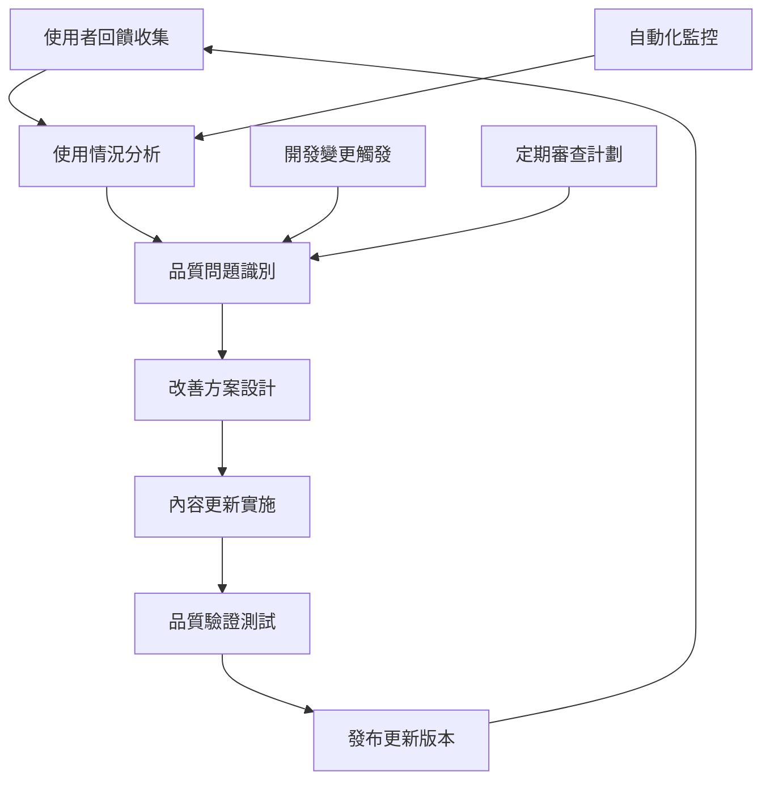

# 📝 文件維護指南

## 📋 總覽

系統化的文件維護策略與實務指南，涵蓋更新流程、品質保證、版本控制和責任分工，確保專案文件的持續準確性和實用性。

## 🔄 文件更新流程

### 文件生命周期管理

#### **三層文件架構維護**

**第一層 (01-getting-started)**：
- **更新頻率**: 每個主版本 (v0.x.0)
- **維護重點**: 核心概念準確性
- **責任人員**: 架構師 + 技術主導

**第二層 (02-development)**：
- **更新頻率**: 每個次版本 (v0.x.x)  
- **維護重點**: 開發流程與工具鏈同步
- **責任人員**: 各領域專家

**第三層 (03-reference)**：
- **更新頻率**: 持續更新
- **維護重點**: 詳細技術資訊與最佳實務
- **責任人員**: 全體開發者

### 文件更新觸發機制

```javascript
// 自動化文件更新檢測系統
class DocumentationUpdateDetector {
  constructor() {
    this.updateTriggers = {
      CODE_CHANGES: this.detectCodeChanges.bind(this),
      API_CHANGES: this.detectAPIChanges.bind(this),
      WORKFLOW_CHANGES: this.detectWorkflowChanges.bind(this),
      DEPENDENCY_UPDATES: this.detectDependencyUpdates.bind(this)
    };
  }

  async analyzeChanges(gitDiff) {
    const updateNeeds = [];
    
    for (const [triggerType, detector] of Object.entries(this.updateTriggers)) {
      const detectionResult = await detector(gitDiff);
      
      if (detectionResult.updateRequired) {
        updateNeeds.push({
          type: triggerType,
          affectedDocs: detectionResult.affectedDocs,
          priority: detectionResult.priority,
          suggestedActions: detectionResult.actions
        });
      }
    }
    
    return this.prioritizeUpdates(updateNeeds);
  }

  detectCodeChanges(gitDiff) {
    const codeFiles = gitDiff.files.filter(f => 
      /\.(js|ts|jsx|tsx)$/.test(f.path)
    );
    
    if (codeFiles.length === 0) {
      return { updateRequired: false };
    }

    // 分析程式碼變更影響的文件
    const affectedDocs = [];
    
    codeFiles.forEach(file => {
      if (file.path.includes('/api/')) {
        affectedDocs.push('docs/domains/02-development/api/internal-api.md');
      }
      
      if (file.path.includes('/services/')) {
        affectedDocs.push('docs/domains/02-development/architecture/domain-design.md');
      }
      
      if (file.path.includes('/test/')) {
        affectedDocs.push('docs/domains/02-development/testing/test-pyramid.md');
      }
    });

    return {
      updateRequired: affectedDocs.length > 0,
      affectedDocs: [...new Set(affectedDocs)],
      priority: 'HIGH',
      actions: [
        '檢查程式碼範例是否需要更新',
        '驗證 API 文件準確性',
        '更新相關技術規範'
      ]
    };
  }

  detectAPIChanges(gitDiff) {
    const apiChanges = gitDiff.changes.filter(change =>
      change.type === 'FUNCTION_SIGNATURE' || 
      change.type === 'CLASS_INTERFACE' ||
      change.type === 'MODULE_EXPORT'
    );

    if (apiChanges.length === 0) {
      return { updateRequired: false };
    }

    return {
      updateRequired: true,
      affectedDocs: [
        'docs/domains/02-development/api/internal-api.md',
        'docs/domains/01-getting-started/core-architecture.md'
      ],
      priority: 'CRITICAL',
      actions: [
        '立即更新 API 文件',
        '檢查程式碼範例',
        '更新使用說明'
      ]
    };
  }

  prioritizeUpdates(updateNeeds) {
    return updateNeeds.sort((a, b) => {
      const priorityOrder = { CRITICAL: 0, HIGH: 1, MEDIUM: 2, LOW: 3 };
      return priorityOrder[a.priority] - priorityOrder[b.priority];
    });
  }
}
```

## 📊 文件品質保證機制

### 自動化品質檢查

#### **連結驗證系統**

```javascript
// 文件連結驗證工具
class DocumentationLinkValidator {
  constructor() {
    this.validationRules = {
      INTERNAL_LINKS: this.validateInternalLinks.bind(this),
      EXTERNAL_LINKS: this.validateExternalLinks.bind(this),
      CODE_REFERENCES: this.validateCodeReferences.bind(this),
      IMAGE_RESOURCES: this.validateImageResources.bind(this)
    };
  }

  async validateDocument(filePath) {
    const content = await this.readFile(filePath);
    const validationResults = [];

    for (const [ruleName, validator] of Object.entries(this.validationRules)) {
      try {
        const result = await validator(content, filePath);
        validationResults.push({
          rule: ruleName,
          status: result.isValid ? 'PASS' : 'FAIL',
          issues: result.issues || [],
          suggestions: result.suggestions || []
        });
      } catch (error) {
        validationResults.push({
          rule: ruleName,
          status: 'ERROR',
          error: error.message
        });
      }
    }

    return this.generateValidationReport(filePath, validationResults);
  }

  async validateInternalLinks(content, currentFile) {
    const linkPattern = /\[([^\]]*)\]\(([^)]+)\)/g;
    const issues = [];
    let match;

    while ((match = linkPattern.exec(content)) !== null) {
      const [fullMatch, linkText, linkPath] = match;
      
      if (!linkPath.startsWith('http') && !linkPath.startsWith('#')) {
        const resolvedPath = this.resolvePath(currentFile, linkPath);
        
        if (!(await this.fileExists(resolvedPath))) {
          issues.push({
            type: 'BROKEN_INTERNAL_LINK',
            link: fullMatch,
            targetPath: resolvedPath,
            line: this.getLineNumber(content, match.index)
          });
        }
      }
    }

    return {
      isValid: issues.length === 0,
      issues,
      suggestions: issues.map(issue => ({
        type: 'FIX_SUGGESTION',
        message: `檢查連結路徑: ${issue.targetPath}`,
        autoFixable: false
      }))
    };
  }

  async validateCodeReferences(content, currentFile) {
    const codeBlockPattern = /```(\w+)?\n([\s\S]*?)```/g;
    const issues = [];
    let match;

    while ((match = codeBlockPattern.exec(content)) !== null) {
      const [fullMatch, language, code] = match;
      
      if (language === 'javascript' || language === 'js') {
        const syntaxIssues = await this.validateJavaScriptSyntax(code);
        issues.push(...syntaxIssues);
      }
    }

    return {
      isValid: issues.length === 0,
      issues,
      suggestions: issues.map(issue => ({
        type: 'CODE_FIX',
        message: `修正程式碼語法: ${issue.message}`,
        autoFixable: true
      }))
    };
  }

  generateValidationReport(filePath, results) {
    const totalIssues = results.reduce((sum, r) => sum + (r.issues?.length || 0), 0);
    
    return {
      file: filePath,
      timestamp: new Date().toISOString(),
      overallStatus: totalIssues === 0 ? 'PASS' : 'FAIL',
      summary: {
        totalRules: results.length,
        passedRules: results.filter(r => r.status === 'PASS').length,
        totalIssues
      },
      details: results,
      actionItems: this.generateActionItems(results)
    };
  }
}
```

### 內容品質標準

#### **技術文件寫作檢查清單**

**結構完整性**:
- [ ] 包含清晰的總覽說明
- [ ] 有具體的使用情境
- [ ] 提供完整的程式碼範例
- [ ] 包含相關文件連結

**技術準確性**:
- [ ] 程式碼範例可執行
- [ ] API 調用正確無誤
- [ ] 版本資訊準確
- [ ] 外部連結有效

**可讀性標準**:
- [ ] 使用清晰的標題結構
- [ ] 段落長度適中 (< 150字)
- [ ] 程式碼有適當註解
- [ ] 包含實際操作步驟

#### **自動化內容審查**

```javascript
// 文件內容品質分析器
class ContentQualityAnalyzer {
  constructor() {
    this.qualityMetrics = {
      readability: new ReadabilityScorer(),
      completeness: new CompletenessChecker(),
      accuracy: new AccuracyValidator(),
      consistency: new ConsistencyAnalyzer()
    };
  }

  async analyzeDocument(content, metadata) {
    const analysis = {};

    for (const [metricName, analyzer] of Object.entries(this.qualityMetrics)) {
      analysis[metricName] = await analyzer.analyze(content, metadata);
    }

    return this.generateQualityScore(analysis);
  }

  generateQualityScore(analysis) {
    const weights = {
      readability: 0.25,
      completeness: 0.30,
      accuracy: 0.30,
      consistency: 0.15
    };

    let totalScore = 0;
    const details = {};

    for (const [metric, weight] of Object.entries(weights)) {
      const score = analysis[metric].score;
      totalScore += score * weight;
      details[metric] = {
        score,
        weight,
        issues: analysis[metric].issues,
        suggestions: analysis[metric].suggestions
      };
    }

    return {
      overallScore: Math.round(totalScore * 100) / 100,
      grade: this.scoreToGrade(totalScore),
      breakdown: details,
      actionPlan: this.generateActionPlan(analysis)
    };
  }

  scoreToGrade(score) {
    if (score >= 0.9) return 'A';
    if (score >= 0.8) return 'B';
    if (score >= 0.7) return 'C';
    if (score >= 0.6) return 'D';
    return 'F';
  }
}
```

## 🔧 版本控制與變更管理

### Git-based 文件管理

#### **文件變更追蹤策略**

```bash
# 文件變更分析腳本
#!/bin/bash
# scripts/analyze-doc-changes.sh

analyze_documentation_impact() {
    local target_branch="${1:-main}"
    local current_branch=$(git rev-parse --abbrev-ref HEAD)
    
    echo "📊 分析文件變更影響..."
    echo "比較: $target_branch..$current_branch"
    
    # 取得文件變更清單
    local doc_changes=$(git diff --name-only $target_branch..$current_branch | grep '\.md$')
    
    if [[ -z "$doc_changes" ]]; then
        echo "✅ 沒有文件變更"
        return 0
    fi
    
    echo "📝 變更的文件:"
    echo "$doc_changes"
    
    # 分析影響範圍
    analyze_change_impact "$doc_changes"
    
    # 檢查是否需要更新相關文件
    suggest_related_updates "$doc_changes"
    
    # 生成變更摘要
    generate_change_summary "$doc_changes" "$target_branch" "$current_branch"
}

analyze_change_impact() {
    local changed_docs="$1"
    
    echo ""
    echo "🎯 影響範圍分析:"
    
    while IFS= read -r doc_file; do
        if [[ -z "$doc_file" ]]; then
            continue
        fi
        
        local impact_level="LOW"
        local affected_users="developers"
        
        # 根據文件路徑判斷影響等級
        if [[ "$doc_file" =~ docs/domains/01-getting-started ]]; then
            impact_level="HIGH"
            affected_users="new developers, all users"
        elif [[ "$doc_file" =~ docs/domains/02-development ]]; then
            impact_level="MEDIUM"
            affected_users="active developers"
        fi
        
        echo "  📄 $doc_file"
        echo "     影響等級: $impact_level"
        echo "     影響對象: $affected_users"
        
    done <<< "$changed_docs"
}

generate_change_summary() {
    local changed_docs="$1"
    local target_branch="$2"
    local current_branch="$3"
    
    echo ""
    echo "📋 變更摘要報告:"
    
    local total_additions=$(git diff --numstat $target_branch..$current_branch -- '*.md' | awk '{sum+=$1} END {print sum+0}')
    local total_deletions=$(git diff --numstat $target_branch..$current_branch -- '*.md' | awk '{sum+=$2} END {print sum+0}')
    local files_changed=$(echo "$changed_docs" | wc -l)
    
    echo "  📊 統計資料:"
    echo "     變更檔案: $files_changed"
    echo "     新增行數: $total_additions"
    echo "     刪除行數: $total_deletions"
    echo "     淨變化: $((total_additions - total_deletions))"
    
    echo ""
    echo "  🎯 建議行動:"
    echo "     1. 執行文件品質檢查: npm run docs:validate"
    echo "     2. 更新相關工作日誌: docs/work-logs/"
    echo "     3. 檢查連結有效性: ./scripts/validate-documentation-links.sh"
    echo "     4. 考慮更新 CHANGELOG.md"
}
```

### 文件版本同步機制

#### **版本標記與發布管理**

```javascript
// 文件版本管理系統
class DocumentationVersionManager {
  constructor() {
    this.versioningStrategy = {
      MAJOR: this.handleMajorVersionUpdate.bind(this),
      MINOR: this.handleMinorVersionUpdate.bind(this),
      PATCH: this.handlePatchVersionUpdate.bind(this)
    };
  }

  async synchronizeWithCodeVersion(codeVersion, changeType) {
    const strategy = this.versioningStrategy[changeType];
    
    if (!strategy) {
      throw new Error(`Unknown change type: ${changeType}`);
    }

    const updatePlan = await strategy(codeVersion);
    return this.executeUpdatePlan(updatePlan);
  }

  async handleMajorVersionUpdate(newVersion) {
    return {
      version: newVersion,
      scope: 'ALL_LAYERS',
      updateActions: [
        {
          type: 'UPDATE_VERSION_REFERENCES',
          files: ['docs/domains/**/*.md'],
          pattern: /v\d+\.\d+\.\d+/g,
          replacement: newVersion
        },
        {
          type: 'ARCHIVE_OLD_FEATURES',
          sourceDir: 'docs/domains/02-development',
          targetDir: 'docs/domains/03-reference/archive',
          criteria: this.identifyDeprecatedFeatures
        },
        {
          type: 'UPDATE_GETTING_STARTED',
          files: ['docs/domains/01-getting-started/**/*.md'],
          action: 'comprehensive_review'
        },
        {
          type: 'REGENERATE_TOC',
          files: ['docs/README.md', 'docs/domains/*/README.md']
        }
      ],
      validationChecks: [
        'verify_all_links',
        'validate_code_examples',
        'check_consistency'
      ]
    };
  }

  async executeUpdatePlan(updatePlan) {
    const results = [];

    for (const action of updatePlan.updateActions) {
      try {
        const result = await this.executeAction(action);
        results.push({
          action: action.type,
          status: 'SUCCESS',
          details: result
        });
      } catch (error) {
        results.push({
          action: action.type,
          status: 'ERROR',
          error: error.message
        });
      }
    }

    // 執行驗證檢查
    const validationResults = await this.runValidationChecks(
      updatePlan.validationChecks
    );

    return {
      version: updatePlan.version,
      updateResults: results,
      validationResults,
      success: results.every(r => r.status === 'SUCCESS') &&
                validationResults.every(r => r.passed)
    };
  }
}
```

## 👥 維護責任分工

### 角色與職責矩陣

| 文件類型 | 主要維護者 | 審查者 | 更新頻率 |
|----------|------------|---------|----------|
| **核心架構** | 架構師 | 技術主導 | 每個主版本 |
| **開發流程** | DevOps工程師 | 開發團隊 | 每個次版本 |
| **API文件** | 後端工程師 | API負責人 | 每次API變更 |
| **測試指南** | QA工程師 | 測試團隊 | 每個Sprint |
| **部署指南** | DevOps工程師 | 運維團隊 | 每次部署流程變更 |
| **故障排除** | SRE工程師 | 技術支援 | 持續更新 |

### 文件所有權管理

#### **CODEOWNERS 文件配置**

```bash
# .github/CODEOWNERS
# 文件維護責任分配

# 核心文件
docs/domains/01-getting-started/ @architect @tech-lead
docs/README.md @architect @tech-lead

# 開發文件  
docs/domains/02-development/api/ @backend-team
docs/domains/02-development/testing/ @qa-team
docs/domains/02-development/workflows/ @devops-team

# 參考文件
docs/domains/03-reference/deployment/ @devops-team @sre-team
docs/domains/03-reference/performance/ @performance-team
docs/domains/03-reference/troubleshooting/ @sre-team

# 專案管理文件
docs/work-logs/ @project-manager
docs/todolist.md @project-manager
CHANGELOG.md @release-manager

# 腳本和工具
scripts/ @devops-team
```

#### **自動化責任提醒系統**

```javascript
// 文件維護責任提醒系統
class MaintenanceReminderSystem {
  constructor() {
    this.reminderSchedule = new Map();
    this.ownershipRules = this.loadOwnershipRules();
  }

  scheduleMaintenanceReminders() {
    const documents = this.getAllDocuments();
    
    documents.forEach(doc => {
      const owner = this.determineOwner(doc);
      const nextReviewDate = this.calculateNextReviewDate(doc);
      
      this.reminderSchedule.set(doc.path, {
        owner,
        nextReview: nextReviewDate,
        priority: this.calculatePriority(doc),
        lastUpdated: doc.lastModified
      });
    });
    
    return this.generateReminderCalendar();
  }

  calculateNextReviewDate(document) {
    const updateFrequency = this.getUpdateFrequency(document);
    const lastUpdate = document.lastModified;
    
    switch (updateFrequency) {
      case 'CONTINUOUS':
        return this.addDays(lastUpdate, 7); // 每週檢查
      case 'SPRINT':
        return this.addDays(lastUpdate, 14); // 每兩週
      case 'MINOR_VERSION':
        return this.addDays(lastUpdate, 30); // 每月
      case 'MAJOR_VERSION':
        return this.addDays(lastUpdate, 90); // 每季
      default:
        return this.addDays(lastUpdate, 30);
    }
  }

  generateMaintenanceReport() {
    const now = new Date();
    const overdue = [];
    const upcoming = [];
    
    for (const [docPath, reminder] of this.reminderSchedule) {
      if (reminder.nextReview < now) {
        overdue.push({
          document: docPath,
          owner: reminder.owner,
          overdueDays: Math.floor((now - reminder.nextReview) / (1000 * 60 * 60 * 24)),
          priority: reminder.priority
        });
      } else if (reminder.nextReview < this.addDays(now, 7)) {
        upcoming.push({
          document: docPath,
          owner: reminder.owner,
          dueInDays: Math.floor((reminder.nextReview - now) / (1000 * 60 * 60 * 24)),
          priority: reminder.priority
        });
      }
    }
    
    return {
      timestamp: now.toISOString(),
      overdue: overdue.sort((a, b) => b.priority - a.priority),
      upcoming: upcoming.sort((a, b) => a.dueInDays - b.dueInDays),
      summary: {
        totalDocuments: this.reminderSchedule.size,
        overdueCount: overdue.length,
        upcomingCount: upcoming.length
      }
    };
  }
}
```

## 📈 文件使用分析與改善

### 使用情況追蹤

#### **文件存取分析**

```javascript
// 文件使用分析系統
class DocumentationUsageAnalyzer {
  constructor() {
    this.analytics = {
      pageViews: new Map(),
      searchQueries: new Map(),
      userJourneys: [],
      feedbackData: []
    };
  }

  trackDocumentAccess(docPath, userContext) {
    const accessEvent = {
      document: docPath,
      timestamp: Date.now(),
      userType: userContext.type, // new_developer, experienced_developer, etc.
      referrer: userContext.referrer,
      sessionId: userContext.sessionId
    };

    this.analytics.pageViews.set(docPath, 
      (this.analytics.pageViews.get(docPath) || 0) + 1
    );

    this.analytics.userJourneys.push(accessEvent);
    
    // 清理舊資料 (保留30天)
    this.cleanupOldData();
  }

  generateUsageReport(timeRange = 30) {
    const cutoffDate = Date.now() - (timeRange * 24 * 60 * 60 * 1000);
    const recentJourneys = this.analytics.userJourneys.filter(
      journey => journey.timestamp > cutoffDate
    );

    return {
      period: `${timeRange} days`,
      totalAccess: recentJourneys.length,
      topDocuments: this.getTopDocuments(recentJourneys),
      userTypeBreakdown: this.getUserTypeBreakdown(recentJourneys),
      commonPaths: this.analyzeCommonPaths(recentJourneys),
      underutilizedDocs: this.identifyUnderutilizedDocs(),
      recommendations: this.generateImprovementRecommendations()
    };
  }

  identifyUnderutilizedDocs() {
    const allDocs = this.getAllDocumentPaths();
    const accessCounts = new Map();
    
    // 計算每個文件的存取次數
    this.analytics.userJourneys.forEach(journey => {
      accessCounts.set(journey.document, 
        (accessCounts.get(journey.document) || 0) + 1
      );
    });

    // 找出低使用率文件
    return allDocs
      .filter(doc => (accessCounts.get(doc) || 0) < 5) // 少於5次存取
      .map(doc => ({
        path: doc,
        accessCount: accessCounts.get(doc) || 0,
        lastAccess: this.getLastAccessTime(doc),
        suggestedActions: this.suggestImprovements(doc)
      }));
  }
}
```

### 持續改善機制

#### **文件品質提升循環**



## 🛠 維護工具與自動化

### 文件管理工具鏈

```bash
#!/bin/bash
# scripts/doc-maintenance-toolkit.sh

# 文件維護工具集

show_help() {
    cat << EOF
📚 文件維護工具集

使用方式:
  $0 [命令] [選項]

可用命令:
  validate     驗證文件品質和連結
  analyze      分析文件使用情況
  update       更新過期文件
  report       生成維護報告
  cleanup      清理無用文件

範例:
  $0 validate --all
  $0 analyze --period 30
  $0 update --target docs/domains/02-development/
  $0 report --format html

詳細說明請執行: $0 [命令] --help
EOF
}

validate_documentation() {
    local target_dir="${1:-docs/}"
    
    echo "📋 執行文件驗證..."
    
    # 1. 連結檢查
    ./scripts/validate-documentation-links.sh "$target_dir"
    
    # 2. 語法檢查
    find "$target_dir" -name "*.md" -exec markdown-link-check {} \;
    
    # 3. 程式碼區塊驗證
    ./scripts/validate-code-blocks.sh "$target_dir"
    
    # 4. 格式一致性檢查
    ./scripts/check-formatting-consistency.sh "$target_dir"
    
    echo "✅ 文件驗證完成"
}

generate_maintenance_report() {
    local output_format="${1:-markdown}"
    local output_file="docs/maintenance-report-$(date +%Y%m%d).${output_format}"
    
    echo "📊 生成維護報告..."
    
    cat > "$output_file" << EOF
# 文件維護報告

生成時間: $(date)

## 📊 統計資訊

$(./scripts/count-doc-stats.sh)

## 🔗 連結檢查結果

$(./scripts/validate-documentation-links.sh --summary)

## 📝 品質評估

$(./scripts/analyze-doc-quality.sh)

## 🎯 待辦事項

$(./scripts/extract-todo-items.sh docs/)

## 📋 建議改善

$(./scripts/suggest-improvements.sh)

EOF

    echo "✅ 維護報告已生成: $output_file"
}

# 主執行邏輯
case "${1:-help}" in
    validate)
        validate_documentation "$2"
        ;;
    analyze)
        analyze_usage_patterns "$2"
        ;;
    update)
        update_outdated_docs "$2"
        ;;
    report)
        generate_maintenance_report "$2"
        ;;
    cleanup)
        cleanup_unused_files
        ;;
    help|--help|-h)
        show_help
        ;;
    *)
        echo "❌ 未知命令: $1"
        show_help
        exit 1
        ;;
esac
```

---

## 📚 相關文件參考

- [貢獻者指南](./contributor-guide.md) - 參與文件維護的工作流程
- [文件標準規範](./documentation-standards.md) - 寫作格式與品質標準
- [使用情況分析](./usage-analytics.md) - 文件使用數據與改善建議

---

**📝 維護提醒**: 文件維護是持續性工作，建議每週執行品質檢查，每月進行全面審查