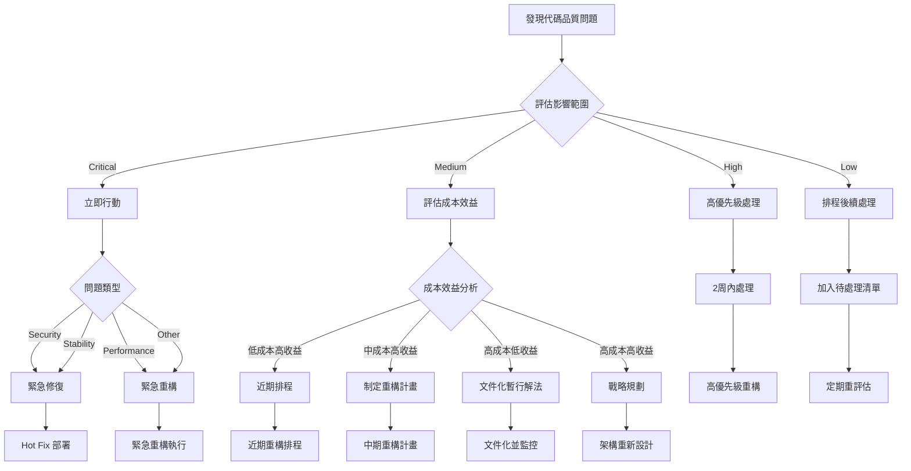

# 🌳 重構決策樹

> **第三層參考文件** - 重構決策判斷與執行指南  
> **適用對象**: 開發者、技術主管、架構師  
> **預期閱讀時間**: 45-60 分鐘  

## 🎯 概述

本文件提供完整的重構決策框架，包含決策樹、風險評估模型、優先級判斷標準和執行計畫指南。幫助開發團隊在面臨代碼品質問題時做出明智的重構決策。

## 🌲 重構決策樹

### 核心決策框架

```javascript
class RefactoringDecisionTree {
  constructor() {
    this.decisionNodes = {
      ENTRY_POINT: {
        question: '發現了代碼品質問題？',
        options: {
          YES: 'ASSESS_IMPACT',
          NO: 'MONITOR'
        }
      },
      
      ASSESS_IMPACT: {
        question: '問題影響範圍和嚴重性？',
        options: {
          CRITICAL: 'IMMEDIATE_ACTION',
          HIGH: 'PRIORITIZE_HIGH',
          MEDIUM: 'EVALUATE_COST',
          LOW: 'SCHEDULE_LATER'
        }
      },
      
      IMMEDIATE_ACTION: {
        question: '是否為安全性或穩定性問題？',
        options: {
          SECURITY: 'HOT_FIX',
          STABILITY: 'HOT_FIX',
          PERFORMANCE: 'URGENT_REFACTOR',
          OTHER: 'URGENT_REFACTOR'
        }
      },
      
      EVALUATE_COST: {
        question: '重構成本 vs 維護成本評估？',
        options: {
          LOW_COST_HIGH_BENEFIT: 'SCHEDULE_SOON',
          MEDIUM_COST_HIGH_BENEFIT: 'PLAN_REFACTOR',
          HIGH_COST_LOW_BENEFIT: 'DOCUMENT_WORKAROUND',
          HIGH_COST_HIGH_BENEFIT: 'STRATEGIC_PLANNING'
        }
      }
    };
    
    this.decisionActions = {
      HOT_FIX: this.planHotFix.bind(this),
      URGENT_REFACTOR: this.planUrgentRefactor.bind(this),
      SCHEDULE_SOON: this.scheduleNearTerm.bind(this),
      PLAN_REFACTOR: this.planMediumTermRefactor.bind(this),
      DOCUMENT_WORKAROUND: this.documentWorkaround.bind(this),
      STRATEGIC_PLANNING: this.initiateStrategicPlanning.bind(this),
      SCHEDULE_LATER: this.addToBacklog.bind(this),
      MONITOR: this.setupMonitoring.bind(this)
    };
  }

  makeDecision(codeIssue) {
    const context = {
      issue: codeIssue,
      path: ['ENTRY_POINT'],
      decisions: [],
      finalAction: null
    };
    
    return this.traverseTree(context);
  }

  traverseTree(context) {
    const currentNode = context.path[context.path.length - 1];
    const node = this.decisionNodes[currentNode];
    
    if (!node) {
      // 到達決策終點
      context.finalAction = this.executeAction(currentNode, context);
      return context;
    }
    
    // 自動評估或提供人工決策介面
    const decision = this.evaluateNode(node, context.issue);
    context.decisions.push({
      node: currentNode,
      question: node.question,
      answer: decision
    });
    
    const nextNode = node.options[decision];
    context.path.push(nextNode);
    
    return this.traverseTree(context);
  }

  evaluateNode(node, issue) {
    switch (node.question) {
      case '發現了代碼品質問題？':
        return issue ? 'YES' : 'NO';
        
      case '問題影響範圍和嚴重性？':
        return this.assessSeverity(issue);
        
      case '是否為安全性或穩定性問題？':
        return this.categorizeUrgentIssue(issue);
        
      case '重構成本 vs 維護成本評估？':
        return this.evaluateCostBenefit(issue);
        
      default:
        return 'UNKNOWN';
    }
  }

  assessSeverity(issue) {
    const severity = this.calculateSeverityScore(issue);
    
    if (severity >= 90) return 'CRITICAL';
    if (severity >= 70) return 'HIGH';
    if (severity >= 40) return 'MEDIUM';
    return 'LOW';
  }

  calculateSeverityScore(issue) {
    let score = 0;
    
    // 安全性問題加重
    if (issue.security_risk) score += 50;
    
    // 影響範圍
    score += issue.affected_modules * 10;
    
    // 使用頻率
    score += issue.usage_frequency * 20;
    
    // 修復難度
    score += issue.fix_complexity * 15;
    
    // 業務影響
    score += issue.business_impact * 25;
    
    return Math.min(score, 100);
  }
}
```

### 決策流程圖



## 🎯 風險評估模型

### 重構風險矩陣

```javascript
class RefactoringRiskAssessment {
  constructor() {
    this.riskFactors = {
      TECHNICAL: {
        code_complexity: { weight: 0.25 },
        test_coverage: { weight: 0.2 },
        dependencies: { weight: 0.15 },
        documentation: { weight: 0.1 }
      },
      
      BUSINESS: {
        feature_stability: { weight: 0.3 },
        user_impact: { weight: 0.25 },
        timeline_pressure: { weight: 0.2 },
        resource_availability: { weight: 0.15 },
        business_priority: { weight: 0.1 }
      },
      
      TEAM: {
        expertise_level: { weight: 0.3 },
        team_size: { weight: 0.2 },
        knowledge_distribution: { weight: 0.2 },
        communication_effectiveness: { weight: 0.15 },
        change_resistance: { weight: 0.15 }
      }
    };
  }

  assessRefactoringRisk(refactoringPlan) {
    const assessment = {
      overall_risk: 'UNKNOWN',
      risk_scores: {},
      mitigation_strategies: [],
      go_no_go_recommendation: 'EVALUATE',
      confidence_level: 0
    };

    // 計算各類風險分數
    for (const [category, factors] of Object.entries(this.riskFactors)) {
      assessment.risk_scores[category] = this.calculateCategoryRisk(
        category, 
        factors, 
        refactoringPlan
      );
    }

    // 計算總體風險
    assessment.overall_risk = this.calculateOverallRisk(assessment.risk_scores);
    
    // 生成緩解策略
    assessment.mitigation_strategies = this.generateMitigationStrategies(
      assessment.risk_scores, 
      refactoringPlan
    );
    
    // 決策建議
    assessment.go_no_go_recommendation = this.makeGoNoGoRecommendation(
      assessment.overall_risk,
      refactoringPlan.expected_benefits
    );

    return assessment;
  }

  calculateCategoryRisk(category, factors, plan) {
    let totalScore = 0;
    let totalWeight = 0;

    for (const [factor, config] of Object.entries(factors)) {
      const score = this.evaluateFactor(category, factor, plan);
      totalScore += score * config.weight;
      totalWeight += config.weight;
    }

    return {
      score: totalScore / totalWeight,
      level: this.getRiskLevel(totalScore / totalWeight),
      factors: this.getFactorDetails(category, factors, plan)
    };
  }

  evaluateFactor(category, factor, plan) {
    switch (`${category}.${factor}`) {
      case 'TECHNICAL.code_complexity':
        return this.assessCodeComplexity(plan.target_code);
        
      case 'TECHNICAL.test_coverage':
        return this.assessTestCoverage(plan.target_code);
        
      case 'BUSINESS.user_impact':
        return this.assessUserImpact(plan.scope);
        
      case 'TEAM.expertise_level':
        return this.assessTeamExpertise(plan.team, plan.refactoring_type);
        
      default:
        return 50; // 中等風險作為預設值
    }
  }

  generateMitigationStrategies(riskScores, plan) {
    const strategies = [];

    // 技術風險緩解
    if (riskScores.TECHNICAL.score > 70) {
      strategies.push({
        category: 'TECHNICAL',
        priority: 'HIGH',
        strategy: '增加技術探索階段',
        actions: [
          '建立詳細的技術調查文件',
          '建立概念驗證(PoC)',
          '進行風險評估會議',
          '建立回滾計畫'
        ]
      });
    }

    // 業務風險緩解
    if (riskScores.BUSINESS.score > 70) {
      strategies.push({
        category: 'BUSINESS',
        priority: 'HIGH',
        strategy: '強化業務溝通與保護措施',
        actions: [
          '與產品經理深度討論',
          '建立功能凍結期',
          '準備快速回滾機制',
          '分階段部署計畫'
        ]
      });
    }

    // 團隊風險緩解
    if (riskScores.TEAM.score > 70) {
      strategies.push({
        category: 'TEAM',
        priority: 'MEDIUM',
        strategy: '提升團隊準備度',
        actions: [
          '舉行技術分享會議',
          '建立配對程式設計制度',
          '增加代碼審查頻率',
          '建立知識文件'
        ]
      });
    }

    return strategies;
  }
}
```

### 風險評估矩陣

| 風險類別 | 低風險 (0-30) | 中風險 (31-70) | 高風險 (71-100) |
|---------|--------------|----------------|----------------|
| **技術風險** | ✅ 繼續進行 | ⚠️ 增加預防措施 | 🚨 重新評估計畫 |
| **業務風險** | ✅ 標準程序 | ⚠️ 強化溝通 | 🚨 高階主管審批 |
| **團隊風險** | ✅ 正常排程 | ⚠️ 額外支援 | 🚨 延後或重組 |

## 📊 優先級判斷標準

### 優先級評分系統

```javascript
class RefactoringPriorityScorer {
  constructor() {
    this.scoringCriteria = {
      // 技術債務嚴重性 (40%)
      TECHNICAL_DEBT_SEVERITY: {
        weight: 0.4,
        factors: {
          maintainability_impact: 0.3,
          scalability_blocker: 0.25,
          security_vulnerability: 0.25,
          performance_degradation: 0.2
        }
      },
      
      // 業務價值影響 (30%)
      BUSINESS_VALUE_IMPACT: {
        weight: 0.3,
        factors: {
          development_velocity: 0.4,
          feature_delivery_blocker: 0.3,
          customer_satisfaction: 0.2,
          operational_cost: 0.1
        }
      },
      
      // 實施成本與風險 (20%)
      IMPLEMENTATION_COST: {
        weight: 0.2,
        factors: {
          development_effort: 0.4,
          testing_complexity: 0.25,
          deployment_risk: 0.2,
          rollback_difficulty: 0.15
        }
      },
      
      // 戰略一致性 (10%)
      STRATEGIC_ALIGNMENT: {
        weight: 0.1,
        factors: {
          architecture_goals: 0.5,
          technology_roadmap: 0.3,
          team_capability: 0.2
        }
      }
    };
  }

  calculatePriority(refactoringCandidate) {
    let totalScore = 0;
    const scoreBreakdown = {};

    for (const [category, config] of Object.entries(this.scoringCriteria)) {
      const categoryScore = this.scoreCategoryFactors(
        category, 
        config.factors, 
        refactoringCandidate
      );
      
      scoreBreakdown[category] = {
        raw_score: categoryScore,
        weighted_score: categoryScore * config.weight,
        weight: config.weight
      };
      
      totalScore += categoryScore * config.weight;
    }

    return {
      total_score: totalScore,
      priority_level: this.getPriorityLevel(totalScore),
      score_breakdown: scoreBreakdown,
      recommendation: this.generateRecommendation(totalScore, scoreBreakdown),
      next_actions: this.suggestNextActions(totalScore, refactoringCandidate)
    };
  }

  getPriorityLevel(score) {
    if (score >= 80) return 'CRITICAL';
    if (score >= 65) return 'HIGH';
    if (score >= 45) return 'MEDIUM';
    if (score >= 25) return 'LOW';
    return 'DEFERRED';
  }

  generateRecommendation(score, breakdown) {
    const priority = this.getPriorityLevel(score);
    
    const recommendations = {
      CRITICAL: {
        action: '立即啟動重構專案',
        timeline: '1-2 週內開始',
        resources: '分配專門團隊',
        approval: '需要高階主管批准'
      },
      
      HIGH: {
        action: '納入下一個衝刺計畫',
        timeline: '2-4 週內開始',
        resources: '分配部分開發人員',
        approval: '技術主管批准'
      },
      
      MEDIUM: {
        action: '排入季度重構計畫',
        timeline: '1-3 月內處理',
        resources: '利用開發空檔',
        approval: '開發團隊內部決定'
      },
      
      LOW: {
        action: '列入長期規劃',
        timeline: '6 月內考慮',
        resources: '個人時間或技術債務時段',
        approval: '不需要特別批准'
      },
      
      DEFERRED: {
        action: '暫緩執行',
        timeline: '條件改善後重評',
        resources: '不分配資源',
        approval: '定期重新評估'
      }
    };

    return recommendations[priority];
  }
}
```

### 優先級矩陣

```markdown
# 📊 重構優先級矩陣

## 優先級分級標準

| 優先級 | 分數範圍 | 處理時間 | 資源分配 | 決策層級 |
|--------|----------|----------|----------|----------|
| 🚨 CRITICAL | 80-100 | 1-2週 | 專門團隊 | 高階主管 |
| 🔴 HIGH | 65-79 | 2-4週 | 部分人員 | 技術主管 |
| 🟡 MEDIUM | 45-64 | 1-3月 | 開發空檔 | 團隊決定 |
| 🟢 LOW | 25-44 | 6月內 | 個人時間 | 不需批准 |
| ⚪ DEFERRED | 0-24 | 條件成熟 | 不分配 | 定期評估 |

## 決策參考因子

### 技術債務嚴重性 (40% 權重)
- **維護性影響** (30%): 代碼修改困難度
- **可擴展性阻礙** (25%): 是否阻礙功能擴展
- **安全性弱點** (25%): 是否存在安全風險
- **效能衰退** (20%): 是否影響系統效能

### 業務價值影響 (30% 權重)
- **開發速度** (40%): 對開發效率的影響
- **功能交付阻礙** (30%): 是否阻礙新功能開發
- **客戶滿意度** (20%): 對使用者體驗的影響
- **營運成本** (10%): 對系統維運成本的影響

### 實施成本風險 (20% 權重)
- **開發工作量** (40%): 所需人力和時間
- **測試複雜度** (25%): 測試驗證的困難度
- **部署風險** (20%): 部署時的潛在問題
- **回滾難度** (15%): 問題發生時的恢復難度

### 戰略一致性 (10% 權重)
- **架構目標** (50%): 與整體架構方向的符合度
- **技術路線圖** (30%): 與技術發展計畫的一致性
- **團隊能力** (20%): 團隊執行能力的匹配度
```

## 📋 執行計畫指南

### 重構計畫範本

```javascript
class RefactoringPlanTemplate {
  generatePlan(refactoringRequest) {
    return {
      // 基本資訊
      metadata: {
        id: this.generatePlanId(),
        title: refactoringRequest.title,
        created_by: refactoringRequest.requester,
        created_at: new Date(),
        estimated_completion: this.estimateCompletion(refactoringRequest),
        priority: refactoringRequest.priority_level
      },

      // 問題定義
      problem_statement: {
        current_issues: refactoringRequest.identified_issues,
        pain_points: refactoringRequest.pain_points,
        impact_analysis: refactoringRequest.impact_assessment,
        root_causes: this.identifyRootCauses(refactoringRequest)
      },

      // 目標定義
      objectives: {
        primary_goals: refactoringRequest.primary_objectives,
        success_criteria: this.defineSucessCriteria(refactoringRequest),
        measurable_outcomes: this.defineMetrics(refactoringRequest),
        business_value: refactoringRequest.expected_benefits
      },

      // 範圍定義
      scope: {
        included_components: refactoringRequest.target_components,
        excluded_components: refactoringRequest.out_of_scope,
        affected_systems: this.identifyAffectedSystems(refactoringRequest),
        dependencies: this.mapDependencies(refactoringRequest)
      },

      // 執行階段
      phases: this.generateExecutionPhases(refactoringRequest),

      // 風險管理
      risk_management: {
        identified_risks: this.identifyRisks(refactoringRequest),
        mitigation_strategies: this.generateMitigationPlans(refactoringRequest),
        contingency_plans: this.createContingencyPlans(refactoringRequest),
        rollback_strategy: this.defineRollbackStrategy(refactoringRequest)
      },

      // 資源需求
      resource_requirements: {
        team_members: this.identifyRequiredSkills(refactoringRequest),
        time_estimation: this.estimateTimeRequirements(refactoringRequest),
        tools_and_infrastructure: this.identifyToolRequirements(refactoringRequest),
        budget_implications: this.estimateCosts(refactoringRequest)
      },

      // 品質保證
      quality_assurance: {
        testing_strategy: this.defineTestingApproach(refactoringRequest),
        code_review_process: this.defineReviewProcess(refactoringRequest),
        performance_benchmarks: this.definePerformanceTargets(refactoringRequest),
        documentation_requirements: this.defineDocumentationNeeds(refactoringRequest)
      },

      // 溝通計畫
      communication_plan: {
        stakeholders: this.identifyStakeholders(refactoringRequest),
        reporting_schedule: this.defineReportingSchedule(refactoringRequest),
        decision_points: this.identifyDecisionPoints(refactoringRequest),
        escalation_procedures: this.defineEscalationPaths(refactoringRequest)
      }
    };
  }

  generateExecutionPhases(request) {
    const phases = [
      {
        name: 'PREPARATION',
        duration: '1-2 週',
        objectives: [
          '深度代碼分析和理解',
          '建立完整的測試覆蓋',
          '建立效能基線',
          '準備開發環境'
        ],
        deliverables: [
          '代碼分析報告',
          '測試套件完善',
          '效能基準測試',
          '重構設計文件'
        ]
      },
      
      {
        name: 'IMPLEMENTATION',
        duration: this.estimateImplementationTime(request),
        objectives: [
          '按階段執行重構',
          '保持功能穩定性',
          '持續測試驗證',
          '文件同步更新'
        ],
        deliverables: [
          '重構代碼',
          '更新的測試',
          '效能驗證報告',
          '技術文件'
        ]
      },
      
      {
        name: 'VALIDATION',
        duration: '1-2 週',
        objectives: [
          '全面功能驗證',
          '效能回歸測試',
          '安全性檢查',
          '使用者體驗確認'
        ],
        deliverables: [
          '驗證測試報告',
          '效能比較分析',
          '安全性評估',
          'UAT 結果'
        ]
      },
      
      {
        name: 'DEPLOYMENT',
        duration: '3-5 天',
        objectives: [
          '生產環境部署',
          '監控系統設置',
          '回滾機制確認',
          '團隊知識轉移'
        ],
        deliverables: [
          '生產部署',
          '監控儀表板',
          '操作手冊',
          '知識轉移文件'
        ]
      }
    ];

    return phases.map(phase => ({
      ...phase,
      id: this.generatePhaseId(phase.name),
      start_date: null, // 將在執行時填入
      end_date: null,
      status: 'PENDING',
      completion_percentage: 0,
      milestone_checkpoints: this.definePhaseCheckpoints(phase)
    }));
  }
}
```

### 階段檢查點

```markdown
# 📋 重構執行檢查點

## Phase 1: 準備階段 ✅

### 週檢查點
- [ ] **Week 1 End**: 代碼分析完成度 ≥ 80%
- [ ] **Week 2 End**: 測試覆蓋率達到基線要求

### 品質門檻
- 代碼理解度評估 ≥ 85%
- 現有測試套件通過率 = 100%
- 效能基線建立完成
- 團隊成員技術準備就緒

## Phase 2: 實施階段 🔄

### 每日檢查點
- [ ] **Daily**: 所有測試通過
- [ ] **Daily**: 代碼審查完成
- [ ] **Daily**: 效能不下降

### 週檢查點
- [ ] **Weekly**: 重構進度符合計畫
- [ ] **Weekly**: 文件同步更新
- [ ] **Weekly**: 無阻塞性問題

## Phase 3: 驗證階段 ✅

### 功能驗證
- [ ] 所有既有功能正常運作
- [ ] 新的代碼結構符合設計
- [ ] 效能指標達到或超越目標
- [ ] 安全性檢查通過

## Phase 4: 部署階段 🚀

### 部署前檢查
- [ ] 生產環境準備就緒
- [ ] 回滾程序測試完成
- [ ] 監控系統配置完成
- [ ] 團隊成員待命支援

### 部署後驗證
- [ ] 功能正常運作確認
- [ ] 效能指標監控正常
- [ ] 無重大錯誤或警告
- [ ] 使用者體驗無負面影響
```

## 🔄 持續改善機制

### 重構後評估

```javascript
class PostRefactoringEvaluation {
  constructor() {
    this.evaluationMetrics = {
      TECHNICAL_OUTCOMES: [
        'code_quality_improvement',
        'maintainability_index',
        'test_coverage_change',
        'performance_metrics',
        'security_improvements'
      ],
      
      BUSINESS_OUTCOMES: [
        'development_velocity_change',
        'defect_rate_change',
        'feature_delivery_improvement',
        'operational_cost_impact'
      ],
      
      TEAM_OUTCOMES: [
        'developer_satisfaction',
        'knowledge_transfer_effectiveness',
        'onboarding_time_improvement',
        'collaboration_enhancement'
      ],
      
      PROCESS_LEARNINGS: [
        'estimation_accuracy',
        'risk_mitigation_effectiveness',
        'communication_quality',
        'decision_making_process'
      ]
    };
  }

  conductEvaluation(refactoringProject) {
    const evaluation = {
      project_id: refactoringProject.id,
      evaluation_date: new Date(),
      evaluator: this.getCurrentEvaluator(),
      
      outcome_analysis: this.analyzeOutcomes(refactoringProject),
      lessons_learned: this.extractLessonsLearned(refactoringProject),
      improvement_recommendations: this.generateImprovements(refactoringProject),
      
      success_rating: 'TBD',
      would_repeat: null,
      confidence_in_decisions: 'TBD'
    };

    // 計算成功評級
    evaluation.success_rating = this.calculateSuccessRating(evaluation.outcome_analysis);
    
    // 經驗提取
    evaluation.lessons_learned = this.extractLessonsLearned(refactoringProject);
    
    // 流程改善建議
    evaluation.process_improvements = this.identifyProcessImprovements(refactoringProject);

    return evaluation;
  }

  analyzeOutcomes(project) {
    const analysis = {};
    
    for (const [category, metrics] of Object.entries(this.evaluationMetrics)) {
      analysis[category] = {};
      
      for (const metric of metrics) {
        analysis[category][metric] = {
          planned_outcome: project.objectives[metric],
          actual_outcome: this.measureActualOutcome(metric, project),
          variance: null,
          assessment: 'TBD'
        };
        
        // 計算差異
        analysis[category][metric].variance = this.calculateVariance(
          analysis[category][metric].planned_outcome,
          analysis[category][metric].actual_outcome
        );
        
        // 評估結果
        analysis[category][metric].assessment = this.assessOutcome(
          analysis[category][metric].variance
        );
      }
    }
    
    return analysis;
  }
}
```

## 🔗 相關文件

- [技術債務管理](./technical-debt-management.md) - 技術債務識別和優先級評估
- [代碼品質標準](./code-quality-standards.md) - 重構後的品質驗證標準  
- [案例研究](./case-studies.md) - 實際重構案例分析
- [TDD 開發流程](../../02-development/workflows/tdd-process.md) - 重構中的測試策略
- [代碼審查指南](../../02-development/workflows/code-review.md) - 重構代碼的審查標準

---

**📝 文件狀態**: 已完成 | **最後更新**: 2025-09-06 | **版本**: v0.11.0