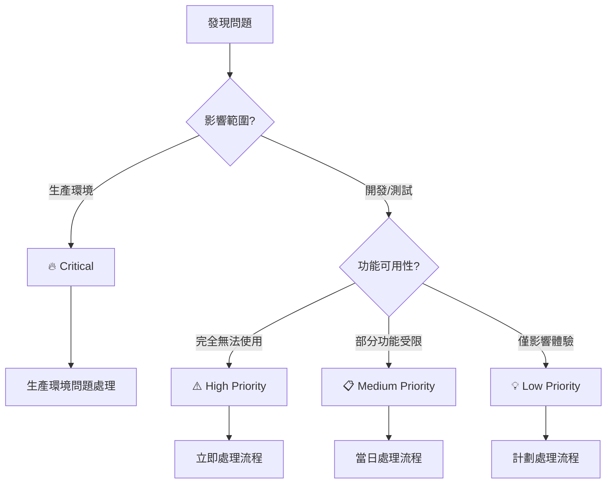

# 🚑 問題診斷專區

> **第三層專業參考文件** - 完整故障診斷與解決方案系統  
> **適用對象**: 開發者、維運人員、技術支援團隊  
> **預期閱讀時間**: 15-30 分鐘 (根據問題類型)  

## 🎯 快速問題定位

### 緊急問題快速導航

```
🔥 生產環境故障 → 生產環境問題處理 (P0 處理)
⚡ Extension 無法載入 → Chrome Extension 特殊問題 (P1 處理)  
🐌 效能嚴重低下 → 效能問題診斷 (P1 處理)
❓ 開發環境問題 → 常見問題手冊 (P2 處理)
```

### 問題分類決策樹



## 📂 問題診斷文件庫

### **🔍 核心診斷文件**

| 文件 | 說明 | 使用時機 | 處理時間 | 維護狀態 |
|------|------|----------|----------|----------|
| [常見問題手冊](./common-issues.md) | FAQ 和快速解決方案 | 日常開發問題 | 5-15分鐘 | ✅ 完成 |
| [Chrome Extension 特殊問題](./extension-specific-issues.md) | Extension 環境特有問題 | Extension 開發故障 | 10-30分鐘 | ✅ 完成 |
| [效能問題診斷](./performance-troubleshooting.md) | 效能瓶頸定位和解決 | 效能優化需求 | 30-60分鐘 | ✅ 完成 |
| [生產環境問題處理](./production-incident-handling.md) | 線上問題應急處理流程 | 緊急故障處理 | 即時響應 | ✅ 完成 |

### **🛠 支援工具與資源**

| 工具類型 | 工具名稱 | 用途 | 使用難度 |
|----------|----------|------|----------|
| **監控工具** | Chrome DevTools | 前端除錯和效能分析 | 初級 |
| **監控工具** | Extension Developer Tools | Extension 專用除錯 | 中級 |
| **日誌分析** | Console API | 應用程式日誌追蹤 | 初級 |
| **效能分析** | Performance API | 效能指標收集 | 中級 |
| **網路分析** | Network Panel | API 請求分析 | 初級 |
| **記憶體分析** | Memory Tab | 記憶體洩漏檢測 | 高級 |

## 🔄 標準問題處理流程

### Phase 1: 問題識別與分類

#### 1.1 問題描述規範化
```javascript
class ProblemReport {
  constructor() {
    this.template = {
      title: '',           // 問題簡述 (1 句話)
      description: '',     // 詳細描述
      environment: {       // 環境資訊
        browser: '',
        version: '',
        os: '',
        extensionVersion: ''
      },
      reproducible: false, // 是否可重現
      impact: '',         // 影響範圍
      severity: '',       // 嚴重程度
      steps: [],          // 重現步驟
      expected: '',       // 預期行為
      actual: '',         // 實際行為
      screenshots: [],    // 截圖證據
      logs: []           // 相關日誌
    };
  }

  validateReport() {
    const required = ['title', 'description', 'environment', 'severity'];
    return required.every(field => this.template[field]);
  }
}
```

#### 1.2 自動化問題分類
```javascript
class ProblemClassifier {
  constructor() {
    this.classificationRules = {
      'CRASH': /crash|崩潰|停止回應|freeze/i,
      'PERFORMANCE': /slow|慢|lag|延遲|timeout/i,
      'EXTENSION': /extension|擴充功能|manifest|background/i,
      'UI': /interface|介面|button|display|render/i,
      'DATA': /data|資料|loading|fetch|api/i,
      'PERMISSION': /permission|權限|access|blocked/i
    };
  }

  classify(problemDescription) {
    const matches = [];
    
    for (const [category, pattern] of Object.entries(this.classificationRules)) {
      if (pattern.test(problemDescription)) {
        matches.push(category);
      }
    }
    
    return {
      primaryCategory: matches[0] || 'GENERAL',
      allCategories: matches,
      confidence: matches.length > 0 ? 'HIGH' : 'LOW'
    };
  }

  suggestDocuments(category) {
    const documentMap = {
      'CRASH': ['./common-issues.md', './extension-specific-issues.md'],
      'PERFORMANCE': ['./performance-troubleshooting.md'],
      'EXTENSION': ['./extension-specific-issues.md'],
      'UI': ['./common-issues.md'],
      'DATA': ['./common-issues.md', './performance-troubleshooting.md'],
      'PERMISSION': ['./extension-specific-issues.md'],
      'GENERAL': ['./common-issues.md']
    };
    
    return documentMap[category] || documentMap['GENERAL'];
  }
}
```

### Phase 2: 診斷與根因分析

#### 2.1 系統化診斷檢查清單
```javascript
class DiagnosticChecklist {
  constructor() {
    this.checks = {
      environment: [
        'Chrome 版本是否支援',
        'Extension 權限是否正確',
        'Developer Mode 是否啟用',
        '衝突的 Extension 是否存在'
      ],
      application: [
        'Console 是否有錯誤訊息',
        'Network 請求是否正常',
        'LocalStorage 資料是否正確',
        'Background Script 是否運行'
      ],
      performance: [
        'CPU 使用率是否正常',
        '記憶體使用量是否異常',
        'API 響應時間是否合理',
        '渲染效能是否正常'
      ],
      data: [
        '資料格式是否正確',
        'API 端點是否可訪問',
        '資料同步是否正常',
        '快取狀態是否正確'
      ]
    };
  }

  generateChecklistFor(problemCategory) {
    const relevantChecks = {
      'CRASH': ['environment', 'application'],
      'PERFORMANCE': ['performance', 'application'],
      'EXTENSION': ['environment', 'application'],
      'DATA': ['data', 'application'],
      'GENERAL': ['environment', 'application', 'performance']
    };
    
    const categories = relevantChecks[problemCategory] || ['environment', 'application'];
    const checklist = [];
    
    categories.forEach(category => {
      checklist.push(...this.checks[category]);
    });
    
    return checklist;
  }
}
```

#### 2.2 自動化診斷工具
```javascript
class AutoDiagnostic {
  constructor() {
    this.diagnostics = new Map();
  }

  async runEnvironmentCheck() {
    const results = {
      browser: this.getBrowserInfo(),
      extension: await this.getExtensionInfo(),
      permissions: await this.checkPermissions(),
      conflicts: await this.detectConflicts()
    };
    
    return {
      status: this.evaluateEnvironment(results),
      details: results,
      recommendations: this.generateEnvironmentRecommendations(results)
    };
  }

  async runPerformanceCheck() {
    const metrics = {
      memory: performance.memory,
      timing: performance.timing,
      navigation: performance.navigation.type
    };
    
    const analysis = {
      memoryUsage: this.analyzeMemoryUsage(metrics.memory),
      loadingTime: this.analyzeLoadingTime(metrics.timing),
      userExperience: this.calculateUXScore(metrics)
    };
    
    return {
      metrics,
      analysis,
      recommendations: this.generatePerformanceRecommendations(analysis)
    };
  }

  getBrowserInfo() {
    return {
      userAgent: navigator.userAgent,
      version: this.parseChromeVersion(navigator.userAgent),
      platform: navigator.platform,
      language: navigator.language
    };
  }

  async getExtensionInfo() {
    try {
      const manifest = chrome.runtime.getManifest();
      return {
        version: manifest.version,
        permissions: manifest.permissions || [],
        contentScripts: manifest.content_scripts?.length || 0,
        backgroundScript: !!manifest.background
      };
    } catch (error) {
      return { error: 'Unable to access extension info' };
    }
  }
}
```

### Phase 3: 解決方案實施

#### 3.1 解決方案模板系統
```javascript
class SolutionTemplate {
  constructor() {
    this.templates = {
      'PERMISSION_ERROR': {
        title: 'Extension 權限問題',
        steps: [
          '檢查 manifest.json 中的 permissions 設定',
          '確認 host_permissions 是否包含目標網站',
          '重新載入 Extension',
          '測試功能是否恢復正常'
        ],
        verification: 'Extension 可以正常存取目標網站資源',
        rollback: '如果問題持續，回復到上一個工作版本'
      },
      'PERFORMANCE_SLOW': {
        title: '效能優化解決方案',
        steps: [
          '使用 Chrome DevTools 識別效能瓶頸',
          '檢查是否有記憶體洩漏',
          '優化 DOM 操作和 API 呼叫',
          '實施延遲載入或快取機制'
        ],
        verification: '頁面載入時間 < 2 秒，互動響應 < 100ms',
        rollback: '監控效能指標，如有退化立即回復'
      },
      'DATA_SYNC_ERROR': {
        title: '資料同步問題',
        steps: [
          '檢查 API 端點可用性',
          '驗證請求格式和參數',
          '檢查網路連接和代理設定',
          '確認 localStorage 和 chrome.storage 狀態'
        ],
        verification: '資料可以正確載入和儲存',
        rollback: '清除快取並重新初始化資料'
      }
    };
  }

  getSolution(problemType, context = {}) {
    const template = this.templates[problemType];
    if (!template) {
      return this.generateGenericSolution(problemType, context);
    }
    
    return this.customizeSolution(template, context);
  }

  customizeSolution(template, context) {
    const customized = { ...template };
    
    // 根據具體情況調整解決步驟
    if (context.severity === 'CRITICAL') {
      customized.steps.unshift('立即通知相關人員');
      customized.steps.push('記錄事件並安排事後檢討');
    }
    
    return customized;
  }
}
```

#### 3.2 解決方案執行追蹤
```javascript
class SolutionTracker {
  constructor() {
    this.solutions = new Map();
    this.outcomes = new Map();
  }

  trackSolutionAttempt(problemId, solution, implementer) {
    const attempt = {
      id: this.generateAttemptId(),
      problemId,
      solution,
      implementer,
      startTime: new Date(),
      status: 'IN_PROGRESS',
      steps: solution.steps.map(step => ({
        description: step,
        completed: false,
        startTime: null,
        endTime: null,
        notes: ''
      }))
    };
    
    this.solutions.set(attempt.id, attempt);
    return attempt.id;
  }

  updateStepProgress(attemptId, stepIndex, completed, notes = '') {
    const attempt = this.solutions.get(attemptId);
    if (!attempt || !attempt.steps[stepIndex]) return false;
    
    const step = attempt.steps[stepIndex];
    step.completed = completed;
    step.endTime = completed ? new Date() : null;
    step.notes = notes;
    
    // 檢查是否所有步驟都完成
    const allCompleted = attempt.steps.every(s => s.completed);
    if (allCompleted) {
      attempt.status = 'COMPLETED';
      attempt.endTime = new Date();
    }
    
    return true;
  }

  recordOutcome(attemptId, success, verification, lessons = []) {
    const outcome = {
      attemptId,
      success,
      verification,
      timestamp: new Date(),
      duration: this.calculateDuration(attemptId),
      lessons,
      followUpRequired: !success
    };
    
    this.outcomes.set(attemptId, outcome);
    return outcome;
  }

  generateReport(problemId) {
    const attempts = Array.from(this.solutions.values())
      .filter(solution => solution.problemId === problemId);
    
    const outcomes = attempts.map(attempt => 
      this.outcomes.get(attempt.id)
    ).filter(Boolean);
    
    return {
      problemId,
      totalAttempts: attempts.length,
      successfulAttempts: outcomes.filter(o => o.success).length,
      averageDuration: this.calculateAverageDuration(outcomes),
      commonIssues: this.identifyCommonIssues(attempts),
      recommendations: this.generateImprovementRecommendations(outcomes)
    };
  }
}
```

## 🔧 診斷工具整合

### Chrome DevTools 整合指南

#### 開發者工具設定
```javascript
class DevToolsIntegration {
  constructor() {
    this.setupConsoleHelpers();
    this.setupPerformanceMonitoring();
  }

  setupConsoleHelpers() {
    // 在 Console 中提供診斷輔助函數
    window.diagTools = {
      checkExtension: this.checkExtensionStatus.bind(this),
      analyzePerformance: this.quickPerformanceAnalysis.bind(this),
      validateData: this.validateDataIntegrity.bind(this),
      exportLogs: this.exportDiagnosticLogs.bind(this)
    };
    
    console.log('🔧 診斷工具已載入。使用 diagTools.checkExtension() 開始診斷');
  }

  checkExtensionStatus() {
    const status = {
      manifest: chrome.runtime.getManifest(),
      permissions: chrome.permissions,
      storage: chrome.storage,
      tabs: chrome.tabs
    };
    
    console.table(status);
    return status;
  }

  quickPerformanceAnalysis() {
    const analysis = {
      memory: performance.memory,
      navigation: performance.getEntriesByType('navigation')[0],
      resources: performance.getEntriesByType('resource').length
    };
    
    console.group('📊 效能分析結果');
    console.table(analysis);
    console.groupEnd();
    
    return analysis;
  }
}
```

### 自動化日誌收集
```javascript
class DiagnosticLogger {
  constructor() {
    this.logs = [];
    this.setupLogCapture();
  }

  setupLogCapture() {
    // 捕捉所有類型的日誌
    this.interceptConsole();
    this.interceptErrors();
    this.interceptNetworkRequests();
    this.interceptExtensionEvents();
  }

  interceptConsole() {
    const originalLog = console.log;
    const originalError = console.error;
    const originalWarn = console.warn;
    
    console.log = (...args) => {
      this.addLog('LOG', args);
      originalLog.apply(console, args);
    };
    
    console.error = (...args) => {
      this.addLog('ERROR', args);
      originalError.apply(console, args);
    };
    
    console.warn = (...args) => {
      this.addLog('WARN', args);
      originalWarn.apply(console, args);
    };
  }

  addLog(level, message) {
    this.logs.push({
      timestamp: new Date(),
      level,
      message: Array.isArray(message) ? message.join(' ') : message,
      stack: new Error().stack
    });
  }

  exportDiagnosticPackage() {
    const diagnosticData = {
      timestamp: new Date(),
      environment: this.getEnvironmentInfo(),
      logs: this.logs,
      performance: this.getPerformanceSnapshot(),
      extension: this.getExtensionInfo()
    };
    
    const blob = new Blob([JSON.stringify(diagnosticData, null, 2)], {
      type: 'application/json'
    });
    
    const url = URL.createObjectURL(blob);
    const a = document.createElement('a');
    a.href = url;
    a.download = `diagnostic-report-${Date.now()}.json`;
    a.click();
    
    return diagnosticData;
  }
}
```

## 📊 問題追蹤與統計

### 問題趨勢分析
```javascript
class ProblemAnalytics {
  constructor() {
    this.problems = new Map();
    this.trends = new Map();
  }

  trackProblem(problem) {
    const id = this.generateProblemId();
    const record = {
      id,
      ...problem,
      timestamp: new Date(),
      status: 'OPEN',
      resolution: null,
      resolutionTime: null
    };
    
    this.problems.set(id, record);
    this.updateTrends(problem.category);
    
    return id;
  }

  updateTrends(category) {
    const current = this.trends.get(category) || {
      count: 0,
      firstSeen: new Date(),
      lastSeen: new Date(),
      averageResolutionTime: 0
    };
    
    current.count++;
    current.lastSeen = new Date();
    
    this.trends.set(category, current);
  }

  generateTrendReport(period = 'week') {
    const now = new Date();
    const cutoff = new Date(now - this.getPeriodMs(period));
    
    const recentProblems = Array.from(this.problems.values())
      .filter(p => p.timestamp > cutoff);
    
    return {
      period,
      totalProblems: recentProblems.length,
      categories: this.categorizeTrends(recentProblems),
      resolutionStats: this.calculateResolutionStats(recentProblems),
      recommendations: this.generateTrendRecommendations(recentProblems)
    };
  }
}
```

## 🎓 團隊協作與知識管理

### 問題解決知識庫
```javascript
class KnowledgeBase {
  constructor() {
    this.solutions = new Map();
    this.expertContacts = new Map();
  }

  addSolutionToKB(problemType, solution, effectiveness) {
    if (!this.solutions.has(problemType)) {
      this.solutions.set(problemType, []);
    }
    
    const solutionRecord = {
      id: this.generateSolutionId(),
      solution,
      effectiveness,
      addedDate: new Date(),
      usageCount: 0,
      successRate: 0
    };
    
    this.solutions.get(problemType).push(solutionRecord);
  }

  findSimilarProblems(description) {
    const similarities = [];
    
    for (const [type, solutions] of this.solutions) {
      const similarity = this.calculateSimilarity(description, type);
      if (similarity > 0.7) {
        similarities.push({
          type,
          similarity,
          solutions: solutions.sort((a, b) => b.effectiveness - a.effectiveness)
        });
      }
    }
    
    return similarities.sort((a, b) => b.similarity - a.similarity);
  }
}
```

## 📋 最佳實踐

### 1. 問題處理原則
- **先分類再處理**: 正確分類問題優先級，避免資源浪費
- **系統化診斷**: 使用檢查清單確保不遺漏關鍵診斷步驟
- **文檔化解決**: 每個解決方案都要記錄過程和結果
- **知識分享**: 將解決經驗整理加入團隊知識庫

### 2. 預防性維護
- **定期系統檢查**: 建立定期檢查機制，提前發現潛在問題
- **監控警報設定**: 設定關鍵指標監控，異常時及時通知
- **版本兼容性測試**: 新版本發布前充分測試兼容性
- **用戶回饋機制**: 建立用戶回饋渠道，及時了解問題

### 3. 團隊協作規範
- **問題升級機制**: 建立明確的問題升級路徑和責任人
- **專家諮詢網路**: 建立各領域專家聯絡機制
- **解決方案審查**: 重要解決方案需要經過同事審查
- **經驗分享會議**: 定期分享複雜問題的解決經驗

## 🔗 相關文件

- [常見問題手冊](./common-issues.md) - 日常問題快速參考
- [Chrome Extension 特殊問題](./extension-specific-issues.md) - Extension 專有問題
- [效能問題診斷](./performance-troubleshooting.md) - 效能問題專門指南
- [生產環境問題處理](./production-incident-handling.md) - 緊急故障處理流程
- [系統監控指南](../monitoring/system-monitoring.md) - 監控系統設定
- [錯誤處理規範](../../guidelines/error-handling.md) - 錯誤處理最佳實踐

---

**💡 貢獻提醒**: 遇到新問題時，解決後請更新相關文件並加入知識庫，幫助團隊持續改善問題處理效率。

**📝 文件狀態**: 已完成 | **最後更新**: 2024-03-20 | **版本**: v1.0.0