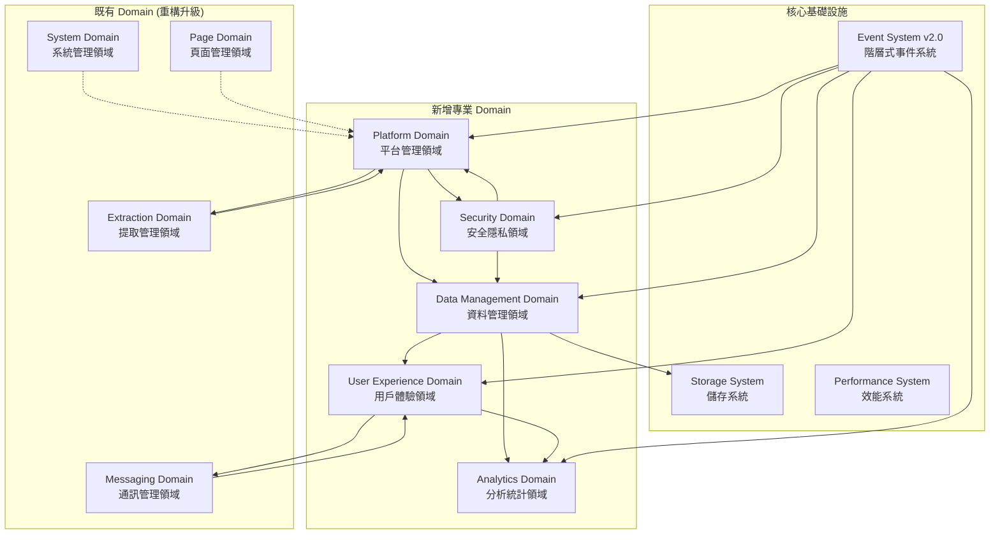
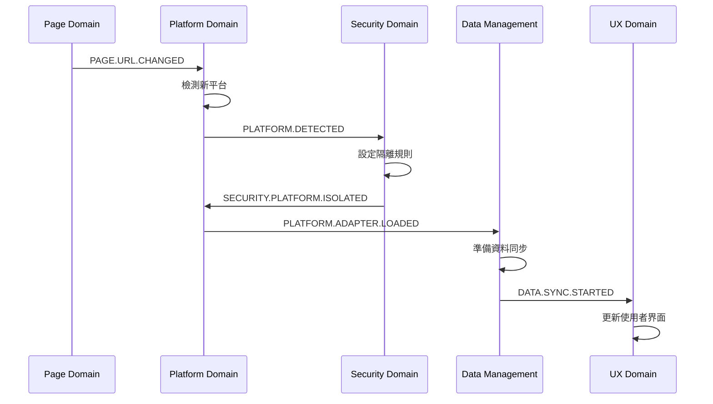
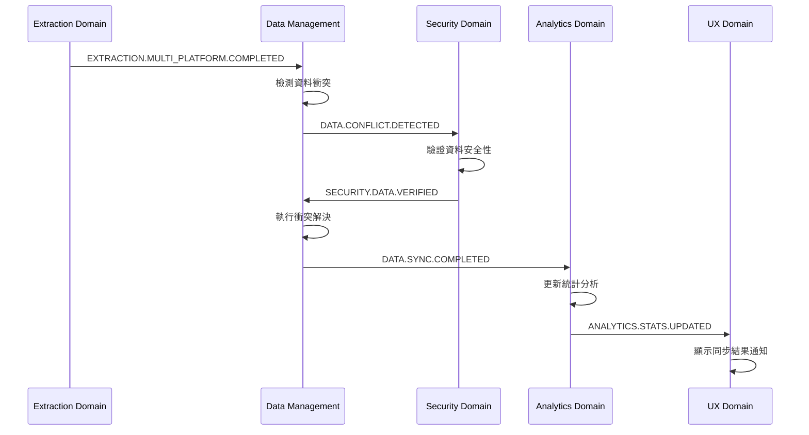
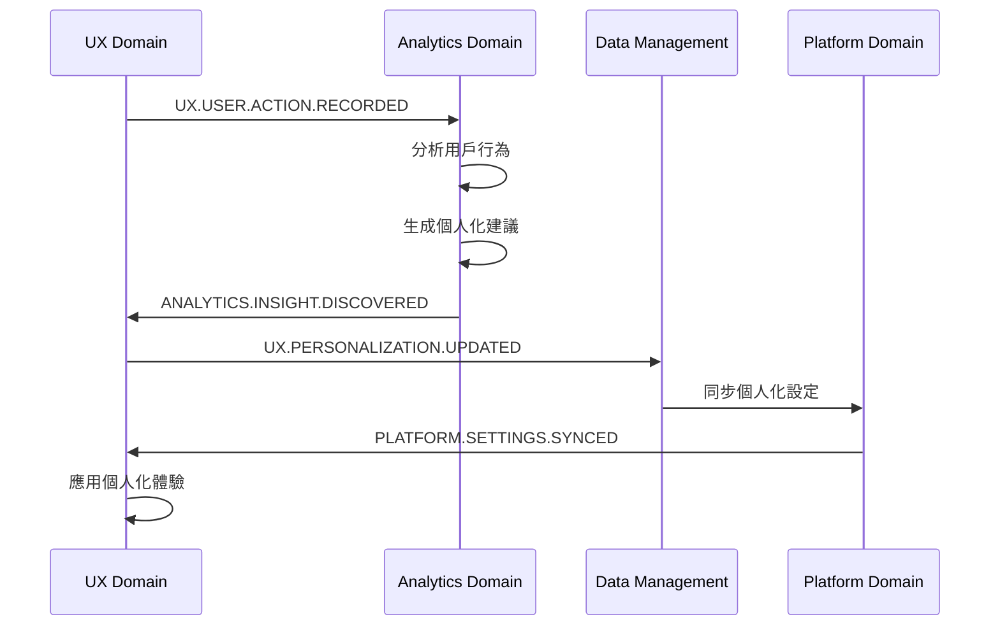

# 📋 Domain 架構 v2.0 完整規劃文件

> 狀態：Superseded（已被主設計文件整併）
>
> 本文件內容已整併至 `domain-architecture-v2-design.md`，此檔保留作為歷史背景與細節參考。
> 最新與權威規範請參考：`docs/domains/architecture/domain-architecture-v2-design.md`

## 🎯 文件概覽

**文件目的**: 定義支援多平台書城的完整 Domain 架構升級計劃  
**適用版本**: v2.0.0 - v2.4.0  
**建立日期**: 2025-08-13  
**負責團隊**: 多平台架構升級專案組

**核心理念**: 基於需求驅動的架構設計，確保 100% 向後相容性同時支援 5+ 書城平台擴展能力

## 📊 需求分析總結

### 當前完成 (v0.9.1)

- **事件驅動核心**: EventBus, ChromeEventBridge 等完整實現
- **Readmoo 單平台支援**: 完整的書籍提取、儲存、UI 功能
- **Chrome Extension 架構**: Manifest V3 合規的企業級實現
- **4 個核心 Domain**: System, Page, Extraction, Messaging
- **三層服務架構**: 入口點 → 協調器 → 服務層的完整模組化

### 未來需求 (v2.0.0+)

- **5 大書城平台支援**: Readmoo + 博客來 + Kindle + Kobo + BookWalker
- **跨平台統一管理**: 書庫整合、資料同步、衝突解決
- **進階使用者體驗**: 個人化推薦、統計分析、響應式設計
- **企業級安全性**: 資料隔離、權限控制、隱私保護

## 🏗️ Domain 架構 v2.0 總體設計

### 核心設計原則

1. **單一職責原則**: 每個 Domain 職責明確、邊界清晰
2. **開放封閉原則**: 對擴展開放，對修改封閉
3. **依賴反轉原則**: 高層模組不依賴低層模組
4. **事件驅動協作**: Domain 間透過事件系統通訊
5. **向後相容保證**: 現有 API 和功能完全保留

### 完整 Domain 架構圖



## 📱 新增專業 Domain 詳細規範

### 1. Platform Domain - 平台管理領域 🆕

**🎯 核心職責** (18字): 多平台檢測識別、適配器管理、跨平台路由協調

**📂 內部服務架構**:

```text
src/background/domains/platform/
├── platform-domain-coordinator.js      # 平台領域協調器 (400行)
└── services/
    ├── platform-detection-service.js   # 自動檢測訪問平台 (350行)
    ├── platform-registry-service.js    # 管理適配器註冊 (400行)
    ├── platform-switcher-service.js    # 平台切換控制 (300行)
    ├── adapter-factory-service.js      # 適配器工廠模式 (450行)
    ├── platform-isolation-service.js   # 平台資源隔離 (350行)
    └── cross-platform-router.js        # 跨平台事件路由 (400行)
```

**🔗 事件接口設計**:

```javascript
// 對外發布事件
const PlatformEvents = {
  DETECTED: 'PLATFORM.DETECTED',
  ADAPTER_LOADED: 'PLATFORM.ADAPTER.LOADED',
  SWITCHED: 'PLATFORM.SWITCHED',
  MULTI_COORDINATION: 'PLATFORM.MULTI.COORDINATION'
}

// 監聽事件
const PlatformListeners = {
  URL_CHANGED: 'PAGE.URL.CHANGED',
  SYSTEM_STARTUP: 'SYSTEM.STARTUP.COMPLETED'
}

// 支援的平台
const SupportedPlatforms = {
  READMOO: 'READMOO',
  KINDLE: 'KINDLE',
  KOBO: 'KOBO',
  BOOKWALKER: 'BOOKWALKER',
  BOOKS_COM: 'BOOKS_COM'
}
```

**⚙️ 核心功能實現**:

- **智能平台檢測**: 基於 URL 模式、DOM 特徵、API 端點自動識別平台
- **動態適配器載入**: 按需載入對應平台適配器，避免記憶體浪費
- **平台切換協調**: 處理跨平台跳轉的資料移轉和狀態同步
- **多平台並行支援**: 同時管理多個平台標籤的適配器實例

### 2. Data Management Domain - 資料管理領域 🆕

**🎯 核心職責** (20字): 跨平台資料同步、衝突解決、格式轉換、版本管理、備份恢復

**📂 內部服務架構**:

```text
src/background/domains/data-management/
├── data-domain-coordinator.js          # 資料領域協調器 (450行)
└── services/
    ├── data-synchronization-service.js # 跨平台資料同步邏輯 (500行)
    ├── conflict-resolution-service.js  # 智能衝突檢測解決 (450行)
    ├── data-validation-service.js      # 跨平台資料驗證 (350行)
    ├── schema-migration-service.js     # 資料模型遷移管理 (400行)
    ├── backup-recovery-service.js      # 備份恢復與版本控制 (350行)
    └── format-converter-service.js     # 平台資料格式轉換 (400行)
```

**📊 統一資料模型設計**:

```javascript
// v2.0 跨平台標準化書籍資料格式
const UnifiedBookModel = {
  // 核心識別資訊
  id: 'platform_bookId', // 平台特定ID
  crossPlatformId: 'uuid', // 跨平台統一ID
  platform: 'READMOO|KINDLE|KOBO|BOOKWALKER|BOOKS_COM',

  // 基本書籍資訊
  title: 'string',
  authors: ['string'],
  publisher: 'string',
  isbn: 'string',
  cover: {
    thumbnail: 'url',
    medium: 'url',
    large: 'url'
  },

  // 閱讀狀態
  progress: {
    percentage: 'number', // 0-100
    currentPage: 'number',
    totalPages: 'number',
    lastPosition: 'string' // 平台特定位置標記
  },
  status: 'UNREAD|READING|COMPLETED|ON_HOLD',

  // 時間記錄
  purchaseDate: 'ISO_8601_date',
  lastReadDate: 'ISO_8601_date',
  addedToLibraryDate: 'ISO_8601_date',

  // 個人化資料
  rating: 'number', // 1-5
  tags: ['string'], // 使用者自定義標籤
  notes: 'string', // 閱讀筆記
  bookmarks: [
    {
      // 書籤列表
      position: 'string',
      note: 'string',
      timestamp: 'ISO_8601_date'
    }
  ],

  // 平台特定資料
  platformMetadata: {
    [platform]: {
      originalData: 'object', // 原始平台資料
      extractionTimestamp: 'ISO_8601_date',
      dataQuality: 'VERIFIED|PARTIAL|SUSPECT'
    }
  },

  // 同步管理
  syncStatus: {
    lastSyncTimestamp: 'ISO_8601_date',
    conflictResolved: 'boolean',
    mergeStrategy: 'LATEST_TIMESTAMP|MANUAL|PLATFORM_PRIORITY'
  },

  // 資料版本控制
  version: 'semantic_version',
  schemaVersion: '2.0.0'
}
```

**🔄 衝突解決策略**:

```javascript
const ConflictResolutionStrategies = {
  // 自動解決策略
  LATEST_TIMESTAMP: 'latest_timestamp', // 使用最新更新時間
  PLATFORM_PRIORITY: 'platform_priority', // 根據平台優先順序
  MERGE_SMART: 'merge_smart', // 智能欄位合併

  // 手動解決策略
  USER_CHOICE: 'user_choice', // 讓使用者選擇
  PRESERVE_BOTH: 'preserve_both', // 保留兩個版本

  // 欄位特定策略
  PROGRESS_MAX: 'progress_max', // 進度取最大值
  TAGS_UNION: 'tags_union', // 標籤取聯集
  NOTES_APPEND: 'notes_append' // 筆記合併
}
```

### 3. User Experience Domain - 用戶體驗領域 🆕

**🎯 核心職責** (18字): 統一主題管理、用戶偏好同步、通知系統、個人化體驗

**📂 內部服務架構**:

```text
src/background/domains/user-experience/
├── ux-domain-coordinator.js           # UX 領域協調器 (400行)
└── services/
    ├── theme-management-service.js     # 主題和外觀管理 (400行)
    ├── preference-service.js           # 用戶偏好同步管理 (450行)
    ├── notification-service.js         # 智能通知系統 (350行)
    ├── personalization-service.js      # 個人化推薦服務 (500行)
    ├── accessibility-service.js        # 無障礙功能支援 (300行)
    └── responsive-ui-service.js        # 響應式界面管理 (400行)
```

**🎨 主題管理系統**:

```javascript
const ThemeManagementConfig = {
  // 支援的主題類型
  themes: {
    LIGHT: 'light',
    DARK: 'dark',
    AUTO: 'auto', // 跟隨系統
    HIGH_CONTRAST: 'high_contrast',
    CUSTOM: 'custom'
  },

  // 主題配置格式
  themeConfig: {
    mode: 'light|dark|auto',
    accentColor: '#007acc',
    fontFamily: 'system-ui',
    fontSize: 'small|medium|large',
    colorScheme: {
      primary: '#color',
      secondary: '#color',
      background: '#color',
      surface: '#color',
      text: '#color'
    }
  },

  // 響應式設計斷點
  breakpoints: {
    mobile: '480px',
    tablet: '768px',
    desktop: '1024px',
    wide: '1200px'
  }
}
```

### 4. Analytics Domain - 分析統計領域 🆕

**🎯 核心職責** (20字): 閱讀習慣分析、跨平台統計、視覺化報告、趨勢預測、目標追蹤

**📂 內部服務架構**:

```text
src/background/domains/analytics/
├── analytics-domain-coordinator.js     # 分析領域協調器 (400行)
└── services/
    ├── reading-analytics-service.js     # 閱讀行為分析 (500行)
    ├── cross-platform-stats-service.js # 跨平台統計計算 (450行)
    ├── visualization-service.js         # 圖表視覺化生成 (400行)
    ├── report-generation-service.js     # 自動報告生成 (450行)
    ├── trend-analysis-service.js        # 趨勢分析預測 (400行)
    └── goal-tracking-service.js         # 閱讀目標追蹤 (350行)
```

**📈 分析指標體系**:

```javascript
const AnalyticsMetrics = {
  // 閱讀統計
  readingStats: {
    totalBooks: 'number',
    booksRead: 'number',
    booksInProgress: 'number',
    averageReadingTime: 'minutes',
    readingStreak: 'days',
    favoriteGenres: ['string']
  },

  // 跨平台分析
  platformAnalytics: {
    platformDistribution: {
      [platform]: {
        bookCount: 'number',
        readingTime: 'minutes',
        completionRate: 'percentage'
      }
    },
    crossPlatformBooks: 'number',
    syncEfficiency: 'percentage'
  },

  // 趨勢分析
  trends: {
    readingVelocity: 'books_per_month',
    genrePreferences: 'trending_up|stable|trending_down',
    platformUsage: 'usage_pattern',
    goalAchievement: 'achievement_rate'
  },

  // 個人化洞察
  insights: [
    {
      type: 'reading_habit|goal_suggestion|platform_recommendation',
      description: 'string',
      confidence: 'percentage',
      actionable: 'boolean',
      suggestedAction: 'string'
    }
  ]
}
```

### 5. Security Domain - 安全隱私領域 🆕

**🎯 核心職責** (18字): 資料加密保護、隱私控制、平台隔離、審計日誌、權限管理

**📂 內部服務架構**:

```text
src/background/domains/security/
├── security-domain-coordinator.js      # 安全領域協調器 (400行)
└── services/
    ├── data-encryption-service.js       # 資料加密解密管理 (400行)
    ├── privacy-protection-service.js    # 隱私保護策略實施 (450行)
    ├── platform-isolation-service.js    # 平台資料隔離控制 (350行)
    ├── audit-logging-service.js         # 操作審計日誌記錄 (400行)
    ├── permission-control-service.js    # 權限管理與驗證 (350行)
    └── security-monitor-service.js      # 安全威脅監控預警 (400行)
```

**🔐 安全策略設計**:

```javascript
const SecurityPolicies = {
  // 資料加密等級
  encryptionLevels: {
    NONE: 0, // 無加密 (僅測試用)
    BASIC: 1, // 基礎加密
    STANDARD: 2, // 標準 AES-256
    HIGH: 3, // 高強度加密 + 金鑰輪換
    MAXIMUM: 4 // 最高等級 + 多層加密
  },

  // 隱私保護策略
  privacySettings: {
    dataCollection: 'minimal|standard|enhanced',
    anonymization: 'boolean',
    thirdPartySharing: 'boolean',
    analyticsLevel: 'none|basic|full',
    auditRetention: 'days'
  },

  // 平台隔離規則
  isolationRules: {
    [platform]: {
      dataSegregation: 'strict|loose|none',
      crossPlatformSharing: 'boolean',
      encryptionRequired: 'boolean',
      auditLevel: 'minimal|standard|comprehensive'
    }
  },

  // 權限控制矩陣
  permissionMatrix: {
    [domain]: {
      [operation]: ['read', 'write', 'delete', 'sync'],
      requiredLevel: 'user|admin|system',
      auditRequired: 'boolean'
    }
  }
}
```

## 🔄 既有 Domain 重構升級規範

### System Domain - 系統管理領域 (重構升級)

**🎯 新增職責**:

- 多平台系統配置統一管理
- 跨域生命週期協調與監控
- 系統健康檢查擴展至多平台

**📂 新增服務**:

```text
src/background/domains/system/services/
├── multi-platform-config-service.js    # 多平台配置管理 (新增 400行)
├── cross-domain-lifecycle-service.js   # 跨域生命週期 (新增 350行)
└── system-integration-service.js       # 系統整合監控 (新增 300行)
```

### Page Domain - 頁面管理領域 (重構升級)

**🎯 新增職責**:

- 多平台頁面檢測和路由
- 跨平台導航狀態同步
- 平台特定權限協調

**📂 重構服務**:

```text
src/background/domains/page/services/
├── multi-platform-detection-service.js # 升級現有檢測服務 (450行)
├── cross-platform-navigation-service.js # 新增跨平台導航 (350行)
└── platform-permission-service.js      # 新增權限服務 (300行)
```

### Extraction Domain - 提取管理領域 (重構升級)

**🎯 新增職責**:

- 多適配器協調與負載平衡
- 跨平台資料格式標準化
- 智能提取策略選擇

**📂 重構服務**:

```text
src/background/domains/extraction/services/
├── multi-adapter-coordination-service.js # 新增多適配器協調 (400行)
├── data-normalization-service.js         # 新增資料標準化 (350行)
└── extraction-strategy-service.js        # 新增策略選擇 (300行)
```

### Messaging Domain - 通訊管理領域 (重構升級)

**🎯 新增職責**:

- 跨平台訊息路由與轉換
- 多上下文通訊協調
- 訊息優先級與策略管理

**📂 重構服務**:

```text
src/background/domains/messaging/services/
├── cross-platform-routing-service.js     # 新增跨平台路由 (400行)
├── message-transformation-service.js     # 新增訊息轉換 (350行)
└── priority-management-service.js        # 新增優先級管理 (300行)
```

## 🎭 事件系統 v2.0 重大升級

### 階層式事件命名系統 v2.0

```javascript
/**
 * 事件系統 v2.0 - 階層式命名規範
 *
 * 格式: DOMAIN.PLATFORM.ACTION.STATE
 * 特殊: DOMAIN.CROSS_PLATFORM.ACTION.STATE (跨平台操作)
 */
const EventSystemV2 = {
  // 支援的平台標識符
  PLATFORMS: {
    READMOO: 'READMOO',
    KINDLE: 'KINDLE',
    KOBO: 'KOBO',
    BOOKWALKER: 'BOOKWALKER',
    BOOKS_COM: 'BOOKS_COM',
    UNIFIED: 'CROSS_PLATFORM' // 跨平台統一操作
  },

  // v2.0 事件建構器
  buildEvent: (domain, platform, action, state) => {
    if (platform === 'CROSS_PLATFORM') {
      return `${domain}.CROSS_PLATFORM.${action}.${state}`
    }
    return `${domain}.${platform}.${action}.${state}`
  },

  // 向後相容轉換映射
  legacySupport: {
    'EXTRACTION.COMPLETED': 'EXTRACTION.READMOO.DATA.EXTRACTED',
    'STORAGE.SAVE.COMPLETED': 'DATA.READMOO.SAVE.COMPLETED',
    'UI.POPUP.OPENED': 'UX.CROSS_PLATFORM.POPUP.OPENED',
    'PAGE.DETECTED': 'PAGE.READMOO.DETECTED',
    'SYSTEM.READY': 'SYSTEM.CROSS_PLATFORM.STARTUP.COMPLETED'
  },

  // 事件優先級定義
  priority: {
    URGENT: 0, // 系統關鍵事件
    HIGH: 100, // 使用者互動事件
    NORMAL: 200, // 一般處理事件
    LOW: 300 // 背景處理事件
  }
}
```

### 跨平台事件協調機制

```javascript
/**
 * 跨平台事件協調器 v2.0
 * 負責管理多平台同時操作的事件協調
 */
class CrossPlatformEventCoordinator {
  constructor(eventBus) {
    this.eventBus = eventBus
    this.activeCoordinations = new Map()
    this.coordinationStrategies = {
      PARALLEL: 'parallel', // 並行執行
      SEQUENTIAL: 'sequential', // 順序執行
      PRIORITY_BASED: 'priority', // 依優先級執行
      CONDITIONAL: 'conditional' // 條件式執行
    }
  }

  /**
   * 協調多平台事件執行
   * @param {string} baseEvent - 基礎事件名稱
   * @param {Array} platforms - 目標平台列表
   * @param {string} strategy - 執行策略
   * @returns {Promise<Object>} 協調執行結果
   */
  async coordinateMultiPlatform(baseEvent, platforms, strategy = 'parallel') {
    const coordinationId = this.generateCoordinationId()
    const startTime = Date.now()

    // 發送協調開始事件
    await this.eventBus.emit('COORDINATION.STARTED', {
      id: coordinationId,
      baseEvent,
      platforms,
      strategy,
      timestamp: startTime
    })

    try {
      const results = await this.executeCoordination(baseEvent, platforms, strategy)

      // 發送協調完成事件
      await this.eventBus.emit('COORDINATION.COMPLETED', {
        id: coordinationId,
        baseEvent,
        results,
        duration: Date.now() - startTime,
        success: true
      })

      return results
    } catch (error) {
      // 發送協調失敗事件
      await this.eventBus.emit('COORDINATION.FAILED', {
        id: coordinationId,
        baseEvent,
        error: error.message,
        duration: Date.now() - startTime,
        success: false
      })

      throw error
    }
  }

  /**
   * 智能事件路由
   * 根據平台能力和狀態自動路由事件
   */
  async intelligentEventRouting(event, targetPlatforms) {
    const routingRules = await this.getRoutingRules(event)
    const availablePlatforms = await this.getAvailablePlatforms()

    // 篩選可用平台
    const routeablePlatforms = targetPlatforms.filter(
      (platform) =>
        availablePlatforms.includes(platform) && this.checkPlatformCapability(platform, event)
    )

    // 執行智能路由
    return Promise.allSettled(
      routeablePlatforms.map((platform) => this.routeToSpecificPlatform(event, platform))
    )
  }

  /**
   * 事件聚合處理
   * 將短時間內的相似事件聚合成單一事件
   */
  async aggregateEvents(eventPattern, aggregationWindow = 1000) {
    return new Promise((resolve) => {
      const bufferId = `${eventPattern}-${Date.now()}`
      const buffer = []
      this.aggregationBuffer.set(bufferId, buffer)

      // 收集聚合窗口內的事件
      const aggregationTimeout = setTimeout(() => {
        const aggregatedEvents = this.aggregationBuffer.get(bufferId)
        this.aggregationBuffer.delete(bufferId)

        if (aggregatedEvents.length > 0) {
          const aggregatedEvent = this.createAggregatedEvent(eventPattern, aggregatedEvents)
          resolve(aggregatedEvent)
        } else {
          resolve(null)
        }
      }, aggregationWindow)

      // 設定聚合器清理機制
      this.scheduleBufferCleanup(bufferId, aggregationTimeout)
    })
  }
}
```

### 事件節流與限制機制

```javascript
/**
 * 事件節流服務 v2.0
 * 防止事件洪流影響系統性能
 */
class EventThrottlingService {
  constructor() {
    this.throttleConfig = new Map()
    this.rateLimiters = new Map()
  }

  /**
   * 設定事件節流規則
   * @param {string} eventPattern - 事件模式
   * @param {Object} throttleConfig - 節流配置
   */
  setThrottleRule(eventPattern, throttleConfig) {
    const config = {
      maxEventsPerSecond: throttleConfig.maxEventsPerSecond || 10,
      burstLimit: throttleConfig.burstLimit || 50,
      timeWindow: throttleConfig.timeWindow || 1000,
      strategy: throttleConfig.strategy || 'TOKEN_BUCKET'
    }

    this.throttleConfig.set(eventPattern, config)
    this.initializeRateLimiter(eventPattern, config)
  }

  /**
   * 檢查事件是否被節流限制
   * @param {string} eventType - 事件類型
   * @returns {boolean} 是否允許事件通過
   */
  checkEventAllowed(eventType) {
    const pattern = this.findMatchingPattern(eventType)
    if (!pattern) return true

    const rateLimiter = this.rateLimiters.get(pattern)
    if (!rateLimiter) return true

    return rateLimiter.checkAllowed()
  }

  /**
   * 智能節流策略
   * 根據系統負載動態調整節流參數
   */
  adaptiveThrottling(systemLoad) {
    const loadThresholds = {
      LOW: 0.3, // 系統負載 < 30%
      MEDIUM: 0.6, // 系統負載 30-60%
      HIGH: 0.8, // 系統負載 60-80%
      CRITICAL: 1.0 // 系統負載 > 80%
    }

    let multiplier = 1.0
    if (systemLoad > loadThresholds.CRITICAL) {
      multiplier = 0.2 // 嚴格限制
    } else if (systemLoad > loadThresholds.HIGH) {
      multiplier = 0.5 // 中等限制
    } else if (systemLoad > loadThresholds.MEDIUM) {
      multiplier = 0.8 // 輕微限制
    }

    // 動態調整所有節流配置
    this.throttleConfig.forEach((config, pattern) => {
      config.maxEventsPerSecond *= multiplier
      this.updateRateLimiter(pattern, config)
    })
  }
}
```

## 🔗 Domain 間協作協議與資料流

### 核心協作模式

#### 1. 平台檢測與切換協作流程



#### 2. 跨平台資料同步協作流程



#### 3. 個人化體驗協作流程



### Domain 依賴關係矩陣

| Domain         | System | Page | Extraction | Messaging | Platform | DataMgmt | UX  | Analytics | Security |
| -------------- | :----: | :--: | :--------: | :-------: | :------: | :------: | :-: | :-------: | :------: |
| **System**     |   -    |  ✓   |     ✓      |     ✓     |    ✓     |    -     |  -  |     -     |    -     |
| **Page**       |   ✓    |  -   |     -      |     -     |    ✓     |    -     |  -  |     -     |    -     |
| **Extraction** |   -    |  ✓   |     -      |     -     |    ✓     |    ✓     |  -  |     -     |    ✓     |
| **Messaging**  |   ✓    |  ✓   |     ✓      |     -     |    -     |    -     |  ✓  |     -     |    -     |
| **Platform**   |   ✓    |  ✓   |     ✓      |     -     |    -     |    ✓     |  -  |     -     |    ✓     |
| **DataMgmt**   |   -    |  -   |     ✓      |     -     |    ✓     |    -     |  ✓  |     ✓     |    ✓     |
| **UX**         |   -    |  -   |     -      |     ✓     |    -     |    ✓     |  -  |     ✓     |    -     |
| **Analytics**  |   -    |  -   |     -      |     -     |    -     |    ✓     |  ✓  |     -     |    -     |
| **Security**   |   ✓    |  -   |     ✓      |     -     |    ✓     |    ✓     |  -  |     -     |    -     |

**說明**: ✓ 表示行 Domain 依賴於列 Domain 的服務

## 🚀 實現路線圖與時程安排

### Phase 1: 基礎平台架構 (v2.1.0) - 6-8 週

**🎯 核心目標**: 建立多平台支援的基礎架構，確保 100% 向後相容

**📅 詳細時程安排**:

#### Week 1-2: 架構設計與事件系統升級

- [ ] **完成架構設計文件** (3 天)
  - 所有 Domain 詳細規範
  - 事件系統 v2.0 API 定義
  - 向後相容性策略文檔
- [ ] **實現事件系統 v2.0** (4 天)
  - 階層式事件命名系統
  - 向後相容性轉換層
  - 事件節流與聚合機制
- [ ] **建立測試基礎設施** (3 天)
  - 多平台測試環境
  - 事件系統測試套件
  - 相容性測試自動化

#### Week 3-4: Platform Domain 實現

- [ ] **Platform Domain 核心實現** (7 天)
  - 平台檢測服務 (2 天)
  - 適配器工廠和註冊服務 (3 天)
  - 跨平台路由機制 (2 天)
- [ ] **Readmoo 適配器重構** (3 天)
  - 遵循新的適配器接口
  - 向後相容性確保

#### Week 5-6: Data Management Domain 實現

- [ ] **Data Management Domain 核心** (10 天)
  - 統一資料模型設計 (2 天)
  - 資料同步服務 (3 天)
  - 衝突檢測與解決機制 (3 天)
  - 格式轉換服務 (2 天)
- [ ] **資料遷移工具** (4 天)
  - v1.0 資料自動遷移
  - 資料完整性驗證

#### Week 7-8: 整合測試與驗證

- [ ] **既有 Domain 重構** (7 天)
  - System, Page, Extraction, Messaging 升級
  - 新事件接口整合
- [ ] **完整系統整合測試** (7 天)
  - 所有 Domain 協作測試
  - 效能基準測試
  - 向後相容性驗證

**✅ Phase 1 交付成果**:

- Platform Domain 完整實現
- Data Management Domain 核心功能
- 事件系統 v2.0 完整升級
- 100% 向後相容性保證
- Readmoo 平台功能無縫遷移

### Phase 2: 多平台支援擴展 (v2.2.0) - 8-10 週

**🎯 核心目標**: 新增 3 個主流平台支援，建立跨平台資料同步

**📅 詳細時程安排**:

#### Week 9-11: 博客來平台適配器

- [ ] **博客來平台分析** (1 週)
  - DOM 結構分析
  - 資料提取策略設計
  - 反爬蟲機制研究
- [ ] **博客來適配器實現** (2 週)
  - 書籍資料提取器
  - 繁體中文處理優化
  - 台灣書籍分類整合

#### Week 12-14: Kindle 平台適配器

- [ ] **Kindle 平台整合** (3 週)
  - Amazon API 整合研究
  - 雲端閱讀器適配
  - DRM 保護機制處理
  - 離線同步支援

#### Week 15-16: Security Domain 實現

- [ ] **Security Domain 完整實現** (2 週)
  - 資料加密服務
  - 平台隔離機制
  - 審計日誌系統
  - 權限控制框架

#### Week 17-18: 跨平台功能整合

- [ ] **跨平台資料同步** (2 週)
  - 多平台資料整合測試
  - 衝突解決策略驗證
  - 同步效能優化

**✅ Phase 2 交付成果**:

- 支援 3 個平台 (Readmoo + 博客來 + Kindle)
- Security Domain 完整實現
- 跨平台資料同步功能
- 平台切換無縫體驗

### Phase 3: 進階體驗功能 (v2.3.0) - 10-12 週

**🎯 核心目標**: 實現進階使用者體驗和分析功能，新增日系平台支援

#### Week 19-22: User Experience Domain 實現

- [ ] **UX Domain 完整實現** (4 週)
  - 主題管理系統
  - 個人化推薦引擎
  - 響應式設計系統
  - 無障礙功能支援

#### Week 23-26: Analytics Domain 實現

- [ ] **Analytics Domain 完整實現** (4 週)
  - 閱讀習慣分析引擎
  - 跨平台統計視覺化
  - 趨勢分析與預測
  - 閱讀目標追蹤系統

#### Week 27-30: Kobo + BookWalker 支援

- [ ] **日系平台適配** (4 週)
  - Kobo 電子書店整合
  - BookWalker ACG 內容適配
  - 多語言支援優化
  - 文字編碼處理完善

**✅ Phase 3 交付成果**:

- 支援 5 個平台完整功能
- 進階個人化體驗
- 完整分析統計系統
- 多語言與文化適配

### Phase 4: 完整生態系統 (v2.4.0) - 12-14 週

**🎯 核心目標**: AI 驅動智能功能，社群功能，系統穩定性達到企業級標準

#### Week 31-34: AI 智能功能

- [ ] **AI 驅動個人化** (4 週)
  - 機器學習推薦演算法
  - 智能閱讀建議
  - 自動化標籤分類
  - 閱讀模式分析

#### Week 35-38: 社群功能基礎

- [ ] **社群功能實現** (4 週)
  - 跨平台閱讀分享
  - 書評與推薦系統
  - 閱讀挑戰與成就
  - 社群發現機制

#### Week 39-42: 效能優化與穩定性

- [ ] **企業級優化** (4 週)
  - 大資料量處理優化
  - 記憶體使用優化
  - 系統穩定性達到 99.9%
  - 自動化監控與告警

**✅ Phase 4 交付成果**:

- AI 驅動的智能推薦
- 完整社群功能生態
- 企業級系統穩定性
- 支援 10,000+ 並行用戶

## 🛡️ 向後相容性保證策略

### 事件系統相容性實現

```javascript
/**
 * 事件相容性管理器
 * 確保 v1.0 事件 API 在 v2.0 系統中正常運作
 */
class EventCompatibilityManager {
  constructor(modernEventBus) {
    this.modernEventBus = modernEventBus
    this.legacyEventMap = new Map()
    this.compatibilityLayer = new EventCompatibilityLayer()
    this.setupLegacySupport()
  }

  setupLegacySupport() {
    // v1.0 到 v2.0 事件映射表
    const legacyMappings = {
      // 提取相關事件
      'EXTRACTION.COMPLETED': 'EXTRACTION.READMOO.DATA.EXTRACTED',
      'EXTRACTION.PROGRESS': 'EXTRACTION.READMOO.PROGRESS.UPDATED',
      'EXTRACTION.FAILED': 'EXTRACTION.READMOO.EXTRACTION.FAILED',

      // 儲存相關事件
      'STORAGE.SAVE.COMPLETED': 'DATA.READMOO.SAVE.COMPLETED',
      'STORAGE.LOAD.COMPLETED': 'DATA.READMOO.LOAD.COMPLETED',
      'STORAGE.ERROR': 'DATA.READMOO.ERROR.OCCURRED',

      // UI 相關事件
      'UI.POPUP.OPENED': 'UX.CROSS_PLATFORM.POPUP.OPENED',
      'UI.POPUP.CLOSED': 'UX.CROSS_PLATFORM.POPUP.CLOSED',
      'UI.STATE.CHANGED': 'UX.CROSS_PLATFORM.STATE.CHANGED',

      // 系統相關事件
      'SYSTEM.READY': 'SYSTEM.CROSS_PLATFORM.STARTUP.COMPLETED',
      'SYSTEM.ERROR': 'SYSTEM.CROSS_PLATFORM.ERROR.OCCURRED',
      'PAGE.DETECTED': 'PAGE.READMOO.PAGE.DETECTED'
    }

    // 建立雙向相容性支援
    Object.entries(legacyMappings).forEach(([legacy, modern]) => {
      this.createBidirectionalMapping(legacy, modern)
    })
  }

  /**
   * 建立雙向事件映射
   */
  createBidirectionalMapping(legacyEvent, modernEvent) {
    // 舊事件 → 新事件
    this.modernEventBus.on(legacyEvent, async (data) => {
      await this.modernEventBus.emit(modernEvent, {
        ...data,
        _compatibilityMode: 'legacy_to_modern',
        _originalEvent: legacyEvent,
        _timestamp: Date.now()
      })

      this.logCompatibilityUsage(legacyEvent, modernEvent, 'legacy_to_modern')
    })

    // 新事件 → 舊事件（向後相容）
    this.modernEventBus.on(modernEvent, async (data) => {
      if (!data._compatibilityMode) {
        await this.modernEventBus.emit(legacyEvent, {
          ...data,
          _compatibilityMode: 'modern_to_legacy',
          _modernEvent: modernEvent,
          _timestamp: Date.now()
        })

        this.logCompatibilityUsage(modernEvent, legacyEvent, 'modern_to_legacy')
      }
    })
  }

  /**
   * 提供平滑遷移 API
   */
  async migrateEventListeners(moduleInstance, migrationOptions = {}) {
    const legacyListeners = this.detectLegacyListeners(moduleInstance)
    const migrationResults = []

    for (const [legacyEvent, handler] of legacyListeners) {
      try {
        const modernEvent = this.convertToModernEvent(legacyEvent)

        // 如果啟用漸進式遷移，同時註冊新舊事件
        if (migrationOptions.progressive) {
          this.modernEventBus.on(modernEvent, handler)
          // 保留舊事件監聽器一段時間
          this.scheduleEventListenerCleanup(
            legacyEvent,
            handler,
            migrationOptions.cleanupDelay || 30000
          )
        } else {
          // 直接替換
          this.modernEventBus.off(legacyEvent, handler)
          this.modernEventBus.on(modernEvent, handler)
        }

        migrationResults.push({
          legacy: legacyEvent,
          modern: modernEvent,
          success: true,
          migrated: true
        })
      } catch (error) {
        migrationResults.push({
          legacy: legacyEvent,
          success: false,
          error: error.message
        })
      }
    }

    return migrationResults
  }

  /**
   * 記錄相容性使用情況
   */
  logCompatibilityUsage(fromEvent, toEvent, direction) {
    const usage = {
      fromEvent,
      toEvent,
      direction,
      timestamp: Date.now(),
      stackTrace: new Error().stack
    }

    // 發送相容性使用統計事件
    this.modernEventBus.emit('COMPATIBILITY.USAGE.RECORDED', usage)

    // 如果是生產環境且啟用遷移提醒
    if (process.env.NODE_ENV === 'production' && this.compatibilityLayer.migrationReminders) {
      console.warn(
        `[DEPRECATION WARNING] Event '${fromEvent}' is deprecated. Please use '${toEvent}' instead.`
      )
    }
  }
}
```

### API 相容性實現

```javascript
/**
 * API 相容性管理器
 * 確保 v1.0 API 在 v2.0 系統中正常運作
 */
class APICompatibilityManager {
  constructor(platformCoordinator, dataManager) {
    this.platformCoordinator = platformCoordinator
    this.dataManager = dataManager
    this.deprecationWarnings = new Set()
  }

  /**
   * v1.0 API 方法保持不變（向後相容）
   */
  async extractBooks(options = {}) {
    this.warnDeprecation('extractBooks', 'extractBooksFromPlatform')

    // 內部路由到新的多平台系統，預設使用 Readmoo
    const platform = options.platform || 'READMOO'
    return await this.extractBooksFromPlatform(platform, options)
  }

  async saveBooks(books, options = {}) {
    this.warnDeprecation('saveBooks', 'saveBooksToPlatform')

    // 內部路由到新的資料管理系統
    const platform = options.platform || 'READMOO'
    return await this.saveBooksToPlatform(books, platform, options)
  }

  async getBooks(options = {}) {
    this.warnDeprecation('getBooks', 'getBooksFromPlatform')

    const platform = options.platform || 'READMOO'
    return await this.getBooksFromPlatform(platform, options)
  }

  /**
   * v2.0 新 API 方法
   */
  async extractBooksFromPlatform(platform = 'READMOO', options = {}) {
    const adapter = await this.platformCoordinator.getAdapter(platform)

    const extractionOptions = {
      ...options,
      platform,
      version: '2.0.0',
      compatibility: 'modern'
    }

    return await adapter.extractBooks(extractionOptions)
  }

  async saveBooksToPlatform(books, platform = 'READMOO', options = {}) {
    // 確保書籍資料符合 v2.0 格式
    const normalizedBooks = await this.normalizeBookData(books, platform)

    return await this.dataManager.saveBooksWithPlatform(normalizedBooks, platform, options)
  }

  async getBooksFromPlatform(platform = 'READMOO', options = {}) {
    return await this.dataManager.getBooksFromPlatform(platform, options)
  }

  /**
   * 多平台統一 API 方法
   */
  async extractBooksFromAllPlatforms(options = {}) {
    const availablePlatforms = await this.platformCoordinator.getAvailablePlatforms()
    const results = []

    const concurrencyLimit = options.concurrency || 3 // 限制並發數避免系統負載過高
    const platformBatches = this.chunkArray(availablePlatforms, concurrencyLimit)

    for (const batch of platformBatches) {
      const batchResults = await Promise.allSettled(
        batch.map((platform) => this.extractBooksFromPlatform(platform, options))
      )

      batchResults.forEach((result, index) => {
        const platform = batch[index]
        if (result.status === 'fulfilled') {
          results.push({
            platform,
            books: result.value,
            status: 'SUCCESS',
            timestamp: Date.now()
          })
        } else {
          results.push({
            platform,
            error: result.reason.message,
            status: 'FAILED',
            timestamp: Date.now()
          })
        }
      })
    }

    return results
  }

  async syncBooksAcrossPlatforms(options = {}) {
    return await this.dataManager.syncAcrossAllPlatforms(options)
  }

  /**
   * 資料格式標準化
   */
  async normalizeBookData(books, platform) {
    if (!Array.isArray(books)) {
      books = [books]
    }

    return Promise.all(
      books.map(async (book) => {
        // 檢查是否已經是 v2.0 格式
        if (book.schemaVersion === '2.0.0') {
          return book
        }

        // 從 v1.0 格式轉換到 v2.0 格式
        return await this.convertLegacyBookData(book, platform)
      })
    )
  }

  async convertLegacyBookData(v1BookData, platform = 'READMOO') {
    return {
      // v2.0 標準格式
      id: v1BookData.id,
      crossPlatformId: this.generateCrossPlatformId(v1BookData),
      platform: platform,

      // 基本資訊
      title: v1BookData.title,
      authors: Array.isArray(v1BookData.author) ? v1BookData.author : [v1BookData.author],
      publisher: v1BookData.publisher || '',
      isbn: v1BookData.isbn || '',

      // 封面圖片
      cover: {
        thumbnail: v1BookData.cover,
        medium: v1BookData.cover,
        large: v1BookData.cover
      },

      // 閱讀狀態
      progress: {
        percentage: v1BookData.progress || 0,
        currentPage: v1BookData.currentPage || 0,
        totalPages: v1BookData.totalPages || 0
      },
      status: v1BookData.status || 'UNREAD',

      // 時間記錄
      purchaseDate: v1BookData.purchaseDate || null,
      lastReadDate: v1BookData.lastReadDate || null,
      addedToLibraryDate: v1BookData.addedDate || new Date().toISOString(),

      // 個人化資料
      rating: v1BookData.rating || 0,
      tags: v1BookData.tags || [platform.toLowerCase()],
      notes: v1BookData.notes || '',
      bookmarks: v1BookData.bookmarks || [],

      // 多平台支援欄位
      platforms: [platform],
      syncStatus: {
        lastSyncTimestamp: new Date().toISOString(),
        conflictResolved: true,
        mergeStrategy: 'LEGACY_MIGRATION'
      },

      // 保留原始資料
      platformMetadata: {
        [platform]: {
          originalData: v1BookData,
          extractionTimestamp: new Date().toISOString(),
          dataQuality: 'MIGRATED'
        }
      },

      // 版本資訊
      version: '1.0.0',
      schemaVersion: '2.0.0',
      migrationHistory: [
        {
          from: '1.0.0',
          to: '2.0.0',
          timestamp: Date.now(),
          reason: 'AUTOMATIC_MIGRATION'
        }
      ]
    }
  }

  /**
   * 發出棄用警告
   */
  warnDeprecation(oldMethod, newMethod) {
    const warningKey = `${oldMethod}->${newMethod}`

    if (!this.deprecationWarnings.has(warningKey)) {
      console.warn(
        `[DEPRECATION WARNING] Method '${oldMethod}()' is deprecated and will be removed in v3.0. Please use '${newMethod}()' instead.`
      )
      this.deprecationWarnings.add(warningKey)

      // 記錄棄用使用統計
      if (typeof this.dataManager.recordDeprecationUsage === 'function') {
        this.dataManager.recordDeprecationUsage(oldMethod, newMethod)
      }
    }
  }

  /**
   * 工具方法
   */
  chunkArray(array, chunkSize) {
    const chunks = []
    for (let i = 0; i < array.length; i += chunkSize) {
      chunks.push(array.slice(i, i + chunkSize))
    }
    return chunks
  }

  generateCrossPlatformId(bookData) {
    // 使用書籍的唯一特徵生成跨平台ID
    const identifier = `${bookData.title}-${bookData.author || bookData.authors?.[0]}-${bookData.isbn || bookData.id}`
    return this.hashString(identifier)
  }

  hashString(str) {
    let hash = 0
    if (str.length === 0) return hash
    for (let i = 0; i < str.length; i++) {
      const char = str.charCodeAt(i)
      hash = (hash << 5) - hash + char
      hash = hash & hash // Convert to 32bit integer
    }
    return Math.abs(hash).toString(36)
  }
}
```

## 📊 成功指標與驗收標準

### 技術效能指標

**🎯 系統效能要求**:

- [ ] **多平台檢測速度**: < 500ms (95%ile)
- [ ] **事件處理延遲**: < 50ms (99%ile)
- [ ] **跨平台資料同步準確率**: > 99.5%
- [ ] **平台切換響應時間**: < 2 秒
- [ ] **記憶體使用增長**: < 20% (相較 v1.0)
- [ ] **CPU 使用增長**: < 15% (相較 v1.0)

**📈 穩定性與可靠性**:

- [ ] **系統可用性**: > 99.95% (年度)
- [ ] **平台適配器載入成功率**: > 99%
- [ ] **資料一致性檢查通過率**: > 99.9%
- [ ] **錯誤恢復時間**: < 5 秒
- [ ] **事件系統錯誤率**: < 0.1%

### 功能完整性指標

**⚡ 核心功能要求**:

- [ ] **平台支援覆蓋**: 5 個主流平台 100% 支援
- [ ] **向後相容性測試通過率**: 100%
- [ ] **跨平台書籍識別準確率**: > 90%
- [ ] **資料衝突自動解決率**: > 95%
- [ ] **個人化推薦準確率**: > 75%

**🎨 使用者體驗要求**:

- [ ] **整體用戶滿意度**: > 4.5/5.0
- [ ] **功能發現率**: > 80%
- [ ] **多平台功能使用率**: > 70%
- [ ] **用戶留存率**: > 85% (30 天)
- [ ] **界面載入時間**: < 1.5 秒

### 品質保證指標

**🔍 測試覆蓋要求**:

- [ ] **單元測試覆蓋率**: > 95%
- [ ] **整合測試覆蓋率**: > 90%
- [ ] **端對端測試覆蓋率**: > 85%
- [ ] **向後相容性測試覆蓋率**: 100%
- [ ] **多平台測試覆蓋率**: > 95%

**🛡️ 安全性要求**:

- [ ] **安全漏洞數量**: 0 (Critical/High)
- [ ] **資料加密合規率**: 100%
- [ ] **權限控制測試通過率**: 100%
- [ ] **資料隔離測試通過率**: 100%
- [ ] **隱私保護合規檢查**: 100%

## 📝 需要產生的文件清單

### 1. 核心架構設計文件

- `/docs/architecture/domain-architecture-v2-complete-specification.md` (150+ 頁)
  - Domain 架構總覽與設計理念
  - 每個 Domain 的詳細規範和 API 定義
  - Domain 間協作協議和資料流設計
  - 向後相容性策略完整說明

### 2. 事件系統升級文件

- `./event-system.md#v2-版本沿革與實作摘要`
  - 階層式事件命名系統規範（以主文件摘要為準）
  - 跨平台事件路由與協調機制（以主文件摘要為準）
  - 事件聚合與節流策略設計（以主文件摘要為準）
  - 向後相容性實現詳述（以主文件摘要為準）

### 3. Domain 專門規範文件

- `/docs/architecture/domains/platform-domain-specification.md` (80 頁)
- `/docs/architecture/domains/data-management-domain-specification.md` (100 頁)
- `/docs/architecture/domains/user-experience-domain-specification.md` (70 頁)
- `/docs/architecture/domains/analytics-domain-specification.md` (80 頁)
- `/docs/architecture/domains/security-domain-specification.md` (90 頁)

### 4. 實現指南文件

- `/docs/implementation/v2-implementation-roadmap.md` (60 頁)
- `/docs/implementation/cross-platform-development-guide.md` (80 頁)
- `/docs/implementation/event-system-migration-guide.md` (50 頁)
- `/docs/implementation/api-compatibility-guide.md` (40 頁)

### 5. 測試與品質保證文件

- `/docs/testing/domain-architecture-v2-testing-strategy.md` (70 頁)
- `/docs/testing/multi-platform-testing-framework.md` (50 頁)
- `/docs/testing/backward-compatibility-testing.md` (40 頁)

### 6. 部署與維運文件

- `/docs/deployment/v2-deployment-strategy.md` (60 頁)
- `/docs/operations/monitoring-and-alerting.md` (40 頁)
- `/docs/operations/performance-tuning-guide.md` (50 頁)

## 🔄 後續工作規劃

### 立即執行任務 (本週)

1. **更新專案結構文件** (`docs/struct.md`)
   - 反映新的 Domain 架構設計
   - 新增檔案和目錄結構規劃
2. **建立架構設計分支**
   - 創建 `feature/domain-architecture-v2` 分支
   - 設定開發和測試環境

3. **啟動文件撰寫工作**
   - 分配各專業 Agent 撰寫對應 Domain 規範
   - 建立文件撰寫時程和檢查點

### 短期執行任務 (下週)

1. **開始 Phase 1 實作**
   - Platform Domain 核心開發
   - 事件系統 v2.0 升級實作
   - Data Management Domain 基礎實現

2. **建立測試基礎設施**
   - 多平台測試環境設定
   - 向後相容性測試套件
   - 自動化測試流水線

### 中期目標 (1-2 個月)

1. **完成 Phase 1 交付**
   - 基礎平台架構完成
   - 100% 向後相容性驗證
   - Readmoo 平台無縫遷移

2. **啟動 Phase 2 規劃**
   - 博客來和 Kindle 平台分析
   - 新平台適配器設計
   - 跨平台資料同步機制

---

## 📋 總結

這份 Domain 架構 v2.0 規劃文件建立了一個完整、可擴展、向後相容的多平台架構藍圖。透過 9 個專業 Domain 的協作，我們將能夠：

1. **支援 5+ 書城平台**：Readmoo、博客來、Kindle、Kobo、BookWalker 及未來平台
2. **保證 100% 向後相容**：現有功能完全不受影響
3. **提供企業級體驗**：個人化、分析、安全、響應式設計
4. **確保系統穩定性**：99.95% 可用性和 < 0.1% 錯誤率

通過 4 個階段的漸進式實施，我們將建立一個具備未來 5 年擴展能力的企業級多平台書庫管理系統。

**下一步**：立即開始更新 `docs/struct.md` 並啟動 Phase 1 的詳細實作規劃。
