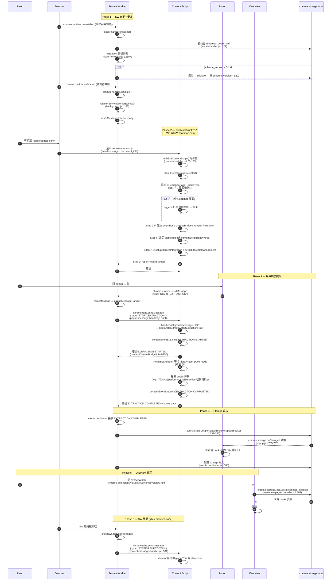
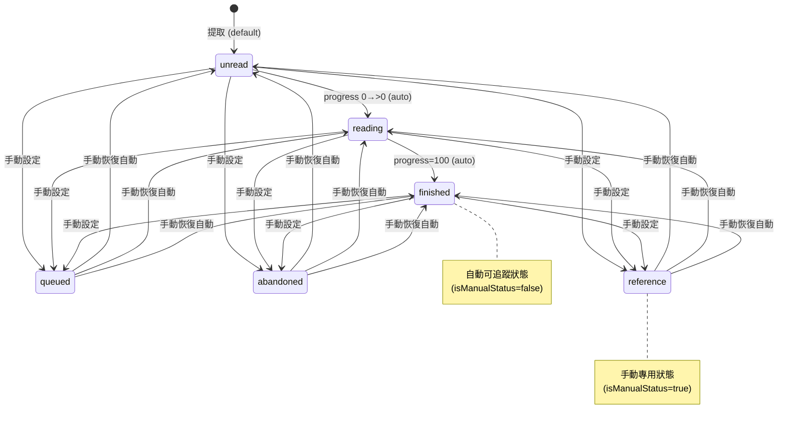

# E2E 提取流程契約規格

## 概述

本規格定義 Chrome Extension 提取 Readmoo 書庫的 E2E 流程契約，涵蓋 Service Worker → Content Script → Storage → Overview 完整鏈路的對外承諾。

**Why（規格動機）**：E2E 契約原本散落於 `tests/e2e/browser/`、`src/background/`、`src/content/`、`src/storage/`、`src/event-system/` 各處的硬編碼字串與常數。新人接手時無從掌握「跨進程邊界的對外承諾」，且 W1-001.2（SPA hash 路由誤判）與 W1-050（CE-Node 環境前提誤判）已證明缺契約成本極高。

**Consequence**：未契約化的 E2E 流程在實作演進過程中容易破壞既有測試的隱性假設；下游消費者（測試、新功能、debug）依賴口傳知識而非可驗證的規格。

**Action**：本規格集中定義 6 個契約，每個契約附 source of truth、JSON Schema / Mermaid diagram、grep 驗證指令；後續修改 E2E 行為時必須先更新本規格再改 code。

---

## 與 SPEC-002 的職責分離

| 規格 | 職責 | 內容類型 |
|------|------|---------|
| SPEC-002 (`extraction-pipeline.md`) | 實作元件清單（What is done） | FR-01/02/03 已實作微服務與檔案路徑 |
| SPEC-002a (本檔, `e2e-contract.md`) | E2E 契約規格（What is the contract） | URL / Storage / Console / Lifecycle / Book schema / DOM 6 契約 |

**邊界**：SPEC-002 回答「目前實作了什麼元件」，SPEC-002a 回答「跨進程邊界的對外承諾是什麼」。元件實作可以重構，契約必須保持向後相容（除非主動 bump 版本）。

---

## 範圍與 UC 對應

本規格涵蓋下列 Use Case 的契約面向（UC 詳見 `docs/use-cases.md` v1.1）：

| UC | 名稱 | 對應契約 |
|----|------|---------|
| UC-01 | 提取 Readmoo 書庫 | §1 URL、§4 Lifecycle、§5 Book schema、§6 DOM |
| UC-02 | 連續提取去重 | §5 Book schema（id 唯一性） |
| UC-03 | CSV / JSON 匯出 | §2 Storage、§5 Book schema |
| UC-04 | JSON 匯入 | §2 Storage、§5 Book schema |
| UC-06 | Overview 顯示 | §1 URL（chrome-extension URL）、§2 Storage、§5 Book schema |

UC-05（搜尋篩選）與 UC-07（Tag 管理）的契約聚焦於 UI 與 tag schema，由 SPEC-003（待建）涵蓋。

---

## 契約結構標準

每個契約章節（§1 ~ §6）必須包含以下項目，缺一不可：

| 項目 | 用途 | 形式 |
|------|------|------|
| **Name** | 契約名稱與適用範圍說明 | Markdown 段落 |
| **Source of Truth** | 契約權威來源與引用點清單 | 表格（檔案 / 行號 / 角色） |
| **契約定義** | 契約核心內容 | JSON Schema、Mermaid diagram、或結構化表格 |
| **變更影響** | 違反契約時的下游影響 | Markdown 段落（誰會壞、怎麼壞） |
| **Grep 驗證** | 確認契約常數對齊的可執行指令 | 程式碼區塊（可直接複製執行） |

**Why（為何強制結構標準）**：6 個契約由不同 sub-ticket 撰寫，沒有結構標準會導致風格不一、查詢不便；統一結構讓讀者可依固定位置定位資訊（grep 驗證指令永遠在最後一節）。

---

## 6 契約導航

| § | 契約 | 對應 sub-ticket | 撰寫狀態 |
|---|------|----------------|---------|
| §1 | URL 與 SPA 路由 | [W5-003.1](../../work-logs/v0/v0.19/v0.19.0/tickets/0.19.0-W5-003.1.md) | completed |
| §2 | Storage key 與 schema | [W5-003.2](../../work-logs/v0/v0.19/v0.19.0/tickets/0.19.0-W5-003.2.md) | completed |
| §3 | Console 訊息與事件格式 | [W5-003.3](../../work-logs/v0/v0.19/v0.19.0/tickets/0.19.0-W5-003.3.md) | completed |
| §4 | Lifecycle 與步驟順序 | [W5-003.4](../../work-logs/v0/v0.19/v0.19.0/tickets/0.19.0-W5-003.4.md) | completed |
| §5 | Book schema v1.1 model | [W5-003.5](../../work-logs/v0/v0.19/v0.19.0/tickets/0.19.0-W5-003.5.md) | completed |
| §6 | DOM 提取選擇器 | [W5-003.6](../../work-logs/v0/v0.19/v0.19.0/tickets/0.19.0-W5-003.6.md) | completed |

---

## §1 URL 與 SPA 路由契約

### Name

定義 Chrome Extension 與 Readmoo 平台之間所有 URL 邊界的契約，涵蓋 content script 注入範圍、page detector 偵測規則、SPA hash 路由處理、chrome-extension URL（Overview 頁）、以及 E2E 測試的 fixture URL。

**適用範圍**：所有與 URL 相關的 production code 與 E2E 測試。修改 Readmoo URL 結構、`manifest.json` matches、page detector 邏輯前必須先更新本契約。

### Source of Truth

| 角色 | 檔案 | 行號 | 內容 |
|------|------|------|------|
| Readmoo 真實 URL（user-facing） | `docs/bookstores/readmoo.md` | §基本資訊 / §測試目標 URL | 官方首頁 / 書庫頁 / 閱讀器 / 帳號設定 |
| Content Script matches | `manifest.json` | L20-23 | `*://*.readmoo.com/*`、`*://readmoo.com/*` |
| Host permissions | `manifest.json` | L47-49 | `*://*.readmoo.com/*` |
| Web accessible resources matches | `manifest.json` | L57-60 | `*://*.readmoo.com/*` |
| Options page（Overview） | `manifest.json` | L63 | `src/overview/overview.html` |
| Page hostname 偵測 | `src/content/detectors/page-detector.js` | L55 | `hostname.includes('readmoo.com')` |
| Page type 偵測規則 | `src/content/detectors/page-detector.js` | L73-90 | `library` / `shelf` / `reader` / `unknown` 分類 |
| 可提取頁面定義 | `src/content/detectors/page-detector.js` | L132-134 | `isReadmooPage && ['library', 'shelf'].includes(pageType)` |
| URL 變更監聽 | `src/content/detectors/page-detector.js` | L142-232 | `onUrlChange` + MutationObserver |
| E2E Fixture URL | `tests/e2e/browser/helpers/extraction-flow.js` | L34 | `FIXTURE_URL = 'https://readmoo.com/library'` |
| Overview URL pattern | `tests/e2e/browser/extraction-pipeline.e2e.test.js` | L204 | `chrome-extension://${extensionId}/src/overview/overview.html` |
| SPA hash 路由規格 | `docs/bookstores/readmoo.md` | §SPA 路由 | Hash-based SPA（`#/library`）處理規則 |

### 契約定義

#### 1.1 Readmoo 真實 URL 表

| 用途 | URL | 登入需求 | 是否注入 CS |
|------|-----|---------|-----------|
| 官方首頁 | `https://readmoo.com/` | 否 | 是 |
| 書庫頁（提取主目標） | `https://read.readmoo.com/#/library` | 是 | 是 |
| 閱讀器頁（單書） | `https://read.readmoo.com/reader/{book-id}` | 是 | 是 |
| 閱讀器 API（DOM dummy） | `https://readmoo.com/api/reader/{book-id}` | — | 是 |
| 帳號設定 | `https://member.readmoo.com/` | 是 | 是 |

**核心契約**：書庫提取主目標 URL 為 `https://read.readmoo.com/#/library`（**SPA hash 路由**），非 `https://readmoo.com/`（首頁無書庫資料）。

#### 1.2 Content Script 注入規則（manifest.json）

```json
{
  "content_scripts": [
    {
      "matches": ["*://*.readmoo.com/*", "*://readmoo.com/*"],
      "js": ["src/content/content-modular.js"],
      "run_at": "document_idle",
      "all_frames": false
    }
  ]
}
```

**注入時機**：`document_idle`（DOM 載入完成後）。

**涵蓋範圍**：

| URL pattern | 命中第 1 條（`*.readmoo.com`） | 命中第 2 條（`readmoo.com`） | 結論 |
|------------|---------------------------|---------------------------|------|
| `https://readmoo.com/*` | 否（subdomain 為空） | 是 | 注入 |
| `https://read.readmoo.com/*` | 是 | 否 | 注入 |
| `https://member.readmoo.com/*` | 是 | 否 | 注入 |
| `https://next.readmoo.com/*` | 是 | 否 | 注入（W6-012.9.4 驗證：未登入 redirect 後變 next 子網域） |
| 其他網域 | 否 | 否 | 不注入 |

#### 1.3 Page Detector 偵測規則

`src/content/detectors/page-detector.js` 兩階段偵測：

**階段 1：是否為 Readmoo 頁面**（`detectReadmooPage`, L53-66）：

```javascript
isReadmooPage = location.hostname && location.hostname.includes('readmoo.com')
```

**階段 2：頁面類型分類**（`detectPageType`, L73-90）：

| 條件（OR） | 分類 | 範例 URL |
|-----------|------|---------|
| `url.includes('/library')` OR `pathname.includes('/library')` | `library` | `https://read.readmoo.com/#/library` |
| `url.includes('/shelf')` OR `pathname.includes('/shelf')` | `shelf` | `https://read.readmoo.com/#/shelf` |
| `url.includes('/book/')` OR `pathname.includes('/book/')` OR `url.includes('/api/reader/')` OR `pathname.includes('/api/reader/')` | `reader` | `https://readmoo.com/api/reader/210017268000101` |
| 以上皆否 | `unknown` | `https://readmoo.com/`（首頁） |

**關鍵契約**：條件用 `url.includes()` **OR** `pathname.includes()` 雙重檢查。**Why**：SPA hash 路由（`#/library`）的 `pathname` 為 `/`，hash 在 `location.href` 中而不在 `pathname` 中；若只查 pathname 會誤判 unknown（W1-001.2 SPA hash 路由誤判事件根因）。

**可提取頁面範圍**（`isExtractablePage`, L132-134）：

```javascript
isExtractablePage = isReadmooPage && ['library', 'shelf'].includes(pageType)
```

即只有 `library` 與 `shelf` 兩種頁面類型會觸發提取流程。

#### 1.4 SPA Hash 路由處理規則

Readmoo 書庫頁採 Hash-based SPA（URL 含 `#/library`）。Content script 處理規則：

| 場景 | 觸發機制 | 對應 src 行 |
|------|---------|------------|
| 初次載入 | `content-modular.js` 啟動時呼叫 `detectReadmooPage()` | `page-detector.js#detectReadmooPage` L53-66 |
| URL hash 變化 | MutationObserver 偵測 DOM 變化，間接捕捉 `location.href` 變化 | `page-detector.js#onUrlChange` L142-232 |
| DOM 動態載入 | 提取流程等待 `.library-item` 出現 | `readmoo-adapter.js#waitForBookElements`（詳見 §6） |

**SPA 路由變更日誌契約**：URL 變更時 console 輸出 `URL 變更檢測:` 字面（page-detector.js L178），格式為：

```javascript
console.debug('URL 變更檢測:', { from, to, oldStatus, newStatus })
```

**警告**：MutationObserver 不直接監聽 `hashchange` 事件，而是觀察 DOM 子節點變動後比對 `location.href`。當 SPA 路由切換僅變更 hash 而未替換 DOM 子節點時（如同一 view 內 tab 切換），MutationObserver 不會觸發 callback，導致 `onUrlChange` 漏觸發。W6-012.9.4 ANA 已驗證此模式存在。

#### 1.5 Chrome-extension URL（Overview 頁）

| 角色 | URL pattern |
|------|------------|
| Options page（manifest 定義） | `chrome-extension://{extensionId}/src/overview/overview.html` |
| Web accessible resources（注入用） | `chrome-extension://{extensionId}/assets/*`、`chrome-extension://{extensionId}/src/overview/overview.html` |
| E2E 測試導航 | 同 Options page pattern |

**Why path 是 `src/overview/`**：manifest 引用 source path 而非 build output path。實際載入 unpacked extension 時，`build/development/manifest.json` 內容相同，但 build 過程會把 `src/overview/overview.html` 複製到 build 目錄維持 path 結構。

#### 1.6 E2E Fixture URL（與真實 URL 的差異）

| 角色 | URL | 路由形式 |
|------|-----|---------|
| 真實書庫 | `https://read.readmoo.com/#/library` | Hash route |
| E2E Fixture | `https://readmoo.com/library` | Path route |

**Why 差異**：E2E 測試（`extraction-flow.js`）採 Puppeteer request interception 將 fixture HTML 服務於任意 readmoo.com URL，選用 path route 避免 hash route 觸發 SPA 行為混淆測試。`manifest.json` matches 同時涵蓋 path 與 hash，兩種 URL 都會觸發 CS 注入，因此 fixture URL 切換不影響 CS 注入契約。

**Consequence**：E2E 測試**無法直接驗證 SPA hash 路由偵測邏輯**。SPA hash 行為需透過實機驗證（`docs/bookstores/readmoo.md` MCP E2E Checklist Step 2-3）覆蓋。

### 變更影響

| 變更內容 | 影響 |
|---------|------|
| 修改 `manifest.json` matches | Content script 注入範圍變動，可能漏注入或誤注入；必須同步更新 §1.2 表格與 page-detector 測試 fixture |
| 修改 page-detector `detectPageType` | 提取觸發條件變動；必須同步更新 §1.3 規則表與 e2e 測試 PROGRESS_TO_STATUS（若新增 pageType） |
| Readmoo 改 URL 結構（例如棄用 hash route） | §1.1 與 §1.3 同步更新；page-detector 雙重 includes 邏輯可能需簡化 |
| 修改 `FIXTURE_URL` | §1.6 同步更新；確認新 URL 仍命中 manifest matches |
| 新增 chrome-extension 頁面（如 popup.html） | 在 §1.5 增列；確認 `web_accessible_resources` 是否需更新 |

### Grep 驗證

每次修改本契約後執行以下指令確認 source code 與規格一致：

```bash
# 1.1 真實 URL：確認 docs/bookstores/readmoo.md 與本規格一致
grep -E "read.readmoo.com/#/library|readmoo.com/api/reader" docs/bookstores/readmoo.md

# 1.2 manifest matches：確認 manifest.json matches 與規格表一致
grep -A2 '"matches"' manifest.json | head -20

# 1.3 page detector 規則：確認三類 page type 偵測邏輯與規格一致
grep -E "pageType|'library'|'shelf'|'reader'|'unknown'" src/content/detectors/page-detector.js | head -30

# 1.4 SPA hash log：確認 URL 變更檢測 log 字面與規格一致
grep -n "URL 變更檢測" src/content/detectors/page-detector.js

# 1.5 Overview URL：確認 manifest options_page 與 e2e 測試引用一致
grep -E "options_page|overview.html" manifest.json
grep -E "overview.html" tests/e2e/browser/extraction-pipeline.e2e.test.js

# 1.6 Fixture URL：確認 e2e helper 引用與規格一致
grep "FIXTURE_URL" tests/e2e/browser/helpers/extraction-flow.js
```

**驗證標準**：每條 grep 指令應命中本規格列出的引用點且無新增未列出的硬編碼點。若新增硬編碼，必須補入本契約 Source of Truth 表格。

---

## §2 Storage key 與 schema 契約

### Name

定義 Chrome Extension 使用 `chrome.storage.local` 的所有 key 命名、value schema、雙形態容錯規則、配額管理、與 schema 演進 migration 機制。

**適用範圍**：所有讀寫 `chrome.storage.local` 的 production code、E2E 測試、migration script。新增 / 修改 storage key 前必須先更新本契約。

### Source of Truth

| 角色 | 檔案 | 行號 | 內容 |
|------|------|------|------|
| 核心 STORAGE_KEYS（書籍/類別/標籤/版本） | `src/storage/adapters/tag-storage-adapter.js` | L24-29 | 4 個核心 key 集中定義 |
| 常數定義（READMOO_BOOKS） | `src/background/constants/module-constants.js` | L521 | 統一常數匯出 |
| 配額閾值 | `src/storage/adapters/tag-storage-adapter.js` | L31-39 | MAX_STORAGE_SIZE + QUOTA_THRESHOLDS |
| readmoo_books 雙形態容錯讀取 | `src/storage/adapters/tag-storage-adapter.js` | L128-135 | loadBooks 雙形態解析 |
| Book schema 版本常數 | `src/data-management/BookSchemaV2.js` | （L: SCHEMA_VERSION = '3.0.0'） | 當前 Book schema 版本 |
| cover-to-reader migration | `src/data-management/migration/cover-to-reader.js` | L33 / L260+ | BACKUP_KEY + migrate flow |
| v1-to-v2 migration | `src/data-management/migration/v1-to-v2.js` | L251 | 舊版升級 |
| E2E storage helper | `tests/e2e/browser/helpers/storage-reader.js` | L23 / L64-73 | STORAGE_KEY + 雙形態容錯讀取 |
| Service Worker retry 狀態 | `src/background/domains/data-management/services/RetryCoordinator.js` | L24 | retryCoordinator_state key |
| Tab 狀態追蹤 | `src/background/domains/page/services/tab-state-tracking-service.js` | L206 | tabStates / tabHistory keys |
| 同步 metadata | `src/background/domains/data-management/services/sync-metadata-manager.js` | L24 | SYNC_METADATA / USER_SETTINGS / LIBRARY_VERSION |
| 跨裝置同步 ID 演進歷程 | `docs/bookstores/readmoo.md` | §ID 演進歷程 | cover-XXX → reader-{privacyBookId} 遷移背景 |

### 契約定義

#### 2.1 Storage key 完整清單

**核心 key**（書籍提取與標籤管理）：

| Key | 型別 | 用途 | 來源 |
|-----|------|------|------|
| `readmoo_books` | Object \| Array | 書籍資料容器（詳見 §2.2 雙形態） | `tag-storage-adapter.js#STORAGE_KEYS.READMOO_BOOKS` |
| `tag_categories` | Array | 標籤類別清單 | `tag-storage-adapter.js#STORAGE_KEYS.TAG_CATEGORIES` |
| `tags` | Array | 標籤清單 | `tag-storage-adapter.js#STORAGE_KEYS.TAGS` |
| `schema_version` | String | 當前 Book schema 版本（例 `"3.1.0"`） | `BookSchemaV2.SCHEMA_VERSION` + migration |
| `migration_backup_v3_1` | Object | cover-to-reader migration 備份 | `cover-to-reader.js#BACKUP_KEY` L33 |

**輔助 key**（內部狀態與同步）：

| Key | 型別 | 用途 | 來源 |
|-----|------|------|------|
| `retryCoordinator_state` | Object | SW 重啟後的 retry queue / circuit breaker 狀態 | `RetryCoordinator.js` L24 |
| `tabStates` | Object | Tab 提取狀態追蹤 | `tab-state-tracking-service.js` L206 |
| `tabHistory` | Array | Tab 切換歷史 | `tab-state-tracking-service.js` L206 |
| `SYNC_METADATA` | Object | 跨裝置同步元資料 | `sync-metadata-manager.js#STORAGE_KEYS.SYNC_METADATA` |
| `USER_SETTINGS` | Object | 用戶設定 | `sync-metadata-manager.js#STORAGE_KEYS.USER_SETTINGS` |
| `LIBRARY_VERSION` | String | 書庫版本追蹤 | `sync-metadata-manager.js#STORAGE_KEYS.LIBRARY_VERSION` |

#### 2.2 readmoo_books 容器 JSON Schema

`readmoo_books` 採**雙形態**設計（歷史相容）：

**形態 A（物件容器，提取流程預設）**：

```json
{
  "$schema": "http://json-schema.org/draft-07/schema#",
  "title": "readmoo_books (Object 形態)",
  "type": "object",
  "required": ["books"],
  "properties": {
    "books": {
      "type": "array",
      "items": { "$ref": "#/definitions/Book" },
      "description": "書籍陣列，每本書 schema 見 §5"
    },
    "extractionTimestamp": {
      "type": "string",
      "format": "date-time",
      "description": "提取完成時間（ISO 8601）"
    },
    "extractionCount": {
      "type": "integer",
      "minimum": 0,
      "description": "本次提取書籍總數"
    }
  }
}
```

**形態 B（直接陣列，部分舊路徑寫入）**：

```json
{
  "$schema": "http://json-schema.org/draft-07/schema#",
  "title": "readmoo_books (Array 形態)",
  "type": "array",
  "items": { "$ref": "#/definitions/Book" },
  "description": "書籍陣列（無 metadata wrapper），每本書 schema 見 §5"
}
```

**Book 物件 schema**：詳見 §5 Book schema v1.1 model 契約（避免重複定義）。

#### 2.3 雙形態容錯讀取規則

所有讀取 `readmoo_books` 的程式碼必須遵循以下順序：

```javascript
function loadBooks(raw) {
  if (raw === null || raw === undefined) return []
  if (Array.isArray(raw)) return raw                     // 形態 B
  if (raw.books && Array.isArray(raw.books)) return raw.books  // 形態 A
  return []
}
```

**讀取規則**：

| Step | 判定 | 處理 |
|------|------|------|
| 1 | `raw == null` | 回傳 `[]`（無資料） |
| 2 | `Array.isArray(raw)` | 回傳 `raw`（形態 B） |
| 3 | `raw.books` 是陣列 | 回傳 `raw.books`（形態 A） |
| 4 | 以上皆否 | 回傳 `[]`（格式異常 fallback） |

**已知雙形態實作**：

| 位置 | 行號 | 角色 |
|------|------|------|
| `src/storage/adapters/tag-storage-adapter.js#loadBooks` | L128-135 | 核心讀取 helper |
| `tests/e2e/browser/helpers/storage-reader.js#readBooksFromStorage` | L64-73 | E2E 測試讀取 helper |

**寫入規則**（`tag-storage-adapter.js#saveBooksWrapper` L137-145）：

```javascript
// 保留原始容器結構：原本為形態 A 則回寫形態 A，否則寫形態 B
async function saveBooksWrapper(books) {
  const raw = await loadFromStorage(STORAGE_KEYS.READMOO_BOOKS)
  if (raw && !Array.isArray(raw) && raw.books) {
    await saveToStorage({ [STORAGE_KEYS.READMOO_BOOKS]: { ...raw, books } })
  } else {
    await saveToStorage({ [STORAGE_KEYS.READMOO_BOOKS]: books })
  }
}
```

**契約**：新增寫入路徑必須採同一保留原始結構策略，避免覆寫使形態退化。

#### 2.4 配額管理規則

**配額上限與閾值**（`tag-storage-adapter.js` L31-39）：

| 常數 | 值 | 用途 |
|------|----|------|
| `MAX_STORAGE_SIZE` | 5,242,880 (5MB) | chrome.storage.local 上限 |
| `QUOTA_THRESHOLDS.WARNING` | 0.8 (80%) | 顯示警告 |
| `QUOTA_THRESHOLDS.AUTO_CLEANUP` | 0.9 (90%) | 觸發自動清理（保留近期資料） |
| `QUOTA_THRESHOLDS.BLOCK` | 0.95 (95%) | 阻擋新寫入 |

**配額層級回傳**（`checkQuotaLevel` L102-116）：

```javascript
{ level: 'normal' | 'warning' | 'auto_cleanup' | 'blocked', usageRatio: 0.0-1.0 }
```

**契約**：寫入大量資料前必須先呼叫 `checkQuotaLevel()`；level=`blocked` 時必須拒絕寫入並回傳明確錯誤訊息給用戶。**Why**：`chrome.storage.local` 觸發 5MB 上限時 Chrome runtime 會回傳 `QuotaExceededError` 但部分舊路徑會吞掉 Promise rejection。**Consequence**：跳過檢查的寫入在配額滿時 UI 看似成功（無 throw）但資料未落地，用戶後續開 overview 發現資料消失。

#### 2.5 Schema 演進與 Migration 機制

**版本歷程**：

| Schema 版本 | 標記 | Book.id 格式 | Migration 來源 |
|------------|------|-------------|---------------|
| v1.x | （無 schema_version） | `cover-{slug}` | （pre-history） |
| v2.0.0 / 3.0.0 | `'3.0.0'` | 過渡：仍含 cover-XXX | `v1-to-v2.js`（W6-012.2 之前） |
| **3.1.0**（當前） | `'3.1.0'` | `reader-{privacyBookId}` | `cover-to-reader.js`（W6-012.2.2.2） |

**當前 SCHEMA_VERSION**：`'3.0.0'`（`BookSchemaV2.SCHEMA_VERSION`）；但 cover-to-reader migration 觸發後寫入 `'3.1.0'`。

**Migration 觸發機制**（`cover-to-reader.js` L260-290 流程）：

```
install-handler.onUpdated 偵測版本升級
  │
  ▼
讀取 ['schema_version', 'readmoo_books']
  │
  ├── schema_version === '3.1.0'? → 跳過（已遷移）
  │
  ├── readmoo_books 不存在? → 直接寫 schema_version='3.1.0'
  │
  └── 執行遷移：
      1. 備份 readmoo_books → migration_backup_v3_1
      2. 套用 5 案例合併規則（詳見 docs/bookstores/readmoo.md §4 遷移流程）
      3. 寫入 readmoo_books + schema_version='3.1.0'
      4. 移除 migration_backup_v3_1
```

**5 案例合併規則**（cover-to-reader migration step）：

| 案例 | 觸發條件 | 處理 |
|------|---------|------|
| 1. 正常遷移 | identifiers.privacyBookId 存在 | 改寫 id 為 `reader-{privacyBookId}` |
| 2. privacyBookId 缺失 | 無 privacyBookId | 保留舊 `cover-XXX` id + 標記 `manual_review` |
| 3. cover-openbook 集體碰撞 | 多本書共用 ID | 以 secondary key（title+author）去重後再遷移 |
| 4. 同 privacyBookId 多筆 | 重複 ID | 取新並集 tag 後合併為單筆 |
| 5. cross-device sync 衝突 | （範圍外） | 由 follow-up ticket 處理 |

**Backup key 生命週期**：

| 階段 | `migration_backup_v3_1` 狀態 |
|------|----------------------------|
| Migration 開始前 | 不存在 |
| Migration 中 | 寫入備份 |
| Migration 成功 | 刪除（cleanup） |
| Migration 失敗 | 保留（供回滾） |
| 回滾觸發（`rollback()` L240-247） | 讀備份 → 還原 → 刪備份 |

**契約**：新增 schema 版本時必須建立新的 backup key（如 `migration_backup_v3_2`），並提供獨立的 forward + rollback function。**Why**：backup key 是 migration 失敗時的唯一還原途徑；複用既有 backup key 會覆寫前版備份，喪失多版回滾能力。**Consequence**：未隔離 backup key 的 schema 升級若中途失敗，用戶資料同時遺失新舊兩版備份，只能從 chrome.storage.sync（若有）或 CSV 匯出檔還原。

#### 2.6 Storage 讀寫者完整清單

**讀者**：

| 檔案 | 行號 | 讀取目的 |
|------|------|---------|
| `src/storage/adapters/tag-storage-adapter.js` | L128 | tag operation 前讀 readmoo_books |
| `src/background/messaging/popup-message-handler.js` | L385 / L750 | popup 查詢書籍數 / 清空前讀取 |
| `src/background/events/event-coordinator.js` | L588 | 提取完成後驗證 storage 寫入 |
| `src/overview/overview-page-controller.js` | L464 | overview 頁載入書籍清單 |
| `tests/e2e/browser/helpers/storage-reader.js` | L57-61 | E2E 測試斷言 |
| `src/data-management/migration/cover-to-reader.js` | L262 | migration 觸發判斷 |
| `src/data-management/migration/v1-to-v2.js` | L251 | migration 觸發判斷 |
| `src/core/errors/UC02ErrorFactory.js` | L491 | `chrome.storage.local.get(null)` 全量讀取（**繞過 tag-storage-adapter 雙形態容錯**，UC-02 錯誤上下文收集用） |

**監聽者**（`chrome.storage.onChanged` 事件監聽，不主動讀取）：

| 檔案 | 行號 | 監聽目的 |
|------|------|---------|
| `src/popup/popup.js` | L785-787 | 偵測提取完成後 readmoo_books 變更，依新值更新 UI |

**寫者**：

| 檔案 | 行號 | 寫入時機 |
|------|------|---------|
| `src/storage/adapters/tag-storage-adapter.js` | L137-145 | saveBooksWrapper（保留容器結構） |
| `src/background/messaging/popup-message-handler.js` | L812 | popup 清空（remove） |
| `src/background/lifecycle/install-handler.js` | L322 | 安裝 / 升級時初始化 `readmoo_books: null` |
| `src/data-management/migration/cover-to-reader.js` | L286+ | migration 寫入新版資料 |
| `src/data-management/migration/v1-to-v2.js` | （migration step） | migration 寫入 v2 資料 |

**契約**：新增寫者必須使用 `saveBooksWrapper`（保留容器結構），不可繞過直接 `chrome.storage.local.set({ readmoo_books: books })`。**Why**：`readmoo_books` 雙形態（物件 vs 陣列）依歷史寫入決定；繞過 wrapper 直接寫陣列會把既有物件容器的 `extractionTimestamp` / `extractionCount` 等 metadata 一併刪除。**Consequence**：metadata 遺失後 popup 顯示「最後提取時間」變空白，用戶無法判斷資料新舊；E2E 測試依賴 metadata 的斷言也會破壞。

### 變更影響

| 變更內容 | 影響 |
|---------|------|
| 新增 storage key | §2.1 補列；確認 5MB 配額不會被擠壓 |
| 改變 readmoo_books 容器形態（例棄用形態 B） | §2.2 / §2.3 同步更新；所有讀取者（7 個）必須一次性升級；E2E helper 同步 |
| 修改 schema_version（例 3.1.0 → 3.2.0） | §2.5 補新 migration script + 新 backup key；提供 forward + rollback |
| 修改配額閾值 | §2.4 更新；UI 警告訊息門檻同步 |
| 修改 BookSchemaV2.SCHEMA_VERSION | §5 Book schema 同步；確認既有資料相容性 |

### Grep 驗證

```bash
# 2.1 核心 key 集中定義（4 個 + migration backup）
grep -n "READMOO_BOOKS\|TAG_CATEGORIES\|TAGS\|SCHEMA_VERSION" src/storage/adapters/tag-storage-adapter.js | head -10
grep -n "BACKUP_KEY" src/data-management/migration/cover-to-reader.js

# 2.2/2.3 雙形態容錯讀取
grep -A5 "function loadBooks" src/storage/adapters/tag-storage-adapter.js
grep -A8 "雙形態容錯" tests/e2e/browser/helpers/storage-reader.js

# 2.4 配額閾值
grep -E "MAX_STORAGE_SIZE|QUOTA_THRESHOLDS" src/storage/adapters/tag-storage-adapter.js | head -5

# 2.5 Schema 版本與 migration
grep -E "SCHEMA_VERSION = " src/data-management/BookSchemaV2.js
grep -n "schema_version.*3.1.0\|TARGET_SCHEMA_VERSION" src/data-management/migration/cover-to-reader.js

# 2.6 所有 readmoo_books 讀寫者
grep -rln "readmoo_books" src/ tests/e2e/ --include="*.js" | sort -u
```

**驗證標準**：每條 grep 指令應命中本規格列出的引用點；新增讀寫者必須補入 §2.6 表格。

---

## §3 Console 訊息與事件格式契約

### Name

定義 Chrome Extension 跨進程通訊（content script ↔ background SW ↔ popup）的 message envelope 結構、v2.0 事件命名規範、核心 E2E message types、與 console log 前綴規則。

**適用範圍**：所有 `chrome.runtime.sendMessage` / `chrome.tabs.sendMessage` 呼叫、事件系統發送/訂閱、用於 E2E 觀察的 console log。新增 message type 或 console log 前綴前必須先更新本契約。

**範圍邊界**：本契約只覆蓋 E2E 流程涉及的核心 message types 與結構化 log 前綴；專屬於 export / sync / 內部 telemetry 等場景的事件類型由各自 spec 文件管理。

### Source of Truth

| 角色 | 檔案 | 行號 | 內容 |
|------|------|------|------|
| v2.0 事件命名規範 | `src/core/events/event-type-definitions.js` | L34-77 | EVENT_TYPE_CONFIG（DOMAINS / PLATFORMS / ACTIONS / STATES）+ NAMING_PATTERN regex |
| 領域 × 平台 mapping | `src/core/events/event-type-definitions.js` | L82-91 | DOMAIN_PLATFORM_MAPPING |
| 平台 × 動作 mapping | `src/core/events/event-type-definitions.js` | L96+ | PLATFORM_ACTION_MAPPING |
| 核心 message router | `src/background/messaging/message-router.js` | L245-284 | routeMessage switch（PING / HEALTH_CHECK / GET_STATUS / EVENT.EMIT / EVENT.STATS / EVENT_SYSTEM_STATUS_CHECK） |
| Content script PING handler | `src/content/content-modular.js` | L314 | content-side PING 回應 |
| Content script START_EXTRACTION handler | `src/content/content-modular.js` | L296 | 提取觸發入口 |
| Popup START_EXTRACTION sender | `src/background/messaging/popup-message-handler.js` | L630 | popup 觸發提取 |
| SW SYSTEM.SHUTDOWN 廣播 | `src/background/messaging/content-message-handler.js` | L581 | SW 關閉時通知 content scripts |
| 頁面檢測 console log | `src/content/detectors/page-detector.js` | L63 | `📍 頁面檢測:` 前綴 |
| URL 變更 console log | `src/content/detectors/page-detector.js` | L178 | `URL 變更檢測:` 前綴 |
| 全域 SW 錯誤前綴 | `src/background/` | （多處） | `[SW] 未處理的 Promise 拒絕:` / `[SW] 未捕獲錯誤:` |
| 提取診斷前綴 | `src/background/`、`tests/e2e/` | （多處） | `[DIAG] performActualExtraction 收到資料` 等 |
| Logger Fallback | （多處） | （多處） | `[Logger Fallback]` 前綴 |

### 契約定義

#### 3.1 v2.0 事件命名規範（DOMAIN.PLATFORM.ACTION.STATE）

**格式**：四層大寫底線分隔，每層 ≤ 20 字元，總長 ≤ 100 字元。

**Regex**：`/^[A-Z][A-Z_]*\.[A-Z][A-Z_]*\.[A-Z][A-Z_]*\.[A-Z][A-Z_]*$/`

**九大領域（DOMAINS）**：

| 領域 | 用途 |
|------|------|
| `SYSTEM` | 系統管理（啟動 / 關閉 / 健康） |
| `PLATFORM` | 平台管理（多書城協調） |
| `EXTRACTION` | 資料提取主流程 |
| `DATA` | 資料管理（儲存 / 載入 / 驗證） |
| `MESSAGING` | 通訊訊息層 |
| `PAGE` | 頁面狀態與導航 |
| `UX` | 使用者體驗事件 |
| `SECURITY` | 安全驗證 |
| `ANALYTICS` | 統計分析 |

**八大平台（PLATFORMS）**：`READMOO` / `KINDLE` / `KOBO` / `BOOKS_COM` / `BOOKWALKER` / `UNIFIED`（跨平台）/ `MULTI`（多平台協調）/ `GENERIC`（平台無關）

**核心動作（ACTIONS）**：`INIT` / `START` / `STOP` / `EXTRACT` / `SAVE` / `LOAD` / `DETECT` / `SWITCH` / `VALIDATE` / `PROCESS` / `SYNC` / `OPEN` / `CLOSE` / `UPDATE` / `DELETE` / `CREATE` / `RENDER`

**狀態（STATES）**：`REQUESTED` / `STARTED` / `PROGRESS` / `COMPLETED` / `FAILED` / `CANCELLED` / `TIMEOUT` / `SUCCESS` / `ERROR`

**範例合法事件名**：

| 事件名 | 解讀 |
|--------|------|
| `EXTRACTION.READMOO.EXTRACT.COMPLETED` | Readmoo 提取流程完成 |
| `ANALYTICS.EXTRACTION.COMPLETED` | 提取統計完成（簡化版三層命名） |
| `CONTENT.STATUS.READY` | Content script 就緒（內部簡化命名） |
| `SYSTEM.SHUTDOWN` | 系統關閉（雙層命名） |

**契約**：所有新事件名應通過 `event-type-definitions.js` 的 `validateEventName()` 驗證；不符合 v2.0 規範的簡化命名（如 `START_EXTRACTION`、`CONTENT.STATUS.READY`）視為**遺留命名**，僅核心 message types 保留，新增事件必須採用 v2.0 規範。**Why**：v2.0 規範 `DOMAIN.PLATFORM.ACTION.STATE` 四層命名提供領域分流（後續多書城擴展需要 PLATFORM 維度）+ 自動統計分組（ANALYTICS 視角）；簡化命名遺失這兩維度，未來重構為 v2.0 需逐一重新對映。**Consequence**：放任新事件採簡化命名會在後續多書城擴展時觸發大規模事件名 migration，且歷史 telemetry 統計無法跨版本對齊。

#### 3.2 核心 E2E Message Types

由 `message-router.js#routeMessage` 統一分派的核心 message types（routing switch L245-284）：

| Type | 來源 | 目標 | 用途 | 處理器 |
|------|------|------|------|--------|
| `PING` | popup / E2E test | content script / SW | readiness check | content-modular.js L314 / message-router.js L252 |
| `HEALTH_CHECK` | popup | SW | 健康檢查 | message-router.js L255 |
| `EVENT_SYSTEM_STATUS_CHECK` | popup / dev tool | SW | 事件系統狀態 | message-router.js L258 |
| `GET_STATUS` | popup | SW | 取得 SW 狀態 | message-router.js L261 |
| `EVENT.EMIT` | content / popup | SW | 事件廣播 | message-router.js L264 |
| `EVENT.STATS` | popup | SW | 事件統計 | message-router.js L267 |
| `START_EXTRACTION` | popup / E2E test | content script | 觸發提取 | content-modular.js L296 / popup-message-handler.js L630 |
| `CANCEL_EXTRACTION` | popup | content script | 取消提取 | （content-modular handler） |
| `SYSTEM.SHUTDOWN` | SW | content scripts | SW 關閉廣播 | content-message-handler.js L581 |

**Source routing**（`message-router.js#routeBySource` L295-322）：

| Sender | 識別方式 | 對應處理器 |
|--------|---------|-----------|
| content-script | `sender.tab && sender.tab.id` | `contentMessageHandler.handleMessage` |
| popup | `sender.url` 含 `popup.html` | `popupMessageHandler.handleMessage` |
| background | 內部呼叫 | `handleInternalMessage` |

未匹配來源回傳 `{ success: false, error: '未知的訊息來源' }`。

#### 3.3 Message Envelope JSON Schema

**Request envelope**（所有 `chrome.runtime.sendMessage` / `chrome.tabs.sendMessage` 採用）：

```json
{
  "$schema": "http://json-schema.org/draft-07/schema#",
  "title": "MessageEnvelope (Request)",
  "type": "object",
  "required": ["type"],
  "properties": {
    "type": {
      "type": "string",
      "description": "Message type，使用核心 message types (§3.2) 或 v2.0 事件名 (§3.1)"
    },
    "data": {
      "description": "Message payload，型別依 type 而定",
      "type": ["object", "array", "string", "number", "boolean", "null"]
    },
    "source": {
      "type": "string",
      "enum": ["content-script", "popup", "background", "options-page"],
      "description": "選填；不提供時由 sender 推導"
    },
    "timestamp": {
      "type": "integer",
      "description": "選填；發送時間（Unix ms）"
    }
  }
}
```

**Response envelope**（`sendResponse` callback 與 `chrome.tabs.sendMessage` 回傳）：

```json
{
  "$schema": "http://json-schema.org/draft-07/schema#",
  "title": "MessageEnvelope (Response)",
  "type": "object",
  "required": ["success"],
  "properties": {
    "success": {
      "type": "boolean",
      "description": "處理結果"
    },
    "data": {
      "description": "成功時的回傳資料"
    },
    "error": {
      "type": "string",
      "description": "失敗時的錯誤訊息（success=false 時必填）"
    },
    "messageType": {
      "type": "string",
      "description": "原始 request type（diagnostics 用，message-router L279 自動帶入）"
    },
    "timestamp": {
      "type": "integer",
      "description": "回應時間（Unix ms）"
    }
  }
}
```

**契約**：

- Response `success=false` 時 `error` 必填且為人類可讀字串
- `messageType` 由 router 自動帶入，handler 不需手動填
- E2E test 應斷言 `success === true` 而非 `!response.error`，避免 undefined 漏斷

#### 3.4 結構化 Console Log 前綴規則

**字元集豁免聲明**：本節表格與 §4 序列圖內出現的 emoji（U+1F4CD 圖釘符 / U+274C 叉號等）為 src code log 字面的機械引用，受 grep 對齊機制保護（修改字面即破壞契約驗證）。本豁免依據 `.claude/rules/core/language-constraints.md` §規則 3 豁免條款，三條件邊界：（1）檔案位置限 `docs/spec/**/*.md`；（2）引用語意限結構化前綴對應表內的 source-of-truth 機械引用；（3）字面與 src code 完全一致。

E2E 觀察依賴的結構化前綴：

| 前綴 | 模組 | 用途 | 範例 |
|------|------|------|------|
| `📍 頁面檢測:` | page-detector.js L63 | Readmoo 頁面偵測結果 | `📍 頁面檢測: Readmoo 頁面 (library)` |
| `URL 變更檢測:` | page-detector.js L178 | SPA URL 變化 | `console.debug('URL 變更檢測:', { from, to, ... })` |
| `[DIAG]` | extraction 流程多處 | 提取診斷訊息 | `[DIAG] performActualExtraction 收到資料` |
| `[SW] 未處理的 Promise 拒絕:` | SW 全域 handler | unhandledrejection | `[SW] 未處理的 Promise 拒絕: <error>` |
| `[SW] 未捕獲錯誤:` | SW 全域 handler | global error handler | `[SW] 未捕獲錯誤: <error>` |
| `[Logger Fallback]` | logger 後備 | Logger 服務不可用時 | `[Logger Fallback] <msg>` |
| `[ErrorHandler]` | ErrorHandler | 錯誤處理過程 | `[ErrorHandler] Export error occurred:` |
| `[ERROR]` | 匯出 / 載入 | v2 匯出 / Chrome Storage 載入 | `[ERROR] v2 CSV 匯出失敗:` |
| `[tag-storage-adapter]` | tag-storage-adapter.js | 配額與並發控制 | `[tag-storage-adapter] mergeAllData blocked: quota exceeded` |
| `[UIDOMManager]` | UI DOM 管理 | DOM 操作失敗 | `[UIDOMManager] Failed to add event listener:` |
| `[DiagnosticModule]` | DiagnosticModule | 健康報告 | `[DiagnosticModule] Failed to generate health report:` |
| `❌ <名詞>失敗:` | 多處 console.error | 業務操作失敗 | `❌ 啟動提取流程失敗:` / `❌ URL 變更回調函數錯誤:` |

**契約**：

- 結構化前綴必須**完全相等**（含 emoji、空格、冒號）才視為合法 E2E 觀察點
- 修改前綴文字時必須同步更新本表 + 所有相關 E2E 觀察測試
- 新增前綴必須加入本表（避免散落硬編碼）

#### 3.5 Status string 集合

E2E 流程涉及的 status string（在 message data / event payload 中使用）：

| Status | 涵義 | 使用場景 |
|--------|------|---------|
| `success` | 操作成功 | response.success === true |
| `failed` | 操作失敗 | response.success === false |
| `progress` | 進行中 | extraction lifecycle 進度 |
| `completed` | 流程完成 | extraction lifecycle 完成 |
| `cancelled` | 已取消 | 用戶取消 |
| `timeout` | 已逾時 | 操作逾時 |
| `ready` | 已就緒 | content script 注入完成 |
| `error` | 錯誤狀態 | 異常分流 |

**對照 v2.0 STATES**：`REQUESTED` / `STARTED` / `PROGRESS` / `COMPLETED` / `FAILED` / `CANCELLED` / `TIMEOUT` / `SUCCESS` / `ERROR`（§3.1 第 9 種狀態）；event payload 用大寫，message response data 用小寫。

### 變更影響

| 變更內容 | 影響 |
|---------|------|
| 新增核心 message type | §3.2 補入；message-router.js routeMessage switch 新增 case；E2E test 確認新 type 不誤觸 default 分支 |
| 修改 message envelope schema | §3.3 更新；所有 sender / handler 同步調整；E2E 測試斷言更新 |
| 修改 v2.0 命名規範（DOMAINS / PLATFORMS 等） | §3.1 更新；既有事件名重新驗證；event-type-definitions.js 更新 mapping |
| 修改結構化 log 前綴 | §3.4 更新；對該前綴有依賴的 E2E 觀察測試同步調整 |
| 新增書城平台 | §3.1 PLATFORMS 新增；DOMAIN_PLATFORM_MAPPING 對齊 |

### Grep 驗證

```bash
# 3.1 v2.0 命名規範
grep -E "DOMAINS:|PLATFORMS:|ACTIONS:|STATES:|NAMING_PATTERN" src/core/events/event-type-definitions.js | head -10

# 3.2 核心 message router switch
grep -E "case 'PING'|case 'HEALTH_CHECK'|case 'GET_STATUS'|case 'EVENT.EMIT'|case 'EVENT.STATS'|case 'EVENT_SYSTEM_STATUS_CHECK'" src/background/messaging/message-router.js

# 3.2 content script handlers
grep -E "case 'START_EXTRACTION'|case 'PING'" src/content/content-modular.js

# 3.2 SYSTEM.SHUTDOWN 廣播
grep -n "SYSTEM.SHUTDOWN" src/background/messaging/content-message-handler.js

# 3.4 結構化 log 前綴（取樣）
grep -rn "頁面檢測:\|URL 變更檢測:\|\[DIAG\]\|\[SW\]\|\[Logger Fallback\]" src/ --include="*.js" | head -10

# 3.4 console.error 起手式分布（取樣，量大時用 head 限縮）
grep -roE "console\.(log|debug|info|warn|error)\(['\"][^'\"]+" src/ --include="*.js" | sort -u | wc -l
```

**驗證標準**：每條 grep 應命中本規格列出的引用點；新發現的硬編碼前綴 / message type 必須補入本契約對應子節。

---

## §4 Lifecycle 與步驟順序契約

### Name

定義 Chrome Extension 從 Service Worker 啟動、Content Script 注入、用戶觸發提取、Storage 寫入、Overview 顯示，到 SW 關閉的完整 lifecycle 步驟順序與各步驟對應 src 檔案行號。

**適用範圍**：所有跨進程協作流程的設計與除錯。變動 SW 啟動順序、CS 注入時機、提取流程任何步驟前必須先更新本契約。

### Source of Truth

| 角色 | 檔案 | 行號 | 內容 |
|------|------|------|------|
| SW 入口 | `src/background/background.js` | L105-183 | initializeBackgroundSystem / registerServiceWorkerEvents |
| Install handler（首次安裝 / 升級） | `src/background/lifecycle/install-handler.js` | L74-82 / L316-322 / L419+ | 初始化 storage / config / migration services |
| Startup handler（瀏覽器啟動） | `src/background/lifecycle/startup-handler.js` | L64+ / L192-194 / L294 / L356-360 | 模組初始化序列 |
| Shutdown handler | `src/background/lifecycle/shutdown-handler.js` | （shutdown 流程） | SW 關閉清理 |
| Lifecycle coordinator | `src/background/lifecycle/lifecycle-coordinator.js` | （協調入口） | 跨 lifecycle phase 協調 |
| Content script 入口 | `src/content/content-modular.js` | L63-135 | initializeContentScript 九步驟 |
| CS 訊息 handler | `src/content/content-modular.js` | L287-334 | handleBackgroundMessage（PAGE_READY / START_EXTRACTION / PING） |
| 提取觸發 | `src/content/content-modular.js` | L296-312 | START_EXTRACTION → bookDataExtractor.startExtractionFlow |
| 事件轉發配置 | `src/content/content-modular.js` | L144-150 | forwardEvents 清單（5 種 EXTRACTION 事件） |
| SW 訊息分派 | `src/background/messaging/message-router.js` | L245-322 | routeMessage / routeBySource |
| Popup 觸發 | `src/background/messaging/popup-message-handler.js` | L630 | START_EXTRACTION sender |
| Storage 寫入 | `src/storage/adapters/tag-storage-adapter.js` | L137-145 | saveBooksWrapper（§2.6 寫者） |
| Storage 變更廣播 | `src/popup/popup.js` | L785-787 | chrome.storage.onChanged 監聽 |
| Overview 載入 | `src/overview/overview-page-controller.js` | L464 | 載入 readmoo_books 渲染 |
| Manifest content_scripts | `manifest.json` | L18-30 | run_at: document_idle |

### 契約定義

#### 4.1 完整 Lifecycle Sequence Diagram



#### 4.2 各 Phase Step 與檔案行號錨點

> **本節定位**：序列流向已由 §4.1 sequenceDiagram 表達（含觸發條件、訊息走向、participant 互動），本節僅補充各 step 對應的 **src 檔案行號錨點**，供讀者跨契約跳轉。**不重述 §2 Storage 寫入細節**（詳 §2.6 寫者 / 監聽者表）、**不重述 §3 訊息結構**（詳 §3.2 / §3.4）。

##### Phase 1: SW 啟動 / 安裝

| Step | 動作摘要 | 對應檔案 / 行號 |
|------|---------|----------------|
| 1.1 | `chrome.runtime.onInstalled` 觸發 | `install-handler.js` |
| 1.2 | 初始化 storage / config / migration services | `install-handler.js` L74-82 |
| 1.3 | 寫入 `readmoo_books: null` 初始化 | `install-handler.js` L322 |
| 1.4 | Migration 觸發判斷 | `cover-to-reader.js` L260+（詳 §2.5） |
| 1.5 | `chrome.runtime.onStartup` 觸發 | `startup-handler.js` |
| 1.6 | 模組初始化序列 | `startup-handler.js` L64+ / L192-194 |
| 1.7 | 註冊 SW event listeners | `background.js#registerServiceWorkerEvents` L183 |
| 1.8 | `routeMessage` listener ready | `message-router.js` L245 |

##### Phase 2: Content Script 注入

| Step | 動作摘要 | 對應檔案 / 行號 |
|------|---------|----------------|
| 2.1 | 用戶導航至 readmoo.com 任何路徑 | （瀏覽器行為） |
| 2.2 | Browser 注入 `content-modular.js`（`run_at: document_idle`） | `manifest.json` L18-30 |
| 2.3-2.9 | `initializeContentScript()` 九步驟（含 §3.4「📍 頁面檢測:」log）| `content-modular.js` L63-126（檔內註解「第一步」~「第九步」明示順序） |
| — | CS → SW 轉發 5 種 EXTRACTION 事件 | `content-modular.js#setupModuleIntegration` L144-150（事件清單：EXTRACTION.STARTED / PROGRESS / COMPLETED / ERROR / CANCELLED） |

##### Phase 3: 用戶觸發提取

| Step | 動作摘要 | 對應檔案 / 行號 |
|------|---------|----------------|
| 3.1 | 用戶開 popup 點 #extractBtn | `src/popup/popup.js` |
| 3.2-3.4 | popup → SW → CS 三段訊息流（`START_EXTRACTION`） | `popup-message-handler.js` L630 → `message-router.js` L295-307 → `content-modular.js` L287-296（詳 §3.2 message types） |
| 3.5-3.6 | CS handler 呼叫 `bookDataExtractor.startExtractionFlow()` | `content-modular.js` L296-299 |
| 3.7-3.8 | CS emit `EXTRACTION.STARTED` 並轉發 SW | `content-modular.js` L144-150 / L155 |
| 3.9-3.10 | DOM 提取 + emit `EXTRACTION.COMPLETED` | `bookDataExtractor` + 詳 §6 DOM 契約 |

##### Phase 4: Storage 寫入與廣播

> **此 Phase 不重述 storage 寫入細節**——SW event-coordinator → saveBooksWrapper → chrome.storage.local.set → onChanged 廣播 → popup + overview listener 完整鏈路的 SoT 為 **§2.6 讀寫監聽者完整清單**（含檔案 / 行號 / 角色）。本表僅補 §2 未覆蓋的 Phase 4 觸發起點與終點。

| Step | 動作摘要 | 對應檔案 / 行號 |
|------|---------|----------------|
| 4.0（觸發起點） | SW event-coordinator 接收 `EXTRACTION.COMPLETED` | `event-coordinator.js` |
| 4.1-4.7（寫入鏈路） | event-coordinator → saveBooksWrapper → set → onChanged → popup + overview listener | **詳 §2.6 讀寫監聽者清單**（避免 SoT 重複定義） |
| 4.8（終點驗證） | SW 驗證 storage 寫入完整性 | `event-coordinator.js` L588 |

##### Phase 5: Overview 顯示

| Step | 動作摘要 | 對應檔案 / 行號 |
|------|---------|----------------|
| 5.1 | 用戶開 overview.html | `chrome-extension://{id}/src/overview/overview.html`（§1.5） |
| 5.2-5.3 | overview-page-controller 載入 → `chrome.storage.local.get(['readmoo_books'])` | `overview-page-controller.js` L464 |
| 5.4 | 雙形態容錯解析 books 陣列 | 詳 §2.3 容錯讀取規則 |
| 5.5 | 渲染 `#tableBody tr td.book-title-cell` 等 | `overview-page-controller.js` |

##### Phase 6: SW 關閉

| Step | 動作摘要 | 對應檔案 / 行號 |
|------|---------|----------------|
| 6.1 | SW 即將被回收（idle / browser close） | （Chrome runtime 行為） |
| 6.2 | `shutdown-handler.cleanup()` | `shutdown-handler.js` |
| 6.3 | SW → CS 廣播 `{ type: 'SYSTEM.SHUTDOWN' }` | `content-message-handler.js` L581（詳 §3.2） |
| 6.4 | CS `cleanup()` 清理 globalThis / observers | `content-modular.js` L233 |

#### 4.8 並發與時序約束

| 約束 | 規則 | 違反後果 |
|------|------|---------|
| CS 注入時機 | `run_at: document_idle`（DOM 載入完成後） | 改為 `document_start` 會在 DOM 未 ready 時提取失敗 |
| Step 6 globalThis 設定必須在 Step 7-8 之前 | content-modular.js L93-101 須在 L103-107 之前 | setupModuleIntegration 依賴 globalThis 變數 |
| `reportReadyStatus()` 必須在所有初始化完成後（Step 9） | content-modular.js L125-126 為最後步驟 | SW 收到 ready 但 CS 未就緒會誤觸 PING 失敗 |
| `chrome.storage.local.set` 必須完成才能 emit COMPLETED | storage 寫入與事件 emit 順序 | popup 收到 COMPLETED 但讀 storage 為空（race） |
| Migration 必須在 SW 啟動完成前完成 | install-handler L74-82 同步等待 | 提取流程讀到舊 schema 資料 |
| SYSTEM.SHUTDOWN 廣播必須在 SW 真正回收前完成 | shutdown-handler 內 | CS 持有 stale event listeners |

### 變更影響

| 變更內容 | 影響 |
|---------|------|
| 修改 `run_at` | §4.3 Step 2.2 同步；CS 注入時機改變可能造成 DOM ready 競爭 |
| 重排 initializeContentScript 九步驟 | §4.3 同步；Step 6 globalThis 約束、Step 9 reportReadyStatus 約束必須維持 |
| 新增 lifecycle phase（例 Phase 7 telemetry） | 4.1 序列圖更新；對應 Phase 章節新增 |
| 修改 START_EXTRACTION 訊息流向（例直接 popup → CS） | §4.4 Step 3.2-3.5 重寫；message-router 路由規則同步 |
| Migration 改為 lazy 觸發（非 SW 啟動時） | §4.2 Step 1.4 移除；§4.5 新增 lazy migration phase |
| 新增 CS → SW 轉發事件類型 | §4.3 「事件轉發設定」5 種清單擴充 |

### Grep 驗證

```bash
# 4.1/4.3 CS 入口九步驟
grep -n "initializeContentScript\|第.*步" src/content/content-modular.js | head -15

# 4.2 SW 啟動 + lifecycle handlers
grep -n "initializeBackgroundSystem\|registerServiceWorkerEvents" src/background/background.js
ls src/background/lifecycle/

# 4.3 CS handleBackgroundMessage 三個 case
grep -E "case 'PAGE_READY'|case 'START_EXTRACTION'|case 'PING'" src/content/content-modular.js

# 4.3 事件轉發 5 種
grep -A6 "forwardEvents = \[" src/content/content-modular.js

# 4.4 popup 觸發
grep -n "START_EXTRACTION" src/background/messaging/popup-message-handler.js | head -3

# 4.5 popup storage 監聽
grep -n "chrome.storage.onChanged\|changes.readmoo_books" src/popup/popup.js

# 4.6 overview load
grep -n "readmoo_books" src/overview/overview-page-controller.js | head -3

# 4.7 SYSTEM.SHUTDOWN
grep -n "SYSTEM.SHUTDOWN" src/background/messaging/content-message-handler.js

# manifest run_at
grep -A3 "content_scripts" manifest.json
```

**驗證標準**：每條 grep 命中本契約列出的引用點；新增 lifecycle step 必須補入對應 Phase 表格與序列圖。

---

## §5 Book schema v1.1 model 契約

### Name

定義 Book 物件的完整欄位 schema、readingStatus 6 狀態 enum 與 state machine、progress → readingStatus auto-derive 規則、手動狀態與自動狀態的分流、與 v1 → v2 migration 對映規則。

**適用範圍**：所有產生 / 消費 / 驗證 Book 物件的程式碼，含提取流程、儲存層、UI 顯示、匯出入、tag 操作。新增欄位 / 修改狀態邏輯前必須先更新本契約。

**規格命名**：本契約對應內部 `Schema version 3.0.0`（BookSchemaV2.SCHEMA_VERSION）；ticket 標題用 "v1.1 model" 是業務語意命名（與 v0.17.x Tag-based Book Model 重構里程碑對應）。

### Source of Truth

| 角色 | 檔案 | 行號 | 內容 |
|------|------|------|------|
| Schema 主定義 | `src/data-management/BookSchemaV2.js` | L45-68 | BOOK_SCHEMA_V2 欄位定義 |
| Schema 版本常數 | `src/data-management/BookSchemaV2.js` | L43 | SCHEMA_VERSION = '3.0.0' |
| readingStatus enum | `src/data-management/BookSchemaV2.js` | L14-21 | READING_STATUS 6 種凍結物件 |
| 自動 / 手動狀態分流 | `src/data-management/BookSchemaV2.js` | L29-39 | isManualOnlyStatus / isAutoTrackableStatus |
| 自動狀態轉換邏輯 | `src/data-management/BookSchemaV2.js` | L134-154 | computeAutoStatusTransition |
| 手動狀態設定邏輯 | `src/data-management/BookSchemaV2.js` | L166-175 | computeManualStatusChange |
| v1 → v2 狀態對映 | `src/data-management/BookSchemaV2.js` | L194-214 | mapV1StatusToV2 |
| v1 progress 正規化 | `src/data-management/BookSchemaV2.js` | L223-238 | normalizeV1Progress |
| Schema 驗證引擎 | `src/data-management/SchemaValidator.js` | （validateField / validateObject） | 通用驗證 |
| TagSchema 定義 | `src/data-management/TagSchema.js` | （tag 結構） | tagIds 引用對象 |
| E2E 測試 enum 引用 | `tests/e2e/browser/extraction-pipeline.e2e.test.js` | L38 | READING_STATUS_ENUM 6 種 |
| E2E 測試 derive 對照 | `tests/e2e/browser/extraction-pipeline.e2e.test.js` | L41 / L47-53 | DERIVABLE_STATUS + PROGRESS_TO_STATUS map |
| 提取時 Book 構造 | `src/content/adapters/readmoo-adapter.js` | （parseBookElement） | DOM → Book 欄位映射（詳 §6） |

### 契約定義

#### 5.1 Book 物件完整 JSON Schema

```json
{
  "$schema": "http://json-schema.org/draft-07/schema#",
  "title": "Book (BookSchemaV2, schema_version 3.0.0)",
  "type": "object",
  "required": ["id", "title", "readingStatus"],
  "properties": {
    "id": {
      "type": "string",
      "minLength": 1,
      "description": "Book ID（格式: reader-{8位數字} 為當前標準，cover-{slug} / title-{slug} / fallback-{hash} 為歷史 fallback，詳 §6 Book ID 來源優先級）"
    },
    "title": {
      "type": "string",
      "minLength": 1,
      "description": "書名"
    },
    "readingStatus": {
      "type": "string",
      "enum": ["unread", "reading", "finished", "queued", "abandoned", "reference"],
      "default": "unread",
      "description": "閱讀狀態（詳 §5.2 enum 與 §5.4 state machine）"
    },
    "authors": {
      "type": "array",
      "items": { "type": "string" },
      "default": [],
      "description": "作者陣列。Readmoo library 頁 DOM 無作者欄位（W1-061 確認），首次提取為空"
    },
    "publisher": {
      "type": "string",
      "default": "",
      "description": "出版社"
    },
    "progress": {
      "type": "number",
      "minimum": 0,
      "maximum": 100,
      "default": 0,
      "description": "閱讀進度（百分比，整數 0-100）"
    },
    "type": {
      "type": "string",
      "default": "",
      "description": "書籍格式（流式 / 版式）"
    },
    "cover": {
      "type": "string",
      "default": "",
      "description": "封面 CDN URL"
    },
    "tagIds": {
      "type": "array",
      "items": { "type": "string" },
      "default": [],
      "description": "標籤 ID 陣列，引用 TagSchema 定義的 tag.id（首次提取為空）"
    },
    "isManualStatus": {
      "type": "boolean",
      "default": false,
      "description": "true: 用戶手動設定狀態（queued/abandoned/reference 必為 true）；false: 自動追蹤（unread/reading/finished）"
    },
    "extractedAt": {
      "type": "string",
      "format": "date-time",
      "description": "首次提取時間（ISO 8601，自動填入）"
    },
    "updatedAt": {
      "type": "string",
      "format": "date-time",
      "description": "最後更新時間（ISO 8601，自動填入）"
    },
    "source": {
      "type": "string",
      "default": "readmoo",
      "description": "資料來源平台（自動填入，v2.0+ 多書城時擴展）"
    }
  }
}
```

#### 5.2 readingStatus enum 6 種狀態

| 狀態 | 字串值 | 分類 | 觸發條件 | isManualStatus |
|------|-------|------|---------|----------------|
| 未讀 | `unread` | 自動可追蹤 | progress = 0 | false |
| 閱讀中 | `reading` | 自動可追蹤 | progress 0 → >0 | false |
| 已完成 | `finished` | 自動可追蹤 | progress 達 100 | false |
| 待讀清單 | `queued` | 手動專用 | 用戶手動設定 | true |
| 已放棄 | `abandoned` | 手動專用 | 用戶手動設定 | true |
| 參考用書 | `reference` | 手動專用 | 用戶手動設定 | true |

**分類規則**（BookSchemaV2.js L29-39）：

```javascript
// 自動可追蹤狀態
isAutoTrackableStatus(s) === [unread, reading, finished].includes(s)

// 手動專用狀態
isManualOnlyStatus(s) === [queued, abandoned, reference].includes(s)
```

#### 5.3 State Machine



**State machine 不變式**（invariants）：

| 不變式 | 規則 |
|--------|------|
| Initial state | 提取時 readingStatus 預設為 `unread`，isManualStatus = false |
| Manual lock | isManualStatus = true 時，progress 變化不觸發狀態轉換 |
| Manual recovery | 手動設定回 unread/reading/finished 時，isManualStatus 自動恢復為 false |
| Auto bound | 自動轉換僅在 `unread → reading` 與 `reading → finished` 兩條 path |
| Backward block | 自動轉換不會 reading → unread 或 finished → reading（須由用戶手動恢復） |

#### 5.4 自動狀態轉換規則

`computeAutoStatusTransition(book, newProgress)` 邏輯（BookSchemaV2.js L134-154）：

```javascript
function computeAutoStatusTransition(book, newProgress) {
  if (book.isManualStatus) {
    return null  // 手動鎖定，不轉換
  }

  const currentStatus = book.readingStatus || 'unread'
  const currentProgress = book.progress || 0

  // Rule 1: unread → reading
  if (currentStatus === 'unread' && currentProgress === 0 && newProgress > 0) {
    return { readingStatus: 'reading', isManualStatus: false }
  }

  // Rule 2: reading → finished
  if (currentStatus === 'reading' && newProgress === 100) {
    return { readingStatus: 'finished', isManualStatus: false }
  }

  return null  // 不轉換
}
```

**契約**：

- 自動轉換**只有兩條 path**：`unread → reading`（首次 progress 變化）與 `reading → finished`（達 100）
- `finished → reading`（progress 倒退）**不會**自動觸發；若需此邏輯必須由用戶手動操作
- isManualStatus 為 true 時，任何 progress 變化都不觸發狀態轉換

#### 5.5 手動狀態設定規則

`computeManualStatusChange(newStatus)` 邏輯（BookSchemaV2.js L166-175）：

```javascript
function computeManualStatusChange(newStatus) {
  if (!READING_STATUS_VALUES.includes(newStatus)) {
    return null  // 無效狀態值
  }

  return {
    readingStatus: newStatus,
    isManualStatus: isManualOnlyStatus(newStatus)
    // queued/abandoned/reference → true
    // unread/reading/finished → false（恢復自動）
  }
}
```

**契約**：

- 設定 `queued` / `abandoned` / `reference` → isManualStatus 自動設為 **true**（後續 progress 變化不會自動轉換）
- 設定 `unread` / `reading` / `finished` → isManualStatus 自動設為 **false**（恢復自動追蹤）
- 無效狀態值（不在 6 種 enum 內）回傳 null，呼叫端必須處理

#### 5.6 v1 → v2 狀態對映規則

`mapV1StatusToV2(v1Book)` 優先順序（BookSchemaV2.js L194-214）：

| 優先級 | 條件 | 對映結果 |
|--------|------|---------|
| 1 | `isFinished === true` | `finished` |
| 2 | `normalizeV1Progress(progress) >= 100` | `finished` |
| 3 | `progress > 0` | `reading` |
| 4 | 其餘（含 `isNew === true`、兩者皆 undefined） | `unread` |

**Progress 正規化規則**（`normalizeV1Progress`, L223-238）：

| 輸入型別 | 處理 |
|---------|------|
| `null` / `undefined` | → 0 |
| `number`（含 NaN） | NaN → 0；其他原值 |
| `string` | `parseInt(value, 10)`；解析失敗 → 0 |
| `object` 含 `progress` 鍵 | 遞迴解析 `value.progress` |
| 其他 | → 0 |

**契約**：

- mapV1StatusToV2 同時被 BookSchemaV2 主流程與 v1-to-v2 migration 使用，修改時兩邊測試必須同步通過
- 異常組合 `isNew=true + isFinished=true` 以 isFinished 優先（避免遺失完成資訊）

#### 5.7 預設值規則

`applyDefaults(book)` 邏輯（BookSchemaV2.js L103-118）：

- 僅對 `undefined` 的欄位填入預設值（已有值不覆寫，含 `null`、空字串、`0`）
- Array 型欄位 deep clone 預設值（`[...fieldDef.default]`），避免共用 reference

**契約**：

- 提取流程必須對每本書呼叫 `applyDefaults` 填入預設值（避免 undefined 流到下游）
- 預設值表（依 5.1 JSON Schema）：authors=[]、publisher=''、progress=0、type=''、cover=''、tagIds=[]、isManualStatus=false、readingStatus='unread'、source='readmoo'

#### 5.8 E2E 測試對照

E2E 測試（`tests/e2e/browser/extraction-pipeline.e2e.test.js`）硬編碼的契約常數：

| 常數 | 行號 | 與 BookSchemaV2 對應 |
|------|------|---------------------|
| `READING_STATUS_ENUM` | L38 | === `READING_STATUS_VALUES`（6 種） |
| `DERIVABLE_STATUS` | L41 | === `[unread, reading, finished]`（自動可追蹤） |
| `PROGRESS_TO_STATUS` | L47-53 | 反推 `computeAutoStatusTransition` 對 fixture progress 的結果 |

`PROGRESS_TO_STATUS` 對照（fixture 5 本書）：

| progress | 期望 readingStatus | 對應規則 |
|----------|-------------------|---------|
| 0 | unread | 預設 |
| 1 | reading | Rule 1: 0 → >0 |
| 45 | reading | Rule 1: 0 → >0 |
| 99 | reading | Rule 1: 0 → >0 |
| 100 | finished | Rule 2: =100 |

**契約**：E2E 測試斷言 `readingStatus` 必須匹配 `PROGRESS_TO_STATUS[progress]`；首次提取結果**只應出現** `DERIVABLE_STATUS` 三種（不含 queued/abandoned/reference，這三種僅手動設定可達）。

### 變更影響

| 變更內容 | 影響 |
|---------|------|
| 新增 readingStatus 狀態（例 `paused`） | §5.2 enum 擴充；§5.3 state machine 補轉換邊；isAutoTrackable / isManualOnly 分類確認；E2E READING_STATUS_ENUM 同步 |
| 修改自動轉換邏輯（例新增 reading → unread） | §5.4 更新；E2E PROGRESS_TO_STATUS 同步；既有資料是否需 backfill |
| 新增必填欄位 | §5.1 JSON Schema required 擴充；既有資料 migration 設計；applyDefaults 不適用（required 不可只用 default） |
| 修改 progress 邏輯（例改為 0-1 浮點） | §5.4 / §5.6 / §5.8 全面同步；DOM 提取 (§6) 同步調整 |
| Schema version bump（3.0.0 → 3.1.0+） | §2.5 migration 機制觸發；本契約 SCHEMA_VERSION 同步；新 migration script 提供 forward + rollback |
| 修改 tagIds 結構（例改為 object 含 weight） | §5.1 tagIds schema 同步；TagSchema 對應；UI / 匯出格式同步 |

### Grep 驗證

```bash
# 5.1 SCHEMA_VERSION + BOOK_SCHEMA_V2 欄位
grep -n "SCHEMA_VERSION\|BOOK_SCHEMA_V2" src/data-management/BookSchemaV2.js | head -10

# 5.2 readingStatus enum 6 種
grep -A8 "const READING_STATUS = Object.freeze" src/data-management/BookSchemaV2.js

# 5.2 自動 / 手動分類
grep -A2 "isManualOnlyStatus\|isAutoTrackableStatus" src/data-management/BookSchemaV2.js | head -10

# 5.4 自動轉換邏輯
grep -A5 "computeAutoStatusTransition" src/data-management/BookSchemaV2.js | head -15

# 5.5 手動設定邏輯
grep -A5 "computeManualStatusChange" src/data-management/BookSchemaV2.js | head -15

# 5.6 v1 → v2 對映
grep -A10 "mapV1StatusToV2" src/data-management/BookSchemaV2.js | head -20

# 5.8 E2E 測試常數
grep -E "READING_STATUS_ENUM|DERIVABLE_STATUS|PROGRESS_TO_STATUS" tests/e2e/browser/extraction-pipeline.e2e.test.js | head -10
```

**驗證標準**：每條 grep 命中本契約列出的引用點；新增狀態 / 修改 derive 規則必須同步 §5.2/§5.3/§5.4 與 E2E PROGRESS_TO_STATUS。

---

## §6 DOM 提取選擇器契約

### Name

定義 Readmoo 書庫頁 `.library-item` DOM 結構、各 Book 欄位的 selector 與 fallback 策略、Book ID 生成優先級、cover 過濾規則、與 lazy load 處理策略。

**適用範圍**：所有從 Readmoo DOM 提取 Book 資料的程式碼。Readmoo 變更 DOM 結構、新增 selector fallback、或修改 ID 策略前必須先更新本契約。

### Source of Truth

| 角色 | 檔案 | 行號 | 內容 |
|------|------|------|------|
| 主要 SELECTORS 集中定義 | `src/content/adapters/readmoo-adapter.js` | L60-94 | 完整 selectors 物件 |
| Unstable cover ID 黑名單 | `src/content/adapters/readmoo-adapter.js` | L112 | UNSTABLE_COVER_IDS Set |
| Placeholder URL pattern | `src/content/adapters/readmoo-adapter.js` | L107 | PLACEHOLDER_URL_PATTERN |
| Library total 文字解析 regex | `src/content/adapters/readmoo-adapter.js` | L99-101 | LIBRARY_TOTAL / ARCHIVED / LENT patterns |
| Load more 按鈕文字判定 | `src/content/adapters/readmoo-adapter.js` | L104 | LOAD_MORE_TEXT_PATTERN |
| 祖先深度上界 | `src/content/adapters/readmoo-adapter.js` | L117 | MAX_ANCESTOR_DEPTH = 12 |
| Book ID 策略 | `src/content/adapters/readmoo-adapter.js` | L1475-1500 | applyIdGenerationStrategiesWithInfo |
| Cover 策略 + 過濾 | `src/content/adapters/readmoo-adapter.js` | L1508-1515 | tryCoverStrategy |
| Title 策略 | `src/content/adapters/readmoo-adapter.js` | L1523-1527 | tryTitleStrategy |
| getBookElements 多層 fallback | `src/content/adapters/readmoo-adapter.js` | L153-260 | bookContainer / alternativeContainers / readerLink 三層 fallback |
| parseBookElement 主流程 | `src/content/adapters/readmoo-adapter.js` | L1044-1180 | DOM 解析入口 |
| Readmoo DOM 結構參考 | `docs/bookstores/readmoo.md` | §書籍容器 DOM 結構 v1.3.0 | 完整 DOM 樹 |
| Book ID 來源優先級背景 | `docs/bookstores/readmoo.md` | §Book ID 來源優先級 + §ID 演進歷程 | cover → reader 遷移脈絡 |
| Lazy load 策略 | `docs/bookstores/readmoo.md` | §虛擬 scroll / lazy load | scroll-to-end 演算法 |
| 作者欄位 limitation | `docs/bookstores/readmoo.md` | §作者欄位 Source Limitation | W1-061 ANA 確認 |
| E2E test 5 本 fixture | `tests/e2e/browser/fixtures/readmoo-mock-page.html` | （fixture） | 5 本 .library-item 範本 |

### 契約定義

#### 6.1 SELECTORS 完整清單

集中定義於 `readmoo-adapter.js` L60-94：

| Selector 名稱 | CSS Selector | 用途 |
|--------------|-------------|------|
| `bookContainer` | `.library-item` | 主要書籍容器（單本書一個） |
| `readerLink` | `a[href*="/api/reader/"]` | reader 深連結（SPA 載入時為佔位 URL） |
| `bookImage` | `.cover-img` | 封面圖片 |
| `bookTitle` | `.title` | 書名 |
| `progressBar` | `.progress-bar` | 進度條 |
| `renditionType` | `.label.rendition` | 書籍格式（流式 / 版式） |
| `privacyElement` | `[id^="privacy-"]` | 真實 book ID 來源（`privacy-{8位數字}`） |
| `scrollContainerCandidates` | `['#react-container', '.react-container']` | 捲動容器候選（lazy load） |
| `loadMoreButton` | `button.btn-outline-primary` | 「更多...」按鈕 |
| `libraryTotalHeader` | `.item-list-state` | 書庫總數文字 header |
| `alternativeContainers` | `['.book-item', '.book-card', '.library-book']` | Fallback containers（DOM 結構演進時的 fallback） |
| `progressIndicators` | `['.progress-bar', '.progress', '[class*="progress"]', '.reading-progress']` | 進度元素 fallback |

#### 6.2 .library-item DOM 結構樹（v1.3.0）

```text
.library-item.library-item-grid-view
├── .cover-outer
│   ├── .cover-container > .cover
│   │   ├── .sc-eCsseJ.elmWWH > .ribbon > span                                  ← Badge ("New" 等)
│   │   └── a.reader-link[href="https://readmoo.com/api/reader/{dummy}"]        ← SPA 佔位 URL
│   │       └── img.cover-img[alt=書名, src="https://cdn.readmoo.com/cover/.../{filename}_210x315.jpg"]
│   ├── .rendition-overlay > .label.rendition                                    ← 格式 ("流式" / "版式")
│   └── .desktop-overlay > .openbook-overlay                                     ← hover popup
│       ├── .detail                                                              ← 詳細按鈕
│       ├── .privacy[id="privacy-{8位數字}"]                                     ← 真實 book ID
│       └── .menu-status > .dropdown > button                                    ← 進度狀態下拉
├── .info
│   ├── .progress.progress-simple > .progress-bar                                ← 進度條
│   ├── .title[title=書名]                                                       ← 書名
│   └── .star-rating                                                             ← 五星評分 (用戶自訂，可空)
└── .select-overlay                                                              ← 批次選取
```

**Source**：`docs/bookstores/readmoo.md` §書籍容器 DOM 結構（v0.19.0 W1-061 實機驗證版）。

#### 6.3 欄位 Selector 對應表

| Book 欄位 (§5.1) | 主要 selector | Fallback 策略 | 來源檔案 |
|------------------|--------------|--------------|---------|
| `id` | 多策略（詳 §6.4） | reader → cover → title → fallback | `readmoo-adapter.js` L1475-1500 |
| `title` | `.title`（讀 `title` 屬性或 textContent） | `img.cover-img[alt]`（圖片 alt 屬性） | `readmoo-adapter.js#extractCoverAndTitle` L988 |
| `cover` | `.cover-img[src]` | （無 fallback，可為空） | `readmoo-adapter.js#extractCoverAndTitle` |
| `progress` | `.progress-bar`（讀 style 寬度 或 aria-valuenow） | `progressIndicators` 陣列依序 | `readmoo-adapter.js#extractProgressFromContainer` L1342 |
| `type` | `.label.rendition`（textContent："流式" / "版式"） | （無 fallback） | `readmoo-adapter.js` |
| `identifiers.privacyBookId` | `[id^="privacy-"]`（讀 id 屬性 8 位數字） | （無 fallback） | `readmoo-adapter.js#parseBookElement` |
| `readerLink` (內部) | `a[href*="/api/reader/"]` | 佔位 URL 偵測 `PLACEHOLDER_URL_PATTERN` 過濾 | `readmoo-adapter.js` L1532+ |
| `authors` | （無 selector） | 永遠 `[]`（W1-061 source limitation，詳 §6.6） | — |

**進度條解析特殊規則**：`.progress-bar` 可能透過 `style="width: 45%"` 或 `aria-valuenow="45"` 表達進度，extractor 兩者皆支援，最終正規化為 0-100 整數。

#### 6.4 Book ID 來源優先級

`applyIdGenerationStrategiesWithInfo` 策略順序（readmoo-adapter.js L1475-1500）：

| 優先級 | 策略 | 條件 | 產出格式 | 穩定性 |
|--------|------|------|---------|--------|
| 1（首選） | `reader-link` | 從 `[id^="privacy-"]` 解析出 8 位數字 privacyBookId | `reader-{privacyBookId}` | 高（Readmoo 內部穩定 book ID） |
| 2 | `cover` | `cover-img[src]` 含可解析的 filename 且不在 `UNSTABLE_COVER_IDS` 黑名單 | `cover-{slug}` | 低（封面 CDN 改版會破壞） |
| 3 | `title` | 書名非空且非「未知標題」 | `title-{slug}` | 中（版本後綴影響） |
| 4（fallback） | 隨機 hash | 前三策略皆失敗 | `fallback-{hash}` | 不穩定（最後手段） |

**關鍵契約**：

- `a.reader-link[href]` 在 SPA 載入時是**佔位 URL**（所有書共用同一 `/api/reader/210017268000101` dummy），**不可作為 book ID 來源**
- 真實 book ID 由 `div.privacy#privacy-{digits}` 提供（在 `.openbook-overlay` 內，DOM 始終存在）
- Parser 應以 privacyBookId 重建真實 reader URL：`https://readmoo.com/api/reader/{privacyBookId}`
- 策略順序（reader → cover → title → fallback）由 W6-012.2.1 確立，**不可改變**

**ID 演進歷程**：詳見 `docs/bookstores/readmoo.md` §ID 演進歷程（cover-XXX → reader-{privacyBookId} 遷移背景，含 5 案例合併規則對 §2.5 migration）。

#### 6.5 Cover 過濾規則

`UNSTABLE_COVER_IDS` 黑名單（readmoo-adapter.js L112）：

```javascript
const UNSTABLE_COVER_IDS = new Set(['openbook', 'undefined', 'placeholder', 'default'])
```

**過濾邏輯**（`tryCoverStrategy` L1508-1515）：

| 步驟 | 動作 |
|------|------|
| 1 | `cover` 為空 / 純空白 → return null |
| 2 | `extractCoverIdFromUrl(cover)` 解析失敗 → return null |
| 3 | coverId 在 UNSTABLE_COVER_IDS 黑名單 → return null |
| 4 | 通過所有檢查 → return `cover-{coverId}` |

**Why**：

- `openbook` 是 Readmoo 書庫的預設預覽圖（多本書共用），會造成集體 ID 碰撞
- `undefined` / `placeholder` / `default` 為佔位填充值，無唯一性

**契約**：新發現的不穩定 cover 識別字必須加入 UNSTABLE_COVER_IDS 並同步本表。**Why**：cover 策略順位為 2（reader-link 失敗後 fallback），若 unstable cover 通過策略會產生集體 ID 碰撞（多本書共用同一 cover-{slug} id），下游 storage / 匯出 / UI 出現重複書籍。**Consequence**：未即時補入黑名單會在用戶實機提取時批次產生碰撞書籍，需執行 migration 重新生成 ID 並合併重複條目（與 W6-012.2.2 cover-to-reader migration 5 案例規則對齊）。

#### 6.6 作者欄位 Source Limitation

**結論**：`.library-item` DOM **不提供作者資訊**，這是 source data limitation，非 extractor 邏輯遺漏。

**W1-061 ANA 證據**（chrome-devtools-mcp 對 96 個 `.library-item` 樣本測試）：

| Selector | 命中數 |
|----------|--------|
| `.author` | 0 |
| `.creator` | 0 |
| `.book-author` | 0 |
| `[class*="author"]` | 0 |
| `[class*="creator"]` | 0 |
| `[class*="writer"]` | 0 |

**對 extractor 的影響**（與 §5 對齊）：

- `parseBookElement()` 維持 schema 不含 `author/authors` selector（即使加上也是 empty string）
- 下游 `data-normalization-service#normalizeBook` 接受 undefined 並產出 `authors: []`
- UI / CSV 匯出明示「作者欄位來源限制，可由用戶手動編輯」

<!-- PC-093-exempt: ticket-tracked:作者欄位 5 種替代來源評估歸 W1-061 ANA 範圍，本契約只引用其結論 -->
**未來考量參考**（W1-061 ANA Solution 已記錄，本契約不重複設計）：5 種替代來源（Reader API / Readmoo 商品 API / Google Books 等），短期方案維持 source limitation + UI 提示。需重啟探索時於 W1-061 衍生範圍建立 follow-up ticket，不在本契約範圍。

#### 6.7 Lazy Load 與 Scroll-to-End 策略

**書庫頁採虛擬 scroll**：944 本書時 DOM 僅渲染前 96 個 `.library-item`。完整提取需 scroll 觸發 lazy load。

**契約**：完整提取必須等 `.library-item` 數量穩定於目標總數後才開始解析。目標總數從 `.item-list-state` header 文字解析。**Why**：Readmoo 書庫頁採虛擬 scroll，首批僅渲染 96 個 `.library-item`（W6-012.9.4 實機驗證）；不等 lazy load 完成直接提取會丟失 90%+ 書目（944 本書時提取 96/944）。**Consequence**：W6-021 ANA 已確認既有 `extractAllBooks` 路徑缺 lazy load loop，導致提取 10% 缺口；未落地 scroll-to-end 演算法的 production code 路徑必然遺失大量資料，用戶誤以為書庫只有 96 本。

**Header 文字格式**（`LIBRARY_TOTAL` / `ARCHIVED` / `LENT` patterns L99-101）：

```
擁有 N 本書，其中封存 X 本，借出 Y 本
```

可見書目數 = N - X - Y。封存與借出子句皆為可選。

**Scroll-to-end loop 演算法**（`docs/bookstores/readmoo.md` §MCP E2E Checklist Step 3 規範）：

| 步驟 | 動作 |
|------|------|
| 1 | 從 `.item-list-state` 解析目標總數 (N - X - Y) |
| 2 | `window.scrollTo(0, document.body.scrollHeight)` |
| 3 | 等 800ms |
| 4 | 找 `button.btn-outline-primary` 含文字「更多」按鈕 → 滾到中間 → 點擊 |
| 5 | 等 800ms |
| 6 | 計數 `.library-item` |
| 7 | 連續 3 輪 count 無變化或達上限 30 輪 → 結束 |

**終止條件**：

- `count === target`（達目標數）
- 連續 3 輪 count 無變化（plateau）
- 30 輪上限

**已知缺口**（W6-021 ANA）：

| 元件 | 狀態 | 影響 |
|------|------|------|
| `readmoo-adapter.js#extractAllBooks` | 缺 scroll-to-end loop | 僅提取首批 96/944（10%） |
| `waitForBookElements` (L268+) | 設計為「等待出現」非「等待完整」 | resolve 條件 `length > 0`，不等 count 穩定 |
| SPA 路由監聽串接 | 未串接 `event-utils.onURLChange` | 路由切換返回 library 只看當下 snapshot |

<!-- PC-093-exempt: ticket-tracked:W6-021 已建 follow-up IMP 規劃 loadAllBooksLazy 落地，本契約只引用其決策 -->
**契約**：將 Step 3 演算法落地到 production code 已由 W6-021 ANA 規劃 follow-up IMP（採 `loadAllBooksLazy()` 新 method 保留呼叫者選擇權；loop 結束條件依本契約）。本契約定義演算法規格，IMP 落地由 W6-021 衍生 ticket 推進。

#### 6.8 getBookElements 多層 Fallback

`readmoo-adapter.js#getBookElements` L153-260 三層 fallback：

| 層 | Selector | 條件 |
|----|---------|------|
| 1 | `.library-item` (`SELECTORS.bookContainer`) | 直接命中即用 |
| 2 | `SELECTORS.alternativeContainers` 陣列依序 | bookContainer 命中 0 個時嘗試 |
| 3 | `SELECTORS.readerLink` 反查 | 從 `a[href*="/api/reader/"]` 向上找最多 12 層祖先（`MAX_ANCESTOR_DEPTH`），找到含書籍特徵的父元素 |

**LAST_RESORT 策略**（第 3 層）：用 `Error().stack` 記錄呼叫來源（L157 用於診斷時序問題），向上找祖先層數上限 `MAX_ANCESTOR_DEPTH = 12`（L117）。

**契約**：DOM 結構大改時，alternativeContainers 與 LAST_RESORT 策略提供短期相容性，但長期應修正主 selector。

### 變更影響

| 變更內容 | 影響 |
|---------|------|
| Readmoo 改 `.library-item` class 名 | §6.1 / §6.2 同步；可能觸發 alternativeContainers fallback；建議改為 `class*="library-item"` attribute selector |
| 新增不穩定 cover 識別字 | §6.5 UNSTABLE_COVER_IDS 補入；舊資料是否需重新 ID 化 |
| 修改 Book ID 策略順序 | §6.4 重寫；§2.5 schema 升級（新 migration 必要）；既有資料 backfill |
| 新增 Book 欄位（例 author / publisher 改有 DOM 來源） | §6.3 selector 對應表補入；§5 schema 同步 |
| Readmoo 移除 SPA / 改為 SSR | §6.7 scroll-to-end 演算法不再需要；§1 SPA hash 處理同步調整 |
| 修改 `.item-list-state` header 文字格式 | §6.7 LIBRARY_TOTAL / ARCHIVED / LENT regex 同步 |

### Grep 驗證

```bash
# 6.1 SELECTORS 完整清單
grep -A30 "^  const SELECTORS = {" src/content/adapters/readmoo-adapter.js | head -35

# 6.4 Book ID 策略順序
grep -A20 "applyIdGenerationStrategiesWithInfo" src/content/adapters/readmoo-adapter.js | head -30

# 6.5 UNSTABLE_COVER_IDS
grep -n "UNSTABLE_COVER_IDS" src/content/adapters/readmoo-adapter.js | head -5

# 6.7 header / load more regex
grep -E "LIBRARY_TOTAL_PATTERN|ARCHIVED_PATTERN|LENT_PATTERN|LOAD_MORE_TEXT_PATTERN" src/content/adapters/readmoo-adapter.js

# 6.7 MAX_ANCESTOR_DEPTH
grep -n "MAX_ANCESTOR_DEPTH" src/content/adapters/readmoo-adapter.js | head -3

# 6.8 getBookElements fallback layers
grep -n "alternativeContainers\|SELECTORS.bookContainer\|SELECTORS.readerLink" src/content/adapters/readmoo-adapter.js | head -10

# 6.6 作者 selector 確認無命中
grep -E "\.author|\.creator|\.book-author" src/content/adapters/readmoo-adapter.js
```

**驗證標準**：每條 grep 命中本契約列出的引用點；新增 selector / fallback 必須補入對應子節。

---

## 跨契約引用矩陣

矩陣記錄每個契約引用其他契約的具體位置。**Why**：契約之間有隱性依賴（例如 Lifecycle §4 必然引用 URL §1.1 的 page detector 結果決定何時注入 CS），無矩陣導讀者無法判斷修改 §X 是否影響 §Y。

**讀法**：橫軸（被引用方）× 縱軸（引用方）。Cell 內容為「§X.Y 段落」+ 簡述引用關係。

|  | →§1 URL | →§2 Storage | →§3 Console | →§4 Lifecycle | →§5 Book | →§6 DOM |
|--|---------|-------------|-------------|----------------|----------|---------|
| **§1 URL ↓** | — | （無） | （無） | §1.SPA hash 變化觸發 §4 路由偵測 step | （無） | §1.matches 決定 §6 DOM 提取範圍 |
| **§2 Storage ↓** | （無） | — | （無） | §2.write 完成觸發 §4 Step "storage 寫入完成" 事件 | §2.value 結構 = §5 Book schema array 包裝 | （無） |
| **§3 Console ↓** | §3.訊息含 §1 URL pattern 識別 | §3.訊息含 §2 storage key 確認 | — | §3.訊息以 §4 step boundary 為分隔 | §3.訊息含 §5 book.id 識別 | §3.提取訊息含 §6 selector 命中 count |
| **§4 Lifecycle ↓** | §4.Step "CS 注入" 引用 §1.matches | §4.Step "storage 寫入" 引用 §2.key | §4.每 step 對應 §3 log 前綴 | — | §4.Step "提取" 產出 §5 Book object | §4.Step "提取" 使用 §6 selectors |
| **§5 Book ↓** | （無） | §5.序列化形式定義於 §2.readmoo_books schema | （無） | §5.derive 邏輯位於 §4 Step "正規化" | — | §5.id 來源優先級 = §6 Book ID 策略 |
| **§6 DOM ↓** | §6.URL 命中規則 = §1.matches | （無） | §6.selector 命中 log 對應 §3.提取訊息 | §6.提取時機 = §4 Step "提取" | §6.selector → §5 欄位映射 | — |

**矩陣填寫規則**：

| 規則 | 說明 |
|------|------|
| 同契約內 | cell = `—`（diagonal） |
| 無引用 | cell = `（無）` |
| 有引用 | cell = `§X.具體子節` + 一句話描述 |
| 雙向引用 | 兩格各自填寫，描述可不同（不同視角） |

**驗收條件**：sub-ticket 撰寫各契約時，必須同步檢查並更新對應行（橫軸）；本 ticket 完成階段三審查時再校對整體一致性。

---

## 變更歷史

| 版本 | 日期 | 變更內容 |
|------|------|---------|
| 1.0 | 2026-05-25 | 初始建立（W5-003）：骨架 + 6 契約導航 + 契約結構標準 + 跨契約引用矩陣 |
